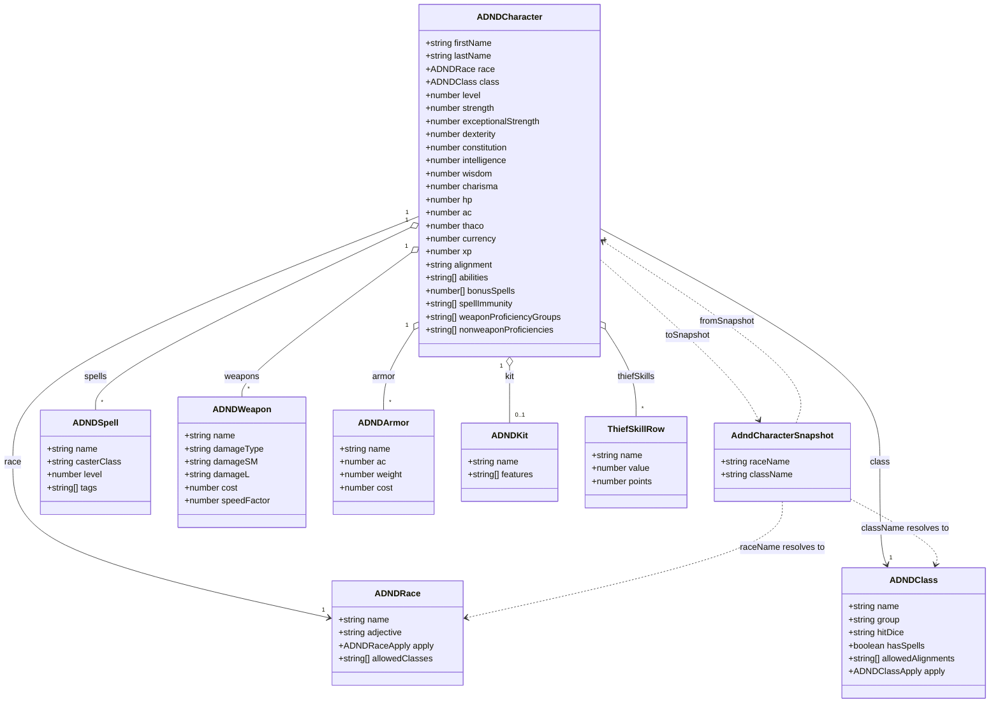
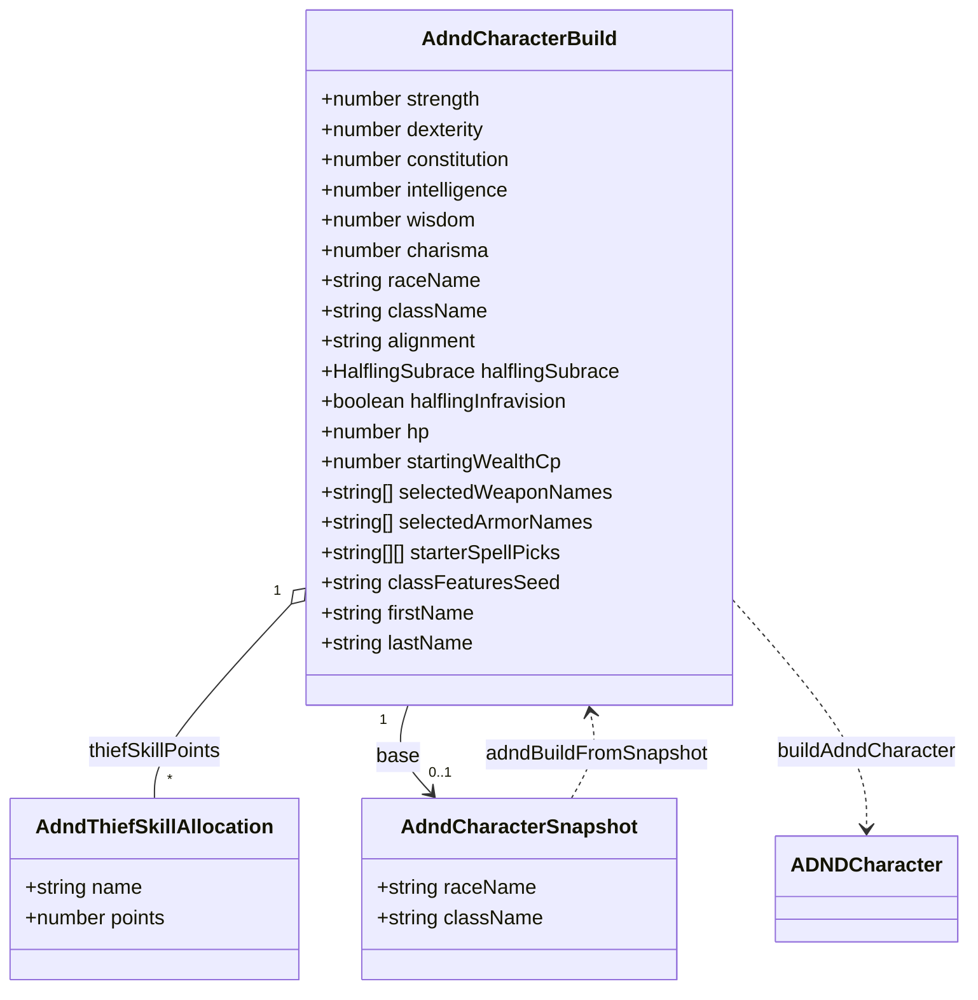
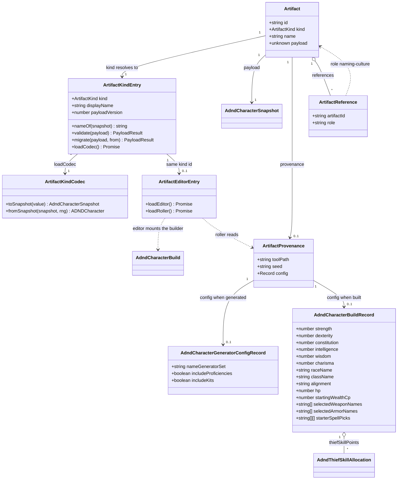

# The AD&D 2E character artifact

This design document covers the artifact kind `character.adnd-2e` and the two tools that produce
it: the **AD&D 2E Character** generator (`/fantasy/adnd/character`) and the **AD&D 2E Character
Builder** (`/fantasy/adnd/character/build`).

Designs [#45](https://github.com/ironarachne/ironarachne/issues/45) — the builder — and
necessarily most of [#47](https://github.com/ironarachne/ironarachne/issues/47), the generator,
because the two make the same thing and the readiness spec requires them to make it under one
kind. It sits inside [the workshop](workshop.md) and is measured against
[Tool release readiness](workshop.md#tool-release-readiness).

**Status:** accepted; **built**. Both tools are Release-ready, assessed section by section in
[What shipped](#what-shipped). The [domain model](#domain-model) was reviewed and approved, so
[the plan](#the-plan) is clear to start.

One decision moved after that approval, on the instruction that a character build be as robust and
recreatable as possible: [decision 6](#6-a-built-character-records-its-build-as-provenance) now has
the builder record its build rather than record nothing, which makes a built character reproducible
from the decisions that made it. It is the only change, it is additive, and the one diagram it
touches says so where it happens.

## The problem

Nothing either tool produces survives the tab closing. `$lib/adnd` has no snapshot module, no
artifact kind is registered for it, and neither component has a `SaveArtifactButton`. Both tools
are Experimental, and sections 3, 4, 5 and 7.2–7.4 of the readiness spec are outstanding in full.

That is the ordinary half. The interesting half is that a character is the first artifact on this
site whose content is **mostly rule data applied to a handful of user decisions**, and the two are
tangled together in one flat object. A settlement's payload was awkward because parts of it were
not serialisable; a character's payload is awkward because parts of it are not the user's.

Three things follow, and they are what this document is mostly about:

- **The rule tables cannot go in the payload, and the numbers they produced must.** `ADNDRace` and
  `ADNDClass` each carry an `apply` function, so neither is storable as it stands. But a character
  saved this year and opened after the class tables change must be the same character — so the
  payload keeps every derived number the tables produced, and stores only the race and class
  themselves by name.
- **Some user decisions were never recorded as data at all.** A thief's discretionary skill points
  are pushed into `abilities` as the prose line `Pick Pockets: 45%`
  (`src/lib/adnd/classes/thief.ts:94`). That round-trips as a string, so requirement 3.2 is
  satisfied by accident — but the _allocation_ is gone, and an editor cannot offer a decision it
  cannot read back.
- **The builder derives its character from scratch on every keystroke.** `previewCharacter` in
  `AdndCharacterBuilder.svelte` rebuilds the whole character from the form's fields each time one
  changes. Point that at a _generated_ character — which carries rolled proficiencies, a kit, and
  an exceptional strength score that no form field represents — and opening it for editing would
  quietly discard them. That is requirement 4.2 failing on open, before the user touches anything.

## What is already true

Assessed rather than assumed, because half of what these issues describe is already in place:

- **1.1–1.4 are met.** Both tools have catalog entries with the right `kind` and `domain`, both
  carry `genre:fantasy` and `system:adnd-2e`, and both are in `TOOL_PANELS`
  (`src/lib/workshop/tool_panels.ts:14`). The label collision both issues describe is **already
  fixed**: the catalog reads `AD&D 2E Character Builder` and `AD&D 2E Character`
  (`src/lib/tools/tool_catalog.ts:24`, `:43`), closed by the tool-naming work. Nothing is owed
  here.
- **8.1 and 8.2 are met.** `$lib/adnd` has a `README.md` and an `index.ts`, and consumers import
  through it.
- **7.1 is broadly met.** The library sits above the per-library coverage gate.
- **6.3 is largely in hand.** `render_adnd_character_pdf.ts` renders a character sheet a user can
  take to the table.

What follows is the rest.

## The shape of the solution

### One kind, named `character.adnd-2e`

The builder and the generator make the same thing, so they share one kind. Two kinds for one shape
would split a user's characters across two vault entries, each openable by only one of the tools
that made them.

It is system-qualified, per [decision 4](workshop.md#4-kinds-are-system-qualified-when-the-payload-is):
an AD&D 2E character is a set of numbers that mean something only under that ruleset.

**The id is `character.adnd-2e`, not `adnd-2e.character`.** Issue #45 guesses at the latter;
`artifact_kind_types.ts` already names the former in the documented convention it establishes
alongside `character.swn`, and the convention — concept first, system as a qualifier — is what
makes every character kind sort together in a vault listing. The code is the authority here.

### The payload is the finished character, with rule data by name

`AdndCharacterSnapshot` is `ADNDCharacter` with two fields replaced:

```
Omit<ADNDCharacter, 'race' | 'class'> & { raceName: string; className: string }
```

Everything else on `ADNDCharacter` is already plain data — numbers, strings, string arrays, and
arrays of `ADNDSpell`, `ADNDArmor`, `ADNDWeapon`, and the kit, none of which carry a function. So
unlike a settlement there is no deep conversion here, and `stripFunctionValuesDeep` is not the
answer either: requirement 3.2 asks for stripped **or reconstructed explicitly**, and a blanket
strip would leave `race` and `class` as objects with a hole where their behaviour was.

**Every derived number stays in the payload.** THAC0, the five saving throws, weight allowance,
system shock, the spell tables, the ability lines — all of it is stored, even though all of it
could in principle be recomputed from race, class, and the six attributes. Storing it is the whole
of requirement 4.2 for this kind. A DM who sets a character's THAC0 by hand has made a decision
that no recomputation may overrule, and a character saved under one edition of the class tables
must still be that character after the tables change. Recomputation is available, but only as an
explicit and clearly destructive command — see [Editing](#editing-a-saved-character).

#### An unknown race or class resolves to a placeholder, not a quarantine

`fromSnapshot` resolves `raceName` and `className` against `races.getAll()` and `classes.getAll()`.
When a name is not there — a class this build dropped, or a payload from a build that had one we
never did — it rebuilds a **placeholder** `ADNDRace` / `ADNDClass` carrying the stored name, empty
rule fields, and an identity `apply`.

The alternative was to reject in `validate`, quarantining the payload. That is right for a payload
from a _newer_ build, which a later version may understand, and wrong here: nothing brings back a
class that was removed, so quarantining would retire the character permanently over a lookup. The
character's numbers are all in the payload and none of them need the class object, so the sheet
still prints `a level 1 elf bladesinger` and the PDF still renders. This is the same bargain
`$lib/settlements` makes with a name-generator set it no longer has: fall back, keep the work.

What a placeholder must not do is get _used_. The builder refuses to re-derive class features from
one, offering instead to pick a real class — which is a destructive change the user makes
deliberately (4.3).

### Thief skills become a field

`ADNDCharacter` gains `thiefSkills: ThiefSkillRow[]`, empty for classes that have none. The type
already exists in `adndthiefskills.ts` and already separates exactly the two halves this needs:
`value` is the rule-derived base after dexterity and race, `points` is the discretionary
allocation, and the displayed percentage is their sum.

Both paths write it. `thief.ts` and `bard.ts` stop pushing `Pick Pockets: 45%` onto `abilities`
and set the rows instead; `appendThiefSkillAbilityLines` in the builder becomes
`applyThiefSkillAllocation`, doing the same. `AdndCharacterSheet.svelte` and the PDF grow a Thief
Skills section reading the rows, so what a user sees is unchanged.

This is not required by requirement 3.2 — the prose lines round-trip perfectly well as strings —
and it is worth being clear about that. It is required by 4.1 and 4.4: an editor cannot offer an
allocation it can only read as a sentence, and re-parsing `Pick Pockets: 45%` back into a base and
a bonus is the kind of fragility that breaks the first time a skill is renamed.

**It is done now because now it is free.** The kind ships at `payloadVersion` 1 and there is
nothing older; adding the field after version 1 is in users' browsers costs a migration step and a
test for it, forever.

Two things surfaced while building it, both recorded here because the second changed shipped
output:

- **The generator shuffles before it deals.** `distributePoints` picks by index, so the shuffle is
  what decides which skills a roll favours and it cannot be removed. It has no business reaching
  the sheet, though, where a skill list in a different order for every character is a presentation
  defect — so `orderThiefSkillRows` sorts the rows back into the canonical order on the way out.
  The values are untouched.
- **The point pool overshot, and was fixed.** `distributePoints` drew each award against the
  per-skill headroom alone and subtracted afterwards, so the last one spent whatever it liked:
  measured over 300 seeds, 86% of rolled thieves and bards came out above their budget, by as much
  as 27 points on a pool of 60. Clamping the draw to what remains is the fix. It changes seeded
  output — 77 thieves in that sample, no bards and no other class, because the clamp only shifts
  later draws when it forces an extra iteration — and it was made **before** the kind ships, since
  afterwards the choice is between rewriting artifacts a user has kept and leaving them wrong.

Weapon and non-weapon proficiencies need none of this — `weaponProficiencyGroups` and
`nonweaponProficiencies` are already string arrays on the character, and already round-trip and
edit as lists.

### One roll path, from a seed

`adnd_character_roll.ts`, modelled on `settlement_roll.ts`, holds:

- `AdndCharacterGeneratorConfigRecord` — `nameGeneratorSet?`, `includeProficiencies?`,
  `includeKits?` — stated as a type so what the generator writes as provenance and what a re-roll
  reads back are in one place.
- `readAdndCharacterGeneratorConfig(config)` — the boundary where the store's
  `Record<string, unknown>` becomes typed, dropping anything unrecognisable rather than coercing
  it.
- `rollAdndCharacter(seed, config)` and `rollAdndCharacterSnapshot(seed, config)` — the single path
  both the generator page and the registered roller take.

This closes a live 2.2 violation as well as enabling re-roll. `AdndCharacterGenerator.svelte`
currently rolls the character from the page's seed but rolls the **name** from
a clock-seeded RNG of its own, so the same seed does not produce the same character today.
The name comes off the seed after this.

A generated character records provenance — tool path, seed, and that config (3.6).

The provenance `config` must be plain data, not a Svelte `$state` object — IndexedDB serialises
with `structuredClone`, which refuses a Proxy. This is the trap `$lib/workshop`'s README records
beside `saveToolArtifact`, and it is on the path both tools take.

### A built character records its build

A character made in the builder is reproducible from the decisions that made it, and it stores
them: provenance is `toolPath: '/fantasy/adnd/character/build'`, `seed: classFeaturesSeed`, and a
`config` holding `AdndCharacterBuildRecord` — the attribute rolls, race, subrace, class, alignment,
hit points, funds, gear by name, spell picks, and the thief allocation.

The record carries neither `base` nor `classFeaturesSeed`. The base is the artifact's own payload,
and a copy of it inside the record of how it was made would be two answers to one question with the
payload being the authoritative one. The seed is already provenance's own field, and a record
holding a second copy could disagree with it.

So the one kind carries **two provenance shapes, told apart by `toolPath`**, and the registered
roller branches on it: the generator's path calls `rollAdndCharacter(seed, config)`, the builder's
calls `buildAdndCharacter(readAdndCharacterBuildRecord(config), seed)`. `readAdndCharacterBuildRecord`
is the same kind of boundary as its generator counterpart — the store's `Record<string, unknown>`
becoming typed, dropping what it does not recognise.

Three things follow, and each is worth stating because each is a promise:

- **Re-roll means "rebuild from my decisions".** For a generated character a re-roll is a fresh
  draw; for a built one it reproduces the same character, discarding hand-edits made outside the
  builder. Both are the destructive operation requirement 4.3 describes, and both are honestly
  described by the same button — "this will overwrite your edits" is true of each.
- **Reopening the builder is exact, not reconstructed.** With a build record present, every control
  comes back as it was set, `classFeaturesSeed` included. `adndBuildFromSnapshot` is then only the
  fallback for a character that has no record — a generated one — where the reverse map is
  best-effort and the base covers the rest.
- **A structural change stays reproducible.** Changing class re-derives from the stored seed rather
  than a freshly minted one, so the same sequence of decisions gives the same character twice.

The invariant that keeps this from rotting turned out to need no enforcement at all. Provenance is
written when an artifact is created and never touched afterwards — `applyArtifactEdits` changes the
payload and the name and leaves it alone — so the record describes how the character was **first
made**, which is exactly what `ArtifactProvenance` says it is for. There is no merge, no staleness
flag, and no writer to clear anything.

An earlier draft of this section claimed the record was "present only when the builder last wrote
the character, and any other writer clears it". That was a rule invented for a problem the store
does not have, and it is recorded here rather than quietly deleted because it is the kind of
invariant that sounds prudent and would have cost real code. What follows from the real behaviour
is simpler and slightly different: a generated character edited in the builder keeps its
_generator_ provenance, so re-rolling it is a fresh draw that discards those edits — which is what
re-rolling a generated character should mean.

Robustness costs one more rule: **an unreadable build record is dropped, not fatal.** A record
written by a build that spelled a field differently loses the recreate affordance and nothing else.
The character is in the payload and does not depend on it.

### Editing a saved character

The builder is the editing view for this kind — `ARTIFACT_EDITORS['character.adnd-2e']` points at
a thin `AdndCharacterArtifactEditor.svelte` that mounts it — rather than a second editor written
beside it. That is what makes 4.1 affordable here, and it is why these two issues land together.

Making that work means the builder stops deriving a character and starts **patching** one.

`adnd_character_build.ts` holds `AdndCharacterBuild`: the builder's form fields, lifted out of the
component into the library as a plain type, plus a `base` — the snapshot being edited, or `null`
when composing from nothing. `buildAdndCharacter(build)` is the pure function `previewCharacter`
becomes, and it has two paths:

- **No base, or a structural change.** Race, class, or the attributes differ from the base, or
  there is no base. The character is derived from scratch, exactly as the builder does today.
  Against a base this is destructive — it discards rolled proficiencies, a kit, and everything else
  downstream of a class — so the surface confirms it first (4.3).
- **A base with its structure intact.** The character _is_ the base, with the fields the builder
  owns written over it: names, alignment, hit points, funds, gear, starting spells, and the thief
  allocation. Nothing the builder does not model is touched, which is how a generated character
  survives being opened.

Where a build record exists the form is restored from it exactly, and none of this reconstruction
is needed. `adndBuildFromSnapshot(snapshot)` is the fallback for the case that has no record — a
generated character opened in the builder. It is exact where it can be: attributes, race and class
names, alignment, gear by name, spell picks, and the thief allocation now that it is a field.
Where it cannot be, the base covers for it — starting funds come back as the purse plus what the
stored gear cost, and there is no `classFeaturesSeed` to recover, so one is minted and recorded the
first time the builder writes that character.

The builder also gains the fields it does not have today, because 4.1 asks for every field a user
would reasonably want to change and at minimum every field displayed. In a **Details** section,
collapsed by default: experience and level, weapon and non-weapon proficiencies, the kit and its
features, the free-text abilities list, and the derived stats block. The derived stats are editable
numbers with one **Recalculate from race, class, and attributes** button above them — today's
automatic derivation, demoted to an explicit command now that a character can be saved.

### Composition

A character takes a **culture** for its names — requirement 5.1's candidate, and the same one every
character tool on the site has.

The path exists but does not record anything. `loadCulturesForNaming()` already merges the open
project's cultures with the legacy scopes and offers them in `CharacterNameSection`'s dropdown; it
copies the names out and records no link, which fails 5.2.

`CharacterNameSource` gains a fourth variant, `referenced_culture`, and `CharacterNameSection`
gains a `SavedArtifactPicker` with `kind: 'culture'` and `role: 'naming-culture'` behind it. The
reference travels on the draft and is stored by id; the **culture's own name-generator set** is
what goes into provenance, so a re-roll produces names of the same tongue without reaching back
into the store for an artifact it has no way to ask for. That is the bargain `$lib/settlements` and
`$lib/religion` already make, and copying it is the point.

`CharacterNameSection` is shared with the DCC, SWN, Uncharted Worlds, and fantasy character
generators. The change is additive — a variant nobody selects behaves as before — and #46, #48,
#49, and #50 each need exactly this. Building it once, here, beats four near-copies; wiring the
other four tools' references and provenance stays in their own issues.

5.3 holds unchanged: with no culture chosen, both tools generate names as they do today. 5.4 is
trivially satisfied — a character references a culture and nothing references a character — but
nothing in the design depends on that remaining true.

### Output and verification

- **6.1.** Both routes are already in `e2e/page_manifest.ts` and so already render at every width
  in `e2e/mobile_viewports.ts`. The risks the new sections add are the weapons table and the
  derived-stats block; each scrolls inside its own `overflow-x: auto` container rather than
  widening the page.
- **6.2.** The builder's equipment checkboxes and thief-skill number inputs need accessible names,
  and the new Details section needs its disclosure to be a real `<button>`.
- **6.4.** ~~`drawDetailSections` draws a labelled box for Kit and Proficiencies unconditionally, so
  a character with neither gets two empty boxes.~~ **Withdrawn — this was wrong.** Those formatters
  return `'None'`, not an empty string, so the PDF prints "Kit: None" rather than a blank box. That
  is a deliberate answer to a question a sheet may reasonably ask, not a layout artifact, and there
  is nothing to fix. The one section that genuinely should not appear is Thief Skills, which
  belongs to two classes out of twenty; it returns an empty string and the renderer omits it. Text
  output is otherwise already free of stray blank sections.
- **7.2.** A round-trip test over three characters that between them cover the shapes: a plain
  generated fighter, a generated one with proficiencies and a kit, and a built thief with an
  allocation.
- **7.3.** Version 1 is the only shape there has been, so `migrate` rejects and the test asserts
  that it does — the same as `migrateSettlementSnapshot`. It is the place the first real step goes.
- **7.4.** An end-to-end test covering generate, save, reopen, edit, for both tools.

### Documentation

`$lib/adnd/README.md` gains what 8.4 asks for: this is **AD&D 2nd Edition**, from the Player's
Handbook, at **level 1 only**, and it deliberately omits multi-classing and dual-classing,
levelling past 1, psionics, non-weapon proficiency slot accounting and proficiency checks, and the
mechanical half of kits — `adnd_kits_data.ts` is narrative features by design. Saying so is worth
more than the rest of the section: every one of those is a thing a user reasonably expects to find.

## Domain model

### The payload

What is stored, and how it relates to the live character the library works with. `ADNDCharacter` is
`TValue`; `AdndCharacterSnapshot` is `TSnapshot` and is the artifact's payload.



`AdndCharacterSnapshot` carries every field `ADNDCharacter` does except `race` and `class`, which
it holds as the two names shown. It is not a subtype of the character and the diagram does not say
it is: the pair of conversions between them is the codec, and the two lower arrows are the only
work that conversion does — a name out, a table lookup back, and a placeholder when the lookup
misses.

`ThiefSkillRow` is the new association on `ADNDCharacter`; everything else on it is unchanged.
`ADNDKit` names the inline `{ name, features }` the character already carries.

### The build

What the builder holds, and how it produces a character. `base` is what makes editing a saved
character non-destructive.



`base` is absent when the builder is composing from nothing, which is how it is reached from its
own route with no artifact open. That optional association is the whole of the design: with a base
present whose race, class, and attributes still match the build's, `buildAdndCharacter` writes the
build's fields over the base and touches nothing else; without one, or once a structural field
differs, it derives the character from scratch — which against a base is the destructive case the
surface confirms first.

### The workshop wiring

Where the kind meets the registries. Nothing here is new machinery — it is the shape every kind
takes, drawn so the review can check that this one is not asking for an exception.



**This is the one part of the model that moved after approval.** `ArtifactProvenance.config`
previously resolved to a generator record alone; it now resolves to one of two, told apart by
`toolPath`. Exactly one is present on any artifact — the two `0..1` associations are exclusive, not
independent — and the roller reads whichever the tool path names.

Both tools therefore produce a re-rollable character, and the two mean different things: for a
generated one a re-roll is a fresh draw, and for a built one it is a faithful rebuild from the
recorded decisions. `AdndCharacterBuildRecord` is `AdndCharacterBuild` without its `base`, which
does not travel — the base is the artifact's own payload.

## Decisions taken here

### 1. The kind is `character.adnd-2e`

Concept first, system as the qualifier, matching the convention `artifact_kind_types.ts` already
documents alongside `character.swn`. It sorts every character kind together in a vault listing,
which `adnd-2e.character` would not. Both issues get the same id, and whichever lands first defines
it.

### 2. The payload keeps every derived number

A character could be reconstructed from race, class, and six attributes. Storing it that way would
make the rule tables authoritative over the user, which is precisely what requirement 4.2 forbids,
and would silently change every saved character the next time a table is corrected. A character is
a few dozen scalars either way — nothing like the settlement that made payload size worth measuring
— so there is nothing to buy by being clever here.

### 3. An unknown race or class becomes a placeholder

Rejecting would be right for a payload from a newer build and is wrong for a rule table that was
removed, because nothing brings that table back. The character's numbers do not need the class
object, so falling back costs the eligibility rules and keeps the character. A placeholder is
inert: nothing may derive from one without the user first choosing a real class.

### 4. Thief skill allocation becomes a field on the character

The prose line `Pick Pockets: 45%` round-trips, so this is not a 3.2 fix. It is a 4.1 and 4.4 fix —
an editor cannot offer an allocation it can only read as a sentence — and it is free before version
1 ships and costs a permanent migration step afterwards.

### 5. The builder patches a base rather than deriving from scratch

Deriving is right when there is nothing to preserve and wrong the moment there is: a generated
character carries proficiencies, a kit, and an exceptional strength score that the builder's form
does not model, and re-deriving on open would discard them before the user touched anything.
Structural changes — race, class, attributes — still derive, because there is no honest way to
patch a class change, and the surface confirms that as destructive.

### 6. A built character records its build as provenance

**Revised after the model was approved**, on the instruction that a character build be as robust
and recreatable as possible. It previously read "a built character records no seed, and therefore
no provenance", reasoning that `ToolArtifactDraft.seed` is documented as absent rather than
invented and that `classFeaturesSeed` reproduces a fragment of a character rather than the
character.

The premise was wrong. `classFeaturesSeed` is a fragment **only because the rest of the build was
being thrown away**; recorded alongside it, the two reproduce the character exactly. So the builder
records `toolPath`, that seed, and an `AdndCharacterBuildRecord` config, and the kind's roller
branches on `toolPath` to decide whether a re-roll is a fresh draw or a faithful rebuild.

What the old decision got right is kept: the payload stays authoritative and the record never
competes with it. Provenance is written once, at creation, and never edited, so "which of these is
the truth" is a question that cannot arise. An unreadable record is dropped rather than fatal,
losing the recreate affordance and nothing else.

This costs a second shape in provenance `config` under one kind, which is the one thing to watch:
`readAdndCharacterGeneratorConfig` and `readAdndCharacterBuildRecord` are separate readers and
neither may accept the other's record.

### 7. The culture reference goes into `CharacterNameSection`, not beside it

The component is shared with four other character tools that need the same thing, and the change is
additive: a name-source variant nobody selects behaves exactly as before. A second picker beside
the existing dropdown would be two ways to choose a culture on one page. Wiring the other four
tools' references and provenance belongs to their own issues, not this one.

### 8. Derived stats become editable, with recalculation as an explicit command

4.1 asks for every field displayed, and the sheet displays about forty derived numbers. Making them
editable is what lets a DM correct a character; demoting automatic derivation to a button is what
stops the correction being undone on the next keystroke. It is the same inversion 4.3 asks for
around re-rolling, applied one level down.

## The plan

Both issues land together, in this order, because the kind is shared and the second tool is what
proves the first did not build something bespoke.

| Step | Work                                                                                                | Issue |
| ---- | --------------------------------------------------------------------------------------------------- | ----- |
| 1    | `thiefSkills` on `ADNDCharacter`; the two class `apply`s, the sheet, and the PDF read it            | #45   |
| 2    | `adnd_character_snapshot.ts` and `adnd_character_artifact_kind.ts`; registration; round-trip tests  | #47   |
| 3    | `adnd_character_roll.ts`; the generator's name roll moves onto the seed; provenance and save        | #47   |
| 4    | `adnd_character_build.ts`; the builder patches a base; the Details section; the editor registration | #45   |
| 5    | `AdndCharacterBuildRecord` as provenance; the roller branches on `toolPath`; rebuild tests          | #45   |
| 6    | `CharacterNameSource.referenced_culture` and the picker in `CharacterNameSection`                   | #45   |
| 7    | 6.2 and 6.4 fixes; the end-to-end tests; the README's 8.4 section; `maturity: 'release-ready'`      | both  |

Step 1 is first and is the only step that touches shipped output before there is a kind to store
it in, which is deliberate: the field must exist before version 1 does. Step 5 follows step 4
rather than merging into it because the build record is a shape only worth freezing once
`AdndCharacterBuild` has settled — a provenance record is user data the moment it ships.

`npm run verify` gates each step and `npm run verify:all` runs before merge — this touches
components and routes, and no Playwright suite runs against a PR.

## Still open

None of these blocks the model; each is presentation or scope.

- **Does the sheet show proficiencies and the kit?** The PDF does and
  `AdndCharacterSheet.svelte` does not, so a generated character with `includeKits` on shows its kit
  only after downloading a file. Adding both to the sheet is a small change that 4.1 arguably
  already requires, and it would land in step 1.
- **What does `loadCulturesForNaming`'s legacy half do once the picker exists?** It merges the open
  project's cultures with `loadSavedCultures()`, and the legacy scopes have been adopted into
  projects since #34. The merge may be vestigial, but confirming that is a question about adoption
  rather than about this kind.
- **Should the derived-stats block be editable in the panel as well as on the route?** It is a long
  block of number inputs and the panel is narrow. Requirement 2.1 says the tool must work
  identically in both, which argues yes; the collapsed Details section is what makes that bearable.

## What shipped

Both tools reached `maturity: 'release-ready'` on 2026-08-25. Assessed against every requirement
that applies, rather than declared:

| Section               | How it is met                                                                                                                                                                                                                                                                                                    |
| --------------------- | ---------------------------------------------------------------------------------------------------------------------------------------------------------------------------------------------------------------------------------------------------------------------------------------------------------------- |
| **1 Discoverability** | Both were already met and are unchanged: catalog entries with the right `kind` and `domain`, `genre:fantasy` and `system:adnd-2e`, both in `TOOL_PANELS`, and labels that already read correctly out of context.                                                                                                 |
| **2 Behaviour**       | `rollAdndCharacter` is the one path from a seed, and it fixed a real 2.2 failure — the name was drawn from the clock, so a locked seed gave a different character each press. Neither tool generates over user input.                                                                                            |
| **3 Artifacts**       | `character.adnd-2e` at `payloadVersion` 1, shared by both tools. Race and class stored by name; every derived number kept. `validate` returns a rejection rather than throwing; `migrate` rejects and says so. Provenance records tool path, seed, and settings — a generator's config or a builder's decisions. |
| **4 Editing**         | The builder **is** the kind's editor. It patches a saved character rather than re-deriving it, so rolled proficiencies and a kit survive being opened. Derived numbers are editable, with recalculation demoted to an explicit command. A structural change re-derives and says so first.                        |
| **5 Composition**     | A culture is taken through `SavedArtifactPicker` and recorded by id, with the culture's own pattern set in provenance so a re-roll keeps the tongue. Both tools work with no culture at all.                                                                                                                     |
| **6 Output**          | Both routes render at every width in `e2e/mobile_viewports.ts`. Every control is reachable by role and name — asserted by driving the whole builder that way. PDF export is the presentation format.                                                                                                             |
| **7 Verification**    | Round-trip, migration, build, subrace and roll tests in `$lib/adnd`; `e2e/adnd_character.spec.ts` covers generate, save, reopen, edit for both tools.                                                                                                                                                            |
| **8 Documentation**   | `$lib/adnd/README.md` says which edition, that everything is level 1, and what is deliberately left out.                                                                                                                                                                                                         |

### What the end-to-end test found

Requirement 7.4 was the last thing built and it earned its place immediately. Five bugs, none of
which any unit test could have seen, because each lived in the space between Svelte's reactivity
and the store:

- **The generator could not save at all.** `character` was deep-reactive `$state`, so the
  snapshot's arrays were Proxies and `structuredClone` — what IndexedDB writes with — refused them:
  `[object Array] could not be cloned`. Guarding the provenance config was not enough; the payload
  goes to the same place. Broken since the save button was added.
- **The builder crashed for every spellcasting class.** `buildAdndCharacter` runs on each
  keystroke, including for the hit-point bounds, and `startingSpellsFromPicks` throws on a partial
  set. Choosing a caster took the page down before the alignment step appeared.
- **Reopening a saved caster showed nothing.** The stored spellbook was rebuilt as one flat list
  rather than one row per choice group, so the form read as unfinished forever.
- **Reopening a character with equipment deleted its gear.** Starting funds were not seeded from
  the artifact, so the over-budget guard fired on mount, cleared the equipment, and put an error
  dialog over the page.
- **The editor never settled.** Announcing a freshly built snapshot on every render meant a new
  object describing an identical character, which the surface stored and re-rendered — a loop that
  left the Save button unclickable.

The last three share a cause worth naming: **the builder is the first artifact editor with state
of its own.** Culture, religion and settlement editors hold everything in the snapshot prop, so
nothing about seeding or re-announcing could go wrong for them. A tool mounted as an editor has to
be seeded completely and has to announce only real changes, and neither requirement existed before
this kind.
