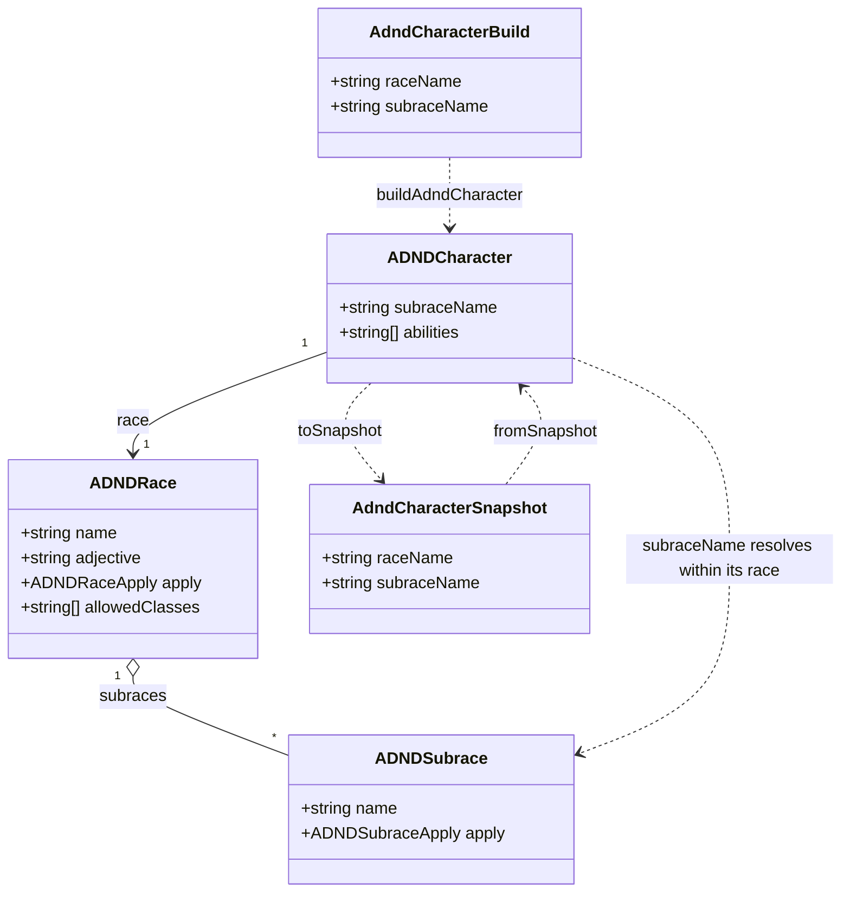

# AD&D 2E subraces

This design document covers **subraces**: the varieties within a race — Stout and Tallfellow
halflings today, grey and wood elves and hill and mountain dwarves in due course — as a mechanism
rather than as a special case inside one race's `apply`.

Designs [#99](https://github.com/ironarachne/ironarachne/issues/99), which is the bug the absence
of that mechanism causes. It sits inside [the AD&D 2E character
artifact](adnd-character.md) and shares its payload, so it is measured against the same
[Tool release readiness](workshop.md#tool-release-readiness) spec.

**Status:** accepted; built. The [domain model](#domain-model) was reviewed and approved, and
[the plan](#the-plan) is implemented — #99 is closed by it.

## The problem

There is exactly one subrace in the codebase and it is implemented by rewriting the race's name:

```ts
character.race.name = `${subrace} halfling`;
```

`character.race` is the singleton `races.getAll()` hands out, so that line does not describe the
character — it edits the rule table. Three things follow, and all three are live today.

- **The shared table is corrupted for the session.** After one halfling is rolled, `getAll()`
  returns `dwarf, elf, gnome, half-elf, Stout halfling, human`. The builder's race dropdown reads
  "Stout halfling", `findAdndRace('halfling')` returns `null`, and the builder can no longer make a
  halfling at all.
- **A saved halfling loses its rules on reopen.** The payload records
  `raceName: "Stout halfling"`, and in a fresh tab that name is in no table, so it resolves to the
  inert placeholder that `adnd_character_snapshot.ts` falls back to. The character survives, which
  is the placeholder working as designed, but its racial rules do not.
- **The subrace is smuggled rather than recorded.** It is in the payload, encoded in a field that
  means something else. That is worse than not recording it, because it is what breaks the lookup.

A second subrace written the same way would double the problem. The elves and dwarves this system
is missing are not an edge case — they are most of the PHB's races.

## What this is not

- **Not a new race.** A Stout halfling is a halfling: same class list, same eligibility minimums,
  same entry in the race dropdown. A subrace that were its own race would multiply the dropdown by
  three and make "can this character be a thief" a question with six answers instead of two.
- **Not a kit.** A kit is a chosen sub-archetype within a class, is optional, and is narrative in
  this codebase. A subrace is a fact about the character that is settled when the race is, and it
  carries mechanical adjustments.
- **Not a payload version bump.** The kind is at `payloadVersion` 1 and has not shipped in a
  release — the last is `v2.5.0`, and the kind landed after it. Adding the field now costs nothing.
  Adding it after a release costs a migration step and a test for it, forever, on data that may be
  arbitrarily old. That timing is the reason this is being designed ahead of the remaining steps in
  [the character design](adnd-character.md#the-plan) rather than after them.

## The shape of the solution

### A subrace is data on the race

`ADNDRace` gains `subraces: ADNDSubrace[]`, empty for races that have none. A subrace carries a
name, the adjustments it makes, and the abilities it grants — the same things a race carries, at a
smaller scale.

The key change is that **`apply` never writes to the race**. It takes the chosen subrace and
writes the character:

```ts
character.subraceName = subrace.name;
```

`character.race.name` stays `halfling` forever, because it is the table's name and not the
character's.

### What a character is called

A character's displayed race becomes a function rather than a field: `adndRaceDisplayName(character)`
returns `Stout halfling` when there is a subrace and `halfling` when there is not. The sheet, the
PDF, and the artifact's default name all go through it.

This is the part that replaces the name mutation, and it is why the mutation was tempting: writing
the name into the race made every display site work without knowing subraces existed. One accessor
costs a handful of call sites once, and does not corrupt anything.

### Rolling one

A race with subraces picks one when it is applied, from the RNG it is already handed, so the
generator stays deterministic for a seed. A race with no subraces draws nothing — which matters,
because a draw taken for a race that has no varieties would shift every roll after it and change
every existing seed's output for no reason.

Where a subrace has a chance of its own — a Stout halfling's 15% infravision against everyone
else's 25% — that draw stays inside the subrace's `apply`, as it is today.

### The payload

`AdndCharacterSnapshot` gains `subraceName: string`, empty for a character with no subrace.
`fromSnapshot` resolves it against the chosen race's `subraces`, and a name that is not there is
dropped rather than quarantined — the same bargain the race and class lookups already make, and
for the same reason: a subrace that was removed is not a corrupt record, and the character's
numbers are all in the payload regardless.

The migration question is the one this document exists to avoid. There is no migration, because
the field lands before version 1 ships.

### The builder

The halfling-specific controls — `halflingSubrace`, `halflingInfravision` — become one subrace
select, shown when the chosen race has subraces and absent when it does not. `AdndCharacterBuild`
carries `subraceName` in their place.

Changing the subrace is a **structural** change, joining race, class, and the attributes in
`adndBuildMatchesBase`. A subrace adjusts ability scores and grants abilities, so a character
whose subrace changed is not the character that was stored — patching it would leave the old
subrace's adjustments applied and the new one's added on top.

## Domain model



The association that matters is `ADNDRace o-- ADNDSubrace`: a subrace belongs to a race and is
resolved **within** it, never globally. Two races may both have a "Grey" variety without
colliding, and a subrace name alone is not enough to look one up — which is the property the
current `Stout halfling` string lacks.

`ADNDCharacter` holds `subraceName`, not a subrace object. The character's abilities and adjusted
scores are already applied and stored; the name is what says which variety produced them, and it is
what the builder's select reads back.

## Decisions taken here

### 1. A subrace is data on its race, not a race of its own

Same class list, same eligibility minimums, same dropdown entry. Making Stout a race would triple
the halfling row in every list a user reads and turn one eligibility question into three.

### 2. `apply` writes the character, never the race

The whole of #99. A rule table is shared, and a function that edits it is describing every future
character rather than the one in front of it. `character.race.name` is the table's name.

### 3. The displayed name is an accessor, not a stored string

`adndRaceDisplayName(character)` composes `Stout halfling` at the point of display. Storing the
composed string is what created the bug: it put a value in `raceName` that no lookup could resolve.

### 4. `subraceName` joins the payload before version 1 ships

The kind landed after `v2.5.0` and has not been released. A field added now is free; the same field
added after a release is a permanent migration step against arbitrarily old data in a browser. This
is the same argument `thiefSkills` was landed on, and it is why this design comes before the
remaining character steps rather than after.

### 5. An unknown subrace is dropped, not quarantined

Consistent with the race and class lookups beside it. A subrace that was removed is not a corrupt
record, and every number it contributed is already in the payload.

### 6. Changing a subrace re-derives

It joins race, class, and the attributes as structural in `adndBuildMatchesBase`. A subrace adjusts
scores and grants abilities, so patching across a change would leave the old variety's adjustments
in place with the new one's stacked on top — which is not a character anyone rolled.

### 7. A race with no subraces draws nothing

Not a draw discarded, not a draw against an empty list — no draw at all. Anything else shifts every
roll after it and changes the output of every existing seed for races that have no varieties, which
is a golden-diff-sized change in exchange for nothing.

## The plan

| Step | Work                                                                                           |
| ---- | ---------------------------------------------------------------------------------------------- |
| 1    | `ADNDSubrace`, `subraces` on `ADNDRace`, `subraceName` on the character, and the accessor      |
| 2    | Halfling converted to it; the shared-table mutation gone; #99's reproduction as a test         |
| 3    | `subraceName` in the payload and in `AdndCharacterBuild`; structural in `adndBuildMatchesBase` |
| 4    | The builder's subrace select replacing the halfling-specific controls                          |

Step 2 is where #99 closes. A golden diff over 300+ seeds is required before and after, per this
repo's practice for a seeded generator — decision 7 is what should keep it empty for every race but
halfling.

## Still open

- **Do elves and dwarves get their subraces in this work or later?** The mechanism does not need
  them, and adding PHB varieties is data entry that can follow at any time. Doing it here would
  widen the golden diff from one race to three.
- **Should `adjective` vary by subrace?** `ADNDRace.adjective` feeds naming hints. A grey elf and a
  wood elf plausibly want different name sets, which would make this a subrace field too — but
  nothing reads it that way today, and inventing the need is how a field ends up unused.
