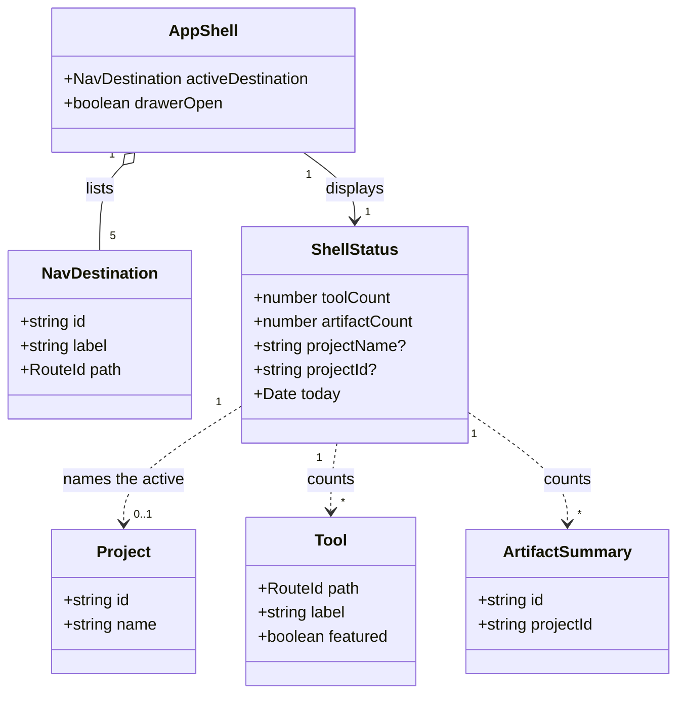
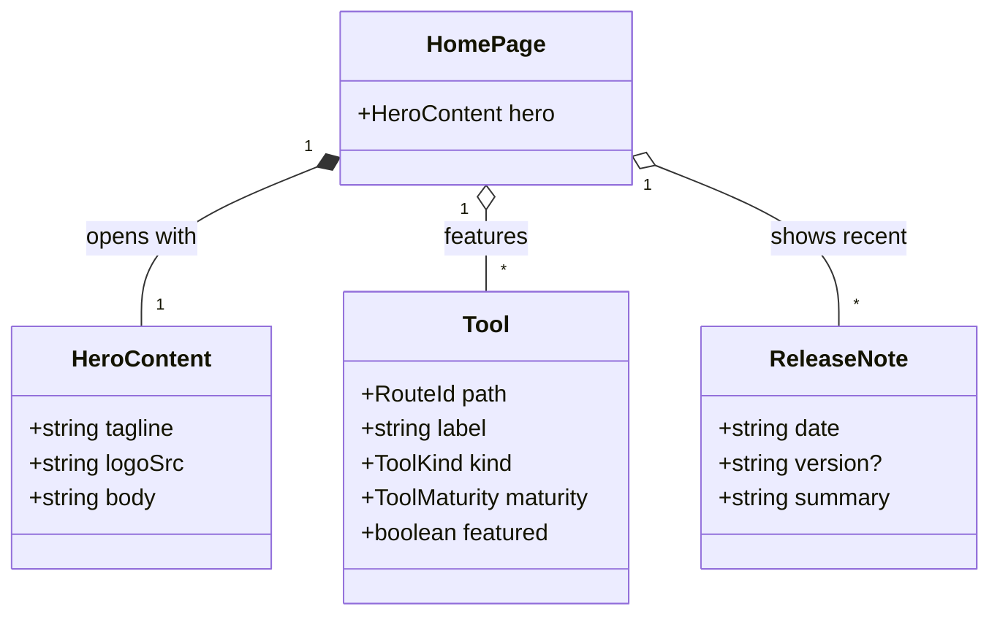
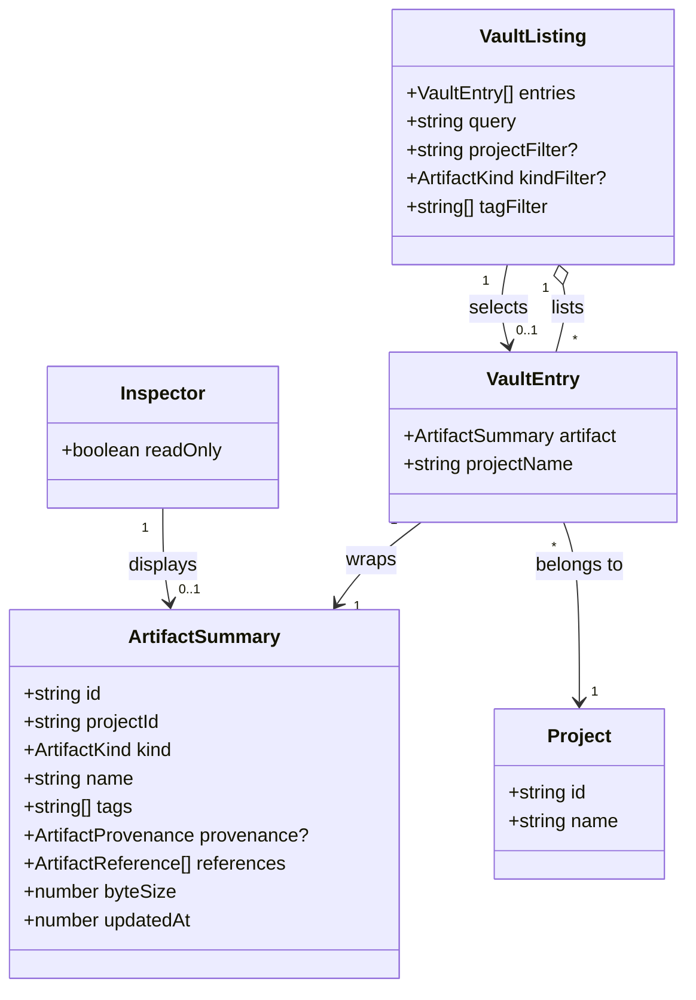

# The application shell

This design document describes the navigation and layout Iron Arachne is rebuilt on: a persistent
**shell** — a top bar and a left sidebar — wrapped around five destinations, replacing the header
and tool taxonomy the site has today.

It is the layout half of [the workshop](workshop.md). The workshop settled what a user's work
_is_ — projects, artifacts, tools. This settles where a user _stands_ while they do it.

**Status:** implemented. The [domain model](#domain-model) was reviewed and approved, and all six
steps in [The plan](#the-plan) are built. One item is deliberately not built — copying an artifact
between projects; see [Open questions](#open-questions).

Supersedes [#13](https://github.com/ironarachne/ironarachne/issues/13), which asked for better use
of desktop screen space. That framing was too small: the reason the site wastes horizontal space is
not that its rules are conservative, it is that the site is still shaped like a directory of pages
when it is becoming a single application.

## The problem

Two things are wrong, and they are the same thing seen from different ends.

**The page is caged.** `src/lib/styles/main.css` sets `html { max-width: 70ch; margin-inline: auto; }`.
That is a good rule for an article and the wrong rule for a workshop: on a 2560px display the site
uses roughly a quarter of the width, and the workshop bench — the one surface whose entire value is
having several panels visible at once — is squeezed into a column narrower than a paperback. Every
fix for #13 that stays inside that rule is decoration.

**The navigation indexes the wrong thing.** The header offers Home, five content domains
(Characters, Factions, Locations, Objects, Utilities), Workshop, and Release Notes. Those five
domains are a taxonomy of _tools_, and they made sense when a visit meant picking a generator and
reading its output. It no longer does. A visit now means opening a project and working in it, and
the workshop is where that happens — so the navigation's widest, most prominent rank of links
points away from the thing the site is for.

The domain index pages (`/characters`, `/factions`, `/locations`, `/objects`, `/utilities`) exist
only to hold those links. `ToolBrowser` inside the workshop already does the same job better:
searchable, filterable by genre, system, and domain, and it mounts what it finds instead of
navigating away from what you were doing.

## The shape

One shell, always present, on every route:

```
┌──────────────────────────────────────────────────────────────────────────────┐
│ ⬡ IRON ARACHNE   │ 36 tools │ 12 artifacts │ Ashfall │        20 August 2026 │  top bar
├──────────┬───────────────────────────────────────────────────────────────────┤
│ Home     │                                                                   │
│ Workshop │                     page region                                   │
│ Projects │                                                                   │
│ Vault    │                                                                   │
│ Notes    │                                                                   │
└──────────┴───────────────────────────────────────────────────────────────────┘
```

- **Top bar** — identity on the left, status in the middle, today's date on the right. It tells you
  where you are and what you have; it holds no navigation.
- **Left sidebar** — the five destinations, and nothing else. This is the whole of the site's
  navigation.
- **Page region** — everything else, filling the remaining viewport in both directions.

The shell is a `display: grid` on the root layout with a fixed-height first row and a fixed-width
first column, so the page region is a single grid cell that owns exactly the space left over. It
does not scroll the shell away: the sidebar and top bar are pinned, and scrolling happens inside
the page region.

### Five destinations

The sidebar is deliberately short. Five items is a list you read rather than scan, and the moment a
sixth is proposed the question is which of these five it belongs inside.

| Destination       | Route            | What it is                                                     |
| ----------------- | ---------------- | -------------------------------------------------------------- |
| **Home**          | `/`              | What this site is, what to try, what changed.                  |
| **Workshop**      | `/workshop`      | The bench. The main screen; where the work is done.            |
| **Projects**      | `/projects`      | The projects a user has, and which one is open.                |
| **Result Vault**  | `/vault`         | Every saved artifact, across every project, with an inspector. |
| **Release Notes** | `/release-notes` | What changed and when.                                         |

#### Home

A landing page for someone who has arrived and does not yet know what this is.

- **Hero** — the stacked logo lockup at display size, the tagline **Weave Your Universe**, and one
  paragraph of copy saying what Iron Arachne is. The copy is site copy, not personal copy: the
  present home page opens with "My name is Ben" in its third paragraph, which belongs on an About
  page or in the footer rather than above the fold of an application.
- **Below the hero, two columns.** Left: the featured tools. Right: the most recent release notes.

  Two columns of a page that is mostly prose is the one place the shell's full width has to be
  spent carefully — a 2000px-wide paragraph is unreadable. Each column carries its own measure
  (see [Measure](#measure)); the columns spread, the text inside them does not.

**Featured tools** become a property of the catalog rather than a hardcoded list in the component.
`defineTool` gains an optional `featured` flag, expanded into a `featured` tag the same way
`genres` and `systems` are expanded, so it composes with the existing tag filtering and there is
one source of truth for what a tool is called, where it lives, and whether it is worth pointing at.
The alternative — deriving featured from `maturity: release-ready` — was rejected: it sounds
principled, but almost every catalog entry is `experimental` today, so the list would be empty for
months and the home page would ship with a hole in it. Featured is an editorial judgement and the
flag says so.

#### Workshop

Already built; unchanged by this document except that it inherits the shell and the full viewport,
which is the point. `/workshop` becomes the site's main screen — the place a returning user lands
and stays. It is no longer one destination among many that happens to have panels in it.

The one change: the workshop's `ProjectContextBar` currently carries project creation, renaming,
deletion, switching, and transfer controls. Project _management_ moves to the Projects page; what
stays on the bench is the smallest possible "which project is open, switch it" control, because a
bench cluttered with administration is a bench with less room for panels.

#### Projects

The projects a user has: name, description, tags, when they were last touched, and how many
artifacts they hold. Create, rename, describe, tag, delete, export, import, and open. This is
`ProjectContextBar`'s management half, given a page instead of a strip.

Below the cards is the **storage panel** — what is in this browser, how long it has been the only
copy, and what to do about it, including the whole-vault export and the per-project sizes the cards
no longer carry. It is a section of this page with the id `storage` rather than a sixth
destination, because five destinations is a cap; the workshop reaches it by link and, when the
browser is nearly full, by banner. See [the storage panel](storage-panel.md).

#### Result Vault

Every artifact the user has saved, in two columns.

- **Left: the list.** Every artifact in every project — the vault is genuinely global, which is
  what "vault" has to mean if it is to be the answer to "where is that culture I made". Grouped by
  kind, filterable by project, kind, and tag, and searchable, reusing `searchArtifacts`,
  `groupArtifactsByKind`, and `artifactTagsOf` from `$lib/artifacts` rather than growing a second
  filtering mechanism. Every artifact already carries `projectId` and `indexedArtifacts()` already
  returns every one of them across projects, so the listing is a sort and a join against the
  project index — no new storage, no new query path.

- **Right: the Inspector.** The selected artifact, read-only: its name, kind, project, tags,
  provenance, references and backlinks, and its payload rendered by the artifact kind's registered
  view (falling back to `ArtifactSnapshotView` when a kind has registered none, as the panel does
  today).

**The Inspector is read-only, and that is a structural decision rather than a scoping one.** A
global listing plus an editor would put artifacts from two different projects in front of the user
in the same editing surface, and `docs/workshop.md` forbids cross-project referencing on the
grounds that a world depending on another world is not a world. Editing belongs on the bench, in
one project's context. The vault answers "what do I have" and hands you to the workshop to change
it: the Inspector's primary action is _Open in workshop_, which switches the active project if the
artifact lives elsewhere and mounts it on that project's bench.

Actions the vault does keep, because they are about the artifact as an object rather than its
content: rename, retag, copy to another project, export, delete.

`/saved-data` today redirects to `/workshop`. It redirects to `/vault` instead, which is what it
originally meant.

#### Release Notes

Unchanged in content. It gains the shell and loses the top-of-page navigation.

### The top bar

Identity, status, date — reading left to right.

- **Identity** — the horizontal lockup (glyph and wordmark), at top-bar height, linking to Home.
  It replaces the CSS-rendered wordmark in `Header.svelte`, which reimplements the brand mark in
  gradients and pseudo-element strokes and has to be re-tuned at every breakpoint. The lockups are
  vendored brand assets and already sync to `landing/assets/logo`; the app needs its own entry in
  `brand-assets.json` (`logo/primary` → `src/lib/assets/images/logo`) rather than a copy, per
  `docs/brand-assets.md`.

- **Status** — three items, horizontally aligned:
  - **Tools** — how many tools the catalog holds. A constant, derived from `allTools().length`.
  - **Artifacts** — how many artifacts the vault holds, across every project. Live: it changes when
    something is saved or deleted, via `onArtifactsChanged`.
  - **Project** — the name of the open project, live via `onProjectsChanged` so a rename is
    reflected. Clicking it goes to Projects.

  Each is a label and a value. They are status, not controls — with the single exception of the
  project name, which is the one status a user needs to act on from anywhere.

- **Date** — today's date, far right, formatted by `$lib/dates`.

**What the status strip must get right.** It reads the vault, and the vault is an IndexedDB
database that has not been opened when the bar first renders. `readShellStatus` would honestly
answer zero, and a bar that says "0 artifacts" for a moment before saying 12 is worse than one that
says nothing yet — so the counts render as a placeholder until the reader has run, then go live on
`onArtifactsChanged` and `onProjectsChanged`.

This was written up as a hydration-mismatch problem, and it is not one: `src/routes/+layout.ts`
sets `ssr = false` for the whole site, so `prerender = true` emits an app shell per route with no
server-rendered content to disagree with. The placeholder is about not lying to the user, not about
matching markup. For the same reason the date is safe to read at module scope — nothing is
evaluated at build time — though it is read at mount anyway, beside the counts, because the two
belong to the same object.

## Layout

### Breakpoints

Three, and the widths are chosen against what the shell needs rather than against device names.

| Range        | Sidebar                    | Top bar                                  | Two-column pages    |
| ------------ | -------------------------- | ---------------------------------------- | ------------------- |
| `< 768px`    | Off-canvas drawer          | Identity + project; counts and date drop | Stacked, one column |
| `768–1199px` | Icon rail, labels on hover | Identity + counts; date drops            | Stacked, one column |
| `>= 1200px`  | Expanded, labels visible   | Everything                               | Side by side        |

The status items and the date drop out at narrow widths in that order because they are the least
load-bearing things on screen: a phone user knows what day it is, and the count of tools is a
flourish. What never drops is the identity and the project name.

Below 768px the sidebar is a drawer behind a button in the top bar, closed by default, dismissed on
navigation and on Escape, and focus-trapped while open. The site has no drawer pattern today, so
this is new component work rather than a media query.

**Result Vault on a phone** is the one destination whose two columns are not merely stacked. A list
above an inspector means every selection scrolls the page; instead the list and the inspector are
two views, and selecting an artifact replaces the list with the inspector plus a back control. That
is a different component state, and it is worth calling out here because it will not fall out of
the CSS.

### Measure

Removing `html { max-width: 70ch }` is what unlocks the shell, and it is also the change most
likely to break something quietly, because every page on the site currently depends on it for
readable line lengths — thirty-odd tool routes included, which keep their URLs and so keep
rendering.

The rule is replaced rather than deleted. `--measure: 70ch` becomes a token, and `section.main` —
the wrapper `GeneratorPage`, `NavIndexPage`, and the hand-written routes all use — carries
`max-width: var(--measure)` in its place. Prose keeps its measure, the shell gets the viewport, and
the pages that want to spend the full width (workshop, vault) opt out by not being `section.main`.

This is the change that `npm run verify:all` exists for. It touches rendering on every route in the
page manifest, and no Playwright suite runs against a PR.

## Domain model

Three diagrams: the shell itself, what Home is made of, and what the vault is made of.

### The shell



`NavDestination` is a new type in a new `src/lib/navigation` library, with `NAV_DESTINATIONS` as
its ordered constant — the sidebar's single source of truth, the same way `TOOL_CATALOG` is the
tools'. `ShellStatus` is a new type in the same library, assembled by a `readShellStatus()` that
reads the existing catalogs and indexes; it owns no storage of its own.

`Tool` is the existing catalog type, gaining `featured: boolean` (and the derived `featured` tag).
`Project` and `ArtifactSummary` are unchanged and shown only for their relationships.

### Home



Nothing here is a new stored type. `HeroContent` is a constant; the featured tools are
`allTools().filter(isFeatured)`; the release notes are `mostRecent(n, releaseNoteEntries)`.

### Result Vault



`VaultEntry` is the one new type: an artifact summary joined to its project's name, so the listing
can show and filter by project without every row re-querying the project index. `VaultListing` is
component state rather than a stored type.

## Decisions taken here

**1. Tool routes stay; the domain index pages go.** The thirty-odd tool routes remain reachable by
URL — they are how someone arrives from a search engine, they are what the e2e page manifest
covers, and `docs/workshop.md` already requires a tool to work both on its own route and in a
panel. What goes is the five domain index pages, which exist only to list links that `ToolBrowser`
lists better. Navigation no longer surfaces tools; URLs still resolve them.

This narrows, but does not contradict, the Routes section of `docs/workshop.md`. That section
should be amended to say the routes are an entry point rather than a navigational destination.

**2. The vault is global; the Inspector is read-only.** Covered above. The pairing is the decision:
a global vault is only safe because nothing in it can be edited in place, and an editable global
vault would be a way to build cross-project references by accident.

**3. Featured is a catalog flag, not a derived property.** Covered above.

**4. The shell is a layout, not a route group.** It lives in `src/routes/+layout.svelte` and applies
to every route including the tool routes, rather than being a `(app)` route group that some pages
sit outside. A tool route that renders without the shell would have no way back to anything.

**5. Five destinations is the cap.** An About page, a search, a settings screen — each of these has
been reasonable to want, and each belongs inside one of the five rather than beside them. The
sidebar's value is that it is short enough not to need reading.

**6. No icons; the rail is a narrower sidebar.** Taken during implementation, and it drops the
`iconName` the approved model carried. The brand repo has no icon set, and five marks drawn in the
app to sit beside a carefully drawn wordmark is the kind of thing that looks improvised forever.
Between 768 and 1199px the sidebar keeps its labels at a smaller size in a narrower column, which
needs no assets and does not ask a screen reader to read a `title` attribute as a label. This
closes the open question the first draft of this document carried.

## What this changes

| Thing                                                          | Change                                                           |
| -------------------------------------------------------------- | ---------------------------------------------------------------- |
| `src/lib/styles/main.css`                                      | `html` measure removed; `--measure` token; `section.main` capped |
| `src/components/layout/Header.svelte`                          | Replaced by `TopBar.svelte` + `Sidebar.svelte`                   |
| `src/components/layout/NavIndexPage.svelte`                    | Deleted with the index routes                                    |
| `src/routes/{characters,factions,locations,objects,utilities}` | Deleted                                                          |
| `src/routes/+layout.svelte`                                    | Becomes the shell grid                                           |
| `src/components/layout/HomePage.svelte`                        | Rewritten: hero + two columns                                    |
| `src/routes/projects/`                                         | New                                                              |
| `src/routes/vault/`                                            | New                                                              |
| `src/routes/saved-data/+page.ts`                               | Redirect target changes to `/vault`                              |
| `src/lib/navigation/`                                          | New library: `NAV_DESTINATIONS`, `readShellStatus`               |
| `src/lib/tools/tool_types.ts`, `tools.ts`                      | `featured` field and derived tag                                 |
| `src/lib/artifacts/`                                           | `listAllArtifacts()` across projects                             |
| `src/components/common/ProjectContextBar.svelte`               | Management half moves to the Projects page                       |
| `brand-assets.json`                                            | New entry syncing the lockups into the app                       |
| `e2e/page_manifest.ts`                                         | Index-page entries out; `/projects` and `/vault` in              |
| `e2e/`                                                         | New shell spec: sidebar, drawer, status counts                   |

Every new library under `src/lib` must reach 80% line and function coverage; per `CLAUDE.md` a new
entry in `scripts/library_coverage_baseline.json` is not an option.

## The plan

Ordered so that each step is mergeable on its own and `main` is never mid-redesign.

1. **The measure change.** Token, `section.main`, `html` rule removed. Nothing moves yet; every
   page still looks the same because nothing yet fills the space. `verify:all` gates it.
2. **The shell.** `TopBar`, `Sidebar`, the layout grid, the drawer, and the status strip. The five
   destinations point at existing routes; `/projects` and `/vault` are the only new ones and can
   land as stubs.
3. **Home.** Hero, featured flag on the catalog, two columns.
4. **Projects.** The management half of `ProjectContextBar`, given a page; the bench keeps the
   switcher.
5. **Result Vault.** `listAllArtifacts`, `VaultEntry`, the listing, the Inspector, the phone's
   two-view behaviour, and the `/saved-data` redirect.
6. **Removal.** The five index routes, `NavIndexPage`, `Header`, and the manifest entries — last,
   so nothing is deleted before its replacement is live.

## Open questions

- **Copying an artifact to another project.** Listed above as an action the vault keeps, and the
  one part of this document that was not built. An artifact's `references` point at artifacts in
  its own project, so a copy either drops them — silently, which is the failure mode the reference
  machinery exists to prevent — or points at ids the destination project cannot resolve. Neither
  is a decision to take inside a component. It needs the same treatment `docs/workshop.md` gave
  references in the first place: a rule stated in the model, then built.
- **Does the sidebar show the open project's artifact kinds?** A second rank under Workshop, the
  way an IDE shows a file tree, is tempting and would make the sidebar a variable-length list.
  Deferred, not rejected.

### Settled since this document was first written

- **Icon set** — closed by [decision 6](#decisions-taken-here). There is no icon rail; the band
  between 768 and 1199px is a narrower sidebar carrying the same labels.
- **Where the About copy goes** — the footer. The home page's "My name is Ben" paragraph is worth
  keeping, and a first-person introduction above the fold of an application competes with what the
  site is for; decision 5 refuses an About page as a sixth destination.
