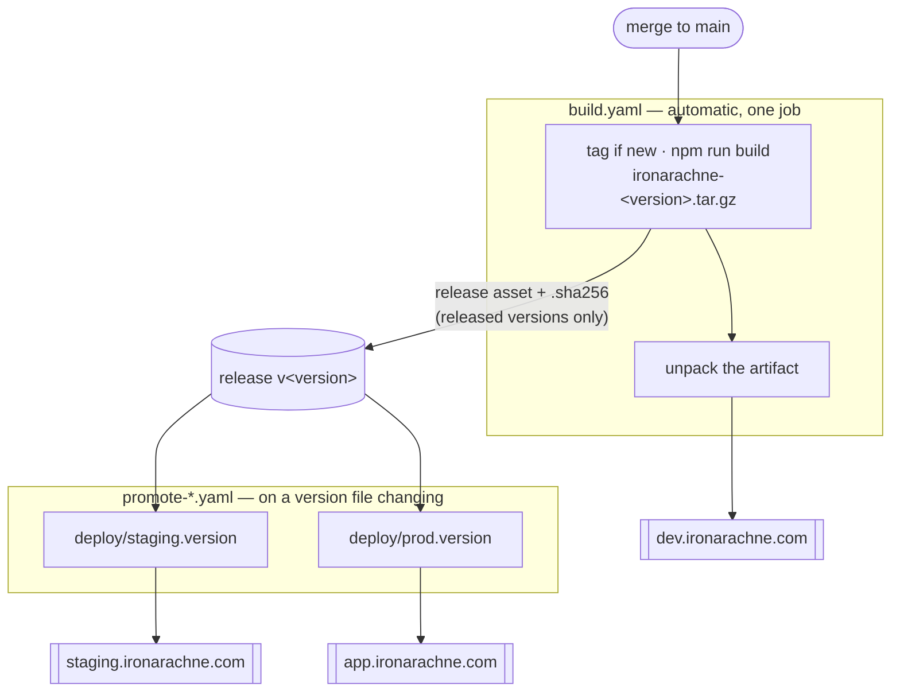

# Deployment

How a build reaches a bucket. The infrastructure it targets is described in `docs/infrastructure.md`;
the version scheme in `docs/versioning.md`.

**Status:** implemented. A merge to `main` tags the version, builds a versioned artifact, publishes it
as a release asset with a checksum, and deploys it to dev — all confirmed on real runs. Promotion by
committed version file replaces an earlier `workflow_dispatch` design that could not work here; the
publish half of it is proven, since staging was promoted to 2.3.2 by running the same two commands
by hand.

Most of the shape below exists to work around things this platform does not implement, and every one
of those limits cost at least one CI round trip to find. Read
[Actions on this host](#actions-on-this-host) before changing any workflow — the section is not
background reading, it is the list of things that will otherwise waste an afternoon.

## The shape



|         | Trigger                          | Deploys                                  |
| ------- | -------------------------------- | ---------------------------------------- |
| dev     | every merge to `main`            | the artifact built in that run, unpacked |
| staging | `deploy/staging.version` changes | the release asset for that version       |
| prod    | `deploy/prod.version` changes    | the release asset for that version       |

Promotion fetches a published artifact rather than rebuilding, so the bytes reaching prod are the
bytes that were built and tested — not a rebuild that happens to start from the same commit.

Build and deploy are **not** separate jobs, and that is a platform constraint rather than a
preference: this host provides no `ACTIONS_RUNTIME_TOKEN`, so workflow artifacts do not work and
there is no way to hand a file between jobs. See [Actions on this host](#actions-on-this-host). The
separation lives in the scripts and in the promotion workflows instead. To keep it honest, the dev
deploy publishes the **unpacked artifact** rather than `build/` directly, so dev serves exactly what
the release contains and a packaging bug surfaces there rather than first appearing in prod.

## Publishing

`scripts/publish_site.sh <dev|staging|prod> [build-dir]` does the actual work, and CI is a thin
wrapper around it. It can be run by hand with `SCW_ACCESS_KEY`, `SCW_SECRET_KEY` and
`BUNNYNET_API_KEY` set:

```bash
npm run build
scripts/publish_site.sh dev
```

### Why the upload is two passes

Cache lifetimes differ by an order of ten million between the two kinds of file, and Object Storage
sends no `Cache-Control` of its own — whatever is set at upload time is what the CDN and browsers
obey.

| Files               | Header                                | Reason                                                                                    |
| ------------------- | ------------------------------------- | ----------------------------------------------------------------------------------------- |
| `_app/immutable/**` | `public, max-age=31536000, immutable` | Vite content-hashes these, so a given URL's bytes never change                            |
| everything else     | `public, max-age=0, must-revalidate`  | HTML shells at stable URLs; serving these stale would pin visitors to the previous deploy |

The passes are also ordered, and the order matters:

1. **`rclone copy` the hashed assets.** `copy`, not `sync`, so nothing is deleted yet. New HTML must
   never reach a visitor before the assets it references exist.
2. **`rclone sync` everything else**, excluding the hashed assets. `sync` prunes files deleted from
   the build, so removed routes stop being served. The exclusion means this pass cannot delete an
   asset that a page still held at the edge might ask for.

Old hashed assets therefore accumulate. That is deliberate — they are small, and deleting them is how
you break the pages still referencing them. Prune with a bucket lifecycle rule if it ever matters.

`--checksum` is not incidental: CI checks out fresh every run, so every file looks newly modified.
Comparing MD5 instead of timestamps means only genuinely changed files upload.

### The cache purge

The edge holds the previous HTML until told otherwise, so the script finishes by purging the pull
zone. Without it a deploy is invisible for as long as the edge copy lives. Hashed assets are
unaffected — their URLs changed, so nothing stale is reachable.

## Promoting to staging or prod

**Promotion is a commit.** Each environment has a file naming the version it should be running:

```
deploy/staging.version
deploy/prod.version
```

Change the file, open a PR, merge it. `promote-staging.yaml` and `promote-prod.yaml` watch their
respective file and, when it changes on `main`, fetch that version's release asset and publish it.

```bash
echo 2.3.3 > deploy/prod.version   # then PR and merge
```

**Rolling back is the same operation**: put the older version in the file and merge. Nothing special,
nothing to remember under pressure.

A version must have been released to be promotable — bump `package.json` to cut one — and the file
holds bare digits, `2.3.2`, with no leading `v`.

Doing it by hand is still supported and is exactly what the workflows run:

```bash
scripts/fetch_release_artifact.sh 2.3.2 build
scripts/publish_site.sh prod build
```

### Why a commit rather than a button

Because a button does not work here. `workflow_dispatch` inputs are collected by the web UI and then
never delivered to the runner — see [Actions on this host](#actions-on-this-host). The three
promotion attempts that failed were all this, wearing different masks.

Having been forced into it, the committed version is the better design regardless: the repository
states what each environment is meant to be running, promotion is reviewable before it happens, and
rollback needs no new mechanism.

## Required setup

Four secrets are in place: `SCW_ACCESS_KEY`, `SCW_SECRET_KEY` and `BUNNYNET_API_KEY`, named to match
the local environment variables, plus `WORKTREE_ACCESS_TOKEN` — a personal access token with write
access to this repository, which is what lets `build.yaml` push the tag and cut the release. Without
that last one, builds and dev deploys still work and the workflow logs a warning; only releases, and
therefore promotion, are blocked.

One thing still needs doing:

**Point the Scaleway secrets at the deploy identity.** They currently hold a user-scoped API key,
which can do anything the account can. `infra/shared` exists to provide a narrower one: an IAM
application whose policy allows only object-storage reads and writes within the site project. Mint a
key against it and replace the secret values — the names do not change, so nothing here needs
editing. `infra/README.md` has the command.

## Why bucket names live in the publish script

`scripts/publish_site.sh` maps environment to bucket and pull zone in a `case` statement, duplicating
what `tofu output` knows. That is on purpose: reading it from OpenTofu state would mean giving the
deploy job credentials for the state bucket, and the whole point of the scoped deploy identity is
that it can touch objects and nothing else. The values are stable; the comment in the script points
at the source of truth.

## Actions on this host

The publish path is verified: `scripts/publish_site.sh` has published a real build to dev, and the
result was checked end to end — correct `Cache-Control` at the origin, the year-long header surviving
through the CDN, a cache `HIT` on a second asset request, deep links resolving, an unknown route
returning the error document, and pages rendering in a browser with no failed requests.

**Tag pushing works.** The first run on `main` cut `v2.3.0` and pushed it. A protected branch does
not block a tag.

Worth holding in mind for all of this: **Worktree.ca is a hard fork of Gitea**, and its Actions
implementation is GitHub-compatible rather than GitHub. Stock actions published by GitHub sometimes
assume they are talking to github.com and refuse to run when they are not — which is the root of the
artifact trouble below, not anything specific to this repository.

**Workflow artifacts do not work here at all, at any version.** Three runs were spent discovering
this, one version at a time:

| Version     | Result                                                                                           |
| ----------- | ------------------------------------------------------------------------------------------------ |
| `v4`        | `GHESNotSupportedError` — refuses to run anywhere but github.com                                 |
| `v3`        | `unsupported action type: node16` — the runner rejects node16 actions outright                   |
| `v3-node20` | ran correctly on node20, found the file, then `Unable to get ACTIONS_RUNTIME_TOKEN env variable` |

That last one is the real answer, and it is not a version problem. `ACTIONS_RUNTIME_TOKEN` is what
the artifact protocol authenticates with, and this runner never sets it — the artifact service is not
implemented. Worktree's own documentation corroborates it from the other side: "Build caching is
currently disabled", and cache and artifacts are the same subsystem.

**So do not add `upload-artifact` or `download-artifact` back in any form.** Anything that needs to
survive beyond a single job has to go somewhere real: a release asset, or a bucket. That constraint
is why `build.yaml` is one job.

**`workflow_dispatch` inputs do not work here at all, and cost three failed prod deploys.** The first two failures looked like two
separate problems, which look nothing alike:

| Attempt                                                        | What happened                                                                                                   |
| -------------------------------------------------------------- | --------------------------------------------------------------------------------------------------------------- |
| `${{ inputs.version }}` in a step `run:`                       | Evaluated to an **empty string**. The scripts ran with no arguments and failed on their own usage messages.     |
| `${{ github.event.inputs.version }}` in a **job-level `env:`** | **Not evaluated at all.** The literal `${{ … }}` text was passed through to `curl`, which choked on the braces. |

A third attempt, reading both spellings from a step-level `env:`, finally showed what is actually
going on:

```
github.event.inputs.environment -> 'map[]'
github.event.inputs.version     -> 'map[]'
inputs.environment              -> ''
inputs.version                  -> ''
```

`map[]` is how Go renders an empty map. **`github.event.inputs` exists but is empty** — the values
typed into the dispatch form are not reaching the workflow by either name.

A fourth attempt dumped every possible source before judging any of them, and settled it:

```
github.event.inputs.environment -> 'map[]'      # an empty map
inputs.environment              -> ''           # not populated
$GITHUB_EVENT_PATH              -> unset; no event payload file exists
environment variables matching INPUT -> (none)
```

**`workflow_dispatch` inputs are not delivered to the runner on this host, by any route.** The web UI
renders the fields and collects what you type — this was confirmed by a human filling them in — and
none of it reaches the job. There is not even an event payload file to read them from. This looks
like a host bug worth reporting upstream.

Hence promotion by committed version file. No workflow here should be designed around dispatch
inputs until that changes.

Two related rules learned along the way:

- **Expressions in job-level `env:` are not evaluated at all.** Step-level `env:` is, and `build.yaml`
  depends on that. Never put an expression in a job-level `env:` here.
- **Print, then judge.** An earlier diagnostic validated values before dumping them, so a bad value
  exited the step early and suppressed the dump added for exactly that purpose. The run failed with
  `unknown environment 'map[]'` and taught us nothing, costing a whole round trip.

**Most of the `GITHUB_*` context is empty; `GITHUB_REF` is the exception.** The gap above is wider
than `workflow_dispatch`. Dumped from inside a real pull request job:

```
GITHUB_EVENT_NAME=''
GITHUB_REF='refs/pull/117/head'
GITHUB_BASE_REF=''
GITHUB_HEAD_REF=''
```

`${{ github.event_name }}` is empty by the same token. So a step that needs to know it is running on
a pull request has to match `GITHUB_REF` against `refs/pull/*`, which is also what
`actions/checkout` resolves its ref from. This was found the hard way by a step in `ci.yaml` that
read `github.event_name`, concluded `event is 'unknown'` on pull request #117, and fell through to
its safe branch — correct behaviour, but the feature it guarded could never have fired. That step
has since been removed with the rest of the pull-request browser suite, and the lesson outlived it:
prefer reading the runner's environment over a `${{ github.* }}` expression whenever there is a
choice.

**`timeout-minutes:` on a job makes the runner reject that job.** Adding it to `e2e` produced a
failure one second after the worker was assigned — before the runner version banner, before any
step, with a five-line log containing no error text at all:

```
⏳ Waiting for available worker...
✅ Assigned to worker MgzuTShhrcQkyRvMmeKi4a
```

The workflow itself parsed: `verify`, from the same file, ran and passed in the same run. So the
symptom is a job that dies instantly and silently while its sibling is fine, which looks nothing
like a bad key and cost a round trip to attribute. No workflow here uses it. If a job needs a time
limit, note that shell `timeout` does not help against the stall below either — see there before
assuming any timer will save you.

**A job that stops producing output is reaped after about fifteen minutes, and nothing inside the
job can pre-empt it.** Observed four times in about twenty-four hours on `e2e`, at unrelated points
— twice mid-suite, once before any test ran while the preview server was still building, and once
at test 258 of 293:

| Run | Last log line          | Failed   | Silence |
| --- | ---------------------- | -------- | ------- |
| 102 | test #113, mid-suite   | 12:19:14 | 14m30s  |
| 110 | test #106, mid-suite   | 19:04:14 | 13m57s  |
| 112 | webserver build output | 19:34:14 | 14m54s  |
| 119 | test #258, mid-suite   | 11:34:14 | 14m13s  |

The consistency of the interval matters more than where each one stopped: this is a timer, not a
deadlock in any particular test. Worth reading alongside the log truncation below, since a job that
merely loses its log stream looks identical from outside until the timer fires.

**No timer inside the job pre-empts it.** Run 119 tested this directly. It ran under
`timeout --kill-after=30s 12m npm run test:e2e`, with `npm run test:e2e` starting at 11:16:11, so
the wrapper was due to fire at 11:28:11. The job died at 11:34:14 instead — the reap, six minutes
late, with no timeout message. Playwright's `globalTimeout` and its 180-second `webServer.timeout`
had already failed to fire in run 112. A shell `timeout` is a separate process and still did not
run, which points at the whole container freezing rather than the browser or Node wedging.

The practical consequence: **a stall cannot be made fast or legible from inside the repository.**
Combined with there being no Actions API to re-run a job from, that is why the browser suite no
longer gates a pull request — see `.worktree/workflows/e2e.yaml`.

**Log output is sometimes lost without the job failing.** A `build` run reported success in 39
seconds — the normal duration — while its log stopped mid-`vite build` and held 193 lines against a
healthy run's ~1026, missing every `✓ built`, the publish output, and the `Deployed … to
https://dev.ironarachne.com` line. The deploy had in fact happened; the origin's `last-modified`
header sat inside the job's window. **Do not read a truncated log as a failed job.** Check the
duration against a known-good run, and check the artefact the job was supposed to produce.

**`actions/create-release` needs `name`, `body`, `draft` and `prerelease` passed explicitly.** Its
defaults are written in terms of `github.event.release.*`, which does not exist on a `push` event; the
expressions collapse to the string `"true"`, and you get a draft prerelease titled `true`. That is
not a cosmetic problem — a draft release is invisible to unauthenticated callers, so
`scripts/fetch_release_artifact.sh` cannot see it and promotion silently has nothing to deploy.

Releases are cut with `actions/create-release`, which Worktree publishes in its own `actions/`
namespace for exactly this purpose. Prefer it over hand-rolled API calls: it runs on node20, it
preserves an existing release rather than duplicating it, and it uploads assets in the same step. It
also publishes a `.sha256` beside the artifact, which `scripts/fetch_release_artifact.sh` verifies
before unpacking — so promotion moves bytes that are checked rather than merely assumed.

### The self-healing release step, and its limit

The release step fires whenever HEAD is exactly at the version tag, rather than only when the tag was
just created. So a build that cuts a tag but dies before attaching the artifact is repaired by the
next run **on that same commit**.

Its limit is worth understanding, because the first attempt ran into it. Once `main` moves past the
tag, the version no longer matches and the step is skipped — correctly, since a later commit is not
that release. A version whose build failed _and_ whose commit has been built over is therefore
stranded: it has a tag and no artifact, and nothing will ever give it one.

That is what happened to `v2.3.0`, which is why it is a tag with no release. The fix is not to
resurrect it but to cut the next version, which is why `2.3.1` exists. If it happens again, bump the
version rather than deleting and re-pushing a published tag.

One earlier unknown is now closed. Scaleway **does** implement the S3 directory redirect: a request
for `/heraldry` returns `302` to `/heraldry/`, so the trailing-slash fallback described in
`docs/static-hosting.md` is not needed in practice.
