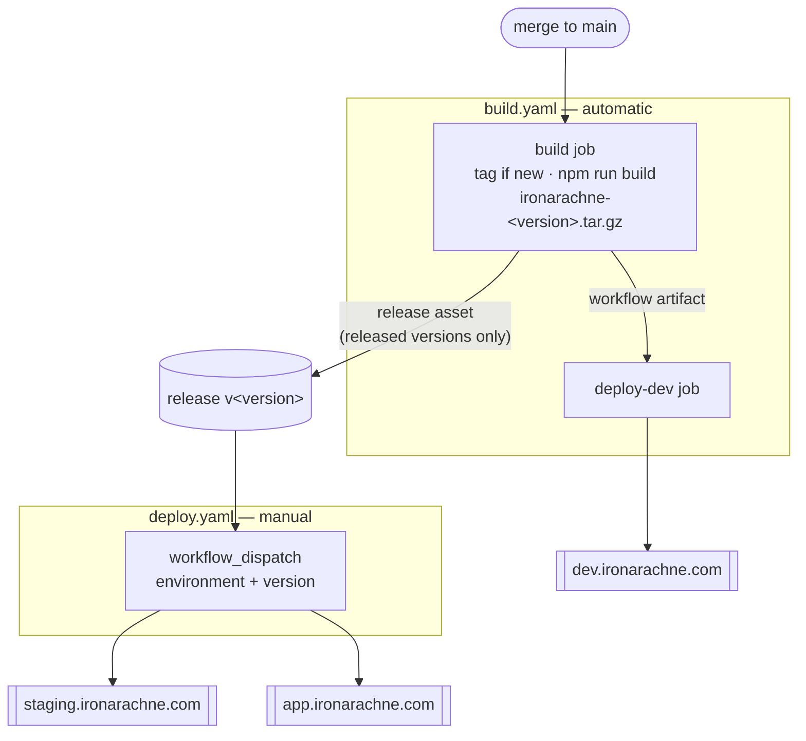

# Deployment

How a build reaches a bucket. The infrastructure it targets is described in `docs/infrastructure.md`;
the version scheme in `docs/versioning.md`.

**Status:** implemented. The publish path is verified end to end against dev. The tag, release and
workflow-artifact steps have not yet run on Worktree Actions — see
[What has not been proven yet](#what-has-not-been-proven-yet).

## The shape



|         | Trigger               | Artifact source                         |
| ------- | --------------------- | --------------------------------------- |
| dev     | every merge to `main` | the workflow artifact from the same run |
| staging | manual                | the release asset for a chosen version  |
| prod    | manual                | the release asset for a chosen version  |

Build and deploy are separate jobs, and promotion is a separate workflow, so the bytes that reach
prod are the bytes that were built and tested — not a rebuild that happens to start from the same
commit.

## Publishing

`scripts/publish_site.sh <dev|staging|prod> [build-dir]` does the actual work, and CI is a thin
wrapper around it. It can be run by hand with `SCW_ACCESS_KEY`, `SCW_SECRET_KEY` and
`BUNNYNET_API_KEY` set:

```bash
npm run build
scripts/publish_site.sh dev
```

### Why the upload is two passes

Cache lifetimes differ by an order of ten million between the two kinds of file, and Object Storage
sends no `Cache-Control` of its own — whatever is set at upload time is what the CDN and browsers
obey.

| Files               | Header                                | Reason                                                                                    |
| ------------------- | ------------------------------------- | ----------------------------------------------------------------------------------------- |
| `_app/immutable/**` | `public, max-age=31536000, immutable` | Vite content-hashes these, so a given URL's bytes never change                            |
| everything else     | `public, max-age=0, must-revalidate`  | HTML shells at stable URLs; serving these stale would pin visitors to the previous deploy |

The passes are also ordered, and the order matters:

1. **`rclone copy` the hashed assets.** `copy`, not `sync`, so nothing is deleted yet. New HTML must
   never reach a visitor before the assets it references exist.
2. **`rclone sync` everything else**, excluding the hashed assets. `sync` prunes files deleted from
   the build, so removed routes stop being served. The exclusion means this pass cannot delete an
   asset that a page still held at the edge might ask for.

Old hashed assets therefore accumulate. That is deliberate — they are small, and deleting them is how
you break the pages still referencing them. Prune with a bucket lifecycle rule if it ever matters.

`--checksum` is not incidental: CI checks out fresh every run, so every file looks newly modified.
Comparing MD5 instead of timestamps means only genuinely changed files upload.

### The cache purge

The edge holds the previous HTML until told otherwise, so the script finishes by purging the pull
zone. Without it a deploy is invisible for as long as the edge copy lives. Hashed assets are
unaffected — their URLs changed, so nothing stale is reachable.

## Promoting to staging or prod

Run the **Deploy** workflow from the Actions UI, choosing an environment and a version. It fetches
that version's release asset and publishes it. Equivalently, by hand:

```bash
scripts/fetch_release_artifact.sh 2.3.0 build
scripts/publish_site.sh staging build
```

A version must have been released to be promotable. Bump `package.json` to cut one.

## Required setup

Three secrets are already in place, named to match the local environment variables:
`SCW_ACCESS_KEY`, `SCW_SECRET_KEY`, `BUNNYNET_API_KEY`.

Two things still need doing:

**1. Add a `WORKTREE_ACCESS_TOKEN` secret** — a personal access token with write access to this
repository. It is what lets `build.yaml` push the tag and create the release. Without it, builds and
dev deploys still work; only promotion is blocked, and the workflow logs a warning rather than
failing.

**2. Point the Scaleway secrets at the deploy identity.** They currently hold a user-scoped API key,
which can do anything the account can. `infra/shared` exists to provide a narrower one: an IAM
application whose policy allows only object-storage reads and writes within the site project. Mint a
key against it and replace the secret values — the names do not change, so nothing here needs
editing. `infra/README.md` has the command.

## Why bucket names live in the publish script

`scripts/publish_site.sh` maps environment to bucket and pull zone in a `case` statement, duplicating
what `tofu output` knows. That is on purpose: reading it from OpenTofu state would mean giving the
deploy job credentials for the state bucket, and the whole point of the scoped deploy identity is
that it can touch objects and nothing else. The values are stable; the comment in the script points
at the source of truth.

## What has not been proven yet

The publish path is verified: `scripts/publish_site.sh` has published a real build to dev, and the
result was checked end to end — correct `Cache-Control` at the origin, the year-long header surviving
through the CDN, a cache `HIT` on a second asset request, deep links resolving, an unknown route
returning the error document, and pages rendering in a browser with no failed requests.

**Tag pushing works.** The first run on `main` cut `v2.3.0` and pushed it. A protected branch does
not block a tag.

Worth holding in mind for all of this: **Worktree.ca is a hard fork of Gitea**, and its Actions
implementation is GitHub-compatible rather than GitHub. Stock actions published by GitHub sometimes
assume they are talking to github.com and refuse to run when they are not — which is the root of the
artifact trouble below, not anything specific to this repository.

**The artifact actions must be `v3-node20`** — not v4, and not plain v3. Both halves matter, and
both were learned by hitting them:

| Version     | Result                                                                                                                |
| ----------- | --------------------------------------------------------------------------------------------------------------------- |
| `v4`        | `GHESNotSupportedError` — refuses to run anywhere but github.com, because the artifact API it needs exists only there |
| `v3`        | `unsupported action type: node16` — the runner rejects node16 actions outright                                        |
| `v3-node20` | v3's protocol, which this host implements, on a runtime the runner accepts                                            |

Do not "upgrade" them. If `v3-node20` is ever withdrawn, the replacement is a _patched_ v4 — a fork
with the github.com check removed — rather than stock v4, which will always refuse.

### The self-healing release step, and its limit

The release step fires whenever HEAD is exactly at the version tag, rather than only when the tag was
just created. So a build that cuts a tag but dies before attaching the artifact is repaired by the
next run **on that same commit**.

Its limit is worth understanding, because the first attempt ran into it. Once `main` moves past the
tag, the version no longer matches and the step is skipped — correctly, since a later commit is not
that release. A version whose build failed _and_ whose commit has been built over is therefore
stranded: it has a tag and no artifact, and nothing will ever give it one.

That is what happened to `v2.3.0`, which is why it is a tag with no release. The fix is not to
resurrect it but to cut the next version, which is why `2.3.1` exists. If it happens again, bump the
version rather than deleting and re-pushing a published tag.

One earlier unknown is now closed. Scaleway **does** implement the S3 directory redirect: a request
for `/heraldry` returns `302` to `/heraldry/`, so the trailing-slash fallback described in
`docs/static-hosting.md` is not needed in practice.
