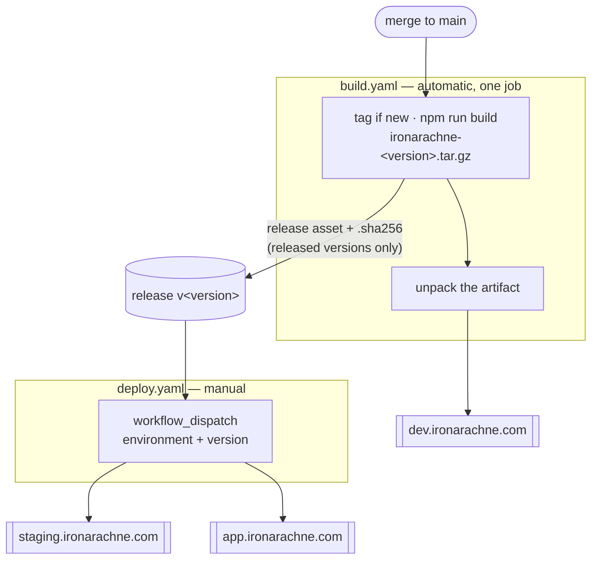

# Deployment

How a build reaches a bucket. The infrastructure it targets is described in `docs/infrastructure.md`;
the version scheme in `docs/versioning.md`.

**Status:** implemented and working. A merge to `main` tags the version, builds a versioned artifact,
publishes it as a release asset with a checksum, and deploys it to dev — all confirmed on a real run.
Promotion works both ways: its two commands were run against staging, which served 2.3.2 correctly,
and the `workflow_dispatch` button has since been used for real.

Getting there took four runs, and what they taught is in
[Actions on this host](#actions-on-this-host). Read that section before changing anything in
`build.yaml`: most of it exists to work around things this platform does not implement.

## The shape



|         | Trigger               | Deploys                                  |
| ------- | --------------------- | ---------------------------------------- |
| dev     | every merge to `main` | the artifact built in that run, unpacked |
| staging | manual                | the release asset for a chosen version   |
| prod    | manual                | the release asset for a chosen version   |

Promotion is a separate workflow that fetches a published artifact, so the bytes reaching prod are
the bytes that were built and tested — not a rebuild that happens to start from the same commit.

Build and deploy are **not** separate jobs, though, and that is a platform constraint rather than a
preference: this host provides no `ACTIONS_RUNTIME_TOKEN`, so workflow artifacts do not work and
there is no way to hand a file between jobs. See [Actions on this host](#actions-on-this-host). The
separation lives in the scripts and in `deploy.yaml` instead. To keep it honest, the dev deploy
publishes the **unpacked artifact** rather than `build/` directly, so dev serves exactly what the
release contains and a packaging bug surfaces there rather than first appearing in a prod promotion.

## Publishing

`scripts/publish_site.sh <dev|staging|prod> [build-dir]` does the actual work, and CI is a thin
wrapper around it. It can be run by hand with `SCW_ACCESS_KEY`, `SCW_SECRET_KEY` and
`BUNNYNET_API_KEY` set:

```bash
npm run build
scripts/publish_site.sh dev
```

### Why the upload is two passes

Cache lifetimes differ by an order of ten million between the two kinds of file, and Object Storage
sends no `Cache-Control` of its own — whatever is set at upload time is what the CDN and browsers
obey.

| Files               | Header                                | Reason                                                                                    |
| ------------------- | ------------------------------------- | ----------------------------------------------------------------------------------------- |
| `_app/immutable/**` | `public, max-age=31536000, immutable` | Vite content-hashes these, so a given URL's bytes never change                            |
| everything else     | `public, max-age=0, must-revalidate`  | HTML shells at stable URLs; serving these stale would pin visitors to the previous deploy |

The passes are also ordered, and the order matters:

1. **`rclone copy` the hashed assets.** `copy`, not `sync`, so nothing is deleted yet. New HTML must
   never reach a visitor before the assets it references exist.
2. **`rclone sync` everything else**, excluding the hashed assets. `sync` prunes files deleted from
   the build, so removed routes stop being served. The exclusion means this pass cannot delete an
   asset that a page still held at the edge might ask for.

Old hashed assets therefore accumulate. That is deliberate — they are small, and deleting them is how
you break the pages still referencing them. Prune with a bucket lifecycle rule if it ever matters.

`--checksum` is not incidental: CI checks out fresh every run, so every file looks newly modified.
Comparing MD5 instead of timestamps means only genuinely changed files upload.

### The cache purge

The edge holds the previous HTML until told otherwise, so the script finishes by purging the pull
zone. Without it a deploy is invisible for as long as the edge copy lives. Hashed assets are
unaffected — their URLs changed, so nothing stale is reachable.

## Promoting to staging or prod

Run the **Deploy** workflow from the Actions UI, choosing an environment and a version. It fetches
that version's release asset and publishes it. Equivalently, by hand:

```bash
scripts/fetch_release_artifact.sh 2.3.2 build
scripts/publish_site.sh staging build
```

A version must have been released to be promotable. Bump `package.json` to cut one.

**Promotion has to be started by a human in the web UI.** The button works. What does not is doing it
programmatically: this host implements no Actions REST API — `/api/v1/repos/{owner}/{repo}/actions/*`
returns a route-level 404 — so no script, agent, or other workflow can dispatch it. The two commands
above are the supported fallback when nobody is around to click; they are exactly what the workflow
runs.

## Required setup

Three secrets are already in place, named to match the local environment variables:
`SCW_ACCESS_KEY`, `SCW_SECRET_KEY`, `BUNNYNET_API_KEY`.

Two things still need doing:

**1. Add a `WORKTREE_ACCESS_TOKEN` secret** — a personal access token with write access to this
repository. It is what lets `build.yaml` push the tag and create the release. Without it, builds and
dev deploys still work; only promotion is blocked, and the workflow logs a warning rather than
failing.

**2. Point the Scaleway secrets at the deploy identity.** They currently hold a user-scoped API key,
which can do anything the account can. `infra/shared` exists to provide a narrower one: an IAM
application whose policy allows only object-storage reads and writes within the site project. Mint a
key against it and replace the secret values — the names do not change, so nothing here needs
editing. `infra/README.md` has the command.

## Why bucket names live in the publish script

`scripts/publish_site.sh` maps environment to bucket and pull zone in a `case` statement, duplicating
what `tofu output` knows. That is on purpose: reading it from OpenTofu state would mean giving the
deploy job credentials for the state bucket, and the whole point of the scoped deploy identity is
that it can touch objects and nothing else. The values are stable; the comment in the script points
at the source of truth.

## Actions on this host

The publish path is verified: `scripts/publish_site.sh` has published a real build to dev, and the
result was checked end to end — correct `Cache-Control` at the origin, the year-long header surviving
through the CDN, a cache `HIT` on a second asset request, deep links resolving, an unknown route
returning the error document, and pages rendering in a browser with no failed requests.

**Tag pushing works.** The first run on `main` cut `v2.3.0` and pushed it. A protected branch does
not block a tag.

Worth holding in mind for all of this: **Worktree.ca is a hard fork of Gitea**, and its Actions
implementation is GitHub-compatible rather than GitHub. Stock actions published by GitHub sometimes
assume they are talking to github.com and refuse to run when they are not — which is the root of the
artifact trouble below, not anything specific to this repository.

**Workflow artifacts do not work here at all, at any version.** Three runs were spent discovering
this, one version at a time:

| Version     | Result                                                                                           |
| ----------- | ------------------------------------------------------------------------------------------------ |
| `v4`        | `GHESNotSupportedError` — refuses to run anywhere but github.com                                 |
| `v3`        | `unsupported action type: node16` — the runner rejects node16 actions outright                   |
| `v3-node20` | ran correctly on node20, found the file, then `Unable to get ACTIONS_RUNTIME_TOKEN env variable` |

That last one is the real answer, and it is not a version problem. `ACTIONS_RUNTIME_TOKEN` is what
the artifact protocol authenticates with, and this runner never sets it — the artifact service is not
implemented. Worktree's own documentation corroborates it from the other side: "Build caching is
currently disabled", and cache and artifacts are the same subsystem.

**So do not add `upload-artifact` or `download-artifact` back in any form.** Anything that needs to
survive beyond a single job has to go somewhere real: a release asset, or a bucket. That constraint
is why `build.yaml` is one job.

**`workflow_dispatch` inputs arrive under `github.event.inputs`, not `inputs`.** The `inputs` context
is not populated here, so `${{ inputs.version }}` silently expands to an empty string — the workflow
runs, calls its scripts with no arguments, and fails with whatever those scripts say about missing
arguments. The first manual prod deploy died exactly that way, on a bare `usage:` line that named
nothing. `github.event.inputs` works on both this host and GitHub, so prefer it everywhere.

`deploy.yaml` also checks its inputs are non-empty before doing anything, so a recurrence names
itself instead of surfacing as a confusing error from a script three layers down.

**`actions/create-release` needs `name`, `body`, `draft` and `prerelease` passed explicitly.** Its
defaults are written in terms of `github.event.release.*`, which does not exist on a `push` event; the
expressions collapse to the string `"true"`, and you get a draft prerelease titled `true`. That is
not a cosmetic problem — a draft release is invisible to unauthenticated callers, so
`scripts/fetch_release_artifact.sh` cannot see it and promotion silently has nothing to deploy.

Releases are cut with `actions/create-release`, which Worktree publishes in its own `actions/`
namespace for exactly this purpose. Prefer it over hand-rolled API calls: it runs on node20, it
preserves an existing release rather than duplicating it, and it uploads assets in the same step. It
also publishes a `.sha256` beside the artifact, which `scripts/fetch_release_artifact.sh` verifies
before unpacking — so promotion moves bytes that are checked rather than merely assumed.

### The self-healing release step, and its limit

The release step fires whenever HEAD is exactly at the version tag, rather than only when the tag was
just created. So a build that cuts a tag but dies before attaching the artifact is repaired by the
next run **on that same commit**.

Its limit is worth understanding, because the first attempt ran into it. Once `main` moves past the
tag, the version no longer matches and the step is skipped — correctly, since a later commit is not
that release. A version whose build failed _and_ whose commit has been built over is therefore
stranded: it has a tag and no artifact, and nothing will ever give it one.

That is what happened to `v2.3.0`, which is why it is a tag with no release. The fix is not to
resurrect it but to cut the next version, which is why `2.3.1` exists. If it happens again, bump the
version rather than deleting and re-pushing a published tag.

One earlier unknown is now closed. Scaleway **does** implement the S3 directory redirect: a request
for `/heraldry` returns `302` to `/heraldry/`, so the trailing-slash fallback described in
`docs/static-hosting.md` is not needed in practice.
