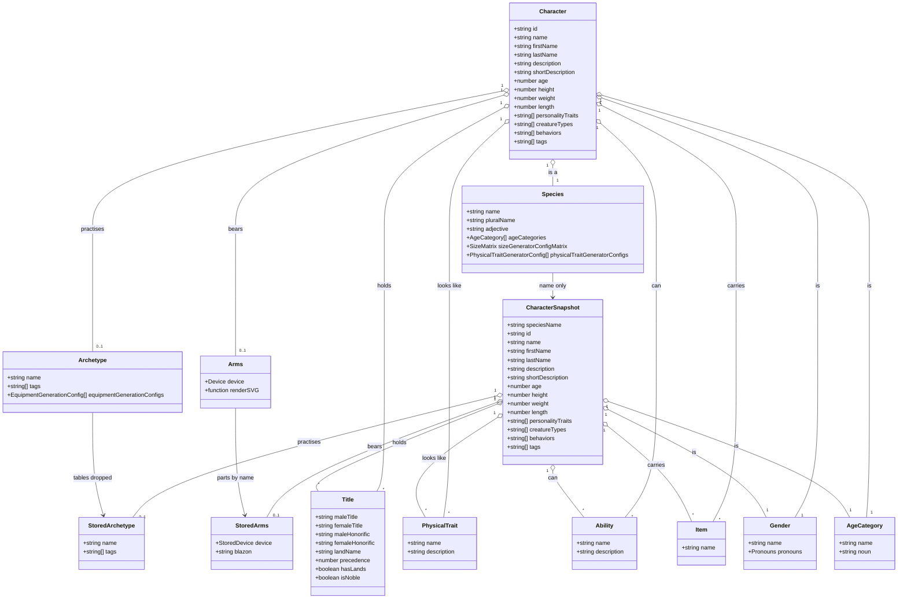
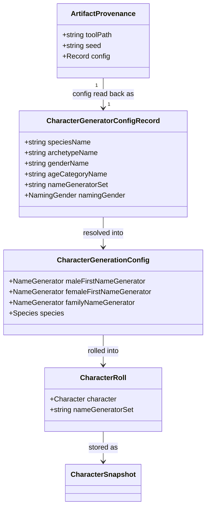
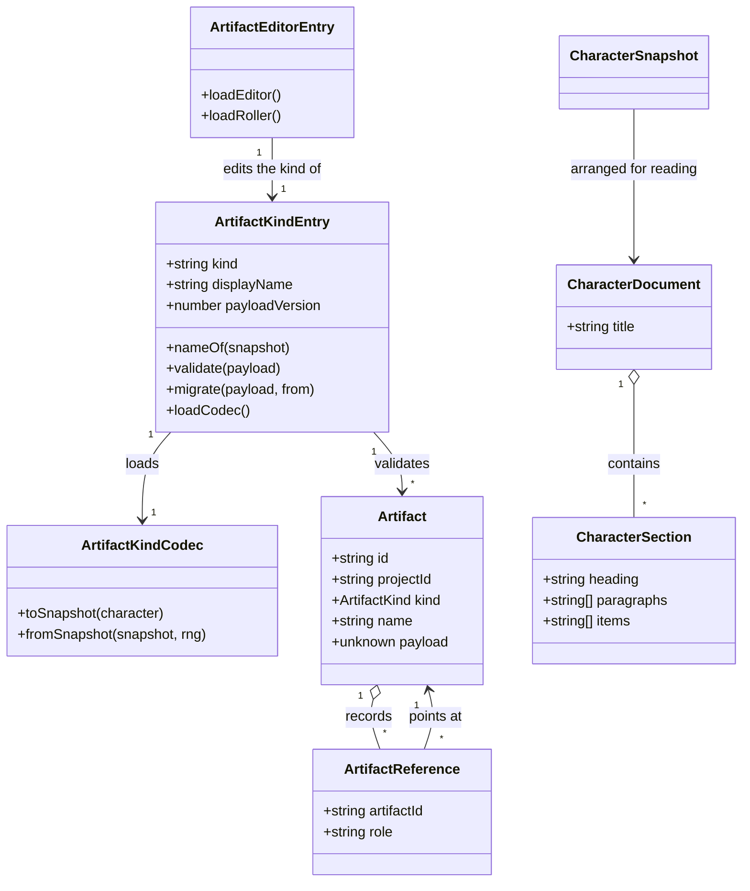

# The fantasy character artifact

This design document covers the artifact kind `character` and the tool that produces it: the
**Fantasy Character** generator (`/character`).

Designs [#46](https://github.com/ironarachne/ironarachne/issues/46), which takes that generator
from Experimental to Release-ready. It sits inside [the workshop](workshop.md) and is measured
against [Tool release readiness](workshop.md#tool-release-readiness). Culture (#40), religion
(#41), settlement (#20) and the AD&D 2E character (#45, #47,
[docs/adnd-character.md](adnd-character.md)) are the worked examples, and this follows them rather
than inventing a second shape.

**Status:** accepted; not yet built. The [domain model](#domain-model) was reviewed and approved,
so [the plan](#the-plan) is clear to start. The one question in [Still open](#still-open) — whether
the editor lets a saved character's species be changed — is still open, and item 6 of the plan is
where it has to be answered.

## The problem

Nothing this generator produces survives the tab closing. `src/lib/characters` has no snapshot
module, no artifact kind is registered for it, and `CharacterGenerator.svelte` has no
`SaveArtifactButton`. Sections 3, 4, 5 and 7.2–7.4 of the readiness spec are outstanding in full.

Three things make this tool different from the four kinds already done, and they are what the rest
of this document is about.

- **Most of a character's bulk is shared table data it was rolled from, not content.** A
  `Character` embeds a whole `Species` — age categories, a size matrix, physical-trait generator
  configs, abilities — and, when it has one, a whole `Archetype`, whose
  `equipmentGenerationConfigs` measured 66 KB per character when the settlement snapshot was
  designed. Stored as they stand, a party of six is a storage-quota problem.
- **Part of this payload already exists, in the wrong library.** `settlement_snapshot.ts` declares
  `StoredCharacter`, `StoredArchetype`, and their converters, because a settlement's notables are
  characters. `$lib/characters` is where that shape belongs, and moving it is not free: it changes
  a payload that is already in users' browsers.
- **The generator is not deterministic today, so 2.2 is failing before anything is saved.**
  `generateCharacter()` reseeds from `Date.now()` on every press unless the seed is locked
  (`CharacterGenerator.svelte:83`), and `generateNameOnly()` builds an RNG from
  `` `${Date.now()}-character-name` `` (`:135`). The same seed and settings do not reliably give
  the same character, which is exactly what a re-roll from provenance depends on. The AD&D
  generator had the same defect and `adnd_character_roll.ts` is the fix; this is the same fix.

## What is already true

Assessed rather than assumed:

- **1.1–1.4 are met.** The catalog entry is `kind: 'generator'`, `domain: 'characters'`,
  `genres: ['fantasy']`, no system — correct for a system-neutral tool — and the label **Fantasy
  Character** reads correctly out of context (`src/lib/tools/tool_catalog.ts:36`). It is
  registered in `TOOL_PANELS` (`src/lib/workshop/tool_panels.ts:18`).
- **2.1 is met.** `/character/+page.svelte` and the panel registry mount the same component.
- **2.3 is met.** `SeedControls` shows the seed and lets the user set and lock it.
- **2.4 is met.** The generator rolls on mount, before there is any user input to discard.
- **2.5 does not apply.** Nothing here is optional hardware; the heraldry a noble carries is SVG.
- **7.1, 8.1 and 8.2 are met.** `$lib/characters` has a `README.md` and an `index.ts`, consumers
  import through it, and it sits above the per-library coverage gate.

What follows is the rest: 2.2, sections 3, 4 and 5 in full, 6.3, and 7.2–7.4.

## The shape of the solution

### One kind, named `character`

The kind id is `character`, unqualified, because a character from this generator is a person rather
than a set of numbers that mean something under one ruleset — the test
[decision 4](workshop.md#4-kinds-are-system-qualified-when-the-payload-is) sets. It does not
collide with `character.adnd-2e`, which is registered, nor with `character.dcc`, `character.swn`
and `character.uncharted-worlds`, which are not yet: concept first, system as a qualifier, so every
character kind sorts together in a vault listing and the unqualified one is the generic.

A character saved from `/character` and one saved from `/fantasy/adnd/character` are deliberately
different kinds. They are not the same payload, and one editor cannot open both.

The kind's mark is `set3/human.svg`. Every registered kind carries one, and the AD&D character
already took `helmet.svg`, so the two read apart in a vault listing that holds both.

### The payload is the character, with shared tables by name

```
CharacterSnapshot =
  Omit<Character, 'species' | 'archetype' | 'heraldry'> & {
    speciesName: string;
    archetype?: StoredArchetype;   // no equipmentGenerationConfigs
    heraldry?: StoredArms | null;  // null when a referenced artifact supplies it
  }
```

Everything else on `Character` — the titles, personality traits, physical traits, abilities,
carried items, gender, age category, combat profile and actions — is plain data that survives
`structuredClone`, which the shipped settlement payload already proves by storing all of it.

The three substitutions are explicit conversions, not a blanket strip. Requirement 3.2 asks for
non-serialisable values _stripped or reconstructed explicitly_, and a blanket
`stripFunctionValuesDeep` over an `Arms` would leave charge groups with a hole where
`renderSVG` was. `stripFunctionValuesDeep` still runs over the remainder, as the culture snapshot
does, because a generator that grows a closure somewhere new should cost a stripped field rather
than a failed IndexedDB write.

**Nothing about the character is recomputed on read.** Height, weight, the description prose, the
personality traits, the land a title is named for: all stored, all authoritative, per requirement
4.2. Species and archetype are resolved by name only so the sheet can say what they were.

#### Species travels by name, and an unknown one becomes a placeholder

`Species` has no id — `name` is its key, and `sentientSpeciesList` is keyed on it. So the snapshot
stores `speciesName`, and `characterFromSnapshot` resolves it against `sentientSpeciesList`.

A name this build no longer has rebuilds a **placeholder** `Species` carrying the stored name, an
adjective and plural derived from it, and empty tables — the bargain
[decision 3 of the AD&D document](adnd-character.md#3-an-unknown-race-or-class-becomes-a-placeholder)
makes with a dropped class. Quarantining instead would retire a saved character permanently over a
lookup, and nothing on the sheet needs the tables: every number they produced is already in the
payload.

What a placeholder must not do is get used. A re-roll from provenance whose species name no longer
resolves falls back to the generator's default rather than rolling a character out of empty tables,
and says so.

#### `StoredCharacter` moves to `$lib/characters`, and the settlement payload advances to version 2

`settlement_snapshot.ts` declares `StoredCharacter` and `StoredArchetype` today. They move to
`src/lib/characters/character_snapshot.ts`, with the reading half in
`character_rehydrate.ts` for the reason settlement's is split: resolving an archetype's equipment
tables and a coat of arms' charges reaches `$lib/archetypes` and the 18 MB charge library, which
nothing that merely validates or lists a character needs. `$lib/settlements` already imports
`$lib/characters`, so the dependency runs the way it already ran.

The move is not shape-neutral: today a settlement's notable embeds a whole `Species`, and the
shared type will store `speciesName`. That is a stored payload changing shape, which is what
requirement 3.4 exists for. So `SETTLEMENT_PAYLOAD_VERSION` advances to 2 and gains a migration
that rewrites each notable's and each organization member's `character.species` object into
`speciesName`, reading the name off the embedded record. Every settlement saved before this
release keeps every notable it had.

The alternative — leave settlement's copy alone and declare a second, differently-shaped
`StoredCharacter` in `$lib/characters` — costs no migration and buys two types named the same
thing that drift the first time either changes, plus a settlement payload that stays five times
larger than it needs to be. The migration is the smaller price, it is the first real
`payloadVersion` step on the site, and it satisfies 7.3 for both kinds with a test that exercises
a real version 1 settlement.

### One roll path, from a seed

`character_roll.ts`, modelled on `adnd_character_roll.ts` and `settlement_roll.ts`:

- `CharacterGeneratorConfigRecord` — species name, archetype name, gender name, age category name,
  name generator set, naming gender. Exactly what the page's four selects and its naming section
  say, and exactly what a re-roll reads back.
- `readCharacterGeneratorConfig(config: Record<string, unknown>)` — the boundary where untyped
  provenance becomes typed. Anything unrecognisable is dropped rather than coerced.
- `rollCharacter(seed, config)` — the single path from a seed to a character, taken by the page and
  by a re-roll alike.
- `rollCharacterSnapshot(seed, config)` — what `ARTIFACT_EDITORS` registers as the roller.

Two determinism fixes come with it. The clock disappears from the roll: pressing **Generate**
draws a _new seed_ from the page's RNG, as the AD&D generator does, rather than seeding from
`Date.now()` inside the roll. And the name is drawn from a stream of its own,
`` `${seed}-character-name` ``, so choosing a name source cannot shift the rest of the character.

`rollCharacter` returns the resolved name generator set alongside the character, because provenance
must record what was used rather than what was asked for — a set this build has since dropped,
recorded as it was requested, is provenance a re-roll cannot honour.

**The "Generate name" control is an edit, not a generation.** It rewrites the name on a character
already on screen, which is precisely what requirement 4.2 protects, so it stays a fresh draw and
does not touch the recorded seed. What changes is that it writes through the same helper the editor
uses, so `firstName`, `lastName` and the derived `name` cannot fall out of step.

### Editing a saved character

`character_editing.ts`, in the shape `culture_editing.ts` established: every function takes a
snapshot and returns a new one, changing nothing in place, so the framework can compare what is on
screen against what was read.

Covering every field the generator displays (4.1):

| What                                 | How it is edited                                                        |
| ------------------------------------ | ----------------------------------------------------------------------- |
| First and last name                  | Two fields; `name` is rederived by `formatCharacterDisplayName`.        |
| Description, short description       | Textareas. Rewriting from the character is an explicit command.         |
| Gender, species name, archetype name | Selects over the build's tables, with the stored value kept if unknown. |
| Age and age category                 | A number and a select.                                                  |
| Height, weight, length               | Numbers, in the units the sheet shows.                                  |
| Personality traits                   | Add, rewrite, remove — one at a time.                                   |
| Physical traits                      | Name and description per trait, add and remove.                         |
| Abilities, carried equipment         | Name and description per entry, add and remove.                         |
| Titles                               | Male and female forms, honorifics, land name, per title.                |
| Heraldry                             | Shown, and re-rolled or replaced from a saved coat of arms.             |

That is 4.4 satisfied by construction: nothing here re-rolls anything else.

**Re-roll is the destructive command**, registered as the kind's roller and warned about by the
editing framework, which already owns that flow. A character whose provenance names a species or
archetype this build no longer has re-rolls with the generator's defaults for the missing part and
says which part it substituted.

### Composition

Two kinds are on offer, both already registered, so 5.1 binds for both.

- **A culture, for names.** `CharacterNameSection` already carries the `offerReferencedCulture`
  opt-in written for #45 and the picker behind it. `/character` turns it on. The reference is
  recorded by id with `role: "naming-culture"` (5.2), and provenance records the culture's own
  pattern set name via `nameGeneratorSetForSource`, so a re-roll produces names of the same tongue
  without reaching into the store for an artifact it cannot ask for.
- **A coat of arms.** A `SavedArtifactPicker` for `HERALDRY_ARTIFACT_KIND`, `role: "arms"`. When
  one is chosen the payload stores `heraldry: null` and the artifact reference says which — the
  shape `culture` already uses for a referenced religion. `null` is a statement, not a gap: it says
  the arms are a record of their own that someone may edit later, and copying them into the
  character would fork them at the moment of saving.

Composition stays opt-in (5.3): handed nothing, the generator rolls its own culture-flavoured names
and its own arms for a noble, exactly as it does today. 5.4 is the framework's, and nothing here
walks references.

### Output

- **6.1.** `/character` is in `e2e/page_manifest.ts`, so `pages.mobile.spec.ts` already renders it
  at every width in `mobile_viewports.ts` with a pinned seed and fails on overflow. The new
  controls — two pickers, a save button, an export button — are the same components the four
  release-ready tools already pass those widths with.
- **6.2.** The heraldry button already carries an accessible name; every select is labelled. The
  editor's fields get labels with it, and the re-roll and export controls are buttons.
- **6.3.** `character_presentation.ts` builds a `CharacterDocument` — a title and sections, where a
  section with neither prose nor items is dropped — in the shape `settlement_presentation.ts`
  established. It is rendered two ways: Markdown, downloaded through `$lib/download`, and PDF,
  through `downloadTextPdf` in `$lib/pdf`.

  **The export control ships in the same work item as the document.** Settlement built
  `settlementToDocument` and wired no control to it, so nothing on the site renders it and 6.3 is
  met there only on paper. That is the mistake this document is naming so as not to repeat it.

- **6.4.** A property of the document model rather than of each renderer: a character with no
  titles, no equipment and no arms prints no headings for them.

### Verification

- **7.2.** A round-trip test: a generated character through `toCharacterSnapshot` and
  `characterFromSnapshot` is the same character, species and archetype resolved, arms redrawn.
- **7.3.** The settlement version 1 → 2 migration, exercised against a real version 1 payload with
  an embedded species. `character` ships at version 1, so its own `migrate` rejects and is tested
  for saying so — the shape `migrateCultureSnapshot` established.
- **7.4.** An end-to-end spec beside `e2e/adnd_character.spec.ts`: generate, save into a project,
  reopen from the vault, edit a field, confirm it persisted across a reload.
- **7.5.** Mutation testing on `$lib/characters`, run by a human per CLAUDE.md.

### Documentation

`src/lib/characters/README.md` gains the new modules and what each is for. For 8.4: this generator
implements **no game system**, and the README says so plainly along with what that means — no
levels, no classes, no attribute scores, no derived combat numbers; an archetype is an occupation
and a flavour, not a character class. The AD&D, DCC, SWN and Uncharted Worlds generators are where
a system's character lives.

## Domain model

### The payload



`heraldry` on the snapshot is `StoredArms | null | undefined`: absent for a character with no arms,
`null` for one whose arms are a referenced artifact, and a value for one that carries its own.

### The roll and its provenance



`CharacterGenerationConfig` carries three `NameGenerator` objects and never leaves the roll — the
closures the issue warns about live here, not in the payload. What provenance keeps is the _name of
the pattern set_, which is enough to rebuild them.

### The workshop wiring



The two reference roles are `naming-culture`, pointing at a `culture` artifact, and `arms`,
pointing at a `heraldry` artifact.

## Decisions taken here

### 1. The kind is `character`, unqualified

A character from this generator is a person, not a set of numbers that mean something under one
ruleset, so the qualifier would be a lie about what the payload is. The id leaves
`character.adnd-2e`, `character.dcc`, `character.swn` and `character.uncharted-worlds` free, and
sorts with them.

### 2. `StoredCharacter` moves into `$lib/characters` and the settlement payload advances to 2

One shape in the library that owns the concept, at the cost of the site's first real migration.
The alternative is two types with one name, drifting from the day either changes, and a settlement
payload that keeps carrying a whole species per notable.

### 3. Species is stored by name, and an unknown name becomes a placeholder

There is no id to store. A name that no longer resolves rebuilds a placeholder rather than
quarantining the character, because nothing on the sheet needs the species tables and nothing ever
brings a removed species back.

### 4. A referenced coat of arms is stored as `null`, not copied

`heraldry: null` plus a reference says the arms are a record of their own. Copying them would fork
them at the moment of saving, so an edit to the coat of arms would never reach the character
wearing it — which is the opposite of what composition is for. It is the shape `culture` already
uses for a referenced religion, and 5.2 requires it.

### 5. The clock leaves the generation path

`Date.now()` inside `generateCharacter` is why 2.2 fails today. Pressing **Generate** draws a new
seed and rolls from it; the roll itself is a pure function of seed and config. The name gets its
own derived stream so choosing a source cannot shift the rest of the character.

### 6. "Generate name" stays a fresh draw, as an edit

It changes a character already on screen. Requirement 4.2 says the payload is authoritative and a
user's edit is not something a seed reproduces, so this is an edit and stays one — it does not
touch the recorded seed and does not claim to be reproducible.

### 7. The culture reference goes through `CharacterNameSection`

The opt-in and the picker were built for #45 and are switched off per tool. `/character` switches
them on; nothing new is written for it. This is the same argument
[decision 7 of the AD&D document](adnd-character.md#7-the-culture-reference-goes-into-characternamesection-not-beside-it)
makes.

### 8. The presentation export ships with the document model

A document model with no control wired to it satisfies 6.3 on paper and renders nothing for a user,
which is the state settlement is in. The Markdown and PDF buttons are part of the same work item.

## The plan

Ordered by dependency. Each is a branch and a PR.

| #   | Work                                                                                                          | Depends on |
| --- | ------------------------------------------------------------------------------------------------------------- | ---------- |
| 1   | `character_snapshot.ts` and `character_rehydrate.ts`: the shape, the converters, `StoredCharacter` moved in   | —          |
| 2   | Settlement payload version 2 and its migration, with a version 1 fixture test                                 | 1          |
| 3   | `character_artifact_kind.ts`: `validate`, `migrate`, `nameOf`, registration in the kind catalog               | 1          |
| 4   | `character_roll.ts`, and `CharacterGenerator.svelte` rolling through it — the 2.2 fix                         | —          |
| 5   | `SaveArtifactButton` and the two pickers in `CharacterGenerator.svelte`, with provenance and references       | 3, 4       |
| 6   | `character_editing.ts` and `CharacterArtifactEditor.svelte`, registered in `ARTIFACT_EDITORS` with its roller | 3, 4       |
| 7   | `character_presentation.ts` plus the Markdown and PDF export controls                                         | 1          |
| 8   | The end-to-end spec (7.4), the README (8.1, 8.4), and `maturity: 'release-ready'` with its assessment comment | 5, 6, 7    |

Items 2 and 4 are worth landing early and separately: the first touches stored data everyone
already has, and the second is a bug fix that stands on its own whether or not the rest lands.

`npm run verify` gates each; `npm run verify:all` runs before merging items 5, 6 and 7, which touch
components and routes.

## Still open

- **Whether the editor offers a species change at all.** Changing a saved character's species does
  not recompute the height, weight or physical traits that species produced, so the result is an
  elf with a halfling's build unless the user fixes the rest by hand. The table above includes it
  on the grounds that 4.1 asks for every displayed field; the alternative is to show species as
  read-only and let a re-roll be the way to change it. This is the one question in this document a
  reviewer should answer deliberately.
