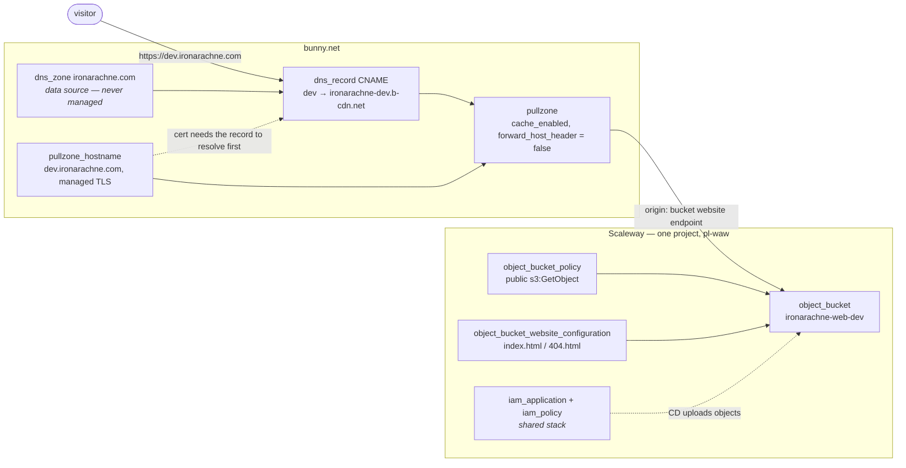

# Infrastructure

This document records how Iron Arachne is hosted and why the pieces are arranged as they are. The
configuration itself lives in `infra/`; `infra/README.md` covers how to run it.

**Status:** implemented and applied. Resolves issue #56. All three environments are live and serving
over HTTPS on their own subdomains. A fourth stack, `environments/landing`, reuses `modules/static_site`
for the one-page site on `www.ironarachne.com` and the apex; it is not an environment of the app and is
documented in `docs/landing-page.md` rather than here.

Per the design process in CLAUDE.md this feature introduces no TypeScript types, so the class
diagram that process asks for does not apply. The equivalent artefact — the resource graph and the
decisions behind it — is below.

## The shape

Three environments, each a public Object Storage bucket serving the prerendered SvelteKit build,
fronted by a Bunny pull zone that terminates TLS for the environment's own subdomain.

| Environment | Hostname                  | Bucket                    | Pull zone             |
| ----------- | ------------------------- | ------------------------- | --------------------- |
| dev         | `dev.ironarachne.com`     | `ironarachne-web-dev`     | `ironarachne-dev`     |
| staging     | `staging.ironarachne.com` | `ironarachne-web-staging` | `ironarachne-staging` |
| prod        | `app.ironarachne.com`     | `ironarachne-web-prod`    | `ironarachne-prod`    |

## Decisions

Each of these was settled on issue #56 before implementation.

### Bunny terminates TLS, not Scaleway Edge Services

A Scaleway bucket serves HTTPS on its own `*.s3-website.<region>.scw.cloud` endpoint, but there is
no documented way to attach a certificate for a domain of ours to it. Scaleway's answer is Edge
Services, which carries a flat monthly subscription fee scoped to a project.

A Bunny pull zone does the same job with free managed certificates and pay-per-GB pricing with no
monthly floor, so that is what we use. The cost is that Bunny now does CDN and TLS rather than only
DNS — a deliberate departure from the original framing of #56.

Two consequences worth keeping in view:

- **No Edge Services plan to arbitrate.** An Edge Services subscription is project-scoped, so three
  environment stacks would have fought over a single shared subscription resource. Nothing in this
  design has that problem.
- **The DNS record targets a name, not an ID.** Every pull zone answers on `<name>.b-cdn.net`, and
  the name is an input, so the CNAME target is known at plan time and the whole graph resolves in
  one apply.

The provider also offers a `PullZone`-type DNS record that links to a pull zone by ID. It requires a
`pullzone_id` and a non-empty `value` whose expected content is undocumented, so a plain CNAME is
used instead. The effect is the same and the behaviour is specified.

### One Scaleway project, three buckets

One credential set and one shared stack, at the cost of prod and dev sharing a blast radius. The
deploy policy is scoped to object-storage actions within this project, which is the boundary that
actually constrains CD.

### Environment directories, not workspaces

Each environment is a root module under `infra/environments/` with its own backend key, over a shared
`modules/static_site`. Explicit state per environment, and the CD step that comes next can target one
directory without a workspace-select dance. `shared` is a fourth stack holding what is genuinely
common.

### Terraform does not mint the CD API key

`shared` creates the IAM application and its scoped policy; the API key is minted out-of-band. A key
created by Terraform has its secret written to state, and state lives in a bucket — a long-lived
deploy credential should not be there. See `infra/README.md` for the command.

## Things that will bite

**The pull zone must not forward the visitor's Host header.** `forward_host_header = false` is
load-bearing: Object Storage routes bucket-website requests by hostname, and it has no bucket called
`dev.ironarachne.com`. The origin has to be addressed by its own name.

**Caching is off by default in the provider.** `cache_enabled` defaults to false, which would make
the CDN a TLS terminator and nothing more. It is set explicitly. Edge lifetime honours the origin's
`Cache-Control`, and Object Storage sends none — so caching only becomes meaningful once the
deployment step sets those headers on upload.

**Enabling a bucket website makes the bucket public.** Scaleway applies a default policy on enable.
The module declares the policy explicitly instead, so the access rule is reviewable in code rather
than an implicit side effect. Index and error documents must both sit at the bucket root.

**The build has to be shaped for bucket hosting.** Routes are emitted as directories with a root
`404.html` for the error document; see `docs/static-hosting.md`. That is what makes `index.html` /
`404.html` the right settings here.

**Certificate issuance races DNS.** Bunny will not issue the managed certificate until the hostname
resolves to the pull zone, so the module orders the record first. On a cold create this is still the
step most likely to need a second apply.

## Verified on the applies

This section listed three runtime behaviours the plan could not confirm. All three are now answered by
the four stacks running in production, and are kept here as answers because each one was a real risk:

1. **A Bunny-managed DV certificate issues for a hostname whose record is a CNAME to `<name>.b-cdn.net`
   in the same account.** Yes, on every hostname, usually within seconds. The ordering the module
   already enforces — record before hostname — is what makes it reliable; see the retry note above.
2. **The `pl-waw` bucket website endpoint behaves as a pull zone origin.** Yes, with the one caveat the
   module encodes: `forward_host_header = false` is mandatory, because Object Storage routes
   bucket-website requests by hostname and no bucket is named after a public hostname.
3. **A path missing its trailing slash gets a redirect to the slashed form** — but it is a **302**, not
   the 301 S3 semantics predicted. It redirects either way, so the client-side recovery in
   `docs/static-hosting.md` is not needed; the difference matters only if something ever caches on the
   assumption that the redirect is permanent.

Issue #148 remains open and is unrelated to any of the above: the bucket-website origin returns
intermittent 500s, roughly 1 request in 5, reproducible with Bunny bypassed. It affects every
environment.

## Out of scope

**Deployments.** Nothing here uploads objects; publishing a build is CD's job. The stacks expose
`bucket_name`, `bucket_website_endpoint` and `pull_zone_id` for it.

**The existing DNS.** `ironarachne.com` carries many records predating this code. The zone is read
through a data source and never managed; only the three new subdomains are declared here.

**The state bucket.** `ironarachne-tfstate-poland` holds the state that would manage it, so it stays
outside this configuration.
