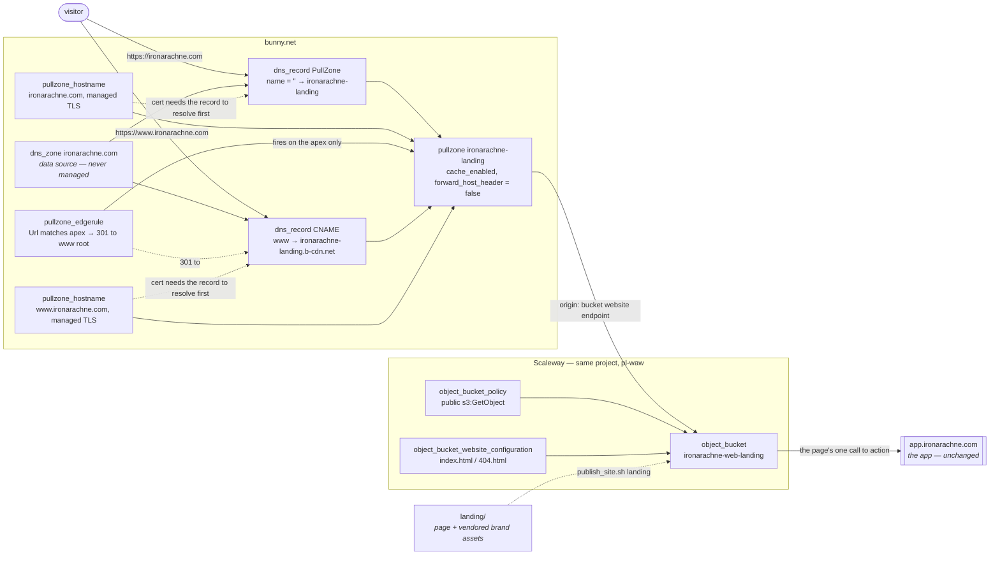

# Landing page

A one-page static site at `ironarachne.com`, separate from the app, linking through to it at
`app.ironarachne.com`. This document records its shape, the decisions behind it, and the DNS cutover
that moves the apex off the old Fly deployment.

**Status:** implemented. Resolves the design of issue #72. The page is built and lives in `landing/`,
the infrastructure it publishes to landed in #157, and the DNS cutover has been performed:
`www.ironarachne.com` serves the page and the apex redirects to it. Fly is still to be decommissioned
per decision 4.

Decision 3 changed at the cutover — the apex is a pull-zone hostname with an edge rule, not the
`Redirect` record originally chosen, because that record redirects to a doubled slash and 404s. The
original reasoning is kept under that decision, since the schema work behind it was correct and only
the runtime behaviour betrayed it.

The seven decisions below were settled on the issue before this document was written; what this adds
is the resource graph, the cutover sequence, and the corrections that came out of checking the plan
against the live zone and the pinned provider. The page design was approved on #72, and its outcome
is recorded in [The page design](#the-page-design).

Per the design process in CLAUDE.md this feature introduces no TypeScript types, so the class diagram
that process asks for does not apply. The equivalent artefact — the resource graph and the decisions
behind it — is below, following the precedent set by `docs/infrastructure.md`.

## The problem

`ironarachne.com` and `www.ironarachne.com` still resolve to `66.241.125.222` — the old Fly
deployment. The current static stack lives only on `dev`, `staging` and `app`. So the domain a visitor
is most likely to type serves the thing we are trying to retire, and the app is reachable only at a
subdomain nobody guesses.

The fix is a second deployable in this repository: a single static page on the apex and `www`, with
the app left where it is.

## The shape

One bucket, one pull zone, two DNS records. `www` is the site; the apex redirects to it. Both names
are hostnames on the same pull zone — see [decision 3](#3-the-apex-is-a-pull-zone-hostname-with-an-edge-rule)
for why the apex is not the simpler `Redirect` record it started as.

| Hostname                 | Serves                  | Mechanism                                            |
| ------------------------ | ----------------------- | ---------------------------------------------------- |
| `www.ironarachne.com`    | the landing page        | CNAME → `ironarachne-landing.b-cdn.net`, managed TLS |
| `ironarachne.com` (apex) | a 301 to `www`          | `PullZone` record + pull-zone hostname + edge rule   |
| `app.ironarachne.com`    | the app — **unchanged** | existing prod stack                                  |

| Resource  | Name                      |
| --------- | ------------------------- |
| Bucket    | `ironarachne-web-landing` |
| Pull zone | `ironarachne-landing`     |
| Source    | `landing/`                |



## Decisions

All seven were settled on issue #72. Recorded here with their reasoning so this document is the one
place to read them.

### 1. Publish straight from `main`, with no release or promotion

Versioning and staged promotion exist to de-risk the app: a tested build is published once and then
moved between three environments without rebuilding. A single page that links to the app does not earn
that ceremony, and coupling it to `package.json`'s version would mean every app release forces a
landing-page deploy.

So: a push-triggered, path-filtered workflow on `landing/`, publishing to one bucket. If it ever needs
a staging environment, add one then.

### 2. It lives in `landing/` at the repository root

Not `src/routes/` — that would make it part of the app build and put it behind `app.ironarachne.com`,
which is the opposite of the point. Not under `src/lib/` — the per-library coverage gate in
`scripts/check_library_coverage.ts` requires 80% line and function coverage of every directory there,
and a static page has nothing to test.

A top-level directory sidesteps both and is still format-gated: `npm run lint` runs `prettier --check .`,
which covers HTML and CSS anywhere in the tree.

### 3. The apex is a pull-zone hostname with an edge rule

**Superseded at the cutover. This decision was originally "the apex is a Bunny `Redirect` record",
and that does not work.** The reasoning that led there is kept below, because it was sound and the
thing that defeated it is invisible from the configuration — the record applies cleanly, resolves,
and serves a valid certificate. What it does not do is build a usable URL.

Bunny composes the redirect target as `value + "/" + requestPath`, and the request path keeps its own
leading slash. Every apex request therefore lands on a doubled slash:

```
https://ironarachne.com/     ->  301  ->  https://www.ironarachne.com//      ->  404
https://ironarachne.com/foo  ->  301  ->  https://www.ironarachne.com//foo   ->  404
```

`//` is not `/` to the bucket website origin, so the apex — the name a visitor is most likely to type,
and the whole reason this work exists — answered 404 while `www` answered 200. Setting `value` to a
trailing-slash form was tried against the live record and doubles it identically; the behaviour is
undocumented, and no field on the record changes it.

So the apex is the fallback this document already named: a second `bunnynet_pullzone_hostname` on the
landing pull zone, with a `bunnynet_pullzone_edgerule` doing the redirect. Three resources rather than
one, and every hop is one we control. The apex record itself is `type = "PullZone"`, which links a
record straight to a pull zone — Bunny is authoritative here, so this needs no hardcoded anycast
addresses. `pullzone_id` is required for that type; `value` holds the pull zone **name**.

**`value` is the one field on that record that cannot be chosen, and getting it wrong fails in the
worst possible place.** The provider requires it to be non-empty, and Bunny then overwrites whatever
is sent with the pull zone's name — so `ironarachne-landing`, never `ironarachne-landing.b-cdn.net`.
Sending the hostname aborts the apply with:

```
Error: Provider produced inconsistent result after apply
.value: was cty.StringVal("ironarachne-landing.b-cdn.net"), but now
cty.StringVal("ironarachne-landing").
This is a bug in the provider, which should be reported in the provider's own issue tracker.
```

It is not a provider bug in any useful sense, and the message sends you to the wrong place. What
makes it expensive is _when_ it happens: the record is created before the error, and the apply then
stops — so the apex points at the pull zone while the pull-zone hostname that carries its certificate
has not been created yet. The apex does not 404 at that point, it fails the TLS handshake outright.
Re-run with the corrected `value` and the apply finishes. The record is left tainted, so `tofu
untaint bunnynet_dns_record.apex` first if you would rather not have it destroyed and recreated for
nothing — recreating it is another short window where the apex does not resolve at all.

`modules/static_site` exports `pull_zone_name` for exactly this, so the name is not restated.

**The edge rule sends everything to the www root and does not preserve the path.** The landing site is
a single page: there is no second path to arrive on and nothing to deep-link to. Preserving the path
would carry the old Fly site's URLs onto a bucket that has never held them, turning every stale link
into a 404 rather than the page we want people on. The rule is triggered on the request URL rather
than left unconditional, because the pull zone now answers for both names and an unconditional rule
would redirect `www` to itself forever.

The lesson worth keeping: **a DNS-level redirect was never testable before the cutover**, because it
only exists once the apex is pointed at it. Verifying the provider schema, as the original reasoning
below did carefully, proves the record can be _created_ — not that it does anything useful.

#### The original reasoning, which was not wrong about the schema

Bunny is authoritative for the zone — `dig NS ironarachne.com` returns `kiki.bunny.net.` and
`coco.bunny.net.` — so the usual "you cannot CNAME an apex" problem does not apply here. Bunny offers a
`Redirect` record type that needs no origin of its own.

**This is now verified against the pinned provider rather than taken from documentation.** Both enum
strings the issue carried forward as unknown are real. `tofu validate` against `bunnyway/bunnynet`
`0.16.0` with a deliberately bogus type prints the whole set:

```
Attribute type value must be one of: ["TXT" "Redirect" "Flatten" "CAA" "TLSA"
"A" "Script" "HTTPS" "MX" "PullZone" "PTR" "CNAME" "SRV" "NS" "SVCB" "AAAA"]
```

The provider's own schema also settles the apex spelling, which was the other open question:

> `name` — The name of the DNS record. Use `name = ""` for apex domain records.

So an apex record is a first-class case in this provider, not a workaround. `value` is required for
every record type, and for a `Redirect` it holds the target URL.

The alternative — adding the apex as a second `bunnynet_pullzone_hostname` and doing the redirect with
an edge rule — is more moving parts for the same visitor-visible behaviour. It stays available as a
fallback if the managed certificate for a `Redirect` record does not materialise; see
[Still unverified](#still-unverified).

**This is the paragraph that saved the cutover, and it was nearly right for the wrong reason.** The
fallback was held in reserve against a certificate that never issued. The certificate issued fine;
what failed was the redirect target. Naming the fallback at all is what made the fix a decision
already taken rather than one to make under pressure with the front door down.

### 4. Cut DNS first, decommission Fly after about a day

DNS moves, Fly keeps running for roughly a day, then the app is deleted and `fly.toml` and `Dockerfile`
are removed from the repository in the same change — so the repo stops describing a deployment that no
longer exists. Confirm nothing else points at that machine before it goes.

### 5. Brand assets are vendored into `landing/`, under the existing pin

#151 has landed, so this no longer needs inventing: `brand-assets.json` records the brand-repo commit
and a list of directory mappings, and `scripts/sync_brand_assets.sh` performs the copy and reports
drift. The landing page's assets become two more entries in `assets`, exactly as `docs/brand-assets.md`
anticipated.

The landing page needs its **own** copy of the fonts. The app's copies live in `src/lib/assets/fonts/`
and are published to the app's bucket; the landing page is a different bucket and cannot reach them. The
same `from` directory appearing twice with two different `to` values is fine — the sync script iterates
the mappings independently.

The same reasoning applies to the palette, which #150 has since vendored to `src/lib/styles/brand` for
the app's benefit. The landing page cannot reach that either, so it takes its own copy.

Proposed additions to `brand-assets.json`:

| `from`           | `to`                   |
| ---------------- | ---------------------- |
| `logo/primary`   | `landing/assets/logo`  |
| `fonts`          | `landing/assets/fonts` |
| `logo/web-icons` | `landing/assets/icons` |
| `tokens`         | `landing/assets/brand` |

### 6. The landing page uses the brand token names directly

The landing page consumes `--ia-charcoal`, `--ia-green` and the rest as the brand repo declares them,
by vendoring `tokens/` as above and linking `colors.css` from the page.

**#150 has landed, so this is now a settled house pattern rather than a divergence.** The app vendors
the same file to `src/lib/styles/brand` and aliases its own vocabulary onto it — `--charcoal` is
`var(--ia-charcoal)` — so no hex value is restated anywhere and the two files cannot drift. That
aliasing layer exists because the app has an established vocabulary in 74 call sites; the landing page
has none, so it skips the layer and uses the brand names as-is.

The consequence worth carrying forward: **the landing page must not restate a hex.** If it needs a
colour the brand repo does not have, the colour goes in the brand repo first.

### 7. Inclusive Sans from the start

Both the app and the landing page use Inclusive Sans for body and Cinzel Decorative for display. #149
has landed, so the app is already converted — the interim serif-to-sans seam the issue accepted as a
risk **no longer exists**. `src/lib/styles/tokens.css` now carries the Inclusive Sans `@font-face`
declarations, and the landing page inherits a consistent product by default rather than by timing.

## What this changes in existing code

Three things, all small. The first is smaller than the issue expected.

### `infra/modules/static_site` — only the `environment` enum needs relaxing

The triage concluded that both validations block reuse:

```hcl
variable "environment" {
  validation {
    condition     = contains(["dev", "staging", "prod"], var.environment)
```

```hcl
variable "subdomain" {
  validation {
    condition     = can(regex("^[a-z0-9]([a-z0-9-]*[a-z0-9])?$", var.subdomain))
```

**The `subdomain` regex does not need to change.** That conclusion assumed the module would have to
express the apex record. Under decision 3 it does not: the apex is a separate `Redirect` record declared
in the landing root module, and the only record the module ever creates for this site is `www` — which
is an ordinary single DNS label and matches the existing regex unchanged.

So the module change is one line: add `"landing"` to the `environment` enum, with a comment saying why a
non-environment value is in there. That variable is really "which deploy target is this", and the
landing site is a fourth one; the string flows into a bucket tag and the DNS record comment, both of
which read correctly as `landing`.

Keeping the regex as it is matters beyond tidiness — it is what stops a typo silently creating a record
at the zone apex.

### `scripts/publish_site.sh` — a fourth `case` arm

The script maps environment to bucket and pull zone in a `case` statement, and `landing` is now a
fourth arm. Its pull zone is `6330365`, which could only be filled in after the first apply — the ID is
assigned by Bunny, so this edit had to follow the infrastructure rather than precede it.

Each arm also names its own default source directory, which is new. The app builds to `build/` and the
landing page is the checked-in `landing/`, so the single shared `build` default would have meant
`publish_site.sh landing` quietly uploading the app to the landing bucket — a foot-gun worth closing
while adding the arm rather than after someone finds it.

**The two-pass upload does not work unmodified, and an earlier draft of this document was wrong to say
it did.** The first pass targets `_app/immutable/**`, which a static page does not have. The claim was
that it would copy nothing and do no harm; in fact `rclone copy` exits **3** on a source directory that
does not exist — `directory not found` — and under `set -euo pipefail` that aborts the publish before
the second pass uploads anything at all. So `publish_site.sh landing` would have failed on its first
run, every time, for a reason that looks nothing like its cause.

The fix is a `[ -d ]` guard around the first pass, which is correct rather than merely tolerable: a
page with no content-hashed assets has nothing to cache for a year. The app's own publishes are
unaffected, since the directory is always there.

The second pass then uploads everything with `public, max-age=0, must-revalidate`, so the fonts and
lockup revalidate on every visit. For a page this size that is a 304 and not worth optimising — but if
it ever matters, the fix is a third pass giving `landing/assets/**` a moderate lifetime, **not** a long
one, because these files are not content-hashed and a year-long header on a logo is unrecallable.

### A publish workflow

`.worktree/workflows/publish-landing.yaml`: push-triggered and path-filtered on `landing/`, modelled on
`promote-prod.yaml` — including its belt-and-braces check that the path actually changed in the push.
Per `docs/deployment.md`, "Actions on this host": no workflow artifacts, no `workflow_dispatch` inputs,
no `timeout-minutes:`, and nothing handed between jobs. Path-filtered `push` triggers do work;
`promote-prod.yaml` relies on one today.

It has no build step and no `npm ci`, because the page is checked in rather than compiled. That is the
whole of the difference from the app's pipeline, and it is why decision 1 holds: there is no artifact to
version and nothing to promote between environments.

**The workflow only fires when `landing/` changes**, so merging it does not itself publish anything. The
bucket was seeded by running `scripts/publish_site.sh landing` by hand, which is also how the whole path
was verified end to end before any of it was trusted.

## The DNS cutover

Three existing records are in the way, not one. All three were confirmed against the live zone:

```
www.ironarachne.com.  IN  CNAME  ironarachne.com.
ironarachne.com.      IN  A      66.241.125.222
ironarachne.com.      IN  AAAA   2a09:8280:1::87:402:0
```

The triage flagged the apex `A`. **`www` is also already present and also unmanaged** — it is a CNAME to
the apex, which is how it currently reaches Fly. `docs/infrastructure.md` is explicit that the zone is
read through a data source and never managed because it carries many records predating that code; these
are among them. So OpenTofu will try to create a `www` record that already exists, and the apply will
fight a record it does not know about, in more than one place.

**The apex `AAAA` is the one this document missed until the cutover was actually attempted**, and it is
the most dangerous of the three because nothing fails when you forget it. Deleting the `A` alone leaves
the apex still resolving over IPv6 to Fly, so the cutover silently half-lands: IPv4 visitors reach the
new page, IPv6 visitors keep reaching the machine we are retiring, and every check that resolves v4
first reports success. It has to go in the same step as the other two.

The general lesson, which is worth more than the specific record: **enumerate the apex by querying the
zone, not by reading this list.** The zone carries 27 records and predates all of this code.

```bash
curl -sS -H "AccessKey: $BUNNYNET_API_KEY" -H "Accept: application/json" \
  https://api.bunny.net/dnszone/491318 \
  | jq '.Records[] | select(.Name=="" or .Name=="www") | {Id, Type, Name, Value}'
```

`Type` is an integer, not a string: `0` = A, `1` = AAAA, `2` = CNAME, `3` = TXT, `4` = MX. Only the A,
AAAA and CNAME above are removed. **The apex `TXT` and `MX` records carry live email** — SPF, the
`forward-email` record, Migadu, and a Google site verification — and deleting one breaks mail delivery
rather than the website. Back the whole zone up before touching it.

Sequence:

1. **Apply the landing stack with no DNS cutover.** Bucket and pull zone only, via `-target`; the exact
   command is in `infra/README.md`. **Not** the `www` hostname — an earlier draft listed it here, but
   Bunny will not issue its certificate while `www` still resolves to Fly, so it belongs to step 4 with
   the records. Verify on the bucket website endpoint and on `ironarachne-landing.b-cdn.net` directly.
   Nothing visitor-facing has moved yet.
2. **Publish the page** to the bucket and confirm it over the `b-cdn.net` hostname.
3. **Resolve the three existing records** — either import them into state or delete them by hand
   immediately before the apply. Deleting is simpler and these records are trivially reconstructible;
   importing is safer if the window matters. Note that importing does not cover the apex `AAAA`: no
   resource in this configuration corresponds to it, so it is deleted either way.
4. **Apply the `www` CNAME and the apex.** Expect the managed certificate to lag: Bunny will not issue
   until the hostname resolves to the pull zone, which is why `static_site` already orders the record
   before the hostname, and why the apex resources here carry the same `depends_on`. On a cold create
   this is the step most likely to need a second apply.
5. **Verify** both hostnames over HTTPS — and **follow the apex redirect to its final status code, not
   just to its `Location` header.** This is the step that caught the doubled slash, and only because
   the redirect was followed; the 301 itself looks entirely healthy. `curl -sSL -o /dev/null -w
'%{url_effective} %{http_code}\n' https://ironarachne.com/` is the whole check, and it must end at
   `https://www.ironarachne.com/` with a `200`. Check the call-to-action reaches the app.
6. **Decommission Fly** after about a day — delete the app, remove `fly.toml` and `Dockerfile`.

What actually happened, for the next person: steps 1 and 2 went exactly as written. Step 3 turned up a
third record (the apex `AAAA`). Step 4 was a single clean apply and the certificate issued without a
retry. Step 5 failed — the apex 404'd — and the fix was the fallback in decision 3, which is now the
design rather than the contingency.

Step 3 is the one that can go wrong quietly. Whether a `Redirect` record can be created at an apex that
still holds an `A` record is the last thing this design could not verify without touching the live zone;
if it cannot, step 3 becomes mandatory rather than merely tidy, and step 4 is two applies.

## The page design

Approved on #72, where the copy was supplied and the remaining choices delegated. The page is built
from it: `landing/index.html`, `landing/404.html` and `landing/styles.css`.

**Decided upstream by the brand repo, and not open here:**

- **The ground is charcoal.** `BRAND.md`: "Charcoal remains the ground everywhere. The setting changes;
  the room doesn't." Combined with the rule that the green is a dark-surface colour, the page sits on
  `--ia-charcoal` `#1b1e24` — never `#000000`.
- **On a dark surface, use the `…-green.svg` lockups.** `GUIDELINES.md` says so directly.
- **The tagline is "Weave Your Universe," and it is the one permitted flourish**, sitting beside the
  mark. Everywhere else — the call to action, any generator descriptions — the plain register holds:
  "Generates a settlement with population, government, and notable buildings," not "Breathe life into
  your world."
- **No motion, no sound, no illustration.** `BRAND.md`'s `## Scope` section puts all three out of scope
  as a stated position, and says requests for one "should be answered with this section." A landing page
  is exactly where all three get proposed, so this is worth quoting rather than paraphrasing.

**Settled by the copy, approved on #72:**

- **Three sections.** A hero that is the lockup alone, an introductory section of four paragraphs, and
  the call to action to `app.ironarachne.com`. No tagline on the page — the hero is the mark and
  nothing else. `BRAND.md` permits the tagline beside the mark; it does not require it, and the copy
  does not use it.
- **The lockup per breakpoint.** Stacked below 480px, horizontal at and above it, both `…-green.svg`.
  Measured in a browser at the widths in `e2e/mobile_viewports.ts` plus desktop: the stacked mark
  renders 230–260px against its 140px floor, and the horizontal 460px against its 200px floor, with no
  horizontal overflow at any width. The stacked mark carries the narrow end deliberately — a 200px
  horizontal lockup at a 320px viewport would sit almost exactly on its own floor.
- **The font budget is one file.** `InclusiveSans-Variable.woff2`, 46KB.

### Why the budget is one file

This follows from the copy rather than from preference, which is why it could not be settled earlier:

| File                                  | Ships | Because                                                                   |
| ------------------------------------- | ----- | ------------------------------------------------------------------------- |
| `InclusiveSans-Variable.woff2`        | Yes   | body copy and the call to action                                          |
| `CinzelDecorative-Regular.woff`       | No    | the page sets no display text; the wordmark is outlined in the lockup SVG |
| `InclusiveSans-Italic-Variable.woff2` | No    | the copy sets no italics                                                  |

46KB rather than the 127KB worst case. Both omissions are conditional on the copy, and
`GUIDELINES.md` forbids synthesising either face — so adding a heading or an italic means shipping
the file, not faking it. Both are already vendored, so doing that is a one-line change to
`landing/styles.css`.

The budget is about what the page **references**, not what the sync copies — see the first item under
"Things that will bite".

## Things that will bite

**A vendored directory arrives whole, and cannot be pruned.** `scripts/sync_brand_assets.sh` maps
directory to directory and copies every file underneath; it hard-errors if `from` is not a directory.
Vendoring `logo/primary` therefore brings all six lockups, not the one or two the page uses, and
vendoring `fonts` brings the italic and both licence texts whether or not the page sets italics.

Do not delete the extras. `--check` compares against the brand repo's file list, so a pruned file is
reported as `missing` on every run from then on — permanently, and for a reason nobody will remember.
The unused files are published to the bucket and never fetched by a visitor, so they cost storage rather
than page weight. If that ever matters, the fix is teaching the sync script a file-level `from`, which
is a change to #151's mechanism and belongs there.

**The SIL OFL requires the licence text to travel with the font.** `fonts/OFL-InclusiveSans.txt` and
`fonts/OFL-CinzelDecorative.txt` come along with the directory mapping, which satisfies clause 2 by
construction — one more reason not to prune.

**Every vendored file Prettier can parse needs a `.prettierignore` entry, and two of these do.**
Artwork and fonts are safe: passing an `.svg` explicitly produces "No parser could be inferred", and
`prettier --check .` only globs extensions it supports, so vendored SVG is invisible to it and fonts are
binary. The risk is the other two mappings.

This is not hypothetical — #150 hit it. Its `.prettierignore` entry records that Prettier "would unpick
the aligned comments in `colors.css` and rewrap `colors.json`", so it ignores `src/lib/styles/brand/`
wholesale. The landing page's copy of `tokens` will hit exactly the same two files, and
`logo/web-icons` carries a `manifest.json` — which is why `static/manifest.json` is already listed.

So `landing/assets/brand/` and `landing/assets/icons/manifest.json` both need entries, added in the
same change that adds the mappings. Miss them and Prettier reformats a vendored file, `--check` then
reports drift in a file nobody knowingly touched, and the format-on-edit hook keeps reintroducing it.

**The pull zone must not forward the visitor's Host header.** Inherited from the module, which sets
`forward_host_header = false` deliberately: Object Storage routes bucket-website requests by hostname and
has no bucket called `www.ironarachne.com`.

**`index.html` and `404.html` must both sit at the bucket root.** The module defaults are right, but a
one-page site has to actually produce a `404.html` rather than assuming the framework made one. It can be
as simple as the same page.

**Issue #148 is still open and visible here.** The Scaleway bucket-website origin returns intermittent
500s — roughly 1 request in 5, reproducible against the origin with Bunny bypassed. It affects every
environment, so it will affect this one. It is not caused by this work and should not block it, but a new
front door is a worse place to meet it than an app subdomain.

## Still unverified

The provider schema and enums are confirmed against the pinned `bunnyway/bunnynet` `0.16.0`, and the
current DNS state is confirmed against the live zone. Neither confirms runtime behaviour.

**The first two items are now answered, and the answers are why decision 3 changed.** They are kept
here rather than deleted, because the shape of the mistake is the useful part: both were framed as
questions about whether the record could be _created_, and both came back yes. Neither asked whether
the thing it created would _work_, which is the question that mattered.

1. ~~**Whether Bunny issues a managed certificate for a `Redirect` record at an apex.**~~ **Answered:
   yes.** The apex served a valid certificate on IPv4 and IPv6 immediately after the cutover. This was
   the risk the fallback was held in reserve against, and it never materialised — the fallback was
   needed for an entirely different reason: the redirect target is built with a doubled slash and
   404s. See decision 3.
2. ~~**Whether a `Redirect` record can be created at an apex that still holds an `A` record.**~~
   **Answered: moot.** The `A` was deleted before the apply, along with an `AAAA` this document did
   not know about and the `www` CNAME, so the question was never put. The cutover was one apply.
3. **The cost of a fourth pull zone.** Bunny is pay-per-GB with no monthly floor per
   `docs/infrastructure.md`, so this is expected to be negligible; not confirmed against the account.
4. **Whether the Fly machine serves anything besides the old site.** Only that it answers on the apex.
   The `@font-face` declaration is no longer on this list. It was checked in Chromium against the built
   page over HTTP: `document.fonts.check('1rem "Inclusive Sans"')` returns true and the rendered text is
   the webfont rather than the fallback, at every width tested. Serving those bytes from a bucket instead
   of a local server is the same HTTP transaction, so what remained of that unknown is the origin's
   `Content-Type`, which `publish_site.sh` does not set and browsers do not require for woff2.

## Out of scope

**The app.** Nothing here changes `app.ironarachne.com`, its build, or its deployment.

**The app's colour tokens.** #150, which has landed — the app now aliases the vendored brand palette
rather than restating it. Nothing is left outstanding there; decision 6 follows the pattern it set.

**The `docs/infrastructure.md` status line.** It still says "Nothing here has been applied yet", which
has been false since all three environments went live. It should be corrected as part of this work's
final step, but it is a documentation fix rather than part of this design.

**A staging environment for the landing page.** Decision 1. Add one if it ever earns it.
