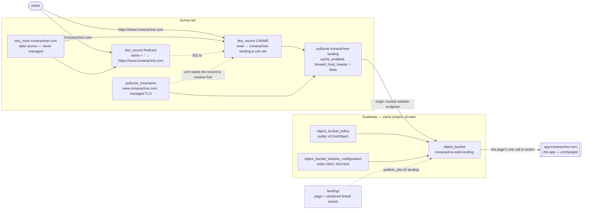

# Landing page

A one-page static site at `ironarachne.com`, separate from the app, linking through to it at
`app.ironarachne.com`. This document records its shape, the decisions behind it, and the DNS cutover
that moves the apex off the old Fly deployment.

**Status:** proposal. Resolves the design step of issue #72. Nothing here has been built. The seven
decisions below were settled on the issue before this document was written; what this adds is the
resource graph, the cutover sequence, and the corrections that came out of checking the plan against
the live zone and the pinned provider.

Per the design process in CLAUDE.md this feature introduces no TypeScript types, so the class diagram
that process asks for does not apply. The equivalent artefact — the resource graph and the decisions
behind it — is below, following the precedent set by `docs/infrastructure.md`.

**This document does not settle the page design.** Copy, sections, and which lockup appears at which
breakpoint are a separate step with its own human-review gate. What is settled here is everything that
step needs as input; see [What the page design must still settle](#what-the-page-design-must-still-settle).

## The problem

`ironarachne.com` and `www.ironarachne.com` still resolve to `66.241.125.222` — the old Fly
deployment. The current static stack lives only on `dev`, `staging` and `app`. So the domain a visitor
is most likely to type serves the thing we are trying to retire, and the app is reachable only at a
subdomain nobody guesses.

The fix is a second deployable in this repository: a single static page on the apex and `www`, with
the app left where it is.

## The shape

One bucket, one pull zone, two DNS records. `www` is the site; the apex redirects to it.

| Hostname                 | Serves                  | Mechanism                                            |
| ------------------------ | ----------------------- | ---------------------------------------------------- |
| `www.ironarachne.com`    | the landing page        | CNAME → `ironarachne-landing.b-cdn.net`, managed TLS |
| `ironarachne.com` (apex) | a redirect to `www`     | Bunny `Redirect` record, `name = ""`                 |
| `app.ironarachne.com`    | the app — **unchanged** | existing prod stack                                  |

| Resource  | Name                      |
| --------- | ------------------------- |
| Bucket    | `ironarachne-web-landing` |
| Pull zone | `ironarachne-landing`     |
| Source    | `landing/`                |



## Decisions

All seven were settled on issue #72. Recorded here with their reasoning so this document is the one
place to read them.

### 1. Publish straight from `main`, with no release or promotion

Versioning and staged promotion exist to de-risk the app: a tested build is published once and then
moved between three environments without rebuilding. A single page that links to the app does not earn
that ceremony, and coupling it to `package.json`'s version would mean every app release forces a
landing-page deploy.

So: a push-triggered, path-filtered workflow on `landing/`, publishing to one bucket. If it ever needs
a staging environment, add one then.

### 2. It lives in `landing/` at the repository root

Not `src/routes/` — that would make it part of the app build and put it behind `app.ironarachne.com`,
which is the opposite of the point. Not under `src/lib/` — the per-library coverage gate in
`scripts/check_library_coverage.ts` requires 80% line and function coverage of every directory there,
and a static page has nothing to test.

A top-level directory sidesteps both and is still format-gated: `npm run lint` runs `prettier --check .`,
which covers HTML and CSS anywhere in the tree.

### 3. The apex is a Bunny `Redirect` record

Bunny is authoritative for the zone — `dig NS ironarachne.com` returns `kiki.bunny.net.` and
`coco.bunny.net.` — so the usual "you cannot CNAME an apex" problem does not apply here. Bunny offers a
`Redirect` record type that needs no origin of its own.

**This is now verified against the pinned provider rather than taken from documentation.** Both enum
strings the issue carried forward as unknown are real. `tofu validate` against `bunnyway/bunnynet`
`0.16.0` with a deliberately bogus type prints the whole set:

```
Attribute type value must be one of: ["TXT" "Redirect" "Flatten" "CAA" "TLSA"
"A" "Script" "HTTPS" "MX" "PullZone" "PTR" "CNAME" "SRV" "NS" "SVCB" "AAAA"]
```

The provider's own schema also settles the apex spelling, which was the other open question:

> `name` — The name of the DNS record. Use `name = ""` for apex domain records.

So an apex record is a first-class case in this provider, not a workaround. `value` is required for
every record type, and for a `Redirect` it holds the target URL.

The alternative — adding the apex as a second `bunnynet_pullzone_hostname` and doing the redirect with
an edge rule — is more moving parts for the same visitor-visible behaviour. It stays available as a
fallback if the managed certificate for a `Redirect` record does not materialise; see
[Still unverified](#still-unverified).

### 4. Cut DNS first, decommission Fly after about a day

DNS moves, Fly keeps running for roughly a day, then the app is deleted and `fly.toml` and `Dockerfile`
are removed from the repository in the same change — so the repo stops describing a deployment that no
longer exists. Confirm nothing else points at that machine before it goes.

### 5. Brand assets are vendored into `landing/`, under the existing pin

#151 has landed, so this no longer needs inventing: `brand-assets.json` records the brand-repo commit
and a list of directory mappings, and `scripts/sync_brand_assets.sh` performs the copy and reports
drift. The landing page's assets become two more entries in `assets`, exactly as `docs/brand-assets.md`
anticipated.

The landing page needs its **own** copy of the fonts. The app's copies live in `src/lib/assets/fonts/`
and are published to the app's bucket; the landing page is a different bucket and cannot reach them. The
same `from` directory appearing twice with two different `to` values is fine — the sync script iterates
the mappings independently.

The same reasoning applies to the palette, which #150 has since vendored to `src/lib/styles/brand` for
the app's benefit. The landing page cannot reach that either, so it takes its own copy.

Proposed additions to `brand-assets.json`:

| `from`           | `to`                   |
| ---------------- | ---------------------- |
| `logo/primary`   | `landing/assets/logo`  |
| `fonts`          | `landing/assets/fonts` |
| `logo/web-icons` | `landing/assets/icons` |
| `tokens`         | `landing/assets/brand` |

### 6. The landing page uses the brand token names directly

The landing page consumes `--ia-charcoal`, `--ia-green` and the rest as the brand repo declares them,
by vendoring `tokens/` as above and linking `colors.css` from the page.

**#150 has landed, so this is now a settled house pattern rather than a divergence.** The app vendors
the same file to `src/lib/styles/brand` and aliases its own vocabulary onto it — `--charcoal` is
`var(--ia-charcoal)` — so no hex value is restated anywhere and the two files cannot drift. That
aliasing layer exists because the app has an established vocabulary in 74 call sites; the landing page
has none, so it skips the layer and uses the brand names as-is.

The consequence worth carrying forward: **the landing page must not restate a hex.** If it needs a
colour the brand repo does not have, the colour goes in the brand repo first.

### 7. Inclusive Sans from the start

Both the app and the landing page use Inclusive Sans for body and Cinzel Decorative for display. #149
has landed, so the app is already converted — the interim serif-to-sans seam the issue accepted as a
risk **no longer exists**. `src/lib/styles/tokens.css` now carries the Inclusive Sans `@font-face`
declarations, and the landing page inherits a consistent product by default rather than by timing.

## What this changes in existing code

Three things, all small. The first is smaller than the issue expected.

### `infra/modules/static_site` — only the `environment` enum needs relaxing

The triage concluded that both validations block reuse:

```hcl
variable "environment" {
  validation {
    condition     = contains(["dev", "staging", "prod"], var.environment)
```

```hcl
variable "subdomain" {
  validation {
    condition     = can(regex("^[a-z0-9]([a-z0-9-]*[a-z0-9])?$", var.subdomain))
```

**The `subdomain` regex does not need to change.** That conclusion assumed the module would have to
express the apex record. Under decision 3 it does not: the apex is a separate `Redirect` record declared
in the landing root module, and the only record the module ever creates for this site is `www` — which
is an ordinary single DNS label and matches the existing regex unchanged.

So the module change is one line: add `"landing"` to the `environment` enum, with a comment saying why a
non-environment value is in there. That variable is really "which deploy target is this", and the
landing site is a fourth one; the string flows into a bucket tag and the DNS record comment, both of
which read correctly as `landing`.

Keeping the regex as it is matters beyond tidiness — it is what stops a typo silently creating a record
at the zone apex.

### `scripts/publish_site.sh` — a fourth `case` arm

The script maps environment to bucket and pull zone in a `case` statement. Add:

```sh
landing)
  bucket="ironarachne-web-landing"
  pull_zone="<id from the apply>"
  ;;
```

The pull zone ID is not known until the infrastructure is applied, so this edit follows the apply rather
than preceding it.

Its two-pass upload works unmodified. The first pass targets `_app/immutable/**`, which a static page
does not have, so it copies nothing and does no harm; the second pass uploads everything with
`public, max-age=0, must-revalidate`. That means the fonts and lockup revalidate on every visit. For a
page this size that is a 304 and not worth optimising before the page exists — but if it ever matters,
the fix is a third pass giving `landing/assets/**` a moderate lifetime, **not** a long one, because
these files are not content-hashed and a year-long header on a logo is unrecallable.

### A publish workflow

Push-triggered and path-filtered on `landing/`, modelled on `promote-prod.yaml` — including its
belt-and-braces check that the path actually changed in the push. Per `docs/deployment.md`, "Actions on
this host": no workflow artifacts, no `workflow_dispatch` inputs, no `timeout-minutes:`, and nothing
handed between jobs. Path-filtered `push` triggers do work; `promote-prod.yaml` relies on one today.

## The DNS cutover

Two existing records are in the way, not one. Both were confirmed against the live zone:

```
www.ironarachne.com.  IN  CNAME  ironarachne.com.
ironarachne.com.      IN  A      66.241.125.222
```

The triage flagged the apex `A`. **`www` is also already present and also unmanaged** — it is a CNAME to
the apex, which is how it currently reaches Fly. `docs/infrastructure.md` is explicit that the zone is
read through a data source and never managed because it carries many records predating that code; these
two are among them. So OpenTofu will try to create a `www` record that already exists, and the apply will
fight a record it does not know about, in both places rather than one.

Sequence:

1. **Apply the landing stack with no DNS cutover.** Bucket, pull zone, and the `www` hostname. Verify on
   the bucket website endpoint and on `ironarachne-landing.b-cdn.net` directly. Nothing visitor-facing
   has moved yet.
2. **Publish the page** to the bucket and confirm it over the `b-cdn.net` hostname.
3. **Resolve the two existing records** — either import them into state or delete them by hand
   immediately before the apply. Deleting is simpler and these records are trivially reconstructible;
   importing is safer if the window matters.
4. **Apply the `www` CNAME and the apex `Redirect`.** Expect the managed certificate to lag: Bunny will
   not issue until the hostname resolves to the pull zone, which is why `static_site` already orders the
   record before the hostname. On a cold create this is the step most likely to need a second apply.
5. **Verify** both hostnames over HTTPS, including that the apex redirect lands on `www` with a valid
   certificate and that the call-to-action reaches the app.
6. **Decommission Fly** after about a day — delete the app, remove `fly.toml` and `Dockerfile`.

Step 3 is the one that can go wrong quietly. Whether a `Redirect` record can be created at an apex that
still holds an `A` record is the last thing this design could not verify without touching the live zone;
if it cannot, step 3 becomes mandatory rather than merely tidy, and step 4 is two applies.

## What the page design must still settle

This is the next gate, and CLAUDE.md is explicit that implementation does not start before a human
approves it. The brand repo has retired most of the risk — what remains is genuinely about this page.

**Already decided upstream, not open for the review:**

- **The ground is charcoal.** `BRAND.md`: "Charcoal remains the ground everywhere. The setting changes;
  the room doesn't." Combined with the rule that the green is a dark-surface colour, the page sits on
  `--ia-charcoal` `#1b1e24` — never `#000000`.
- **On a dark surface, use the `…-green.svg` lockups.** `GUIDELINES.md` says so directly.
- **The tagline is "Weave Your Universe," and it is the one permitted flourish**, sitting beside the
  mark. Everywhere else — the call to action, any generator descriptions — the plain register holds:
  "Generates a settlement with population, government, and notable buildings," not "Breathe life into
  your world."
- **No motion, no sound, no illustration.** `BRAND.md`'s `## Scope` section puts all three out of scope
  as a stated position, and says requests for one "should be answered with this section." A landing page
  is exactly where all three get proposed, so this is worth quoting rather than paraphrasing.

**Open, and for the review to settle:**

- **The copy and sections.** One screen, one call to action to `app.ironarachne.com`.
- **Which lockup at which breakpoint.** The floors are 200px wide for the horizontal lockup and 140px
  for the stacked, with clear space of half the glyph height on all four sides. At the narrowest
  viewport the app pins, 320px, a 200px horizontal lockup leaves 60px a side — workable, but it is a
  deliberate choice rather than a comfortable one. The stacked lockup is the safer call at phone widths.
  Review at the widths in `e2e/mobile_viewports.ts`: 320/360/375/390/430px.
- **The font budget.** Inclusive Sans roman (46KB) is a given. Cinzel Decorative (33KB) ships only if
  the page sets a display heading — the wordmark itself is outlined in the lockup SVG and does not need
  the font. The italic (48KB) ships only if the copy sets italics; `GUIDELINES.md` forbids synthesising
  it, so this is a copy decision, made here rather than discovered later.

Note that the font budget is about what the page **references**, not what the sync copies — see the
first item under "Things that will bite".

## Things that will bite

**A vendored directory arrives whole, and cannot be pruned.** `scripts/sync_brand_assets.sh` maps
directory to directory and copies every file underneath; it hard-errors if `from` is not a directory.
Vendoring `logo/primary` therefore brings all six lockups, not the one or two the page uses, and
vendoring `fonts` brings the italic and both licence texts whether or not the page sets italics.

Do not delete the extras. `--check` compares against the brand repo's file list, so a pruned file is
reported as `missing` on every run from then on — permanently, and for a reason nobody will remember.
The unused files are published to the bucket and never fetched by a visitor, so they cost storage rather
than page weight. If that ever matters, the fix is teaching the sync script a file-level `from`, which
is a change to #151's mechanism and belongs there.

**The SIL OFL requires the licence text to travel with the font.** `fonts/OFL-InclusiveSans.txt` and
`fonts/OFL-CinzelDecorative.txt` come along with the directory mapping, which satisfies clause 2 by
construction — one more reason not to prune.

**Every vendored file Prettier can parse needs a `.prettierignore` entry, and two of these do.**
Artwork and fonts are safe: passing an `.svg` explicitly produces "No parser could be inferred", and
`prettier --check .` only globs extensions it supports, so vendored SVG is invisible to it and fonts are
binary. The risk is the other two mappings.

This is not hypothetical — #150 hit it. Its `.prettierignore` entry records that Prettier "would unpick
the aligned comments in `colors.css` and rewrap `colors.json`", so it ignores `src/lib/styles/brand/`
wholesale. The landing page's copy of `tokens` will hit exactly the same two files, and
`logo/web-icons` carries a `manifest.json` — which is why `static/manifest.json` is already listed.

So `landing/assets/brand/` and `landing/assets/icons/manifest.json` both need entries, added in the
same change that adds the mappings. Miss them and Prettier reformats a vendored file, `--check` then
reports drift in a file nobody knowingly touched, and the format-on-edit hook keeps reintroducing it.

**The pull zone must not forward the visitor's Host header.** Inherited from the module, which sets
`forward_host_header = false` deliberately: Object Storage routes bucket-website requests by hostname and
has no bucket called `www.ironarachne.com`.

**`index.html` and `404.html` must both sit at the bucket root.** The module defaults are right, but a
one-page site has to actually produce a `404.html` rather than assuming the framework made one. It can be
as simple as the same page.

**Issue #148 is still open and visible here.** The Scaleway bucket-website origin returns intermittent
500s — roughly 1 request in 5, reproducible against the origin with Bunny bypassed. It affects every
environment, so it will affect this one. It is not caused by this work and should not block it, but a new
front door is a worse place to meet it than an app subdomain.

## Still unverified

The provider schema and enums are confirmed against the pinned `bunnyway/bunnynet` `0.16.0`, and the
current DNS state is confirmed against the live zone. Neither confirms runtime behaviour.

1. **Whether Bunny issues a managed certificate for a `Redirect` record at an apex.** The whole appeal of
   decision 3 is that `https://ironarachne.com` works with valid TLS and no bucket behind it. If it does
   not, the fallback is the apex as a second pull-zone hostname with an edge rule.
2. **Whether a `Redirect` record can be created at an apex that still holds an `A` record.** This decides
   whether the cutover is one apply or two.
3. **The cost of a fourth pull zone.** Bunny is pay-per-GB with no monthly floor per
   `docs/infrastructure.md`, so this is expected to be negligible; not confirmed against the account.
4. **Whether the Fly machine serves anything besides the old site.** Only that it answers on the apex.
5. **Whether `format("woff2-variations")` behaves as prescribed when served from a bucket.** The
   `@font-face` block is specified by `GUIDELINES.md` and now also ships in the app, so this is far less
   of an unknown than when the issue raised it — but the app serves it from a different bucket and the
   declaration has not been checked on this one.

## Out of scope

**The app.** Nothing here changes `app.ironarachne.com`, its build, or its deployment.

**The app's colour tokens.** #150, which has landed — the app now aliases the vendored brand palette
rather than restating it. Nothing is left outstanding there; decision 6 follows the pattern it set.

**The `docs/infrastructure.md` status line.** It still says "Nothing here has been applied yet", which
has been false since all three environments went live. It should be corrected as part of this work's
final step, but it is a documentation fix rather than part of this design.

**A staging environment for the landing page.** Decision 1. Add one if it ever earns it.
