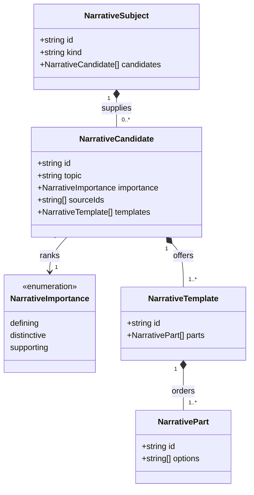
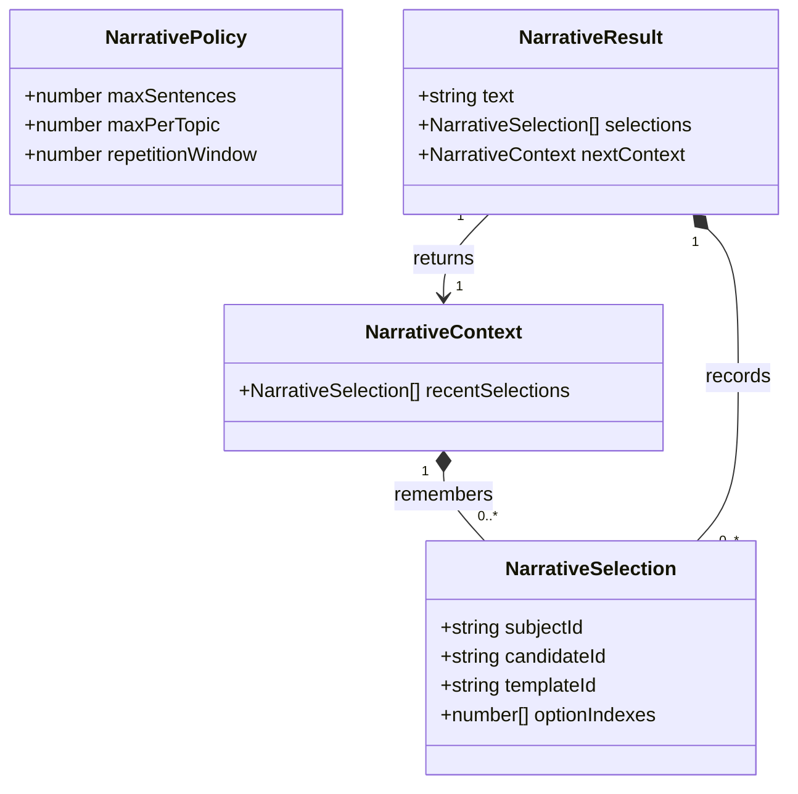

# Focused, varied generated prose

**Status:** accepted — domain model approved by Ben on 2026-10-03; implementation and adoption in progress.

## Problem

Generated descriptions should tell readers what a thing is like and what makes it worth noticing.
Changing a few words while reporting the same complete checklist of properties does not achieve
that. Raw map statistics, generation diagnostics and statements about missing simulation detail
are not narrative content.

Current implementations offer useful pieces of this approach:

- Settlement categories provide `possibleDescriptions`; settlement narrative filters some wording
  against law-and-order facets.
- Merchants supply pools for venues, shop interiors and behavioral traits.
- Religion composes domain-specific narrative; architecture assembles descriptive fragments.
- Region overviews select examples, while settlement roles now offer seeded sentence variants.

These are representative examples, not an exhaustive inventory. There is no shared contract that
makes narrative focus, compatibility and omission consistent across generators.

## Decisions

1. **Choose what matters before choosing how to say it.** Domain adapters derive eligible candidates
   from the object and its current evidence. A candidate expresses one coherent meaning, not a raw
   statistic. Wording options must express that same meaning.
2. **The described subject supplies its options.** Its domain library builds a transient
   `NarrativeSubject` containing candidates and compatible sentence templates. The shared composer
   knows nothing about bog moisture thresholds, settlement placement or merchant honesty. Domain
   adapters remain functions over existing data; persisted objects need no methods or closures.
3. **Judge difference relative to things of the same kind.** Adapters use a documented type-specific
   reference profile or comparable peers. A humid bog is not remarkable merely because it is wetter
   than a desert. Domains define meaningful contrast thresholds and minimum comparison evidence.
   Without reliable comparison, they omit relative claims rather than inventing them.
4. **Keep three levels of importance.** Defining candidates establish identity or a central role;
   distinctive candidates describe significant departures or relationships; supporting candidates
   provide optional texture. No candidate is compulsory merely because its statistic exists.
   Ordinary climate details are normally absent, and a numeric extreme is not automatically
   narratively important.
5. **Use a short content budget.** The caller supplies a sentence limit and a limit per topic.
   Prefer a defining fact and distinctive details; supporting texture only fills a justified role.
   Do not pad the result when fewer useful candidates exist. Topic limits prevent several different
   candidates from restating the same climate or political point.
6. **Vary focus as well as wording.** Rank by importance, then select among equally useful candidates
   with the supplied RNG. Randomness must not let routine details crowd out distinctive ones.
   Use compatible template choices and fragment pools only after selecting the meanings.
7. **Preserve grammar and truth across every combination.** A template is an ordered sequence of
   fragment pools authored to agree in subject, tense, articles and punctuation. Incompatible
   constructions belong in separate templates. Whole-sentence variants are a valid one-part
   template. Extra sensory details, institutions, history or relationships require established
   domain facts; wording draws do not invent those facts.
8. **Keep generated prose reproducible and stable.** Use the caller-owned `RNG`, stable candidate
   and template IDs, deterministic ordering and explicit batch context. Do not seed another stream
   from the clock or choose prose during rendering, reopening or export. Every eligible meaning
   should offer multiple valid expressions; absent safe alternatives, keep accurate wording rather
   than fabricate a synonym that changes its meaning.
9. **Avoid repeated descriptions across a batch.** Pass recent candidate/template selections in
   explicit context. Prefer unused alternatives of equal importance within the configured window;
   when valid alternatives are exhausted, allow repetition instead of weakening truth or focus.
   Shared topic names do not forbid describing the same important property in different objects.
10. **Preserve stored and authored text.** Persist the final generated prose using each domain's
    existing fields. The page, standalone exports and project publication reuse those words. The
    composer does not migrate or rewrite old descriptions. Authored text bypasses composition.

## Domain model

The proposed `narrative` library owns these transient types in `narrative_types.ts`. Existing
subject types, facts, snapshots and payload versions stay unchanged. Domain libraries adapt their
objects into the model through their own public APIs.

Candidate and template IDs are namespaced by subject kind and semantic meaning. Source IDs are
opaque references supplied by the domain, not displayed text. A part must have at least one
option; a candidate without templates or a template without parts is invalid. Templates produce one complete sentence.
Domain adapters filter unsupported or stale meanings before supplying candidates.

The proposed composer accepts a subject, policy, context and caller-owned RNG, and returns a
result. Selection records identify the chosen fragment combination for repetition control and
verification. They are runtime data; existing snapshots persist the text and their existing
provenance only. No global repetition history or hidden mutable state is introduced.

## Example: a bog

A bog's adapter might supply a defining landscape candidate, a distinctive dangerous-ground
candidate and a distinctive isolation candidate. If its humidity is ordinary for bogs, it supplies
no humidity candidate. If reliable comparison shows exceptional humidity, that candidate could
provide a one-part template with these options:

- “This bog is oppressively humid.”
- “The humidity here is unusually intense.”
- “Even among bogs, this place stands out for its heavy, damp air.”

The selected sentence must be justified by the same underlying finding. A short description might
choose dangerous footing and isolation and omit humidity altogether. Another bog might emphasize
its unusual access or inhabitants. Selection changes the narrative focus without changing facts.

## Verification contract

- Same seed, subject, policy and context produce identical text and selection records.
- Multiple seeds vary wording and eligible focus without altering the underlying object or evidence.
- Ordinary same-type features and weak comparisons are omitted; meaningful contrasts can be selected.
- Sentence/topic budgets and importance ordering prevent checklist descriptions and redundant claims.
- Compatible fragment combinations have coherent grammar, references and punctuation. Small pools
  can be checked exhaustively; larger pools need deterministic representative coverage.
- Batch repetition control prefers alternative expressions but handles exhausted pools truthfully.
- Invalid empty pools are rejected; a subject with no eligible candidates yields empty prose.
- New domain adapters test both positive eligibility and omission/contradiction cases.
- Saved and authored descriptions survive reopening and every export without composition reruns.
- Existing per-library coverage requirements apply. UI consumers receive browser verification.

## Adoption boundary

This contract applies to generated narrative descriptions throughout Iron Arachne. It does not
randomize rules text, reference material, structured statistics, labels, author-supplied prose or
editorial documentation. Existing successful domain pools can be adapted rather than replaced.

After the model is approved, inventory every generated-prose entry point and plan adoption by
library. Regions provide an initial proving ground because both focus and diagnostics have just
been examined. Do not treat three sentence variants per settlement role as completion of the
cross-system goal. No implementation tasks or shared-library changes begin before model approval.
