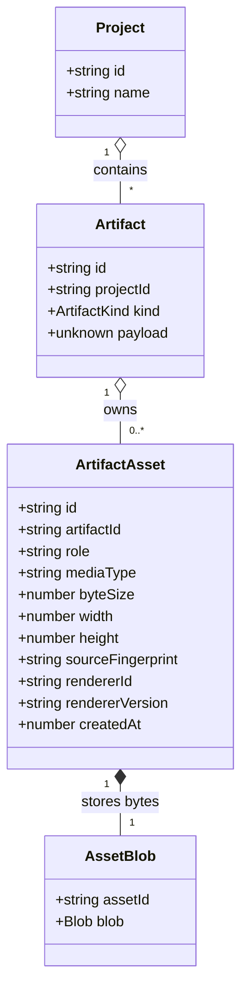

# Persisted artifact assets

**Status:** implemented; astronomical and current map/emblem/mark providers complete, follow-up visual outputs remain

Closes the design work for #287. The feature persists expensive visual output alongside saved
Workshop artifacts so opening an artifact does not have to regenerate a preview that was already
produced. It remains local-first: assets live in IndexedDB and travel in the existing project,
artifact, and vault export scopes. No server storage is introduced.

## Problem

Artifact payloads are saved, but generated visual output is not. A generator may spend substantial
time producing a star-system preview, map, emblem, or diagram and then keep the result only in
component state. When the generator panel closes, the visual is gone.

The payload remains the source of truth. A visual is a saved representation of that payload, not a
replacement for it and not a new payload version. The visual must nevertheless be persisted because
it is part of what the user saw and chose to keep, and because a later renderer version must not
silently change the appearance of an existing result.

The first implementation targeted the astronomical composite previews used by Star Nation and Star
System. The same generic contract now also persists the current Planet PNG, Region map SVG, Dungeon
map PNG, Heraldry SVG, organization-owned emblem SVG, and Merchant mark SVG.

## Goals

- Save generated visual assets with the artifact that produced them.
- Display a saved asset immediately when an artifact is opened.
- Keep the payload and asset writes safe under IndexedDB transaction rules.
- Preserve old artifacts that have no asset and provide an explicit fallback path.
- Clean assets up with their owning artifact or project.
- Include assets in artifact, project, and vault export/import.
- Detect an asset whose source payload no longer matches it.
- Keep visual assets out of `ArtifactSummary` and payload schemas so existing artifact kinds remain
  responsible for their content.

## Non-goals

- Server-side storage, synchronization, or collaboration.
- Deduplicating identical bytes across artifacts in the first version. Reference counting and merge
  rules add complexity without being needed to prove the contract.
- Making every visual generator support persistence in the first implementation slice.
- Replacing specialized PDF, SVG, or map exports. Those are user-requested downloads; persisted
  assets are the saved result's visual representation.
- Treating an asset as authoritative when its source payload has changed.

## Domain model

The asset metadata and bytes are separate records. The metadata is queried by artifact; the bytes
are loaded only when a view needs them. One artifact may have several named visual roles, but one
asset occupies a given `(artifactId, role)` slot at a time.



### Type shape

The implementation types should follow this model:

```typescript
type ArtifactAssetRole = string;

type ArtifactAsset = {
  id: string;
  artifactId: string;
  role: ArtifactAssetRole;
  mediaType: string;
  byteSize: number;
  width?: number;
  height?: number;
  sourceFingerprint: string;
  rendererId: string;
  rendererVersion: string;
  createdAt: number;
};

type ArtifactAssetBlob = {
  assetId: string;
  blob: Blob;
};

type ArtifactAssetDraft = {
  role: ArtifactAssetRole;
  mediaType: string;
  blob: Blob;
  width?: number;
  height?: number;
  sourceFingerprint: string;
  rendererId: string;
  rendererVersion: string;
};
```

`ArtifactAsset` is metadata, not an `ArtifactSummary` field. A project listing must not load image
bytes merely to list artifacts. `ArtifactAssetBlob` is not exported as a public domain object; the
asset store owns it and returns a `Blob` through an asset read result.

## Decisions

### 1. Assets live in two IndexedDB stores

Add these stores at vault schema version 3:

| Store                  | Key       | Holds                                                                           |
| ---------------------- | --------- | ------------------------------------------------------------------------------- |
| `artifact_assets`      | `id`      | Asset metadata, indexed by `artifactId` and by `(artifactId, role)` lookup data |
| `artifact_asset_blobs` | `assetId` | `{ assetId, blob }`                                                             |

The metadata and blob are written and deleted in the same transaction. The artifact store does not
know the asset shape; `$lib/artifacts` owns asset operations and `$lib/vault_db` only knows keys,
stores, and transactions.

There is no deduplication in v1. Each artifact-role slot owns one asset. Replacing it deletes the
old metadata and blob in the same transaction after the new blob has been staged. This avoids an
orphan/refcount problem while preserving a straightforward deletion invariant.

### 2. Assets are derivatives of the complete stored payload

The source fingerprint is a SHA-256 digest of the canonical stored snapshot plus the renderer id
and renderer version. The complete snapshot is used in v1 rather than asking every kind to define a
visual-source projection. That is conservative: editing a description that does not affect an image
may invalidate more often than necessary, but it can never display an image for a different payload.

The fingerprint is checked when an asset is loaded. A missing, malformed, or mismatched asset is
treated as absent. The payload remains readable.

`rendererId` identifies the visual role and implementation, for example
`astronomical-system-composite`. `rendererVersion` changes when the renderer's output contract
changes. A renderer version change does not silently overwrite the saved appearance; it makes the
asset stale and leaves regeneration to the explicit fallback path.

### 3. Saving is atomic when an asset is available

`saveToolArtifact` gains optional asset drafts. The create transaction writes:

1. artifact summary;
2. artifact payload;
3. asset metadata and blobs.

If the transaction fails, none of those records are committed and the generated payload remains on
screen for the user to retry or download. A tool may save valid content without an asset when its
renderer failed; the result must report that the visual was not saved rather than claiming a complete
save.

Artifact metadata-only changes preserve existing assets. A payload change removes the asset slots in
the same transaction, because the old asset no longer describes the new payload. The framework may
then ask the registered visual provider to render a replacement after the payload save succeeds.

Rerolling is a payload replacement, so it also clears old assets. A renderer-aware roller may return
new asset drafts in a later implementation, but the first slice does not make the generic roller
depend on the DOM or on a rendering context.

### 4. Visual providers are separate from artifact codecs

The artifact kind codec remains responsible for snapshot validation and live-value rehydration. A
visual provider is an optional Workshop registration keyed by artifact kind and role. It is loaded
only when a visual is needed and has this conceptual contract:

```typescript
type ArtifactVisualProvider = {
  role: ArtifactAssetRole;
  rendererId: string;
  rendererVersion: string;
  render: (snapshot: unknown, context: ArtifactVisualContext) => Promise<ArtifactAssetDraft>;
};
```

The context supplies the browser rendering context and the artifact seed where the renderer needs
one. The provider must derive output from the snapshot, not reroll content. It may reuse an image
already held by a generator component rather than render a second time.

The provider registry is separate from `ArtifactKindEntry`: not every kind has a visual, and a kind's
payload contract should not be forced to load graphics code merely because its artifact is listed.

### 5. Opening uses the saved asset first

The artifact panel loads asset metadata with the artifact and loads the blob only for the visible
artifact. A valid `primary-preview` is shown immediately above the editor or viewer. Kind-specific
roles are handed to a future kind-specific viewer; the first slice needs only the generic composite
preview surface.

If no valid asset exists and a provider is registered, the panel may render a transient fallback from
the snapshot. The fallback is visibly marked as being regenerated. A successful fallback may repair
the missing asset through an asset-only transaction, provided the artifact has not changed since the
render began. A failure leaves the payload open and reports that the preview is unavailable.

This makes old artifacts compatible without pretending their missing assets were saved. It also
avoids using provenance to recreate user-edited content: providers receive the stored snapshot.

### 6. Editing invalidates visuals, not payloads

The artifact panel owns the asset lifecycle around an editor:

- Loading an artifact reads its valid assets.
- Changing the draft marks the displayed asset stale without writing on every keystroke.
- Saving a changed payload commits the payload and removes stale assets atomically.
- After save, the provider may render a replacement and write it in an asset-only transaction.
- Discarding changes reloads the stored payload and its stored asset.

The user never sees an old image presented as if it described newly edited data.

### 7. Export remains one logical format, with a ZIP container

The current JSON export envelope remains the logical manifest, but binary assets require a container.
The next export format version uses a ZIP file containing:

```text
manifest.json
assets/<asset-id>
assets/<asset-id>
```

`manifest.json` carries the existing envelope, plus asset metadata and references for the selected
scope. Asset bytes are not base64-encoded into JSON. Asset entries are ordered by asset id, and the
manifest records each asset's byte digest so truncation or replacement is reported.

The three existing scopes retain their meaning:

- artifact export includes that artifact's assets;
- project export includes assets for artifacts in that project;
- vault export includes every asset.

Restore preserves artifact and asset ids. Merge remints both and rewrites each asset's `artifactId`
through the same old-to-new artifact map. An asset whose bytes are missing or whose digest fails is
reported and omitted; its artifact still imports because the payload is the canonical work.

Existing JSON exports remain readable. JSON exports made by a build before asset support contain no
assets and continue through the legacy fallback path.

### 8. Deletion and quota behavior are explicit

Deleting an artifact deletes all its asset metadata and blobs in the same transaction. Deleting a
project includes those stores in the existing cascade. Clearing or restoring the vault clears and
rewrites the asset stores with the other stores.

Asset writes use the same `VaultResult` failure vocabulary as payload writes. A quota failure does
not remove an existing asset or payload. The UI says the artifact was saved without its preview only
when the payload transaction committed and the follow-up asset write failed; it never says the full
visual result was saved in that case.

## First implementation slice

The first implementation should support one role for two kinds:

- `star-nation`: the existing home-system composite preview;
- `star-system`: the existing system composite preview.

Both use `renderStarSystemPreviewImage`, so this slice proves:

- converting a data URL to a `Blob` without changing the renderer's output;
- passing a generated asset through `SaveArtifactButton` and `saveToolArtifact`;
- loading and displaying a stored asset in `ArtifactPanel`;
- clearing it when the snapshot changes;
- repairing old artifacts through the same provider contract;
- exporting and restoring one binary asset.

Star System's individual star/planet previews and other visual outputs that are not owned by the
saved artifact payload remain follow-up provider registrations. They do not get special storage
paths.

## Implementation plan

1. **Storage types and schema**
   - Add asset metadata/blob records, schema version 3, indexes, transaction helpers, and size accounting.
   - Extend artifact and project deletion, clear, and vault-write paths.
2. **Asset domain API**
   - Add create/read/list/replace/delete operations by artifact and role.
   - Add source fingerprinting and asset validation.
3. **Save and panel contracts**
   - Extend `ToolArtifactDraft` and `saveToolArtifact` with optional assets.
   - Load asset metadata in `ArtifactEditingTarget` and pass valid assets to the panel surface.
   - Invalidate on payload edits and support asset-only repair writes.
4. **Visual provider registry**
   - Register astronomical composite providers with explicit renderer ids and versions.
   - Reuse the generator's already-rendered data URL when saving instead of rendering again.
5. **Export/import**
   - Add the ZIP container and manifest asset entries.
   - Preserve JSON import compatibility and report missing/corrupt assets without dropping payloads.
6. **First-slice UI**
   - Show the stored composite above Star Nation and Star System artifact editors.
   - Show a clear regenerated/unavailable status for legacy or failed assets.
7. **Follow-up audit**
   - Register the remaining visual generators one at a time after measuring their output type, size,
     renderer inputs, and editor behavior.

## Tests

### Unit tests

- Store and retrieve a Blob and its metadata in one transaction.
- Replace one artifact-role asset without leaving the old blob.
- Delete an artifact and project without orphaned asset metadata or blobs.
- Preserve assets on metadata-only artifact edits.
- Remove assets when the payload changes or an artifact is rerolled.
- Reject mismatched fingerprints and renderer versions as stale.
- Keep quota and unavailable-storage failures in `VaultResult`.
- Round-trip export manifest metadata and asset digests.
- Remint asset ids during merge and preserve them during restore.
- Import old JSON exports with no assets.
- Report missing/corrupt asset entries without dropping the artifact payload.

### Browser tests

- Generate, save, close, and reopen a Star Nation without invoking its visual provider on the reopen
  path when the asset exists.
- Do the same for Star System.
- Edit a visual source field, save, and verify the old image is not shown as current.
- Open a legacy artifact without an asset, see the regeneration status, and verify the fallback image
  appears or the unavailable message is shown.
- Export and restore a project containing an asset, then reopen it without regeneration.
- Delete an artifact and verify its asset no longer exists after reload.
- Exercise quota/error reporting without losing the payload.

Run `npm run verify:all`; this changes persistence, export/import, artifact panels, and rendered
output.

## Acceptance criteria

- [ ] The asset model and storage transactions are implemented as specified.
- [ ] Star Nation and Star System composite previews survive save, close, reload, and reopen.
- [ ] Existing artifacts without assets remain readable and have an explicit fallback.
- [ ] Payload edits cannot display a stale visual as current.
- [ ] Artifact and project deletion remove owned assets.
- [ ] Artifact, project, and vault exports preserve assets without base64 JSON payloads.
- [ ] Old JSON exports remain importable.
- [ ] Asset failures never silently remove or invalidate the canonical payload.
- [ ] The remaining visual generators have an audit result and follow-up issues or registrations.
- [ ] `npm run verify:all` passes.

## Approved decisions

The maintainer approved the recommendations for all three design questions:

1. **ZIP is the binary export container.** It carries `manifest.json` and asset files without
   base64-encoding binary data into JSON.
2. **The first slice uses a generic preview in `ArtifactPanel`.** Assets with the
   `primary-preview` role appear above the editor. Kind-specific presentation sections remain a
   follow-up for maps, heraldry, and diagrams.
3. **Legacy assets repair automatically after fallback rendering.** The repair is guarded by the
   artifact id and source fingerprint, and a failed repair does not affect the canonical payload.
