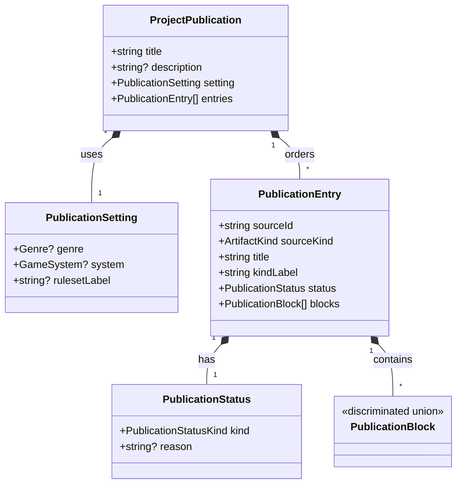
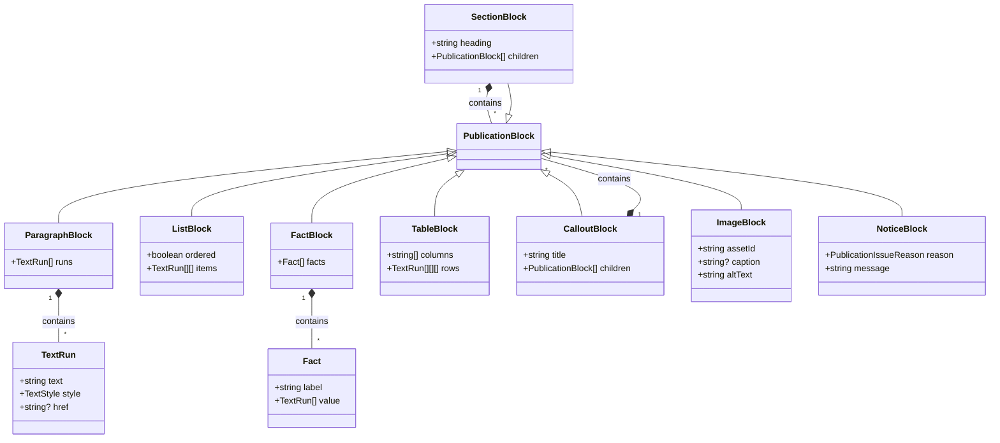
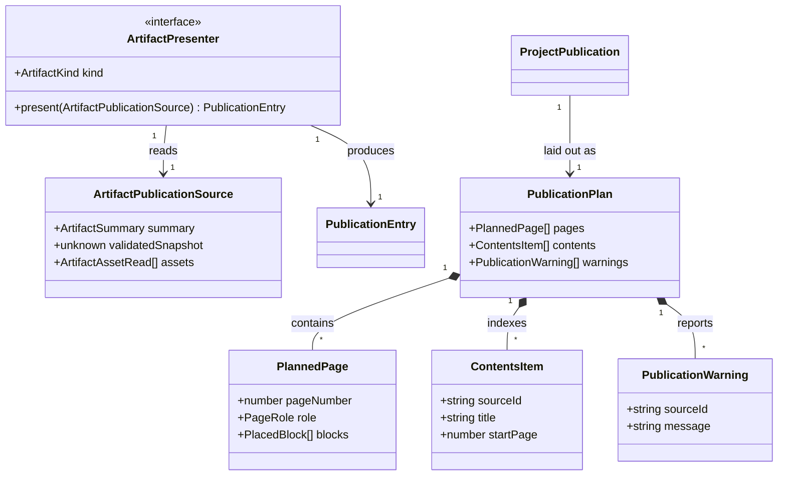

# Project PDF

**Status:** accepted; the domain model and visual direction were approved for implementation,
with a white page background for easier printing. The raw-payload export remains in place until
the replacement is built.

## Problem and goal

The current project PDF prints each saved artifact's object keys and values. It is a data dump with
a cover, even when the tool presents a finished potion description, character sheet, map, or other
designed result. The PDF should read and look like a **published tabletop RPG supplement**: a
coherent book assembled from the user's saved work, suitable for reading, printing, and sharing.
The separate JSON project export remains the complete, reimportable backup.

The PDF publishes _saved snapshots_. It never rerolls, rewrites an edited description, or
substitutes current generator defaults for the work the user saved. It preserves the content and
meaningful presentation of those results in one book design. Pixel-for-pixel identity with each
tool page is not the goal; editorial fidelity is.

## Decisions proposed

1. **One publication language, many artifact presenters.** Each supported artifact kind converts
   its validated saved snapshot into typed publication blocks. Presenters reuse existing domain
   document and formatting functions where available. The result UI should use the same semantic
   model when practical; parity tests cover UI that remains separate. PDF layout never decides
   what a domain field means.
2. **One book layout.** The project PDF owns the cover, contents, section openings, page numbers,
   headers, typography, rules, spacing, and pagination. A kind contributes content and limited
   semantic layout hints, not its own page geometry. Character sheets and other strongly designed
   outputs are adapted into book blocks rather than stapled in as standalone PDFs.
3. **Explicit gaps.** Every project artifact keeps its place in project order. An unreadable
   snapshot, missing presenter, or failed image produces a named publication note. Raw payload
   fields are never the fallback. The book can still download, and the UI reports incomplete
   entries by name.
4. **Genre-neutral identity.** A restrained Iron Arachne imprint works for fantasy, science
   fiction, horror, and mixed projects. Optional genre colour is a small accent selected from
   existing project metadata, not a separate template. No game's trade dress is copied.
5. **Local PDF-native output.** The static browser export draws searchable text, vector rules,
   and saved images without a server, network font, DOM screenshot, or remote renderer.

## Reader experience and page system

Use US Letter portrait, as the current export does. Keep essential marks inside at least 15 mm
of safe margin, with a slightly wider inner margin for binding. The cover is an inset title
composition rather than full bleed. It shows the project name, optional description and setting
details, the first eligible saved primary image in project order when one exists, and an Iron
Arachne imprint. An empty project still gets a finished cover and a short “No saved work yet” page.

The contents lists every artifact's display name, kind, and starting page and flows to additional
pages if needed. The body follows the existing project listing order. Each artifact starts on a
new page with title, kind label, optional lead, and content. A long artifact continues under a
running heading. Body pages carry quiet folios and the project title; the cover carries neither.

Use white pages, dark charcoal ink, restrained lines, and one muted accent. The brand green
is unsuitable for body text on white according to the brand palette's contrast data. Use a clear
scale for book title, artifact title, section heading, body, caption, and metadata. Display type
may use the branded Cinzel face; body type must be comfortable at print size. Both must be
embedded with enough character coverage for saved names and prose. The vendored web fonts are
WOFF/WOFF2; implementation must obtain PDF-compatible licensed files through the branding asset
process or document a compatible alternative, without editing vendored assets in place. Text must
remain selectable and wrap using actual embedded-font metrics.

The reference art direction is a white page (`#ffffff`, with no full-page background fill) with
charcoal (`#1b1e24`) text, granite (`#3c4350`) secondary labels, and thin tan (`#5c5031`) rules.
Gold (`#c8a46e`) or a genre accent can appear in rules and ornaments, not small text. A rough
type target is 30–36 pt on the cover, 20–24 pt for artifact openings, 13–15 pt for section
heads, 10–11 pt body with generous leading, and at least 8.5 pt for captions and folios.
These are layout targets to validate on actual rendered pages, not values to force when a long
name or localized text needs more space. Ornament is limited to title framing, section rules,
and a small running motif; the content stays dominant.

Narrative prose uses one reading column. Other blocks provide the structure an RPG supplement
needs:

| Block                  | Book treatment                                                    |
| ---------------------- | ----------------------------------------------------------------- |
| Paragraph and list     | Comfortable measure, real bullets or numbering, paragraph spacing |
| Key facts / stat block | Aligned reader-facing labels and values, never raw object keys    |
| Table                  | Column headings, wrapped rows, repeated header across page breaks |
| Callout / quotation    | Bordered or tinted inset with label and interior spacing          |
| Image                  | Preserved aspect ratio, optional caption, print-safe size         |
| Section                | Heading kept with the first content lines                         |
| Publication note       | Visible explanation of what could not be presented                |

Images come from saved artifact assets, not regenerated previews. The primary visual appears
near the artifact opening; additional images sit with the relevant section. SVG is rasterized for
embedding only when the browser can do so safely; PNG and JPEG remain embedded. Never stretch an
image to arbitrary dimensions. A missing or failed image gets a visible note.

The compositor measures before drawing. It plans the body, reserves and measures contents pages,
then resolves final page numbers before rendering; if the contents page count changes, it repeats
that planning step until stable. It keeps headings with content, avoids orphaned final lines,
splits long paragraphs and tables safely, repeats table headers, and can give an oversized image
its own page. An indivisible block that cannot fit produces a layout error, never clipping. A
compact stat list may use two columns; prose is not forced into a universal two-column template.

## Domain model

These are transient publication types, not new IndexedDB or JSON backup fields. The current
`Project`, `ArtifactSummary`, validated payload, and `ArtifactAssetRead` remain source records.
`project-pdf-types.ts` (or equivalently named type files) should declare these shapes. A
presenter consumes one saved, validated artifact and produces one entry. `sourceId` and
`sourceKind` exist for diagnostics and links, not for printing implementation data.

Blocks contain reader-facing content and semantic hints, never jsPDF coordinates or CSS. These
are the `PublicationBlock` variants and their nested value types. `TextRun.style` is one of
plain, emphasis, or strong; `TextRun.href` is an optional safe external or internal link.
`ListBlock.ordered` distinguishes numbered and bulleted lists. `NoticeBlock.reason` is a
machine-readable reason such as unreadable-artifact, missing-presenter, or missing-image;
`message` is its reader-facing wording. `ImageBlock.assetId` points to a saved asset of the
same artifact, not a new image generated for export.

The type declarations should make `TableBlock.rows` a named row type if that improves clarity;
each row has one cell per column, and each cell is a series of text runs. Text runs keep emphasis
and links explicit rather than smuggling HTML or Markdown into the renderer. Presenter validation
rejects empty required text and non-finite displayed numbers.

`PageRole` distinguishes cover, contents, body, and optional image pages. `PlacedBlock` holds
a block reference, bounds, and any split/continuation information. It is never persisted.
Warnings also return to the download UI; they must not be hidden only inside the PDF.

## Source and completeness rules

Read each artifact through the existing version-aware, validated path. A migrated snapshot may
be presented in memory without writing a new version. The saved artifact name is the entry
title; the kind's own name may appear in its blocks. A reference to another included artifact
renders as a reader-facing name and may become an internal PDF link. A missing reference is
named as missing, never regenerated or silently dereferenced.

The first complete release should have a presenter for every artifact kind the current build can
read. Existing tool-specific text documents and PDF sheet renderers are starting material, not
automatic drop-in pages. A registry check enforces coverage as kinds are added. An unknown future
kind or corrupted old record still gets an explicit incomplete entry. A presenter exception
becomes an incomplete entry and UI warning rather than aborting the book. A fatal failure to
create or save the PDF remains an error and produces no success message.

This derived export changes no persistence schema or import format. It must not mutate project
state or claim to be a backup. The builder should avoid loading every full-resolution asset at
once for a large project and give clear feedback while preparing the download.

## Verification and work after approval

1. Inventory artifact kinds and their current UI, canonical document functions, saved image
   roles, and standalone PDF behavior. Map each to publication blocks.
2. Implement block types and the presenter registry, then presenters for all readable kinds.
   Test saved edits, optional fields, names, references, and unsupported records. Reject raw
   payload traversal as a publication fallback.
3. Implement two-pass layout, embedded fonts, image placement, contents, folios, and warnings.
   Keep PDF code dynamically loaded from the export action.
4. Compare representative PDFs with the result UI: narrative, table, character sheet, map,
   long content, non-ASCII names, and a mixed project. Inspect rendered pages at screen and print
   sizes, extracted text, page boundaries, and missing-asset behavior. Exercise the browser
   download with Playwright. Run `npm run verify:all` before merge because this changes rendering.

The acceptance bar is a coherent supplement whose artifacts are understandable without seeing
the app or its storage format. Finding one phrase inside the PDF is insufficient.
