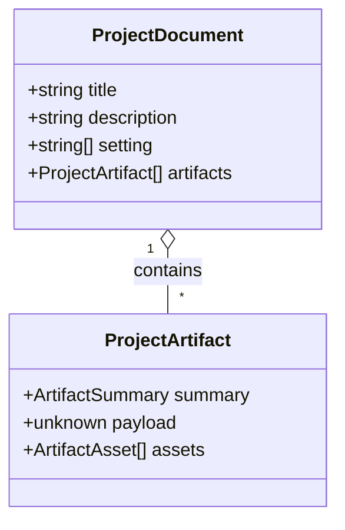

# Project PDF

**Status:** implemented

The project PDF is a readable compilation, not a concatenation of the individual tool PDFs. It has
a cover page containing the project name, description, and setting metadata, followed by artifacts
in the same order as the project listing. Artifacts that cannot be read by the current build are
omitted; the JSON project export remains the lossless backup.

## Domain model

The project boundary reads validated snapshots rather than regenerating live values. This keeps
edited artifacts faithful to what was saved and lets the PDF remain independent of generator
renderers. Persisted PNG, JPEG, and SVG artifact assets are embedded when present.
