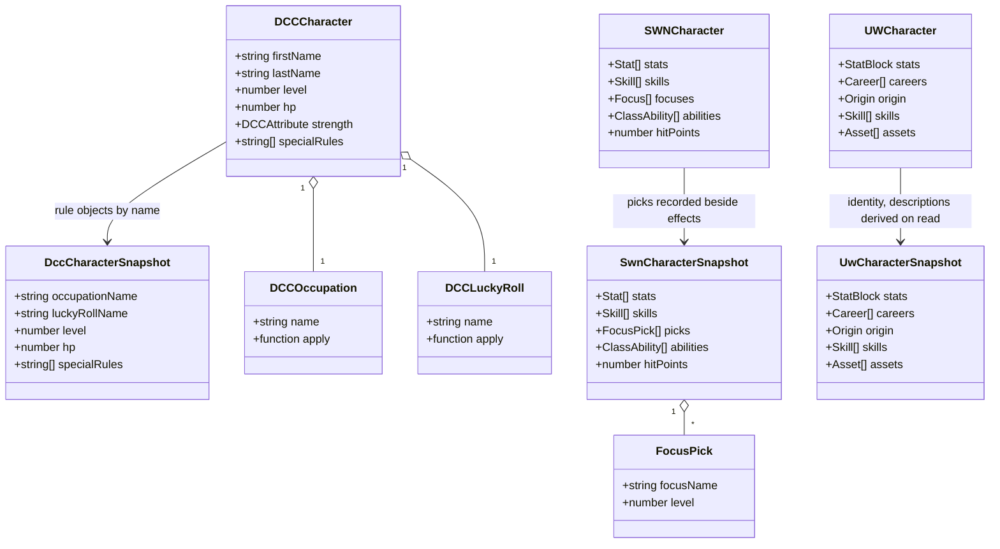
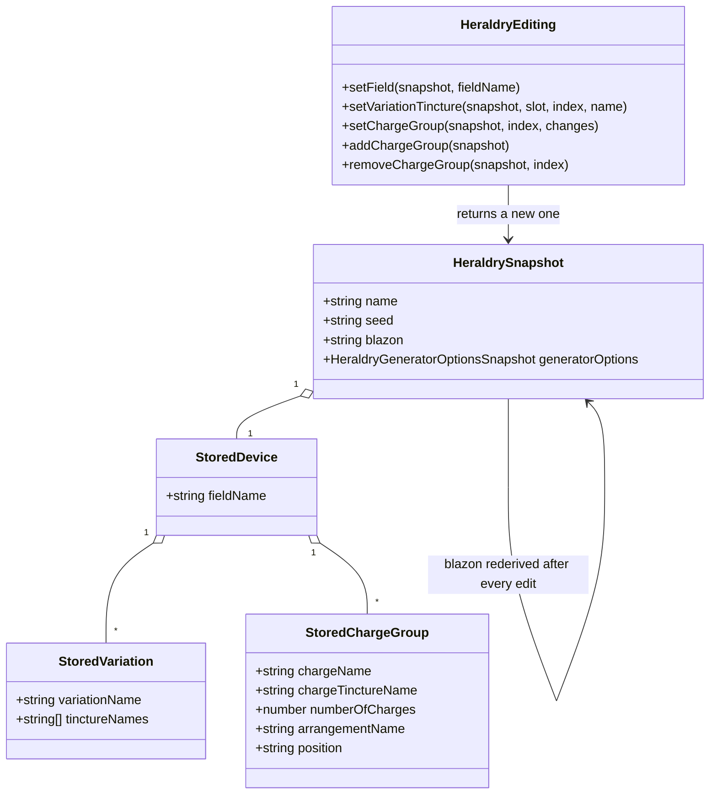

# Readiness: the characters domain

Five tools, taken to Release-ready: the Dungeon Crawl Classics character generator
([#48](https://github.com/ironarachne/ironarachne/issues/48)), the Stars Without Number character
generator ([#49](https://github.com/ironarachne/ironarachne/issues/49)), the Uncharted Worlds
character generator ([#50](https://github.com/ironarachne/ironarachne/issues/50)), the heraldry
generator ([#51](https://github.com/ironarachne/ironarachne/issues/51), Beta rather than
Experimental), and Velgarth Gifts
([#52](https://github.com/ironarachne/ironarachne/issues/52)).

Part of [the readiness pass](tool-readiness.md); read that first for what all twenty-eight tools
share — the determinism fix, the stored vocabulary, the kind ids, and the field-editor decision.
Measured against [Tool release readiness](workshop.md#tool-release-readiness).

**Status:** accepted; not yet built. Reviewed and approved with [the pass](tool-readiness.md#domain-model), so the work in this document is clear to start.

## The three system characters

#48, #49 and #50 are one design problem in three costumes, and the AD&D character
([docs/adnd-character.md](adnd-character.md)) already solved it. A system character is **mostly
rule data applied to a handful of user decisions**, and the two are tangled in one flat object.
The answers carry over unchanged:

- The kind is system-qualified: `character.dcc`, `character.swn`, `character.uncharted-worlds`.
- Every derived number stays in the payload. A DM who edits a saving throw has made a decision no
  recomputation may overrule, and a character saved under one edition of the tables must still be
  that character after the tables change.
- Rule objects are stored by name and resolved on read; a name this build no longer has rebuilds a
  placeholder rather than quarantining the character.
- Recomputation exists, as an explicit and clearly destructive command (4.3), never as something
  that happens on open.

What differs per system is which fields carry a closure, and what the user decided that the
payload does not currently record. Those are below.

### #48 — Dungeon Crawl Classics

**The closures are named in the types.** `DCCOccupation.apply` and `DCCLuckyRoll.apply`
(`src/lib/dcc/dcc_types.ts:65`, `:73`) are functions held in data, so neither object may reach the
payload. The snapshot stores `occupationName` and `luckyRollName` and resolves both on read, in the
shape AD&D stores its race and class:

```
DccCharacterSnapshot =
  Omit<DCCCharacter, 'occupation' | 'luckyRoll'> & {
    occupationName: string;
    luckyRollName: string;
  }
```

Everything else on `DCCCharacter` is plain: six attributes as `{ value, modifier }`, the saves,
`specialRules: string[]`, `currency: Record<string, number>`, and arrays of `DCCItem` and
`DCCWeapon`, none of which carries a function.

**The funnel is the interesting part, and it decides the kind's cardinality.** DCC's zero-level
funnel produces several characters at once, which is what makes this tool unlike its neighbours.
Two readings were available and the choice matters:

- One artifact per character, saved individually.
- One artifact holding the funnel — `{ characters: DccCharacterSnapshot[] }`.

**The payload is one character, and a funnel saves several artifacts.** A funnel is a way of
rolling, not a thing in the world: the four peasants who walk into the dungeon are four characters,
three of them about to die, and the survivor is a character a player keeps for a year. An artifact
holding all four would make that survivor unopenable on their own, un-renamable, and impossible to
reference from anything else — and 3.5 (name on save, rename after) is unanswerable for a bundle.

So the generator's save control, when a funnel is on screen, saves each character as its own
artifact, naming them from the same prompt with an index. That is the one place in this pass where
one press of **Save** writes more than one artifact, and it is worth the special case.

**8.4** — the README says DCC as published in the core rulebook, that the funnel implements
zero-level characters only, and that levelled advancement is deliberately out of scope.

### #49 — Stars Without Number

**No closures in the character.** `SWNCharacter`'s `abilities: ClassAbility[]` is a discriminated
union of plain records (`{ kind: 'effortAbility', description }` and friends,
`src/lib/swn/character.ts:198`), and stats, skills, foci, equipment and weapons are all plain data.
The snapshot is close to the identity function, which is unusual here and worth saying rather than
leaving a reader to wonder what was missed.

**What the issue asks for is the pick, not the effect.** Foci and psychic disciplines are levelled
choices (`focus_data.ts`, `psychic_discipline_data.ts`) whose effects are resolved into the
character at generation time. The payload keeps **both**: the resolved numbers, because 4.2 says
the payload is authoritative, and the picks that produced them, because an editor cannot offer a
decision it cannot read back and advancement is otherwise a migration.

That means `SWNCharacter` grows one field — `picks: { focusName: string; level: number }[]` and the
psychic equivalent — in the same way the AD&D character grew `thiefSkills`. It is the same
finding: a user decision that was never recorded as data, only as its consequence.

**6.3 is largely in hand** — `render_swn_character_pdf.ts` already exists. What it needs is the
presentation document beneath it so the PDF and any Markdown export cannot disagree.

### #50 — Uncharted Worlds

The simplest of the three: `UWCharacter` is descriptors, a stat block, careers, an origin, skills,
a workspace, assets and a name (`src/lib/unchartedworlds/character.ts:8`), with **no function-typed
field anywhere in the library** — the search for one returns nothing.

**Skill descriptions are derived and stay derived.** `skill_description.ts` turns a skill into its
prose; the payload stores the skill, and the description is produced on read. A wording fix then
reaches a character saved last month, which is the whole reason not to store it. This is the one
place in this domain where _not_ storing something is the right answer, and it is safe precisely
because the derivation takes no RNG and no user input: it is a lookup, not a roll.

The edit that follows: a user who rewrites a skill description is editing prose the library owns,
so the editor does not offer that field. Careers, origin, workspace, assets and the stat block are
what it offers.

## #51 — Heraldry, from Beta to Release-ready

The shortest run on the site, and the one requirement in the way is the one the spec calls the
requirement that separates a workshop from a gallery.

**What is already true**, and this is assessed, not inherited: heraldry clears sections 1–3
(a registered kind with a validating v1→v2 migration, a round-tripping snapshot, provenance and a
name on save), 6 (mobile, keyboard, SVG and PNG export) and 7.1–7.2. `ARTIFACT_EDITORS` registers
`HeraldryArtifactView` — a viewer, not an editor — so a saved coat of arms can be looked at and
downloaded, and not changed. Outstanding: **4.1–4.4, 5.1–5.3, 7.3 and 7.4.**

### The editor is a device editor, and the stored shape is already the right one

`StoredDevice` (`src/lib/heraldry/heraldry_snapshot.ts`) is exactly the vocabulary an editor needs:

```
StoredDevice  = { fieldName, variations: StoredVariation[], chargeGroups: StoredChargeGroup[] }
StoredVariation   = { variationName, tinctureNames: string[] }
StoredChargeGroup = { chargeName, chargeTinctureName, numberOfCharges, arrangementName, position? }
```

So the editor is a form over names, and every control it needs already exists for the generator:
`resolveFieldOptions`, `eligibleVariationTinctures`, `fieldVariationSlotCountForDivision` and
`variationTinctureCountForSlot` in `heraldry_ui_options.ts`, plus `Fields`, `Tinctures`,
`Variations` and the charge data exported from the library's index.

**Each change redraws and re-blazons, and re-rolls nothing** (4.2, 4.4). Changing the field's
tincture must leave the charges alone; adding a charge group must not disturb the field. That falls
out of `heraldry_editing.ts` being snapshot-to-snapshot functions, as culture's is — with one
addition heraldry needs and culture did not: **the blazon is derived, not edited.**
`renderDeviceBlazon(device)` recomputes it after every change, because a stored blazon that no
longer describes the device is worse than no blazon.

This is deliberately _not_ a `SnapshotFieldEditor` case
([decision 5](tool-readiness.md#5-flat-payloads-get-a-declared-field-editor-not-twenty-five-bespoke-components)):
a charge group is a repeating structure with its own add and remove, and the editor renders the
arms beside the controls. A flat list of inputs would be a worse editor than the viewer it
replaces.

### Composition, and why heraldry is the kind that tests 5.4

5.1 for heraldry itself is thin — a coat of arms takes no other artifact as an input — so what it
owes is 5.3 (works with nothing supplied: already true) and its side of everyone else's
references. Five kinds in this pass reference `heraldry`: character, organization, family, merchant
and region.

That makes heraldry the kind most likely to sit in a cycle — a region's authority bears the arms of
the organization the region references — and 5.4 is tested in whatever walks references, once, not
in this tool. Retiring `heraldry_saved_state.ts` is part of this issue;
`src/lib/legacy_adoption` is what carries existing saves across and does not change.

## #52 — Velgarth Gifts

The smallest generator in the pass with a real payload. `Gift` is `{ name, description, strength }`
(`src/lib/velgarth_gifts/gift.ts`) and the tool produces a list of them; the component is 47 lines
and the library has no dependency on any other.

- **Kind `velgarth-gifts`**, payload `{ gifts: Gift[] }`. The name is the setting rather than a
  system, for the reason [the spine](tool-readiness.md#kind-ids) gives: a Velgarth gift is fan
  content for one setting, there is no `setting:` namespace to qualify with, and the generic kind
  `gifts` would claim a concept this does not own.
- **The editor is a `SnapshotFieldEditor` case** over a string list plus a number per gift — the
  simplest instance of decision 5 in the pass.
- **8.4 applies to a setting as much as to a system.** The README says which of Velgarth's gifts
  are represented, that strength levels follow the published descriptions rather than any
  mechanical system, and that this is unofficial fan content.

## What every tool in this domain owes

Beyond the per-tool notes above, and identical for all five:

- **`*_roll.ts` and the end of `Date.now()`.** All four generators call it — DCC, SWN and Uncharted
  Worlds twice each, Velgarth twice, heraldry once. Wave 0 of the pass does not fix this; each
  tool's own work item does.
- **`SaveArtifactButton`**, provenance (tool path, seed, config), and the no-project case on the
  tool's own route (3.6, 3.7). Heraldry has this already.
- **A culture reference for naming** where the tool names anyone: DCC, SWN and Uncharted Worlds all
  import `$lib/characters` and can take `CharacterNameSection`'s existing `offerReferencedCulture`
  opt-in, which was built for #45 and costs a prop.
- **A presentation document** and an export control (6.3). The three system characters have PDF
  renderers already and need the document under them; Velgarth needs both.
- **7.2, 7.3, 7.4**: a round-trip test, a migration test where a version step exists, and an
  end-to-end spec beside `e2e/adnd_character.spec.ts` covering generate, save, reopen, edit.

## Domain model

### The three system characters



### Heraldry, edited



## Decisions taken here

### 1. A DCC funnel saves one artifact per character

A funnel is a way of rolling, not a thing in the world. One artifact per character keeps the
survivor openable, renamable and referenceable; a bundle makes 3.5 unanswerable and the survivor
unreachable. The cost is the pass's one save control that writes several artifacts at once.

### 2. SWN stores the pick and the effect, not one or the other

The effect, because 4.2 makes the payload authoritative. The pick, because an editor cannot offer a
decision it cannot read back, and because levelling a character otherwise becomes a payload
migration. This is the AD&D thief-skills finding in a different system.

### 3. Uncharted Worlds derives skill descriptions on read

The one thing in this domain deliberately not stored. It is a lookup with no RNG and no user input,
so deriving it is safe, and a wording fix then reaches characters saved before it. The editor does
not offer the field, because it is not the user's text.

### 4. Heraldry's editor is bespoke, and the blazon is derived

A charge group is a repeating structure with its own add and remove, and the arms are drawn beside
the controls, so this is not a flat-form case. The blazon is recomputed from the device after every
edit rather than stored as an editable string: a blazon that no longer describes the device is
worse than none.

### 5. Velgarth Gifts is named for its setting

Neither generic nor system-qualified, because it is neither. The README carries the same courtesy
8.4 asks for a system: what is represented, what is not, and that it is unofficial.

## Still open

- **#14 (Convention Special DCC generator) builds on #48.** It is not folded in here. What #48 owes
  it is a settled `character.dcc` kind, which is what makes #14 small; if #14 lands first it will
  need one anyway.
- **Whether the SWN pick fields belong on `SWNCharacter` or only on the snapshot.** This document
  puts them on the character, matching what AD&D did with `thiefSkills`, on the grounds that a
  field only the stored form has is a field the generator cannot fill honestly. A reviewer who
  disagrees changes one type and nothing else.
