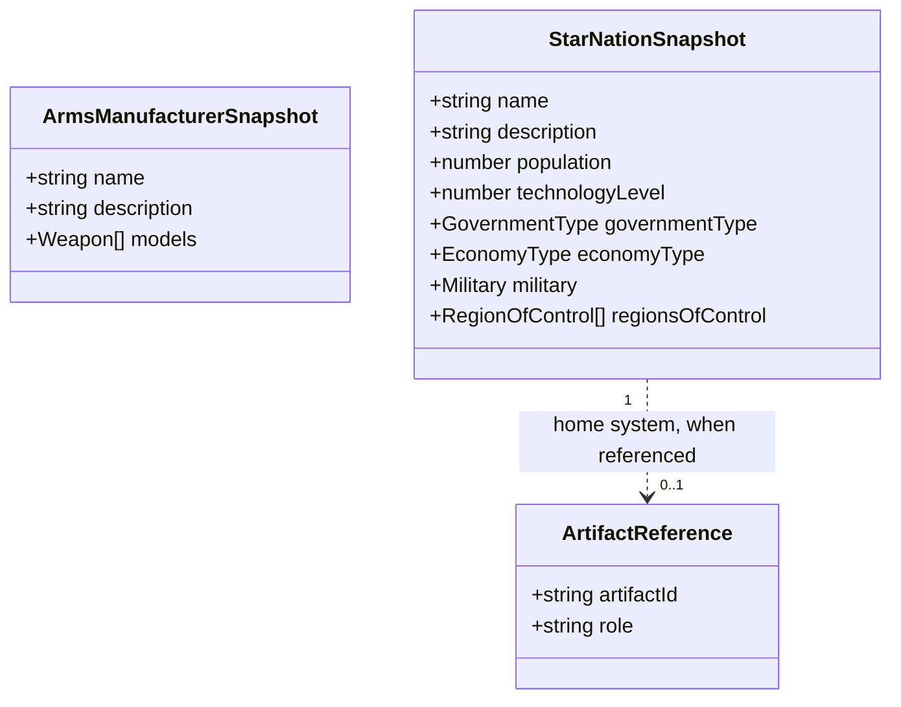
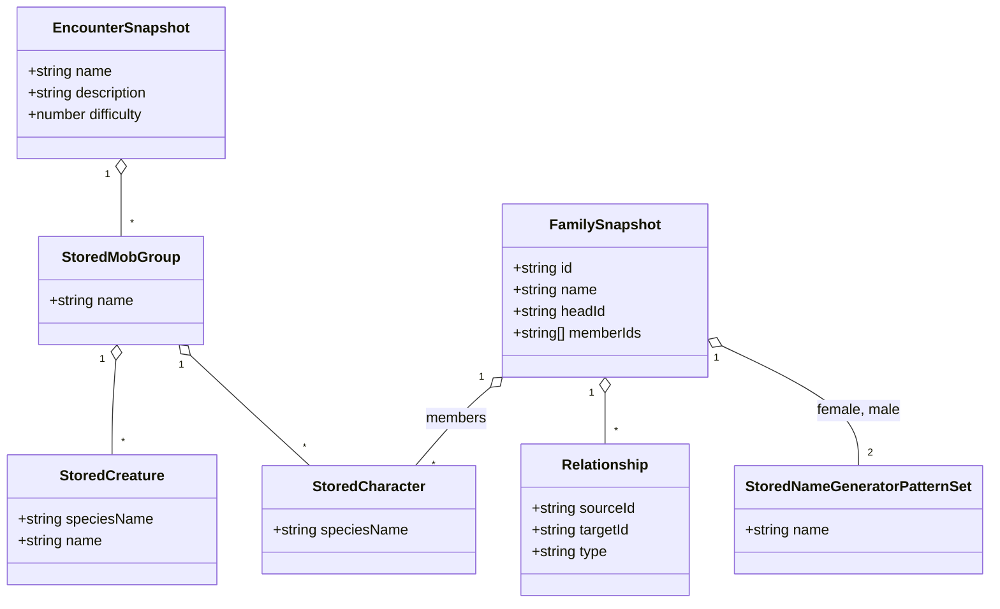
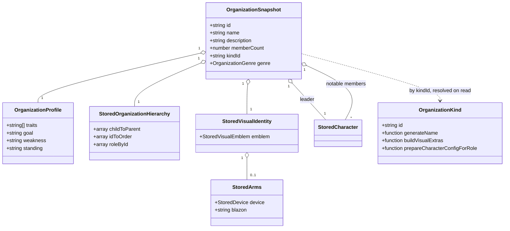

# Readiness: the factions domain

Five tools: the arms manufacturer
([#53](https://github.com/ironarachne/ironarachne/issues/53)), the fantasy encounter generator
([#54](https://github.com/ironarachne/ironarachne/issues/54)), the fantasy family generator
([#55](https://github.com/ironarachne/ironarachne/issues/55)), the fantasy organization generator
([#56](https://github.com/ironarachne/ironarachne/issues/56)) and the star nation generator
([#57](https://github.com/ironarachne/ironarachne/issues/57)).

Part of [the readiness pass](tool-readiness.md). Measured against
[Tool release readiness](workshop.md#tool-release-readiness).

**Status:** accepted; the arms manufacturer ([#53](#53--arms-manufacturer)) and the fantasy
encounter ([#54](#54--fantasy-encounter)) are **implemented**; #55 to #57 are not yet built. Reviewed and approved with [the pass](tool-readiness.md#domain-model), so the work in this document is clear to start.

This domain holds the pass's easiest tool and its second-hardest. The arms manufacturer is three
files and a flat payload; the organization generator is the richest generator on the site, with a
kind registry of its own, hierarchies held as `Map`s, and four libraries' worth of generated
imagery. They are in one document because they are one catalog domain, not because they are alike.

## #53 — Arms manufacturer

`ArmsManufacturer` is `{ name, description, models: Weapon[] }`
(`src/lib/arms_manufacturer/arms_manufacturer.ts`) — three fields, no closures, no imagery, no
cross-library dependency except `$lib/weapons`, which nothing else on the site imports.

- **Kind `arms-manufacturer`**, payload the type as it stands. `Weapon` from `$lib/weapons` is
  plain data; this is the one snapshot in the pass that is genuinely the identity function, and
  saying so is more useful than inventing a conversion to look thorough.
- **2.3 fails and is most of the work.** `ArmsManufacturerGenerator.svelte` renders no
  `SeedControls` and calls `Date.now()` three times. It gets the seed control every other generator
  has, and an `arms_manufacturer_roll.ts` behind it.
- **The editor is a `SnapshotFieldEditor` case**: two text fields and a list of models.
- **6.3** is a presentation document of the manufacturer and its catalogue, exported as Markdown
  and PDF.

The issue calls this a good tool to take through the whole spec early precisely because nothing
about it is hard, and [wave 1](tool-readiness.md#the-order-of-the-work) agrees.

**As built.** Everything above landed as written except the editor, which is bespoke — and this is
the second time the document has been wrong about that in the same way. "A list of models" is a
list of _records_: a `Weapon` is a name, a damage type and a description (and two string lists
behind them), and the only repeating control `SnapshotFieldEditor`'s descriptor language declares
is `string-list`. The guard at the end of
[decision 5](tool-readiness.md#5-flat-payloads-get-a-declared-field-editor-not-twenty-five-bespoke-components)
applies exactly as it did to Velgarth Gifts, so `ArmsManufacturerArtifactEditor.svelte` is the
company's two fields and one row per model with its own add and remove, and **the declared
component is still unbuilt**. Two of the twelve tools listed as flat have now turned out not to be,
and both for the same reason — a catalogue, a set, a roster is a list of records — which is worth
knowing before the next one is assumed to be.

The kind question the issue asked was settled the way the kind table says: `arms-manufacturer` is
its own kind, not a discriminator on `organization`. An `Organization` is a leader, members, a
hierarchy and a visual identity; a manufacturer shares a `name` with it and nothing else, so one
kind would be one validator and one migration path over two shapes.

The PDF is `$lib/pdf`'s `downloadTextPdf` over the same document model the Markdown is written
from, so the two cannot drift. `Weapon.maker`, which the generator leaves empty, is left empty:
filling it would be a generator change nothing asked for, and a model added by hand in the editor
is the one place it is set, to the company's name, because that is the one field a blank row can
truthfully start with.

**One thing to settle while here.** `$lib/weapons` is imported by `$lib/arms_manufacturer` and by
nothing else in the application — its science-fiction weapon path belongs to this tool. #69 assumes
that library backs the _fantasy_ weapon generator and it does not; see
[Objects](readiness-objects.md#66-and-69--one-kind-item) and
[the pass's corrections](tool-readiness.md#corrections-to-the-issues).

## #54 — Fantasy encounter

An `Encounter` is `{ name, description, difficulty, groups: MobGroup[] }`
(`src/lib/encounters/encounter_types.ts`), and a `MobGroup` holds `Mob`s — which for this generator
are `Creature`s and `Character`s, each embedding a whole `Species`.

- **Kind `encounter`.** The payload composes `StoredCreature` and `StoredCharacter` from
  [the stored vocabulary](tool-readiness.md#the-stored-vocabulary); `StoredCreature` is new and
  this is the tool that needs it first.
- **`EncounterGroupTemplate` never reaches the payload.** It carries `Mutator<Character>[]`,
  `Mutator<Creature>[]` and `Mutator<Species>[]` — arrays of functions — plus tag filters. They are
  generator input, not content: what the mutators produced is in the creatures. The template's
  name is recorded as provenance so a re-roll can find it again.
- **Composition:** an `environment` reference for where the encounter happens (5.1), which is why
  #60 lands first. The encounter generates its own if given nothing (5.3).
- **6.3 is the point of this tool.** An encounter is a thing a GM prints and puts on the table, and
  it has no export today. The presentation document is per group: creatures with their numbers, the
  difficulty line, and the environment when one was supplied.
- **6.4 has teeth here.** An encounter with no treasure and no complication must not print their
  headings. The document model drops empty sections, as settlement's does.

The editor is bespoke but small: a group is a repeating structure (name, count, creatures), so it
is a list editor rather than a flat form.

**As built.** Everything above landed as written, with three things worth recording.

`StoredCreature` is declared in `$lib/creatures` as `creature_snapshot.ts` and
`creature_rehydrate.ts`, split the way the character's halves are. `placeholderSpecies` moved
there from `$lib/characters` with it — a placeholder species is a creature-level concept, and the
character half re-exports it. The creature lookup searches every species this build has rather
than the sentient list, because a species mutator can turn a band of cultists into ghouls and the
stored name is whatever the mutator left.

**A stored mob carries a `mobKind` discriminator**, written on the way in. `MobGroup` holds `Mob`s
and a `Character` is a `Creature` with more, so a stored group is a list of `StoredCharacter` or
`StoredCreature`; inferring which from field presence on the way out is exactly the kind of guess a
migration later has to undo. The kind's validator delegates each mob to the vocabulary type's own
validator rather than copying it.

**The environment reference (5.1) is deferred**, not dropped: `environment` (#60) has not landed,
and `Encounter` has no field for one yet. The encounter takes nothing today and works with nothing
supplied (5.3). When #60 lands, the reference is a field on this payload and a version 2.

6.4 turned out to bind on two fields the issue did not name. The generator writes an empty
description and a difficulty of zero on every encounter (both marked TODO), so a document that
printed them would print a blank paragraph and "Difficulty: 0" on every sheet ever made. Both are
dropped when empty. There is no treasure or complication field to drop.

## #55 — Fantasy family

The payload is a graph, and the graph is the risk the issue names: a family contains cycles by
construction, because two people are each other's siblings and a spouse edge points both ways.

- **Kind `family`.** `Family` is `{ id, name, headId?, members: Character[], memberIds: string[],
relationships: Relationship[], femaleNameGenerator, maleNameGenerator }`. Two of those fields are
  `NameGenerator`s carrying closures, and the members are characters.
- **The snapshot is `StoredCharacter[]` plus a stored pattern set.** The name generators become a
  `StoredNameGeneratorPatternSet`, exactly as a culture's do, and are rebuilt on read from the RNG
  the codec is handed. The relationships are plain records of ids and need no conversion.
- **Cycles are not a problem for the snapshot, and are for anything that walks it.** The members
  are a flat array and the relationships reference ids, so `structuredClone` never recurses — the
  graph is only a graph once `graph.ts` builds it. 3.2's round-trip test uses a real
  multi-generation family, as the issue asks, and 5.4 belongs to the reference walker.

**6.3 is already built and unused.** `getFamilyTreeSVG(family)` in `src/lib/families/graph.ts:365`
renders a family tree as SVG with `xmlbuilder2`, and `FamilyGenerator.svelte` does not call it. So
the issue's question — "a family diagram is not free; say whether it is in scope" — is answered by
the code: the diagram exists, and 6.3 here is a download control over a function that already
works, plus the Markdown roster beside it. That is the cheapest 6.3 in the pass.

**Composition:** a `culture` reference for naming, and `heraldry` for a family's arms.

## #56 — Fantasy organization

The richest generator on the site, and the one whose payload is most nearly written already.

`Organization` (`src/lib/organizations/organization_types.ts:75`) is `{ id, name, description,
memberCount, profile, visualIdentity, hierarchy, leader, notableMembers, relationships, genre,
kindId }`. Three of those need conversion, and **`settlement_snapshot.ts` already converts all
three** — `StoredOrganization`, `StoredOrganizationHierarchy`, `StoredVisualIdentity` and
`StoredVisualEmblem` exist today, because a settlement holds organizations.

So this tool's payload work is mostly [wave 0](tool-readiness.md#the-order-of-the-work): move those
types to `$lib/organizations` and `$lib/visual_identity`, which is where they belong, and the
organization kind composes what the settlement kind has been using all along.

What remains is genuinely this tool's:

- **The hierarchy is three `Map`s** (`childToParent`, `idToOrder`, `roleById`). `JSON.stringify`
  turns a `Map` into `{}` without complaining, which is how a naively stored settlement came back
  with every organization's structure silently emptied. They travel as entry arrays.
- **`kindId` is already the right shape.** `OrganizationKind` carries `buildVisualExtras`,
  `generateName` and `prepareCharacterConfigForRole` — three closures — and the organization
  records only `kindId`, resolving the kind on read. Nothing to design; it is already done, and it
  is why this payload is less work than its size suggests.
- **Imagery round-trips as parameters, never as a rendered SVG.** The issue is right and the reason
  is worth keeping: a stored SVG is a fossil — it cannot be re-themed, cannot be re-rendered at
  another size, and pins the payload to the renderer that made it. `StoredVisualEmblem` stores the
  emblem's parameters and, when it is heraldic, `StoredArms`.
- **The two registries must not be conflated.** `$lib/organizations`'s kind registry predates the
  artifact kind registry and means something else entirely. In code they stay `kindId` and
  `ArtifactKind`; in the README the distinction gets a sentence, because the next reader will
  otherwise assume one is the other.

**The editor is bespoke.** A hierarchy is a tree of roles with people in them, and the flat-form
editor would be a worse view of it than the generic snapshot view. What it must reach: the name and
description, the profile's traits, goal, weakness and standing, each role's holder, and the visual
identity's parameters — with a redraw, not a re-roll, after each change.

**Composition:** `heraldry` for the arms, `character` for the leader and notable members, `culture`
for naming.

## #57 — Star nation

`Civilization` is `{ name, description, population, technology_level, government_type,
economy_type, military }` (`src/lib/civilizations/civilizations.ts`), and the generator assembles a
nation from a civilization, two `RegionOfControl`s — the home system and the home planet — and a
generated star system. All of it is plain data.

- **Kind `star-nation`**, payload the civilization, its regions of control, and the home system's
  identity. The star system itself is a **reference** to a `star-system` artifact when the user
  supplied one, and embedded otherwise: the same shape culture uses for religion.
- **Renderer output is not stored.** The component calls `renderStarSystemPreviewImage`; what is
  stored is what the renderer takes — the system's bodies and their parameters — never the image.
- **The editor is a `SnapshotFieldEditor` case.** Every field is a string, a number or a select
  over a named table, which is exactly the four controls decision 5 allows.
- **2.2**: two `Date.now()` calls, and the component already carries a comment about one of them
  generating from a clock rather than from the seed. The roll module ends that.

**#11 is the open question and this document does not close it.** #11 proposes reframing the
civilization generator as setting flavour over RPG stats — which would remove or reshape
`military.quality`, `training_level` and their neighbours. A payload built around stats that are
about to be removed is a migration nobody needed. So: **#57 does not start until #11 is decided.**
It is the one tool in the pass with a hard external dependency, and pretending otherwise is how a
payload version 2 gets written three weeks after version 1.

## Domain model

### The two flat payloads

### Encounter and family

### Organization

## Decisions taken here

### 1. `StoredCreature` is declared in `$lib/creatures`, and the encounter is its first consumer

A `Creature` embeds a whole `Species` exactly as a `Character` does, and both the encounter and the
dungeon payloads need it. Declaring it here rather than inside the encounter payload keeps the
dungeon from writing a second one.

### 2. Encounter group templates are generator input and never reach the payload

They carry three arrays of mutator functions. What the mutators produced is in the creatures, which
is the content; the template's name goes to provenance so a re-roll can find it.

### 3. The family diagram is in scope, because it already exists

`getFamilyTreeSVG` works and nothing calls it. 6.3 for this tool is a download control, not a
render pipeline, and the issue's hesitation was written without that fact.

### 4. The organization's stored shape is the settlement's, moved

`StoredOrganization` and its parts already exist in `$lib/settlements` and already ship. Moving
them to the library that owns the concept is [wave 0](tool-readiness.md#the-order-of-the-work) and
costs one settlement payload migration shared with the character move; writing a second stored
organization beside the first would cost a silent divergence the first time a field is added.

### 5. Generated imagery is stored as parameters

For every tool in this domain and the next: parameters, never a rendered SVG or PNG. A stored image
cannot be re-themed, re-rendered at another size, or read by anything but the renderer that made
it, and this site re-themes by genre.

### 6. #57 waits on #11

The star nation payload is mostly the civilization's stats, and #11 proposes replacing those stats
with setting flavour. Building the payload first means migrating it immediately. This is a
sequencing decision rather than a design one, and it is the only hard external dependency in the
pass.

## Still open

- **Whether an encounter should reference the creatures' species as artifacts.** There is no
  species kind and this pass does not add one; creatures carry `speciesName` and rebuild. If a
  species kind ever exists — #19 and #25 circle it — the encounter is where it would first pay off.
- **How much of an organization's hierarchy an editor should let a user restructure.** This
  document says roles and holders are editable and the tree's shape is not, on the grounds that a
  hierarchy with a cycle in it is a bug the generator cannot produce and an editor should not
  invent. A reviewer may want the stronger version.
