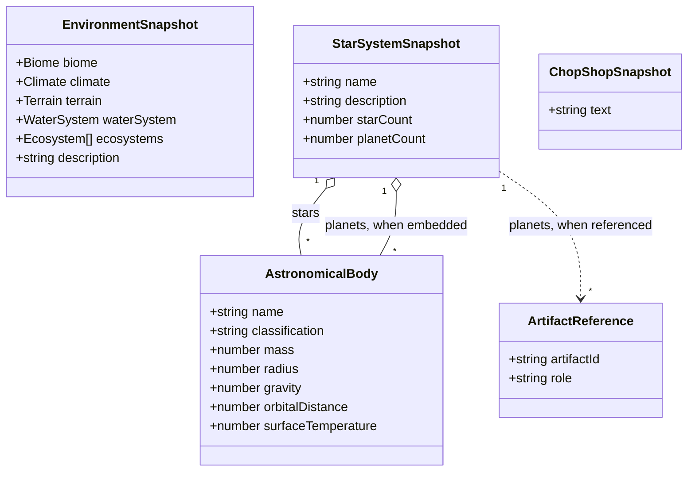
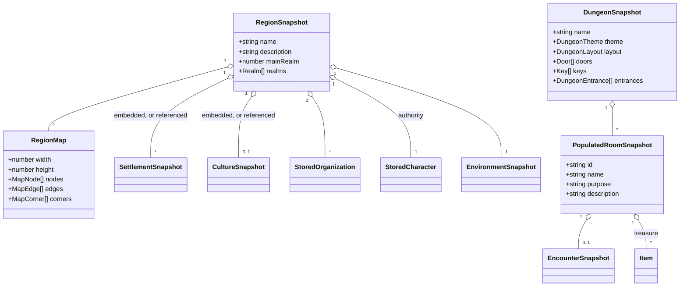

# Readiness: the locations domain

Six tools: the cyberpunk chop shop
([#58](https://github.com/ironarachne/ironarachne/issues/58)), the dungeon generator
([#59](https://github.com/ironarachne/ironarachne/issues/59)), the environment generator
([#60](https://github.com/ironarachne/ironarachne/issues/60)), the planet generator
([#61](https://github.com/ironarachne/ironarachne/issues/61)), the region generator
([#62](https://github.com/ironarachne/ironarachne/issues/62)) and the star system generator
([#63](https://github.com/ironarachne/ironarachne/issues/63)).

Part of [the readiness pass](tool-readiness.md). Measured against
[Tool release readiness](workshop.md#tool-release-readiness).

**Status:** accepted; not yet built. Reviewed and approved with [the pass](tool-readiness.md#domain-model), so the work in this document is clear to start.

The pass's two heaviest tools are here — the dungeon and the region — and so is one of its
cheapest. The environment generator goes first regardless of size, because two other tools
reference it.

## #60 — Environment

`Environment` is `{ biome, climate, terrain, waterSystem, dominantEcosystem, ecosystems,
description }` (`src/lib/environment/environment.ts`), and every part of it is a plain record of
strings, numbers and number arrays. No closures, no `Map`s, no imagery.

- **Kind `environment`**, payload the type as it stands.
- **The editor is a `SnapshotFieldEditor` case** — selects over the biome, climate and water
  vocabularies, numbers for the terrain's elevation and relief, a textarea for the description.
- **Genre-neutral**, one of only four tools carrying no genre tag, so it is visible in every
  project. That is why it is first in [wave 1](tool-readiness.md#the-order-of-the-work): the
  encounter and dungeon generators both reference it, and a genre-neutral kind is one every project
  can use.

## #58 — Cyberpunk chop shop

`src/lib/chopshop/index.ts` is a single file whose `generate(rng)` returns **a string** — a
paragraph assembled from five phrase tables. There is no type to snapshot, and that is the design
problem rather than an oversight.

- **Kind `chop-shop`**, payload `{ text: string }`, per
  [decision 4 of the pass](tool-readiness.md#4-prose-generators-get-a-kind-and-it-holds-the-prose).
  The thing a user wants to keep is the paragraph.
- **The editor is a textarea**, which is the honest editing view for prose and satisfies 4.1
  completely: every field displayed is the field.
- **8.3 needs the library split.** Types and generation live in one `index.ts`; CODE_STYLE.md wants
  them apart, so this grows `chop_shop_types.ts` and a generation module beside it. It is the only
  real code change in the tool.
- **2.3 fails**: no `SeedControls`, two `Date.now()` calls. It gets both halves of the standard fix.

**One of two cyberpunk tools** on the site, with `/drug`. A cyberpunk project sees a very short tool
list, which is a fact about the catalog rather than a bug in this tool.

**As built.** Everything above landed as written, with one output change: the back-room sentence
carried a doubled space between its tool and technician clauses, which the browser collapsed and a
Markdown export did not, so the two read differently. The generator now joins them with one. The
library is now `chop_shop_types.ts` (the one
type), `chop_shop_generation.ts` (the phrase tables, with `generate` kept and `generateChopShop`
wrapping it), and the five kind modules the pass prescribes. The kind's `nameOf` answers "Chop
Shop" for every payload, because a paragraph has no name of its own and the user names the artifact
on save. 5.1 does not bind and no input was invented for it; when a settlement kind is something a
cyberpunk project can hold, a `SavedArtifactPicker` here is where the reference goes.

## #61 — Planet and #63 — Star system

One library backs both — `$lib/astronomical_bodies` — and their payloads are the same plain shape,
so they are designed together and shipped separately.

`AstronomicalBody` is fifteen numbers and three strings: albedo, gravity, luminosity, mass, orbital
distance and period, radius, rotation period, surface pressure and temperature, and a
classification. `StarSystem` is `{ name, description, star_count, planet_count, stars: [],
planets: [] }`. Nothing in either carries a function.

- **Kinds `planet` and `star-system`.** A star system references its planets when the user built it
  from saved ones and embeds them otherwise — the shape culture uses for religion, and the reason
  #61 lands before #63.
- **Both editors are `SnapshotFieldEditor` cases.** A planet is a form of numbers; a star system is
  a list of planets plus a name and a description.
- **Renderer output is never stored.** Both components render through `$lib/renderers`; what the
  payload keeps is what the renderer takes.
- **2.5 binds.** The previews are WebGL, and a machine that cannot run WebGL must still get the
  numbers and the prose. `webgl_scene_draw.ts` is the single non-test entry in `coverage.exclude`,
  covered by `e2e/preview_pixels.spec.ts` in a real browser — that exclusion is not extended by any
  work in this pass.

**#16 and #17 are 6.3 work on exactly these two tools** — an orbital view image, and SVG output for
the stellar generators. This document does not fold them in, and recommends they land _with_ these
issues rather than beside them: the presentation document is being written either way, and an SVG
export is a renderer this domain has been asked for twice.

**#61 is featured on the home page**, and one of only two featured tools that is not already
Release-ready. A regression here is visible on the first screen a visitor sees.

## #62 — Region

The most composed payload on the site. `Region` is `{ name, environment, description,
dominantCulture, settlements, mainRealm, realms, authority, organizations, map }`
(`src/lib/regions/region.ts`) — a culture with its name generators, an array of settlements, an
array of organizations with their hierarchies and emblems, a character, and a map.

Every one of those already has a stored form by the time this tool starts, which is the whole point
of the ordering:

| Field             | Stored as                                                   |
| ----------------- | ----------------------------------------------------------- |
| `dominantCulture` | a `culture` reference, or `CultureSnapshot` embedded        |
| `settlements`     | `settlement` references, or `SettlementSnapshot[]` embedded |
| `organizations`   | `StoredOrganization[]`, from `$lib/organizations`           |
| `authority`       | `StoredCharacter`, from `$lib/characters`                   |
| `environment`     | `Environment`, plain                                        |
| `map`             | `RegionMap`, plain — nodes, edges, corners                  |

- **Kind `region`.** It lands last in the pass with the dungeon, because it is the sum of
  everything above.
- **`RegionMap` is stored, and a rendered map is not.** The map is a plain graph
  (`src/lib/map/map_graph.ts:71`), so it survives `structuredClone` as it stands. What must never be
  stored is the SVG `region_map_svg.ts` produces: a rendered map cannot be re-themed or re-rendered
  at another size, and the tile arrays the issue worries about are smaller than the picture of them.
- **Composition is the tool's whole character.** `RegionGenerator.svelte` already carries a
  `SavedArtifactPicker` — the only generator in the pass that does — and #20 took settlements to
  Release-ready partly so that regions built from saved settlements would become possible. This is
  that issue arriving.
- **The editor is bespoke**: a region is a list of places with a map beside it, and the fields a
  user changes are its name, description, which settlement is the seat, and the realms.
- **6.3 is the map.** A region is a map and a map is the export — SVG through
  `region_map_svg.ts`, which exists, plus the Markdown gazetteer of settlements and realms.

## #59 — Dungeon

The largest tool in the pass. `EngineeredDungeon` is `{ name, theme, layout, rooms, doors, keys,
entrances }` (`src/lib/dungeon/generator/types.ts:22`), where a `PopulatedRoom` carries an optional
`Encounter` and optional treasure `Item[]`, and the library has generator, grid, layout,
interactive, render, room and theme subdirectories drawing through Three.js and GLSL.

- **Kind `dungeon`.** The payload is the blueprint: grid, layout, rooms, doors, keys, entrances,
  theme. It composes `encounter`'s stored shape for room encounters, which is why #54 lands first.
- **The scene is not the payload.** Three.js meshes, shaders and the WebGL renderer are how a
  dungeon is _drawn_; none of it is stored, and `stripFunctionValuesDeep` is not the answer either
  — the blueprint never held them in the first place.
- **2.5 binds hardest here.** A machine without WebGL must still get a dungeon it can read: the
  room list, the doors and keys, the encounters, the map as a classic module-style plan
  (`render/classic_module_map.ts` already exists). The 3D view is the enhancement, not the tool.
- **Payload size is a real constraint.** A large dungeon is not a small object, and the vault
  reports its quota for a reason. The rule is the pass's: store what a user could have edited — the
  rooms, their contents, the doors — and regenerate nothing that a seed cannot honestly reproduce.
- **The editor is bespoke and room-shaped**: rename the dungeon, retheme it, and edit a room's
  name, purpose, description, encounter and treasure without disturbing its neighbours (4.4).
- **`verify:all` more than once.** This tool touches rendering, and no Playwright suite runs against
  a pull request.

**As built.** Everything above landed as written, with three corrections and one measurement.

- **The dungeon does not draw through Three.js or GLSL, and never did.** Both this document and
  [#59](https://github.com/ironarachne/ironarachne/issues/59) say it does. Nothing under
  `src/lib/dungeon` imports `three`, the repository contains no `.glsl` file at all, and the plan is
  drawn by `render/classic_module_map.ts` onto a 2D canvas. `three` belongs to `$lib/renderers`,
  which draws the astronomical previews. So 2.5 binds far more mildly here than the design feared:
  the canvas carries an accessible name and fallback content, the room list under it is the whole
  dungeon in text, and the Markdown and PDF exports carry the same. There was no WebGL path to
  degrade from.
- **The library's determinism defect was in the page, not in the library.** `generateDungeon` was
  already a pure function of its config — one of the few generators in the pass that was. What was
  wrong is that the thirty-line environment step feeding it lived in `DungeonGenerator.svelte`,
  where a re-roll from provenance could not reach it. `dungeon_roll.ts` holds it now, in the order
  the page drew it, and a golden diff over forty seeds confirms the module reproduces exactly what
  the page produced before it existed. The five `getDefault*Config` helpers in `$lib/environment`
  still default their RNG to the clock; every one of them is overwritten on this path before it is
  used, so the fix stays with [#60](https://github.com/ironarachne/ironarachne/issues/60), which
  owns them.
- **5.1 binds on `encounter` only.** `environment` has no kind yet, so the second half does not
  bind. A saved encounter goes in the room the stairs come up in — a place on the map a referee can
  point at, where "room 23 of 44" would be a search — and the room's name is re-derived so it stops
  reading as abandoned. The reference sits beside the payload, so a re-roll does not wear it, which
  is the position `$lib/organizations` already takes.

**The size measurement this document left open.** A live dungeon runs from 1.2 MB at 20×20 to
48 MB at the 120×120 maximum, almost all of it combatants embedding a whole `Species` each. As a
snapshot the same four sizes are 64 KB, 304 KB, 700 KB and 2.7 MB: the stored vocabulary is what
makes this storable, and the ratio is pinned by a test. So the answer to "tens or hundreds of
kilobytes" is hundreds at the default and low megabytes at the extreme — nothing about the shape
changes, and the page now says what saving one will cost before it is saved.

**Editing.** The editor is bespoke and room-shaped as designed. Retheming relabels the dungeon and
leaves every room as it was rolled, which is 4.2 rather than a shortcut: silently re-rolling forty
rooms' purposes because a user changed a label would be regenerating over their work, and the
editor says so in as many words. The geometry — positions, room shapes, door and key coordinates —
is shown and not edited, because `keys.ts` guarantees a key sits in a zone reachable before the
door it opens and a text box over a coordinate would break that quietly.

## Domain model

### The plain payloads

### Region and dungeon

## Decisions taken here

### 1. The environment kind goes first in the pass, despite being small

Two other tools reference it, it is genre-neutral so every project sees it, and its payload is
plain data with no conversion at all. It is the cheapest thing that unblocks something else.

### 2. A star system references its planets, or embeds them

The same shape culture uses for a religion: referenced when the user built it from saved planets,
embedded when the generator made its own. That keeps 5.2 (record by id, do not copy) true without
making a system built from nothing unreadable.

### 3. The map is stored as a graph and never as a picture

`RegionMap` is plain and survives storage as it stands. The SVG is a rendering, and a rendering is
a fossil — it cannot be re-themed by genre, re-rendered larger, or read by anything but the
renderer that produced it. The same rule governs the dungeon's 3D scene.

### 4. The dungeon's payload is the blueprint, and WebGL is an enhancement

2.5 is not a footnote for this tool: the readable dungeon — rooms, doors, keys, encounters, a plan
view — is what the payload holds and what a machine with no WebGL still gets. The scene is drawn
from the blueprint every time it is shown.

### 5. #16 and #17 land with #61 and #63 rather than beside them

Both are 6.3 work on the two stellar tools, whose presentation documents are being written by this
pass anyway. Landing them together costs one design conversation instead of two and one round of
`verify:all` instead of two.

## Still open

- **How large a dungeon actually is once stored.** The design says store the blueprint; whether a
  large one is measured in tens or hundreds of kilobytes is a measurement #59 should take before it
  writes the kind, in the same way #74 is asked to measure a lexicon. Nothing about the shape
  changes if it is large — it changes what the tool tells the user about quota.
- **Whether a region should be able to reference a dungeon.** The reference table in the pass says
  no, on the grounds that a dungeon sits inside a settlement or a wilderness hex rather than in the
  region's own structure. If the answer is yes, it is one more picker and one more role, and it
  belongs to whichever of the two lands second.
