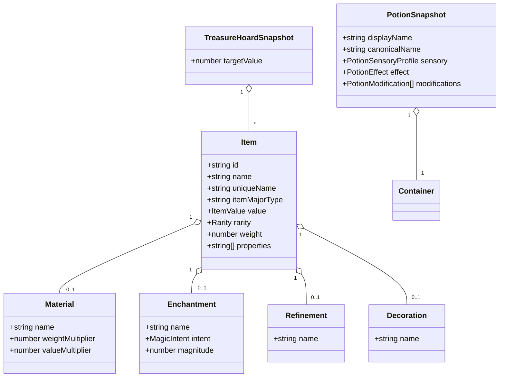
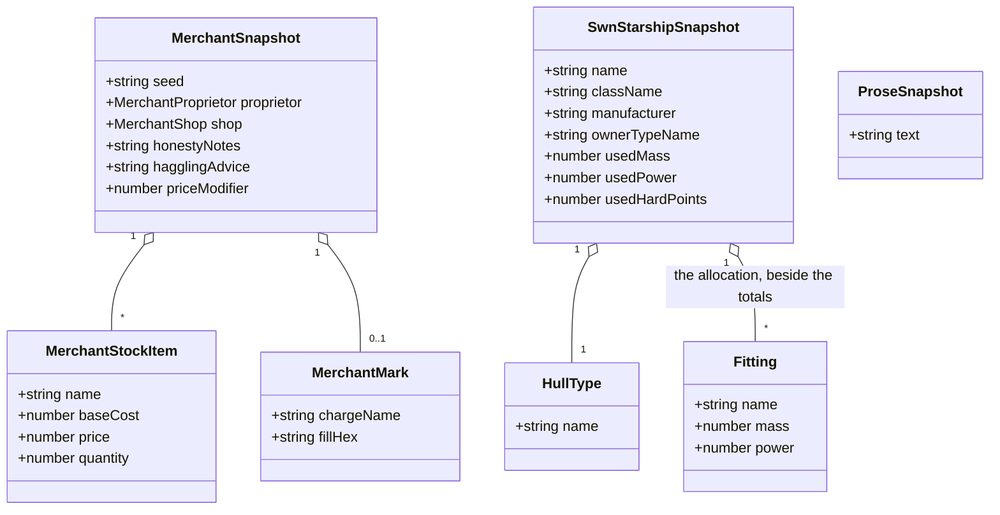

# Readiness: the objects domain

Nine tools: the cyberpunk drug generator
([#64](https://github.com/ironarachne/ironarachne/issues/64)), the fantasy equipment price lists
([#65](https://github.com/ironarachne/ironarachne/issues/65)), the fantasy equipment generator
([#66](https://github.com/ironarachne/ironarachne/issues/66)), the fantasy merchant generator
([#67](https://github.com/ironarachne/ironarachne/issues/67)), the fantasy potion generator
([#68](https://github.com/ironarachne/ironarachne/issues/68)), the fantasy weapon generator
([#69](https://github.com/ironarachne/ironarachne/issues/69)), the fantasy treasure hoard
generator ([#70](https://github.com/ironarachne/ironarachne/issues/70)), the spooky starship
generator ([#71](https://github.com/ironarachne/ironarachne/issues/71)) and the Stars Without
Number starship generator ([#72](https://github.com/ironarachne/ironarachne/issues/72)).

Part of [the readiness pass](tool-readiness.md). Measured against
[Tool release readiness](workshop.md#tool-release-readiness).

**Status:** accepted; not yet built. Reviewed and approved with [the pass](tool-readiness.md#domain-model), so the work in this document is clear to start.

The largest domain in the pass by count and the smallest by difficulty. Seven of the nine are flat
payloads that the declared field editor serves; one is a reference tool with no kind at all; and
the interesting question here is not any single tool but how many kinds these nine should produce.
The answer is seven.

## #66 and #69 — one kind, `item`

Both produce an `Item` from `$lib/equipment`. The weapon generator is the equipment generator with
the major type fixed to a weapon and `domains` from `$lib/religion` steering the enchantment;
`WeaponGenerator.svelte` imports `$lib/equipment` and nothing else that makes an object.

Two kinds for one payload shape would split a user's gear across two vault entries, each openable
by only one of the two tools that made it. That is the argument the AD&D builder and generator
settled — [one kind, two tools](adnd-character.md#one-kind-named-characteradnd-2e) — and it holds
here for the same reason.

- **Kind `item`**, payload `Item` as it stands. `Item` is plain: strings, numbers, a value, a
  rarity, and optional `material`, `refinement`, `enchantment`, `decoration` and `combatProfile`,
  all of them plain records.
- **The composition is stored, not just the prose.** #66 asks for this explicitly and it is right:
  an item's enchantment and refinement are composed at generation time, and storing only the
  rendered description would leave an editor able to rewrite prose and nothing else. The payload
  keeps `material`, `refinement`, `enchantment` and `decoration` as the records they are.
- **3.5 carries unusual weight.** Users accumulate many small artifacts of this kind, and an
  unnamed item in a list of forty is unusable. The kind's `nameOf` returns `uniqueName ?? name`, and
  the save dialog prefills it.
- **Provenance tells the two tools apart.** `toolPath` is `/fantasy/equipment-generator` or
  `/fantasy/weapon`, which is what the roller reads to know which config shape it is holding.

**As built (#66).** The kind and the payload landed as designed, and the composition is stored as
the records the document asks for. Four things this section did not anticipate:

- **A press is a list; an artifact is one item.** The generator rolls ten at once, and the kind is
  `item` — so each card carries its own save button, and the seed it records is
  `itemSeed(pageSeed, index)` rather than the page's. Deriving it keeps the whole list a pure
  function of the one seed the user sees while still letting the third sword re-roll to the third
  sword. Nothing else in the pass has this shape.
- **The card showed less than it had rolled.** The material, refinement, enchantment and decoration
  were folded into one sentence and never named: a user could read that a blade was _"finely
  balanced"_ and not that the refinement was called "balanced". The card and both exports render
  the presentation document now, which names all four — which is the visible half of what storing
  the records buys, the editable half being the other.
- **`weaponType` and `armorType` are not stored**, though `Weapon` and `Armor` carry them.
  Everything the page shows from either is already a field of its own: `itemMinorType` is the
  type's name, the armour's defence is in the combat profile, and the weapon's attacks are in
  `actions`, which the snapshot does keep. Keeping the row whole would copy a table into every
  sword.
- **The description cannot be recomputed from a stored item.** `generateItem` writes the composed
  paragraph back over the base type's own description, the field the composer builds _from_, so
  re-running it on a saved item would nest the paragraph inside itself. `itemBaseDescription`
  resolves the base sentence from the type table instead — which is the one place the store-by-name
  treatment does apply here.

**Two bugs found on the way**, both invisible until the tool was taken seriously:

- **The page reseeded its own RNG from the seed field**, inside an `$effect`, so the next press's
  seed depended on the text of the previous one. Requirement 2.2's usual failure in a form the pass
  had not seen before: the generator was pure and the page was not.
- **A `$state` list of payloads cannot be saved.** Svelte's deep proxy wraps every array in the
  payload, and IndexedDB's structured clone refuses one — `[object Array] could not be cloned`. The
  list is `$state.raw`, which is what a payload the page only ever replaces wholesale wants anyway.

**#69's genre question answers itself.** The issue asks whether the tool should carry a sci-fi tag
because `src/lib/weapons` has a `scifi.ts`. `WeaponGenerator.svelte` does not import
`$lib/weapons` at all — the only importer anywhere is `$lib/arms_manufacturer`, which is #53 and is
already tagged `scifi`. Nothing science-fictional is reachable from `/fantasy/weapon`; the tag is
right; the sci-fi weapon code is not dead, it belongs to another tool. See
[the pass's corrections](tool-readiness.md#corrections-to-the-issues).

## #68 — Fantasy potion

A well-factored library already: catalog, descriptor, naming, sensory detail, value and a generator
config, each with tests.

- **Kind `potion`**, not folded into `item`. A `Potion` is `{ container, liquid, displayName,
canonicalName?, sensory, effect, modifications }` — a richer shape with its own catalog identity,
  and an editor for it reaches effects and sensory detail that an item editor has no field for.
  Sharing `item`'s kind would mean one editor that is wrong for half its payloads.
- **The editor is a `SnapshotFieldEditor` case** with a list control for modifications.
- **1.4 is already satisfied.** The issue says the label reads "Fantasy Potion Generator"; the
  catalog reads `Fantasy Potion`. Nothing is owed.

**As built (#68).** Decision 2 held: the kind is `potion`, not a share of `item`, and the editor's
sensory and effect fields are what that decision buys — an item editor has no place for a duration
or a flavour. **1.4 needed nothing**, as this section said: the catalog has always read
`Fantasy Potion`, whatever the issue claimed.

Three things this section did not anticipate:

- **The payload stored the same thing twice.** `generatePotion` writes the effect, the sensory
  profile and the display name into the liquid _and_ onto the potion beside it —
  `liquid.effect === effect`, `liquid.sensory === sensory`, `liquid.name === displayName`. Two
  copies of one fact is a shape where an editor changes one and the other goes stale, which is 4.2's
  failure mode dressed as a data model. The snapshot keeps the potion's copy and rebuilds the
  liquid's on read, so there is one place to edit an effect and one answer to what it is.
- **The page decided the potion's form by sniffing its properties**, three levels of nested ternary
  deep, where nothing could test it. `potionForm` owns that now — the same shape of finding the
  reference tools kept producing, in a generator.
- **The sensory profile was a `<ul>` wrapped around a `<dl>`.** A list whose only child is a
  definition list is invalid markup and announces a one-item list around four pairs. It is a
  `StatBlock` alone now (6.2).

**The seed came from the clock inside every press**, which is requirement 2.2's oldest failure in
the pass rather than the newer `$effect` form #66 and #67 had — this page built a whole
`new RNG(Date.now().toString())` per press to draw the next seed. The `$state.raw` trap was here
too, making it three tools in a row.

## #70 — Fantasy treasure hoard

`generateRandomTreasureHoard(seed, config)` returns `Item[]` — coins packed into piles, gems, art
objects, mundane and magic items, and potions flattened into items.

- **Kind `treasure-hoard`**, payload `{ items: Item[], targetValue: number }`. It is a list rather
  than a bag of references: a hoard is one thing a GM reads out, and forty artifacts for one hoard
  would be a vault nobody can browse.
- **Composition, if it happens, is by reference.** A hoard built to contain a _saved_ potion or a
  saved item records the reference beside the payload. 5.4 then belongs to the reference walker, as
  the issue notes.
- **6.4 has teeth**: a hoard with no art objects must not print the heading. The presentation
  document drops empty sections by construction.
- **The generator is already seeded properly** — it takes a `seed` string and builds its own RNG.
  The clock is in the component, and the roll module is where it stops.

## #67 — Fantasy merchant

`Merchant` is `{ seed, proprietor, shop, mark, honesty, priceLevel, priceModifier, honestyNotes,
hagglingAdvice, stock }` (`src/lib/merchants/merchant_types.ts`) — and it already carries its own
seed, which is a good sign and a small trap: the payload's `seed` and the artifact's provenance
seed must be the same value, and the snapshot keeps the field rather than growing a second one.

- **Kind `merchant`.** `MerchantMark` is `{ chargeName, fillHex }` — a mark stored by the _name_ of
  its charge, which is exactly the treatment
  [decision 5 of the factions document](readiness-factions.md#5-generated-imagery-is-stored-as-parameters)
  asks for, already done.
- **Stock is stored as items, not regenerated.** #67 worries about duplicated item records making a
  merchant the largest object in the vault. `MerchantStockItem` is `{ name, baseCost, price,
quantity, note? }` — five fields, not a full `Item` — so a fifty-line inventory is a few
  kilobytes. Storing it is right: a GM who crosses two items off the list has edited the shop.
- **Composition:** a `culture` reference for naming (the config already carries a
  `CharacterNameSource`), and a `settlement` reference for where the shop stands.
- **6.3 matters here.** A shop inventory is a thing a GM wants on paper; the presentation document
  is the proprietor, the shop, the haggling advice and the stock table.

**As built (#67).** The kind and the payload landed as designed, and the size worry the issue
raises turned out to be as small as this section predicted: a `MerchantStockItem` is five fields,
so a twelve-line inventory is under a kilobyte. Four things worth recording:

- **The payload's `seed` and the provenance seed are the same value**, which is what this section
  warned about. `merchantSeedMatchesProvenance` asserts it out loud and the roll module keeps it
  true; a second seed would have been a shape where two answers to "what rolled this" can disagree.
- **Re-rolling a merchant named from a culture would have crashed.** The provenance records the
  culture's _pattern set name_, which is the treatment `character_roll.ts` settled — but
  `getFantasyNameGeneratorSet` **throws** for a name it does not have, and a culture's set name is a
  generated name, nothing like the twelve fantasy presets. `nameSourceForSet` falls back to the
  default patterns instead, which is the discipline 3.3 asks of every other read path.
- **5.1 binds twice, and the second half needed a generation change.** A culture for naming was
  already reachable through `nameSource`. Where the shop _stands_ was not: `generateVenueDescription`
  invents a location blurb — "on the market square", "beside the temple district" — and had never
  known which town that square was in. `MerchantShop` gains an optional `settlementName`, the
  location line reads "…​ In Ashford.", and the two answer different halves of the question rather
  than one replacing the other. It is the first tool in the pass to compose two kinds.
- **The town's name is the settlement's, not the vault entry's.** A settlement a user labelled
  "starting town" is still called whatever the generator called it, so the reference reads the
  payload's `name` rather than the artifact's.

**The same two page-level faults #66 found were here too**, which is now three tools in a row: the
page reseeded its own RNG from the seed field inside an `$effect`, and the payload had to move to
`$state.raw` before IndexedDB would take it.

## #64 — Cyberpunk drug

`Drug` is `{ name, description, drugType, method, effectType, effectDescription, strength, color,
duration, sideEffect, commonality }` — ten strings and two small records.

- **Kind `drug`.** `DrugType` is `{ name, methods }` and travels whole. `EffectType` carries a
  `generate` closure in the effect tables (`src/lib/drug/drugs.ts`), so the payload stores the
  effect's **name and its generated description**, never the type object.
- **The editor is the simplest `SnapshotFieldEditor` case in the pass** — ten text fields.
- **2.2**: two `Date.now()` calls, and a seed control that exists. The roll module is the only
  change.

The issue calls this a good tool to run the whole spec against early, to find the awkward corners
of the process rather than of the tool. [Wave 1](tool-readiness.md#the-order-of-the-work) agrees,
and pairs it with the arms manufacturer for exactly that purpose.

**As built.** The kind and the payload landed as designed. Three corrections, and the first is to
this document.

- **`EffectType` carries no closure.** This section says it does — "`EffectType` carries a
  `generate` closure in the effect tables (`src/lib/drug/drugs.ts`)" — and that is the reason it
  gives for storing the effect by name. The type is `{ name, effects: string[] }`, entirely plain.
  The only closures in the library are the three `generate` functions inside `randomName`'s local
  `nameType` list, which never leave that function. So nothing in a `Drug` was ever at risk of
  reaching storage as a function, and `stripFunctionValuesDeep` is not needed here.
- **`DrugType` is stored by name too**, where this section says it "travels whole". The reason the
  document gives for naming the effect turns out not to apply to either, but a better reason
  applies to both: each is a row of a table, of which the payload uses the name and one drawn
  entry — the method, or the effect sentence — and both of those are already fields of their own.
  Storing a row whole copies every _other_ method into the payload, to go stale the day the table
  changes. That is the treatment the pass gives species, archetypes and realm types.
- **The page showed one paragraph.** `drug.description` was the whole of the output, with the ten
  fields behind it invisible — which would also have left the editor with fields answering to
  nothing on screen. The page renders the presentation document now, as the other tools in the pass
  do.

**The description is offered rather than recomputed**, which is the one genuinely interesting
corner in a tool the issue rightly calls easy. `describe()` builds the paragraph from the other ten
fields, so an editor that re-ran it on every field change would be the most natural thing to write
and would throw away a hand-written description on the next keystroke — requirement 4.2 exactly. It
is a button instead, the shape the DCC sheet uses for its derived saves.

**On the editor.** This section calls it "the simplest `SnapshotFieldEditor` case in the pass", and
once the two table rows reduce to names the payload really is eleven strings — the first and only
payload in the pass that would have fitted the descriptor language, including its `select` control
for the two named rows. It arrives one merge after
[decision 5a](tool-readiness.md#5a-the-re-derive-none-of-the-twelve-was-a-customer) retired that
component for want of customers, and the retirement still holds: one customer does not pay for a
declarative layer, and this editor is shorter than the descriptor list that would have configured
it. The re-derive's own reasoning about _this_ tool was wrong, though, and is corrected there.

## #71 — Spooky starship

Like the chop shop, `src/lib/spooky_ship/index.ts` is a single file whose `generate(rng)` returns
**a string** — an intro, an origin and a twist, assembled from phrase tables.

- **Kind `spooky-ship`**, payload `{ text: string }`, per
  [decision 4 of the pass](tool-readiness.md#4-prose-generators-get-a-kind-and-it-holds-the-prose).
- **The editor is a textarea**, which is 4.1 satisfied completely.
- **8.3 needs the library split** into types and generation, as the chop shop does.
- **The only horror tool on the site**, and the only tool carrying two genres. A horror project sees
  this tool and the four genre-neutral ones and nothing else — a fact about the catalog, worth
  knowing when the project-genre work lands.

## #72 — Stars Without Number starship

`SWNStarship` is `{ name, className, manufacturer, hullType, currentCrew, totalCost, tonsOfCargo,
usedMass, usedPower, usedHardPoints, ownerType, weapons, defenses, fittings, drive }`.

- **Kind `starship.swn`**, system-qualified: a hull's mass, power and hardpoint budget means
  something only under that ruleset.
- **`OwnerType` carries closures** — `getRandomClassName` and `getRandomShipName`
  (`src/lib/swn/starship.ts:565`, `starship_owner_type_data.ts:414`) — so the snapshot stores
  `ownerTypeName` and resolves it on read, in the shape AD&D stores a class.
- **Store the allocation, not only the totals.** #72 is right and it is the same finding as SWN's
  character foci: `usedMass`, `usedPower` and `usedHardPoints` are derived from the fittings, and
  the fittings are the user's decisions. The payload keeps both — the totals because 4.2 makes the
  payload authoritative, the fittings because an editor cannot offer a decision it cannot read back.
- **The editor is bespoke**: fittings are a repeating structure with a budget, and the budget lines
  recompute as an explicit command rather than silently.
- **8.4**: the README says which SWN edition the hulls and fittings come from, and what is
  deliberately omitted.

## #65 — Fantasy equipment price lists

A **reference** tool. Sections 3, 4 and 5 do not apply, and neither do 2.2–2.4. What remains is
sections 1, 2.1, 2.5, 6, 7.1 and 8 — and 6.1 is the whole job.

`EquipmentPriceLists.svelte` renders price tables from `$lib/equipment` and `$lib/currency`. Wide
tables at 320px are the classic horizontal-overflow failure, and `e2e/pages.mobile.spec.ts` fails
on exactly that. The fix is the repository's own rule: **a table scrolls inside its own
`overflow-x: auto` container; the page never scrolls sideways.** The site's table conventions were
settled in [the visual design document](visual-design.md) and #154 already made tables rows rather
than a grid of cells — this tool adopts that, it does not invent anything.

6.2 is the other half: column headers associated with their columns, and every control keyboard
reachable.

**As assessed.** 6.1 was already met, and by the repository's own mechanism: the page has used
`DataTable` since #154, so each table flips to a stack of labelled rows below 640px and
`e2e/tables.spec.ts` has been holding the page to it at 320px and 375px all along. This section
expected the work to be there and it was not. What the section-by-section pass found instead was
6.4, in three places that had nothing to do with layout and everything to do with what the page
says:

- **An item costing nothing printed an empty cell.** `valueToString(0)` is the empty string, and
  the club, the quarterstaff and the sling stone are free. They read `Free` now.
- **The key described coins no price was ever quoted in**, and omitted one that was. It listed
  electrum, platinum and a crown — the first two are filtered out of the D&D display system, and
  no currency system in `$lib/currency` has ever had a crown — while English prices came back in
  guineas, because the guinea outranks the pound at 252 pence to 240 and `valueToString` spends
  every denomination it is given. The farthing printed its name, `$lib/currency` giving it no
  symbol, in a column of `cp` and `sp`.
- **The fix is that the key is derived from the currency the prices are written in**, so the two
  cannot drift again. Both currencies are display systems local to `$lib/equipment` rather than
  `$lib/currency`'s own: a denomination that must never appear in a price has to be absent, not
  merely unlikely.

**7.1 needed the logic to exist somewhere testable first.** The currency conversion, the D&D
system's filtered denominations and the copper-is-a-farthing rate lived in the component, where no
unit test could reach them — which is why all three of the above shipped. `price_lists.ts` holds
them now, along with the search and the exports, and `price_lists.test.ts` covers them.

**6.3 applies to a reference tool and was not skipped.** A five-hundred-row price list is exactly
the thing a referee wants on paper, so the page exports Markdown and a PDF, written from the same
document it renders. They export what is on screen, filtered rows included.

**One addition beyond the spec**, recorded because it is a judgment rather than a requirement: a
search box. Five hundred rows in twenty-three tables is legible on a phone in the sense 6.1 means
and unusable in the sense a reader means, and the fix is one text input over
`filterEquipmentLists`. A category with nothing left in it is dropped rather than shown empty.

**The page and the catalog now agree on the tool's name.** The heading read "Fantasy Equipment
Lists" while the catalog entry — and therefore the panel title, the tool browser and `/tools` —
read "Fantasy Equipment Price Lists". 1.4 is about a label reading correctly out of context, and a
link that lands on a differently-named page is the same failure from the other end.

## Domain model

### Items, potions and hoards

### Merchants, ships and prose

`ProseSnapshot` is the shape both `chop-shop` and `spooky-ship` register — one field, and the
editor is a textarea.

## Decisions taken here

### 1. The equipment generator and the weapon generator share the kind `item`

One payload shape, one kind, and the provenance's tool path says which tool rolled it. Two kinds
would split a user's gear across two vault entries and give each tool half the user's items.

### 2. A potion is not an item

It has its own catalog identity, its own effect and sensory structure, and an editor that reaches
fields an item editor has no place for. Folding it into `item` would produce one editor that is
wrong for half of what it opens.

### 3. A hoard is one artifact, not forty

A hoard is read out at a table as a unit. Forty artifacts per hoard is a vault nobody can browse,
and the items in it are not things a user names individually.

### 4. Merchant stock is stored, not regenerated

`MerchantStockItem` is five fields, so an inventory is kilobytes rather than the megabyte the issue
feared — the worry was about full `Item` records, which is not what stock holds. And a GM who
crosses two items off has edited the shop, which 4.2 says the payload must remember.

### 5. The SWN starship stores its allocation beside its totals

The same finding as SWN's character foci and AD&D's thief skills: derived numbers stay because the
payload is authoritative, and the decisions that produced them are recorded because an editor
cannot offer what it cannot read back.

### 6. The two prose generators get one shape and two kinds

`{ text: string }` for both, registered separately so a vault listing keeps a chop shop apart from
a haunted freighter. They are the pass's cheapest complete tools and go first for that reason.

## Still open

- ~~**Whether `item` should carry the generator's config in provenance in enough detail to re-roll a
  _similar_ item rather than the same one.**~~ **Settled by building it (#66).** Re-roll does mean
  "the same seed and config again", and for an item that is the identical item — which turns out
  not to be useless at all, because that is exactly what requirement 4.3 describes: the destructive
  command that throws away a user's edits and puts the rolled item back. "Roll me another like
  this" is a different feature and is still not smuggled in; what the provenance carries is the
  page's four controls, and the display system is not among them because it changes how the same
  item reads rather than what was rolled.
- **Whether the price lists should offer a downloadable table (6.3).** It is a SHOULD for a
  reference tool and the tables are already data; a CSV or Markdown download is a small addition
  that #65 may take or leave.
