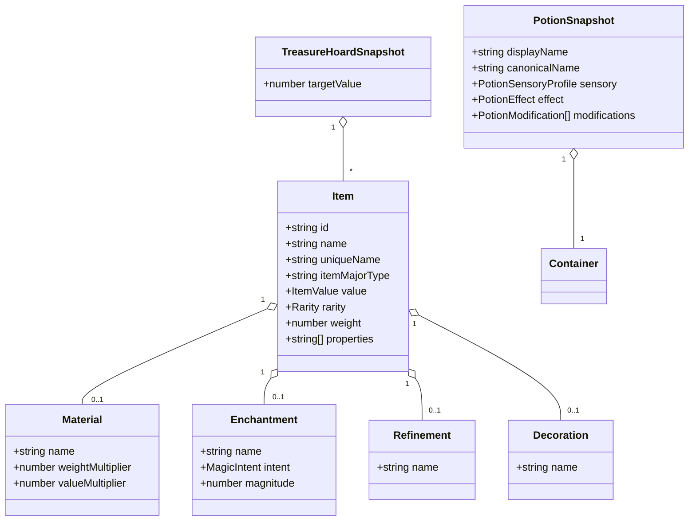
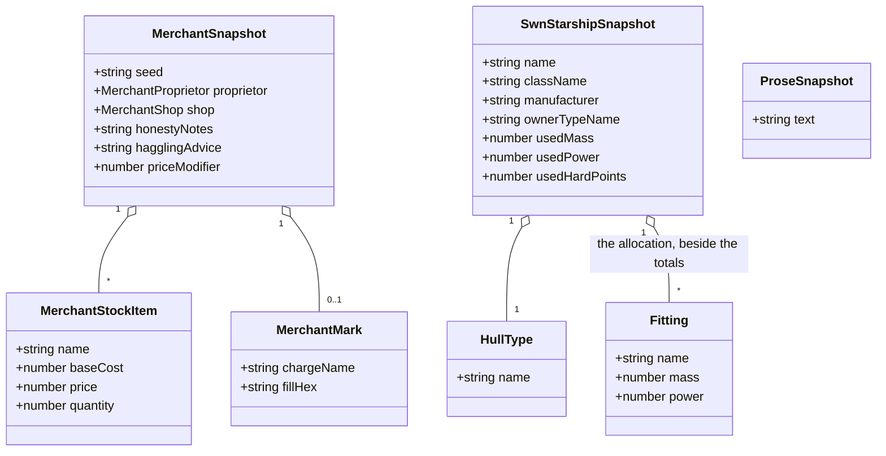

# Readiness: the objects domain

Nine tools: the cyberpunk drug generator
([#64](https://github.com/ironarachne/ironarachne/issues/64)), the fantasy equipment price lists
([#65](https://github.com/ironarachne/ironarachne/issues/65)), the fantasy equipment generator
([#66](https://github.com/ironarachne/ironarachne/issues/66)), the fantasy merchant generator
([#67](https://github.com/ironarachne/ironarachne/issues/67)), the fantasy potion generator
([#68](https://github.com/ironarachne/ironarachne/issues/68)), the fantasy weapon generator
([#69](https://github.com/ironarachne/ironarachne/issues/69)), the fantasy treasure hoard
generator ([#70](https://github.com/ironarachne/ironarachne/issues/70)), the spooky starship
generator ([#71](https://github.com/ironarachne/ironarachne/issues/71)) and the Stars Without
Number starship generator ([#72](https://github.com/ironarachne/ironarachne/issues/72)).

Part of [the readiness pass](tool-readiness.md). Measured against
[Tool release readiness](workshop.md#tool-release-readiness).

**Status:** accepted; not yet built. Reviewed and approved with [the pass](tool-readiness.md#domain-model), so the work in this document is clear to start.

The largest domain in the pass by count and the smallest by difficulty. Seven of the nine are flat
payloads that the declared field editor serves; one is a reference tool with no kind at all; and
the interesting question here is not any single tool but how many kinds these nine should produce.
The answer is seven.

## #66 and #69 — one kind, `item`

Both produce an `Item` from `$lib/equipment`. The weapon generator is the equipment generator with
the major type fixed to a weapon and `domains` from `$lib/religion` steering the enchantment;
`WeaponGenerator.svelte` imports `$lib/equipment` and nothing else that makes an object.

Two kinds for one payload shape would split a user's gear across two vault entries, each openable
by only one of the two tools that made it. That is the argument the AD&D builder and generator
settled — [one kind, two tools](adnd-character.md#one-kind-named-characteradnd-2e) — and it holds
here for the same reason.

- **Kind `item`**, payload `Item` as it stands. `Item` is plain: strings, numbers, a value, a
  rarity, and optional `material`, `refinement`, `enchantment`, `decoration` and `combatProfile`,
  all of them plain records.
- **The composition is stored, not just the prose.** #66 asks for this explicitly and it is right:
  an item's enchantment and refinement are composed at generation time, and storing only the
  rendered description would leave an editor able to rewrite prose and nothing else. The payload
  keeps `material`, `refinement`, `enchantment` and `decoration` as the records they are.
- **3.5 carries unusual weight.** Users accumulate many small artifacts of this kind, and an
  unnamed item in a list of forty is unusable. The kind's `nameOf` returns `uniqueName ?? name`, and
  the save dialog prefills it.
- **Provenance tells the two tools apart.** `toolPath` is `/fantasy/equipment-generator` or
  `/fantasy/weapon`, which is what the roller reads to know which config shape it is holding.

**#69's genre question answers itself.** The issue asks whether the tool should carry a sci-fi tag
because `src/lib/weapons` has a `scifi.ts`. `WeaponGenerator.svelte` does not import
`$lib/weapons` at all — the only importer anywhere is `$lib/arms_manufacturer`, which is #53 and is
already tagged `scifi`. Nothing science-fictional is reachable from `/fantasy/weapon`; the tag is
right; the sci-fi weapon code is not dead, it belongs to another tool. See
[the pass's corrections](tool-readiness.md#corrections-to-the-issues).

## #68 — Fantasy potion

A well-factored library already: catalog, descriptor, naming, sensory detail, value and a generator
config, each with tests.

- **Kind `potion`**, not folded into `item`. A `Potion` is `{ container, liquid, displayName,
canonicalName?, sensory, effect, modifications }` — a richer shape with its own catalog identity,
  and an editor for it reaches effects and sensory detail that an item editor has no field for.
  Sharing `item`'s kind would mean one editor that is wrong for half its payloads.
- **The editor is a `SnapshotFieldEditor` case** with a list control for modifications.
- **1.4 is already satisfied.** The issue says the label reads "Fantasy Potion Generator"; the
  catalog reads `Fantasy Potion`. Nothing is owed.

## #70 — Fantasy treasure hoard

`generateRandomTreasureHoard(seed, config)` returns `Item[]` — coins packed into piles, gems, art
objects, mundane and magic items, and potions flattened into items.

- **Kind `treasure-hoard`**, payload `{ items: Item[], targetValue: number }`. It is a list rather
  than a bag of references: a hoard is one thing a GM reads out, and forty artifacts for one hoard
  would be a vault nobody can browse.
- **Composition, if it happens, is by reference.** A hoard built to contain a _saved_ potion or a
  saved item records the reference beside the payload. 5.4 then belongs to the reference walker, as
  the issue notes.
- **6.4 has teeth**: a hoard with no art objects must not print the heading. The presentation
  document drops empty sections by construction.
- **The generator is already seeded properly** — it takes a `seed` string and builds its own RNG.
  The clock is in the component, and the roll module is where it stops.

## #67 — Fantasy merchant

`Merchant` is `{ seed, proprietor, shop, mark, honesty, priceLevel, priceModifier, honestyNotes,
hagglingAdvice, stock }` (`src/lib/merchants/merchant_types.ts`) — and it already carries its own
seed, which is a good sign and a small trap: the payload's `seed` and the artifact's provenance
seed must be the same value, and the snapshot keeps the field rather than growing a second one.

- **Kind `merchant`.** `MerchantMark` is `{ chargeName, fillHex }` — a mark stored by the _name_ of
  its charge, which is exactly the treatment
  [decision 5 of the factions document](readiness-factions.md#5-generated-imagery-is-stored-as-parameters)
  asks for, already done.
- **Stock is stored as items, not regenerated.** #67 worries about duplicated item records making a
  merchant the largest object in the vault. `MerchantStockItem` is `{ name, baseCost, price,
quantity, note? }` — five fields, not a full `Item` — so a fifty-line inventory is a few
  kilobytes. Storing it is right: a GM who crosses two items off the list has edited the shop.
- **Composition:** a `culture` reference for naming (the config already carries a
  `CharacterNameSource`), and a `settlement` reference for where the shop stands.
- **6.3 matters here.** A shop inventory is a thing a GM wants on paper; the presentation document
  is the proprietor, the shop, the haggling advice and the stock table.

## #64 — Cyberpunk drug

`Drug` is `{ name, description, drugType, method, effectType, effectDescription, strength, color,
duration, sideEffect, commonality }` — ten strings and two small records.

- **Kind `drug`.** `DrugType` is `{ name, methods }` and travels whole. `EffectType` carries a
  `generate` closure in the effect tables (`src/lib/drug/drugs.ts`), so the payload stores the
  effect's **name and its generated description**, never the type object.
- **The editor is the simplest `SnapshotFieldEditor` case in the pass** — ten text fields.
- **2.2**: two `Date.now()` calls, and a seed control that exists. The roll module is the only
  change.

The issue calls this a good tool to run the whole spec against early, to find the awkward corners
of the process rather than of the tool. [Wave 1](tool-readiness.md#the-order-of-the-work) agrees,
and pairs it with the arms manufacturer for exactly that purpose.

## #71 — Spooky starship

Like the chop shop, `src/lib/spooky_ship/index.ts` is a single file whose `generate(rng)` returns
**a string** — an intro, an origin and a twist, assembled from phrase tables.

- **Kind `spooky-ship`**, payload `{ text: string }`, per
  [decision 4 of the pass](tool-readiness.md#4-prose-generators-get-a-kind-and-it-holds-the-prose).
- **The editor is a textarea**, which is 4.1 satisfied completely.
- **8.3 needs the library split** into types and generation, as the chop shop does.
- **The only horror tool on the site**, and the only tool carrying two genres. A horror project sees
  this tool and the four genre-neutral ones and nothing else — a fact about the catalog, worth
  knowing when the project-genre work lands.

## #72 — Stars Without Number starship

`SWNStarship` is `{ name, className, manufacturer, hullType, currentCrew, totalCost, tonsOfCargo,
usedMass, usedPower, usedHardPoints, ownerType, weapons, defenses, fittings, drive }`.

- **Kind `starship.swn`**, system-qualified: a hull's mass, power and hardpoint budget means
  something only under that ruleset.
- **`OwnerType` carries closures** — `getRandomClassName` and `getRandomShipName`
  (`src/lib/swn/starship.ts:565`, `starship_owner_type_data.ts:414`) — so the snapshot stores
  `ownerTypeName` and resolves it on read, in the shape AD&D stores a class.
- **Store the allocation, not only the totals.** #72 is right and it is the same finding as SWN's
  character foci: `usedMass`, `usedPower` and `usedHardPoints` are derived from the fittings, and
  the fittings are the user's decisions. The payload keeps both — the totals because 4.2 makes the
  payload authoritative, the fittings because an editor cannot offer a decision it cannot read back.
- **The editor is bespoke**: fittings are a repeating structure with a budget, and the budget lines
  recompute as an explicit command rather than silently.
- **8.4**: the README says which SWN edition the hulls and fittings come from, and what is
  deliberately omitted.

## #65 — Fantasy equipment price lists

A **reference** tool. Sections 3, 4 and 5 do not apply, and neither do 2.2–2.4. What remains is
sections 1, 2.1, 2.5, 6, 7.1 and 8 — and 6.1 is the whole job.

`EquipmentPriceLists.svelte` renders price tables from `$lib/equipment` and `$lib/currency`. Wide
tables at 320px are the classic horizontal-overflow failure, and `e2e/pages.mobile.spec.ts` fails
on exactly that. The fix is the repository's own rule: **a table scrolls inside its own
`overflow-x: auto` container; the page never scrolls sideways.** The site's table conventions were
settled in [the visual design document](visual-design.md) and #154 already made tables rows rather
than a grid of cells — this tool adopts that, it does not invent anything.

6.2 is the other half: column headers associated with their columns, and every control keyboard
reachable.

## Domain model

### Items, potions and hoards

### Merchants, ships and prose

`ProseSnapshot` is the shape both `chop-shop` and `spooky-ship` register — one field, and the
editor is a textarea.

## Decisions taken here

### 1. The equipment generator and the weapon generator share the kind `item`

One payload shape, one kind, and the provenance's tool path says which tool rolled it. Two kinds
would split a user's gear across two vault entries and give each tool half the user's items.

### 2. A potion is not an item

It has its own catalog identity, its own effect and sensory structure, and an editor that reaches
fields an item editor has no place for. Folding it into `item` would produce one editor that is
wrong for half of what it opens.

### 3. A hoard is one artifact, not forty

A hoard is read out at a table as a unit. Forty artifacts per hoard is a vault nobody can browse,
and the items in it are not things a user names individually.

### 4. Merchant stock is stored, not regenerated

`MerchantStockItem` is five fields, so an inventory is kilobytes rather than the megabyte the issue
feared — the worry was about full `Item` records, which is not what stock holds. And a GM who
crosses two items off has edited the shop, which 4.2 says the payload must remember.

### 5. The SWN starship stores its allocation beside its totals

The same finding as SWN's character foci and AD&D's thief skills: derived numbers stay because the
payload is authoritative, and the decisions that produced them are recorded because an editor
cannot offer what it cannot read back.

### 6. The two prose generators get one shape and two kinds

`{ text: string }` for both, registered separately so a vault listing keeps a chop shop apart from
a haunted freighter. They are the pass's cheapest complete tools and go first for that reason.

## Still open

- **Whether `item` should carry the generator's config in provenance in enough detail to re-roll a
  _similar_ item rather than the same one.** Re-roll means "the same seed and config again", which
  for an item is the identical item — arguably useless. The alternative reading, "roll me another
  like this", is a different feature and this document does not smuggle it in.
- **Whether the price lists should offer a downloadable table (6.3).** It is a SHOULD for a
  reference tool and the tables are already data; a CSV or Markdown download is a small addition
  that #65 may take or leave.
