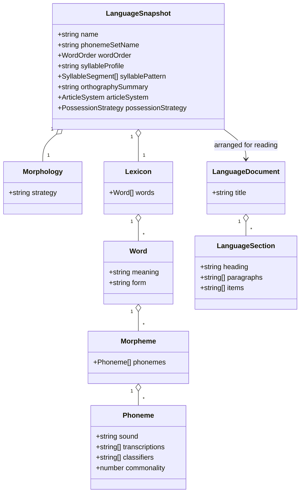
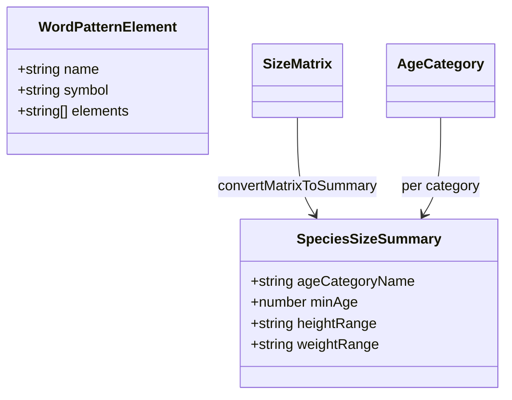

# Readiness: the utilities domain

Three tools: the language generator
([#74](https://github.com/ironarachne/ironarachne/issues/74)), the species height and weight
calculator ([#75](https://github.com/ironarachne/ironarachne/issues/75)) and the word generator
cheat sheet ([#76](https://github.com/ironarachne/ironarachne/issues/76)).

Part of [the readiness pass](tool-readiness.md). Measured against
[Tool release readiness](workshop.md#tool-release-readiness).

**Status:** proposal, with [the pass](tool-readiness.md#domain-model). Not reviewed.

Two of these are reference tools with no artifact kind at all, which makes them the smallest jobs
in the pass; they run in parallel with everything else rather than queueing behind it
([decision 9](tool-readiness.md#9-the-three-reference-tools-do-not-queue-behind-the-generators)).
The third is the largest single payload the site would store.

## #74 — Language

`src/lib/languages` is the largest library behind any single tool: phonology, morphology, a
lexicon, typology, and two-way translation between English and the constructed language, across
twenty-nine modules.

The payload, happily, is not proportional to that. `ConstructedLanguage` is
`{ name, phonemeSetName, wordOrder, syllableProfile, syllablePattern, morphology,
orthographySummary, lexicon, articleSystem, possessionStrategy }`
(`src/lib/languages/language_types.ts:59`) — **entirely plain data**. A `Lexicon` is
`{ words: Word[] }`, a `Word` is plain, a `Morpheme` is a list of `Phoneme`s, and a `Phoneme` is
four fields. There is no closure anywhere in it. The `Map`s and `Set`s the library uses live in the
translation machinery, not in the language.

- **Kind `language`**, payload the type as it stands. Genre-neutral, so every project sees it.
- **The lexicon is stored whole.** #74 asks whether to store it or regenerate it from the seed, and
  the answer is store: a user who renames one word has edited the language, and 4.2 says a seed may
  not overrule that. Regeneration is a re-roll, and a re-roll is the destructive command.
- **The measurement #74 asks for still happens**, and it belongs to that issue: a lexicon of a few
  thousand words at four fields per phoneme is worth measuring against what the vault reports
  before the kind ships, because it changes what the tool tells the user about quota — not what the
  payload is.
- **Determinism is worth proving explicitly here** (#74 says so and it is right). "Regenerate from
  the seed" is only ever a storage strategy if it actually holds, and the way to know is a test
  that generates the same language twice from one seed and compares the lexicon word for word. That
  test is worth having even though this design stores the lexicon rather than relying on
  regeneration — it is what makes the re-roll honest.
- **2.3 fails.** `LanguageGenerator.svelte` renders no `SeedControls` and calls `Date.now()`. It
  gets the seed control and a `language_roll.ts`, like every other generator in the pass.
- **The editor is bespoke.** A lexicon is a long list of paired words, and the useful editing view
  is a searchable table where one gloss can be rewritten without disturbing its neighbours (4.4).
  This is explicitly not a `SnapshotFieldEditor` case: the typology fields would fit, the lexicon
  never would.
- **6.3 is a real loss today.** A conlang is a document — the phonology, the typology, and the
  lexicon as a two-column glossary. Markdown and PDF, from one presentation document.

## #75 — Species height and weight calculator

A reference tool: sections 3, 4 and 5 do not apply, and neither do 2.2–2.4. The bar is sections 1,
2.1, 2.5, 6, 7.1 and 8.

**The issue's stated blocker does not apply to this tool, and that is worth settling before anyone
spends a week on it.** #75 says #25 — 182 of 239 species carry placeholder human sizes — is "the
blocker in spirit if not in process", on the reading that the calculator returns confident numbers
from placeholder data.

It does not read that data at all. `SpeciesStatsCalculator.svelte` takes four percentages — female
and male height and weight, as a proportion of a modern human — plus a maximum age, and derives
size and age tables from `Sizes.getHumanVariant` and `AgeCategories.getHumanVariant`. It never
touches the species list. Its own description says so: _"To use it, just enter the percentage of
human size you want to use... All numbers use modern human as a base."_

So the tool is a calculator for **authoring** a species, and #25 is a fact about species data the
calculator is used to _produce_. They are adjacent, not blocking. What #75 owes #25 is nothing;
what #25 owes the site is a separate piece of work.

What this tool actually owes:

- **1.2 — drop the `fantasy` genre tag.** Height and weight as a proportion of a human baseline is
  not fantasy-specific; a sci-fi setting inventing a heavy-worlder uses the identical arithmetic.
  A mis-tagged tool disappears from the projects that need it once projects carry a genre, and
  three of the four genre-neutral tools are already utilities.
- **1.4 — one name, not two.** The catalog says **Species Height and Weight Calculator**; the page
  renders `title="Species Stats Tool"`. A label that reads correctly out of context cannot be two
  different labels, and the catalog's is the better one.
- **6.1 and 6.2** — the numbers render as `Stat`/`StatBlock` pairs rather than a wide table, so the
  usual overflow risk is low; the `NumberField` controls need labels and keyboard operation
  confirmed rather than assumed.
- **#19 (expand the calculator for specific settings)** is the other open issue here, and it is a
  feature rather than a readiness gap. Read before scoping; not folded in.

## #76 — Word generator cheat sheet

The smallest job in the pass. A reference tool with no artifact kind, no seed, and no logic — and
it is the tool that forces the one spec question in this domain.

**Does a tool with no library satisfy 8.1 and 8.2?** `WordGeneratorCheatSheet.svelte` imports
nothing from `$lib`; its content is a table of pattern elements built as an HTML string inside the
component (`WordGeneratorCheatSheet.svelte:11`).

[Decision 8 of the pass](tool-readiness.md#8-a-reference-tool-with-no-logic-still-gets-a-library)
settles it: it gets a library. `src/lib/word_patterns` holds the element table as data — name,
symbol, elements — and the component renders it as real markup rather than an interpolated string.
Three reasons: the content is a table rather than prose, so it is data sitting in a component; the
word generators elsewhere on the site document the same vocabulary, so it has a second reader; and
a library gives 7.1 something to test where a component full of literals gives it nothing.

Building the table as an HTML string is also what makes 6.2 hard to verify — headers exist in that
string, but nothing checks them — and rendering from data fixes that as a side effect rather than
as separate work.

**6.1 is already handled and should not be re-done.** The component wraps the table in
`.element-table-scroll` with `data-scroll-x`, and its style carries the reasoning: unbreakable
terms set a minimum width, so the table scrolls on its own rather than the page scrolling sideways.
That is exactly the repository rule. This is a case where the issue's expectation — "6.1 and 6.2
are the real work" — is half met already.

## Domain model

The two reference tools have no payload and therefore no diagram. That is not an omission: a
reference tool produces no artifacts, and a model of nothing would be a decoration.

Both are existing types rather than new ones — the only new declaration in this domain outside the
language kind is `WordPatternElement`, and it is a move rather than an invention.

## Decisions taken here

### 1. The lexicon is stored, not regenerated from the seed

A user who renames one word has edited the language, and 4.2 forbids a seed overruling that.
Regeneration is what a re-roll does, deliberately and destructively. The size measurement #74 asks
for still happens and changes what the user is told about quota, not what the payload holds.

### 2. Determinism gets a test even though nothing depends on it for storage

"Regenerate from the seed" is a claim, and the only way to know it holds is to generate twice and
compare. It is what makes the re-roll trustworthy, and #74 was right to ask for it explicitly.

### 3. #25 does not block #75

The calculator never reads the species table; it computes from a human baseline and says so on the
page. The placeholder-sizes problem is about data this tool is used to author, not data it consumes.
Recording that here means the next reader does not re-inherit the assumption.

### 4. The calculator loses its `fantasy` tag and gains one name

The arithmetic is genre-neutral, and a mis-tagged tool vanishes from the projects that need it once
projects filter by genre. The page title and the catalog label become the same string — the
catalog's.

### 5. The cheat sheet gets a library, and renders from data rather than an HTML string

The pass's answer to the question #76 raises. The alternative — a spec sentence exempting
logic-free reference tools — would be used by the next reference page too, and the exemption would
become the pattern. Rendering from data also makes 6.2 checkable instead of assumed.

## Still open

- **How the language editor handles a lexicon of a few thousand words in a panel.** A searchable
  table is the design; whether it needs virtualisation is a question for the implementation, and
  the honest answer is that nobody has measured how long a generated lexicon actually is.
- **Whether `word_patterns` should be consumed by the word generators as well as documented by the
  cheat sheet.** It would make the sheet provably current rather than a hand-maintained copy. It is
  also scope beyond #76, so this document names it and leaves it.
