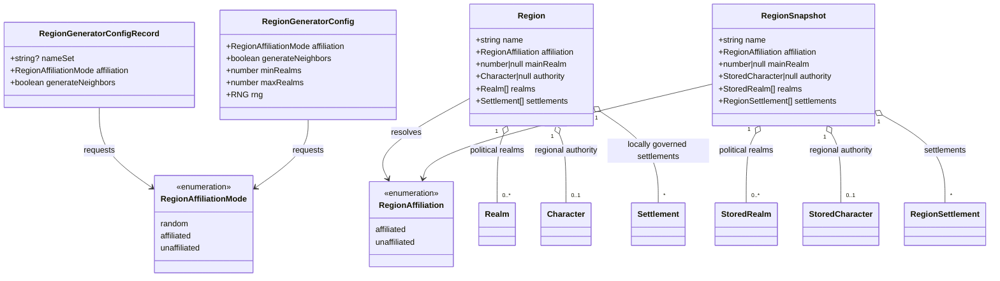

# Region affiliation and optional neighbors

**Status:** implemented for [#394](https://github.com/ironarachne/ironarachne/issues/394).
The behavior decisions below incorporate Ben's instructions on 2026-10-09. Ben approved the domain model and proposed defaults on 2026-10-09.

## Problem

The region generator always creates a main realm, uses that realm's name and ruler for the
region, and labels the first settlement as a capital. Neighboring realms are always generated.
A geographic region should also be able to exist without an overarching political affiliation,
while its settlements retain their own governments.

## Confirmed behavior

- Affiliation defaults to random, weighted toward unaffiliated, and is configurable in the UI.
- An unaffiliated region has no overarching realm or regional ruler. Settlement governments
  remain available. Unaffiliated regions have no capital cities.
- Neighbors are an optional extra and are not generated by default.
- Unaffiliated region names should reflect appropriate geography, as described in #394.

## Decisions

### Generation settings

Offer an Affiliation select with Random, Unaffiliated, and Affiliated. Offer a Generate
neighboring realms checkbox, unchecked by default. Use random weights of 3 unaffiliated
to 1 affiliated, as approved with this model.

Store the requested affiliation mode and neighbor toggle in generator provenance. Random
remains random on reroll, resolved deterministically from the seed. Store the resolved
affiliation separately in the result. Changing controls affects the next generation only.

The toggle controls additional neighboring realms and their required parents. An affiliated
main realm still receives its own required parent when neighbors are disabled; a parent is
not an optional neighbor. Retain the existing neighbor count range when enabled.

For this first version, optional neighbors remain political realms. An unaffiliated region's
neighbors generate their own required parents rather than inheriting a nonexistent main
realm's parent. Generating unaffiliated geographic neighbors would need a separate model.

### Result model

Add resolved `affiliation: 'affiliated' | 'unaffiliated'` to live and stored regions. Make
`mainRealm` and regional `authority` nullable. Keep `realms` as the list of political realms,
including any main realm, parent and optional neighbors; do not manufacture a placeholder
realm for an unaffiliated region.

An unaffiliated region has `mainRealm: null` and `authority: null`. It can have an empty
`realms` list or a list containing neighbors and their parents. Neighbor presence never
establishes ownership of the region. An affiliated generated region has a valid main-realm
index and its corresponding ruler. Historical affiliated saves with an empty realm list retain
their nonnegative integer seat index and saved ruler: the existing validator accepted that
state, and migration must preserve readable saved content. Validators reject inconsistent affiliation/nullability
and invalid realm indices rather than coercing them into another affiliation.

### Settlements and capitals

Retain the existing settlement size mix, including a large settlement, in either mode.
An unaffiliated region's large settlement is an ordinary locally governed settlement.
Do not append capital prose, generate the `regional-capital` role, display capital headings,
or draw capital pennants. Guard the map renderer's legacy first-settlement capital fallback
by affiliation as well as the presence of role facts.

Affiliated regions retain the current regional-capital behavior. Local settlement rulers,
organizations, roads, resources, ecology and livelihoods remain valid in unaffiliated regions.
`RegionFacts.claims` includes evidence-backed statements such as road connections; it is not
the same thing as political territorial claims and must not be cleared wholesale.

### Names and geographic evidence

Affiliated regions retain main-realm naming. Unaffiliated regions receive a saved geographic
name, using the landscape-name vocabulary and eligibility rules where suitable. Derive
eligible terrain nouns from realized land nodes and biome/landform classifications, with a
neutral evocative form ending in Country or Reaches when no specific terrain qualifies.
Do not claim an unsupported mountain, forest, coast or named water body.

For the initial implementation, omit names referring to a particular sea, including
"By the Blade Sea": the current region needs an established named sea to support that form.
Likewise, omit compass-relative names for the whole region until there is a defined external
reference frame. Existing directions for zones within the region do not establish that the
whole region is western in a larger world. These naming limits are approved scope decisions.

Always consume the seed-owned name-set selection draw, including when provenance already
contains a resolved name set. Otherwise saving that choice shifts the root generation seed
on reroll.

Names are generated once and persisted in the existing `name` field. Rendering and exports
reuse that name and do not draw new names. A supplied culture can contribute cultural naming
forms without implying political ownership.

### Randomness

Resolve affiliation using a named `affiliation` stage. Use separate named `region-name` and
`neighbors` stages for geographic naming and optional neighbors. Rebuild name generators from
pattern sources with the appropriate stage RNG rather than invoking culture-owned closures.

Neighbor generation must not perturb the main region's name, authority, settlements, terrain
or regional facts. Changing affiliation must not perturb physical geography, ecology or
resources. It can change political content and capital-specific roles and prose. All modes
remain reproducible from the same seed, settings and supplied culture.

### Persistence and existing results

Increment the region payload version from the current 10 to 11. Run existing migrations and
mark old saved results affiliated; preserve their name, ruler, realms, main-realm selection,
map and facts without regeneration. Audit legacy edge cases before tightening validation so
previously readable results are not silently lost or assigned an invented ruler.

Historical provenance without the new settings rerolls as affiliated with neighbors enabled,
preserving its previous generation intent. Fresh generation defaults to random and neighbors
disabled. Distinguish the legacy provenance reader from the fresh-settings defaults explicitly.
Unknown future payload versions retain existing unsupported-payload handling.

### Presentation and editing

The generator, workshop, vault editor, gazetteer, map previews, Markdown, text and PDF exports
must all handle the absent main realm and ruler. Display an explicit Unaffiliated status;
omit regional ruler and regional heraldry controls in that mode. Show optional political
neighbors separately, with their own rulers and heraldry.

Do not offer the existing Seat of the region select for unaffiliated results merely because
they have neighbors. Keep text and settlement editing available. For this version, changing
affiliation or neighbor generation is a whole-region reroll through configuration, rather
than a field edit that must reconcile rulers, roles and authored descriptions.

## Domain model

New affiliation types belong in `src/lib/regions/region_affiliation_types.ts`. Existing region,
snapshot and configuration definitions use them. `Realm` and `StoredRealm` retain their
required rulers; only the region-wide authority becomes nullable.

The diagrams show changed fields and relevant relationships, not every existing field.
`mainRealm` indexes the region's `realms` list only when affiliation is affiliated; it is
never an index into settlements. Stored configuration fields above describe normalized
new provenance; legacy input is handled by the compatibility reader.

## Acceptance criteria

- Fresh UI defaults to Random affiliation and no neighbors. Forced modes work; random uses
  the approved weights and can produce both affiliations across a fixed seed corpus.
- Unaffiliated results have no main realm, regional ruler, capital role, capital prose or
  capital pennant. Their settlement governments remain intact.
- Disabled neighbors generate no additional neighboring realms. Enabled neighbors work in
  either affiliation mode, with valid parent relationships.
- Neighbor toggling leaves all main-region content unchanged except the neighbor list and
  its presentation. Same seed/settings reproduce the result through save and reroll.
- Geographic names use eligible vocabulary and are reused consistently across views/exports.
- Both modes save, reopen, edit and export; an unaffiliated result with political neighbors
  never acquires a regional seat selector or ruler through presentation fallbacks.
- Versions 1–10 migrate without rerolling saved content; legacy provenance retains its
  affiliated/neighbor-enabled intent. Invalid new combinations and future versions fail safely.
- Run `npm run verify` for implementation and `npm run verify:all` before merging the UI change.

## Review record

Ben approved the domain model, 3:1 random weighting, political-only neighbor scope, initial
geographic naming limits, and reroll-only affiliation changes on 2026-10-09.

## Implementation and validation

Implemented after approval on 2026-10-09. Payload version 11 records affiliation, while legacy
provenance defaults explicitly retain affiliated generation with neighbors. The historical
empty-realm validation allowance is preserved without inventing content.

The determinism audit traced `rollRegion` through named generation stages, landscape naming,
realm generation and character generation. Realm defaults create a clock-seeded RNG, but this
path replaces both that RNG and its name generators before generation; tests vary the clock
and compare complete snapshots, including optional neighbors. The audit reproduced and fixed
resolved name-set provenance shifting the generation seed on reroll.

The unit, type, lint and coverage gates passed: 6,995 unit tests and all 100 libraries above the
coverage threshold. Region desktop lifecycle, export and seeded map-layout checks passed.
`npm run verify:all` passed: 664 browser tests, including all five mobile widths; five optional
golden-image tests were skipped.
