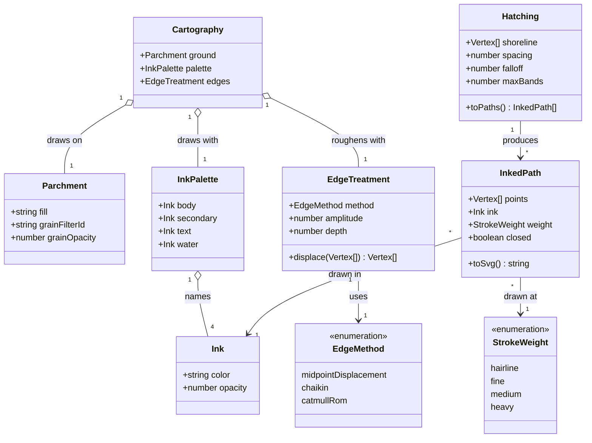
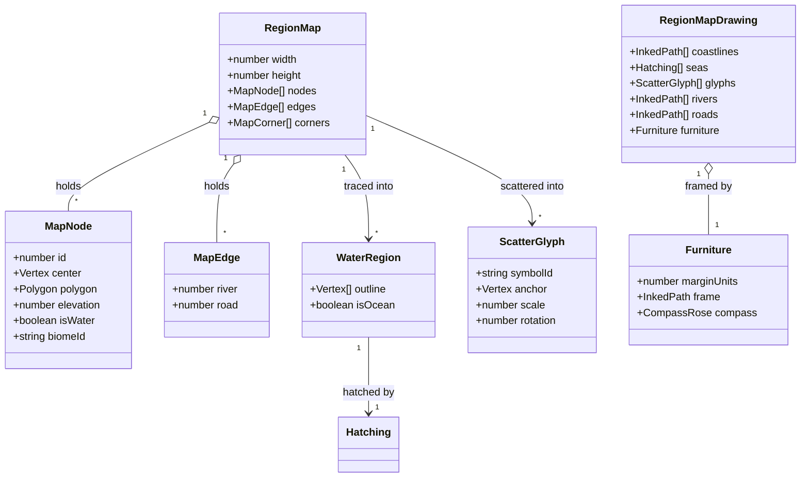

# Region Map Cartography

This design document describes what the region map is trying to look like, and the drawing
vocabulary it needs in order to look like that. It covers the style target, the decisions taken to
reach it, and — in [Domain model](#domain-model) — the types of the new `cartography` library those
decisions require.

**Status:** accepted; ink vocabulary (#230), water outlines (#231), sea hatching (#232), removal of terrain fills (#233), glyph scatter (#194), and label placement/cartouche (#234) implemented; remaining steps not yet built. The [domain model](#domain-model) was reviewed and approved, so
the work in [the plan](#the-plan) is clear to start — in the dependency order given there, which is
not advisory. The one [open question](#open-question) is deferred to a future update and does not
block any of it.

Tracked as [#229](https://github.com/ironarachne/ironarachne/issues/229), which holds the release
gate: **no version is promoted to staging or prod while that issue is open.**

## The problem

`/region` was assessed Release-ready under #62 against `docs/workshop.md`, section by section. That
assessment was sound on its own terms — it covered the seed path, the artifact kind, the editor,
composition, mobile widths and the exports. What it did not cover is whether the map the tool draws
is good enough to put in front of someone, and it is not.

The map is not in production. `deploy/staging.version` and `deploy/prod.version` both read `2.5.0`,
and in `v2.5.0` the `/region` catalog entry carried no `maturity` field and `region_presentation.ts`
did not exist — there was no map on the page and no SVG export. Both arrived in `f0030696` (2026-09-02),
which is unreleased. The exposure is that the next release ships it.

### What the current renders show

Reproduce with `npm run render:region -- --svg-out <path> --seed <seed>` on `alpha`, `bravo` and
`charlie`. These three seeds are the reference set for the whole of [the plan](#the-plan); every
change is judged against them.

**Structural** — coastlines and lake outlines are visibly polygonal, straight segments meeting at
sharp corners. The jitter in `cornerLoopToVertices` and the displacement in `inkEdge` both exist and
neither is close to sufficient: the underlying segments are cell-boundary length, so jittering their
midpoints yields a polygon with slightly wavy sides. Terrain region fills show their own cells; on
`charlie` the Voronoi cells in the mountain band are individually countable.

**Scatter** — trees carpet the entire map including open grassland, so the forest fills beneath them
read as nothing; on `alpha` forest and plains are visually identical. `charlie`'s mountain band is a
pile of stacked peaks and trees. The land biome symbols (`·`, `,`, `∴`) read as dust.

**Text** — `charlie` draws the label "Adalin" through the map title. `bravo`'s "Alestor's Rest" and
`charlie`'s "Lotfobend" run off the right edge with letters cut. Labels sit on their own markers.

**Linear features** — rivers are a grey-green that reads as land rather than water, they do not
taper with flow volume although `MapEdge.river` carries it, and both rivers and roads terminate
abruptly in open country.

**Absent** — frame, margin, compass rose, scale bar, cartouche. Content bleeds to the viewBox edge.

## The style target

**The Tolkien/novel-endpaper tradition**: pen and ink line work on parchment, near-monochrome sepia,
terrain carried by drawn glyphs rather than by fill colour, generous empty space.

Explicitly _not_ the age-of-exploration tradition (ornamental borders, sea monsters, heavy
cartouches), and _not_ the modern coloured-relief sourcebook look that the renderer currently
approximates. The present palette — sage `#c2d7c2` forest at 0.42 opacity, slate blue water, warm
grey mountain bodies — is the thing being replaced, not tuned.

This is an aesthetic bar. It cannot be settled by assertions, and the project has deliberately not
added region maps to `goldens.yaml`, so **each work item is judged by a human rendering the
reference seeds and looking at them.** Where a property _is_ measurable — no label outside the
viewBox, no near-coincident glyph pair — it is asserted in tests as well, because a regression
nobody is looking for should not need a human to catch it.

## Decisions taken here

**1. Terrain is carried by glyphs, not by fill.** The forest and mountain region fills are deleted
rather than given organic edges. A forest is its trees; a range is its peaks. This is what the style
target calls for, it is a far smaller change than smoothing those boundaries, and it removes the
cell-edge problem instead of solving it. The consequence is that glyph density becomes the entire
terrain signal, which is why the scatter work depends on the fills being gone first.

**2. Region membership is still computed, just not drawn.** `makeRegionContainmentTest` and the
component tracing stay. Placement still has to know where a forest is, in order to keep a tree
inside one. Deleting the fill is a drawing change, not a model change.

**3. The sea is line hatching, not a fill.** Strokes parallel to the coast, thinning seaward. This
is new drawing machinery rather than a palette change, and it is the item most likely to be
underestimated: offsetting a closed curve inward repeatedly breaks on narrow inlets, where offset
curves cross. It also has an output-size constraint — see decision 7.

**4. The ink vocabulary is a library, not a set of constants.** The alternative was module-level
constants in `region_map_svg.ts`. Rejected because the work is split across eight issues that all
touch colour, and the failure mode is five slightly different browns. A shared library also gives
the dungeon renderer and any future settlement map somewhere to draw from — but the abstraction is
designed against the region map alone and should not be widened speculatively.

**5. The palette lands first, alone.** One work item establishes the ink vocabulary and converts the
renderer to it, with no other behaviour change, before anything else starts. Everything downstream
is then drawn in the final language rather than being restyled afterwards.

**6. The renderer stays a pure function of the stored graph.** `buildRegionMapSvgString(map, options)`
takes no RNG; its variation comes from `hash01(a, b, c)` over node ids. `RegionSnapshot` stores the
map graph and no seed, and `region_presentation.ts` renders saved regions straight from that
snapshot. Nothing in this work may introduce a dependency on a seed that saved artifacts do not
carry — where Bridson's needs an RNG, it gets one derived deterministically from the map itself.
This keeps the persisted shape untouched and needs no migration.

**7. Output size is a design constraint, not an afterthought.** The map reaches the page as a
`data:` URL through `regionMapDataUrl`, and the current SVGs are 130–200 KB. A hatching pass that
emits thousands of short `<line>` elements bloats the DOM on `/region` and every exported file with
it. Prefer few long paths to many short ones, and state before/after sizes when changing a drawing
pass.

**8. Deliberate overlap is preserved.** `appendScatterSymbolsBackToFront` sorts glyphs by base `y`
so that a symbol nearer the bottom of the map covers the ones behind it — a painter's-algorithm
depth cue that only works if glyphs overlap. The target is no _near-coincident stacking_, not no
overlap; a spacing radius below the silhouette half-width, tuned by eye.

**9. The map is an ``, and stays one.** Inlining the SVG was tried and reverted: the map's
paths are drawn in viewBox units and extend past the viewBox that clips them, so
`getBoundingClientRect` reports each at full geometry — up to 1,888px inside a 320px phone — and
`pages.mobile.spec.ts` reads that as horizontal overflow. A frame drawn at the viewBox edge is fine;
one drawn outside it is not.

### Open question

**What does a map unit mean?** A scale bar needs miles or leagues per map unit, and the region
generator defines no such relationship anywhere. Either the region gains a physical extent — which
is a change to generated data and therefore outside this document's rendering-only scope — or the
scale bar is dropped.

**Deferred to a future update of this document**, by decision at review. It blocks nothing: it
reaches only the scale bar in item 8, the last of [the plan](#the-plan), and that item already says
to drop the bar rather than invent a number if the question is still open when it is worked.

## Domain model

The new library, and the parts of `$lib/map` it draws for. `Parchment`, `Ink` and `EdgeTreatment`
are the vocabulary; `InkedPath` is what a caller hands over; `Hatching` is the sea's own case.
Nothing here is persisted — these types exist only during a render.

How the region map consumes it. `RegionMap` and its members are existing types, unchanged — the
arrows show what the renderer reads in order to emit paths, not new associations.

### What the diagrams settle

- **`Ink` and `StrokeWeight` are separate.** A coastline and a river may share an ink and differ in
  weight; keeping them one type would force a new entry per combination.
- **`EdgeTreatment` is a strategy, not a function.** The coastline method is settled in
  [Coastline method](#coastline-method-231). Its amplitude is independent of cell size so the
  roughness does not vary with `pointSpacing`. Naming the method as data
  keeps that choice changeable without touching callers.
- **`Hatching` takes a shoreline, not a region.** It is defined by the curve it follows, which is
  what makes it reusable for a lake and correct after the coastline work changes that curve.
- **There is no `Legend`.** An endpaper map generally does not carry one, and adding the type
  invites building it.

The palette-first review comparisons are in [the #230 visual review](region_cartography_230/README.md).

## Coastline method (#231)

Use the approved `EdgeTreatment` strategy with **Chaikin smoothing followed by bounded,
continuous displacement**. Resample the source loop at uniform arc length before smoothing;
otherwise the rounding radius would still depend on Voronoi cell size. Three corner-cutting
passes remove angular joins. Two scales of smooth deterministic noise along the resulting loop
supply the irregularity a fitted curve alone lacks. A final resampling bounds every emitted
line segment. Dimensions and amplitudes scale with the shorter map dimension, never with cell
size or graph ids. Equivalent loops with a different start, orientation, or redundant collinear
corners must produce the same shore.

Midpoint displacement alone is not selected: retaining the original corners would preserve the
strongest cell-shaped bends, even with short noisy segments between them. Catmull-Rom is not
selected because its overshoot makes narrow inlets harder to keep under control. The existing
terrain-fill edge strategy remains in place until #233 removes those fills.

Use the same processed outline for the water fill, coastline strokes, inner-coast clip, river
cutout, and glyph clearance. Glyph containment must account for the drawn shore rather than
inflating the raw-cell margin by a guessed smoothing radius. The existing terrain-region margin
stays for terrain boundaries; water clearance includes half the coast stroke, the ink filter's
maximum displacement, and coordinate-rounding slack. Keep this geometry in the render only;
`RegionMap` and saved artifacts remain unchanged.

The outside-of-map parts of a water boundary extend beyond the viewBox before smoothing so water
still reaches the page edge. The map remains an image clipped by its viewBox, as required by
decision 9. Reference renders and SVG size changes are recorded in [the #231 visual review](region_cartography_231/README.md).

## Sea hatching method (#232)

Use **interior distance contours** of the processed water outline as parallel inset bands. A
bounded grid samples distance to the shore inside the water; marching squares traces each inset
level into connected polylines. Unlike vertex-normal offsets, distance contours split or disappear
when an inlet becomes too narrow instead of crossing each other. This implements the approved
`Hatching` → `InkedPath` model without changing stored geography.

Ocean gets up to four bands with increasing spacing and decreasing ink opacity. Large lakes get
two closer bands; lakes smaller than six square units at the reference-map scale get bare
parchment inside their outline. All water loses its flat wash. Terrain ink is masked out of water,
so the underlying parchment grain remains visible even where a raw terrain region overlaps the
smoothed shore. Existing coast ink, glyph placement, labels, rivers, and the image embedding stay.

Distance is measured to visible shoreline segments, not the artificial closing runs outside the
viewBox. This prevents hatch lines along the rectangular crop. The grid scales with the shorter
map dimension; it has bounded resolution independent of cell count. Contours are joined and
simplified before serialization, and each shoreline is defined once and referenced by its
strokes, clips, and masks. SVG sizes and the three seed comparisons are recorded in [the #232 visual review](region_cartography_232/README.md).

## Glyph scatter method (#194)

Use one map-wide Bridson candidate set for trees and peaks, with a locally constructed RNG derived
from map width, height, and node count. Candidate spacing is 1.1 units at the 60×35 reference size,
scaled by the shorter map dimension. This sets the overall density; the old per-cell density and
40-dart limit are removed. Up to 12,000 accepted terrain candidates may be returned. Glyphs are
larger than the old scatter, with a map-relative size floor, and retain scale and rotation jitter.

The geometry sampler's optional acceptance predicate filters its returned points. Hidden samples
remain active across rejected ground so separate islands and forests can all be reached. Its
optional point budget counts accepted output, not that hidden scaffold. Callers without options
retain their existing sample sequence, including the Voronoi map builder.

Fit candidates against the existing terrain containment and processed-water clearance tests. A
single spatial index then enforces a radius of 0.55 times each glyph's drawn half-width, plus SVG
rounding slack. The sum of two such radii is the minimum base-point separation; partial silhouette
overlap remains, and base-y ordering supplies depth. The result is a greedily thinned subset of a
uniform Poisson set, not a true variable-radius Poisson distribution.

Mountain cells take precedence over forest cells when assigning glyphs, removing the independent
second layer of trees on ranges. Trees are restricted to the remaining forest/woodland cells.
Open biomes have no cell-centre text marks, including the former dust-like dots and commas. This
changes only the drawing: Alpha's stored land is entirely forest/woodland, while Charlie has actual
grassland cells; the renderer does not invent plains by changing those biomes.

Reference images, spacing counts, SVG sizes, and rendering measurements are recorded in
[the #194 visual review](region_cartography_194/README.md).

## Label placement and title (#234)

The title sits in a compact parchment panel with a fine sepia border. It scales down for long
names, tries modest size reductions before moving, and stays clear of marker footprints. If a
marker sits at the top edge, panel placement leaves room for its name nearby. Settlement labels
remain smaller than the title and retain population-based sizing. Halos are slightly lighter on
the bare parchment.

Text reservations use conservative serif advance bounds, ascent/descent clearance, halo width,
and serialization slack. This matters for exported SVG: `rsvg-convert` ignores `textLength`, so a
forced-width attribute cannot repair an underestimated reservation. Each ink text element records
its reserved box for regression checks; browser tests separately compare actual glyph bounds
against those reservations.

Candidate label positions are clamped onto the sheet, then rejected if they intersect a marker
or the entire cartouche. These are hard constraints. Only overlaps with other settlement labels
remain a soft preference. Additional candidates can clear an obstacle vertically; text too large
to fit or with no legal placement is omitted. Marker reservations include their stroke/filter or
shadow extent. No saved data, geography, or glyph placement changes.

The reference comparisons and sizes are in [the #234 visual review](region_cartography_234/README.md).

## The plan

Dependency order. Items 2, 6 and 7 can run in parallel once 1 lands; 3 waits on 2; 5 waits on 4.
`src/lib/map/region_map_svg.ts` is 1,767 lines and items 1–4 touch most of it, so the ordering is
not advisory.

| #   | Issue                                                         | Work                                                        |
| --- | ------------------------------------------------------------- | ----------------------------------------------------------- |
| 1   | [#230](https://github.com/ironarachne/ironarachne/issues/230) | The `cartography` library, and the renderer converted to it |
| 2   | [#231](https://github.com/ironarachne/ironarachne/issues/231) | Organic coastlines and water outlines                       |
| 3   | [#232](https://github.com/ironarachne/ironarachne/issues/232) | The sea as line hatching                                    |
| 4   | [#233](https://github.com/ironarachne/ironarachne/issues/233) | Drop the terrain region fills                               |
| 5   | [#194](https://github.com/ironarachne/ironarachne/issues/194) | Rework the glyph scatter                                    |
| 6   | [#234](https://github.com/ironarachne/ironarachne/issues/234) | Label placement and the map title                           |
| 7   | [#235](https://github.com/ironarachne/ironarachne/issues/235) | Rivers and roads                                            |
| 8   | [#236](https://github.com/ironarachne/ironarachne/issues/236) | Cartographic furniture                                      |

Furniture is last because it frames finished content: adding a margin changes the drawable area,
which changes where every glyph, label and coastline sits.

## Scope

This document is about **rendering**. The terrain simulation — `elevation.ts`, `water.ts`,
`climate.ts`, `biome.ts` — and the placement of settlements and roads are out of scope, and the
`/region` tool's own readiness assessment under #62 stands. If work under [the plan](#the-plan)
uncovers a defect in what the map _is_ rather than in how it is drawn — a river that flows uphill, a
road routed to a settlement that no longer exists — that is filed separately rather than absorbed
here.
