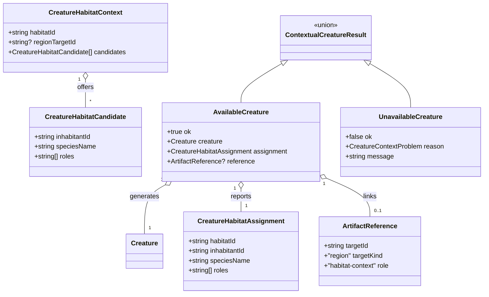

# Regional creature context

**Status:** proposal for [#337](https://github.com/ironarachne/ironarachne/issues/337).
Implementation awaits human approval of this document and domain model.

## Problem and boundary

Regions already save habitats, characteristic inhabitants and ecological roles. The existing
`$lib/creatures.generate` accepts species, age and gender options but has no way to consume those
saved facts. An optional library contract should generate an individual from a supported regional
inhabitant and report its habitat and role without changing standalone generation.

This issue will expose that contract, which its scope explicitly permits. It will not add a new
creature route, encounter template system or artifact kind. There is currently no registered
standalone `creature` artifact kind: encounters and dungeons embed `StoredCreature` values. The
existing regional `creature-artifact` source variant therefore remains readable but is not a
generation candidate until a registered kind and live resolver exist. Do not manufacture a new
individual by treating a named creature link as a species catalog entry.

## Decisions

### Resolve the saved region before selecting species

Add a projection in `$lib/regions` that receives a validated `RegionSnapshot`, a selected habitat
ID, optional region artifact ID, and a caller-supplied species catalog. It returns an optional
creature-generation context. It does not read browser storage or regenerate ecology.

Eligible inhabitants must belong to the selected habitat, be fauna or fantastical, have a
`species` source that resolves exactly in the catalog, and have current supporting evidence.
The habitat and its upstream evidence must also be current. Described inhabitants, flora,
unresolved species, stale reasons and unsupported creature links are omitted. Trace fact sources
with cycle detection and verify saved map/environment observations. A current flag alone is
insufficient when the underlying observation has changed. Authored facts without a generated
reason may remain readable but do not establish an automatically supported candidate.

Use the habitat assignment from regional generation rather than guessing a niche from threat,
body size or editable prose. The role `other` is reported as an unspecified ecological role.
The contract makes no assertion about population size, encounter frequency or predator behavior.

### Preserve the standalone RNG contract

Leave `generate(seed, config)` and `CreatureGenerationConfig` unchanged. Add
`generateWithHabitatContext(seed, config, context)` to `$lib/creatures`. The neutral input and
result types belong to creatures; regions supplies the adapter. Creatures never imports regions,
and neither library imports UI or storage.

Intersect the existing `speciesOptions` with the supported candidates by canonical species name.
Sort candidates by inhabitant ID and species name, and deduplicate species for weighted selection
so two regional records do not double a species' probability. Select the regional record for a
chosen species by stable inhabitant ID. Require a nonempty intersection. An explicit request for
an unsupported habitat returns an unavailable result, never an unrelated standalone creature.

Use an isolated child seed for contextual species selection and call the existing individual
generator with that one species and the caller's age/gender options. Validate those options
against the selected species before generation and return an unavailable result if incompatible.
Do not mutate the supplied config, species catalog or regional facts. The same seed, settings and
saved context produce the same individual and assignment regardless of input-list order.

### Report context separately from the individual

Return the existing `Creature` plus a transient assignment and optional `ArtifactReference`.
The assignment holds habitat/inhabitant IDs and the saved ecological roles; it contains no region,
habitat or inhabitant snapshot. A presentation helper reads names and explanations from the
currently resolved region. The individual remains usable independently.

When the caller supplied a saved region ID, return a reference with `targetKind: 'region'` and
`role: 'habitat-context'`. A future saving consumer must persist that reference and the assignment
in its own approved codec; it may not embed the region. This library-only integration adds no
new persisted shape and does not claim a saved assignment round trip. Existing encounter,
dungeon, creature and region payload versions remain unchanged.

For an unsaved region the assignment is transient and has no artifact reference. Presentation
returns an explicit unresolved state if the habitat/inhabitant disappears, its species changes,
or its evidence becomes stale. It never silently rerolls the creature or rewrites the source.

## Domain model

The `Species` and `Creature` types already exist. Candidate roles are descriptive strings in the
neutral creature contract; the regions adapter emits only the approved `EcologicalRole` values.
These new types live in `creature_habitat_types.ts`, separately from their implementation.

`CreatureContextProblem = 'missing-habitat' | 'stale-context' | 'no-supported-species' |
'incompatible-options'`. The projection uses the same unavailable vocabulary when it cannot
offer a context. A presentation result separately distinguishes current, stale and unresolved
assignments; it is also transient. Spatial anchors and ecology facts retain their existing types.

## Verification and acceptance

Use controlled forest, upland and wetland habitats with compatible species, plus a fantastical
fixture. Verify selected species belong to the habitat and reports include its saved role.
Test absent habitats, stale upstream observations, source cycles, flora, described sources,
unknown catalog names, creature links, incompatible gender/age options and empty intersections.
None may fall back to an unrelated species. Verify repeatability, shuffled lists, duplicate
species records, immutable inputs and unchanged standalone snapshots for fixed seeds.

Check current/stale/unresolved presentation after rename, deletion and source-species edits.
Verify saved-region references contain only IDs/kind/role and unsaved context produces no
reference. Run `npm run verify` without changing coverage thresholds. Browser tests become
required if the implementation expands to UI; that would also require reviewing the additional
consumer's persistence design first.

## Implementation boundary after approval

Implement the neutral contextual generator, saved-fact projection and presentation helpers,
their public exports and library README examples. Keep this issue limited to the optional
contract; adding a new saving consumer or standalone creature kind is separate work.
