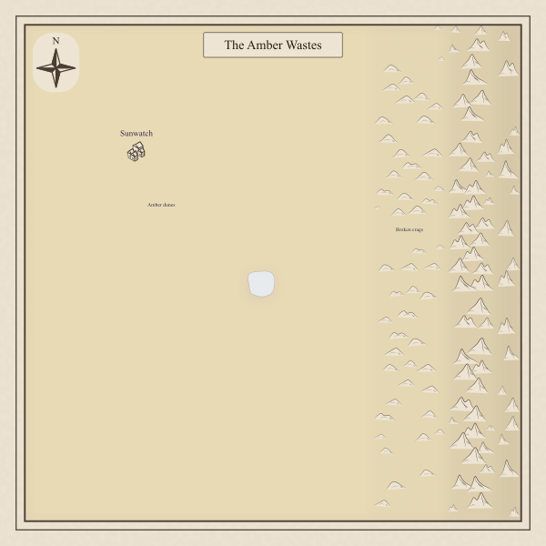
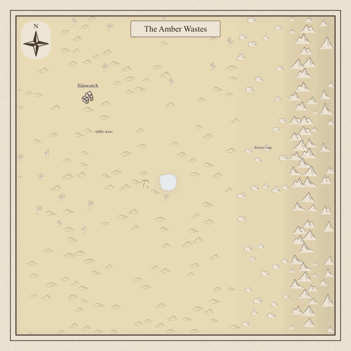
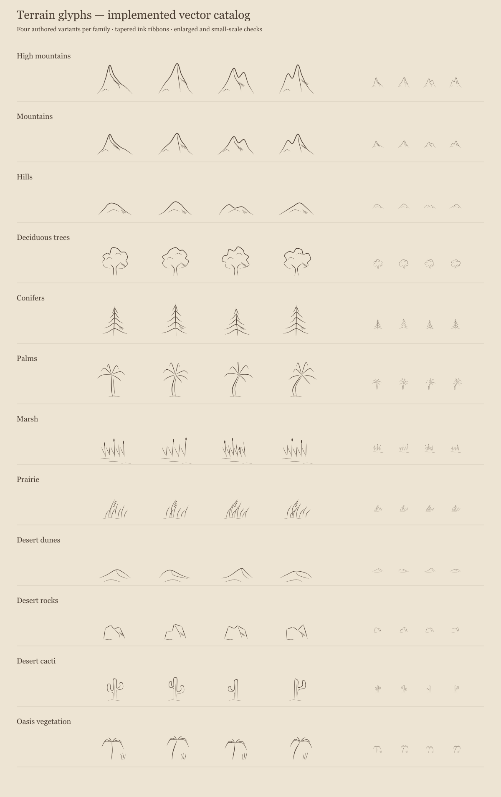

# Desert display review and validation

Implementation of [#388](https://github.com/ironarachne/ironarachne/issues/388), following the
[approved design and domain model](../region-desert-display.md) on 2026-10-04.

## Controlled before and after

The same 100 × 100 map has warm plains, cold plains across its lower left, rocky hills,
ordinary mountains, high mountains, and a small freshwater lake. The graph contains 400 cells.
Lake node 209 is deterministically selected for an oasis. Sunwatch and two landscape labels
exercise the existing marker, label, and furniture treatment.

| Before                             | After                      |
| ---------------------------------- | -------------------------- |
|  |  |

The after map shows low asymmetric dunes, sparse branching cacti, and angular low crags.
Mountains keep their existing silhouettes. A single palm-and-grass mark stands on land beside
the existing lake; the lake outline and water fill are unchanged. Cold plains have dunes
without cactus or palm imagery. Coast clearance and open space keep the oasis separate from
the water rather than drawing a second pool.

[Before SVG](mixed-before.svg), [after SVG](mixed.svg), and
[Chromium-rendered PNG](mixed-browser.png). The browser rendering also shows the same
placement and readable silhouettes at ordinary map size.

## Specimens and negative cases

[The specimen sheet](specimens.svg) shows all twelve families enlarged and at small scale,
including four distinct drawings for each of the four new desert families.



| Fixture                                | Evidence                                             | Browser result    |
| -------------------------------------- | ---------------------------------------------------- | ----------------- |
| [Mixed warm/cold desert](mixed.svg)    | Selected small lake at node 209                      | 1 oasis, 17 cacti |
| [Unselected lake](unselected-lake.svg) | Eligible small lake at node 210 fails site selection | 0 oases, 17 cacti |
| [Cold desert](cold.svg)                | Lake surrounded by cold desert                       | 0 oases, 0 cacti  |
| [Waterless desert](waterless.svg)      | No water nodes                                       | 0 oases, 16 cacti |

Chromium loaded each SVG, verified that placed desert glyphs had finite, visible bounds,
and checked those oasis counts and cold-desert vegetation exclusions. librsvg exported
the PNGs. Visual inspection covered the normal-scale map, enlarged specimens, and browser
image. Tests additionally cover missing processed shoreline, unfittable vegetation, and
failed fits leaving no spacing reservation.

## Pinned generated maps

Generated using `scripts/render_region_map.ts` with the same seeds and configuration on
the baseline and implementation. Baseline renders came from an isolated archive of the
pre-change Git revision `a89434f616ed1298fb4d545b5df448f5c7d5292e`, with the same installed
dependencies.

- `bravo`: [before](bravo-before.svg) and [after](bravo-after.svg) are byte-identical.
  This is a useful check that a map without placed desert glyphs can retain its output.
- `charlie`: [before](charlie-before.svg) and [after](charlie-after.svg) retain water,
  settlements, and map text. This seed has small cold-desert pockets but fits no new desert
  marks. Extending the eligible scatter area changes some ordinary terrain placement.
  The controlled fixture supplies positive desert and oasis evidence.

Additional seed exploration found a pre-existing generation failure for `dunes`:
`Unrelated river channels overlap: river-edge:303, river-edge:150`. The baseline reproduces
the same failure before the renderer is called. This change does not address river generation.

## Tests and determinism

- Focused map tests cover exact biome matching, finite temperature thresholds, relative
  relief, sparse cactus selection, lake components, area limits, enclosure, shoreline
  association, river clearance, footprint bounds, and rejected placements.
- Repeated rendering of the same saved graph produces identical SVG without mutating inputs.
  Site identity and sorted node arrays remain stable under reordered adjacency and node iteration.
- The determinism audit followed `buildRegionMapSvgString` through terrain assignment,
  site derivation, the shared Poisson stream, catalog selection, fitting, and water geometry.
  New selection/style RNG streams derive from the existing map key plus stable node/site IDs.
  They do not consume candidate-generation draws or use a clock or unseeded randomness.
- `npm run verify` passed: zero type errors/warnings, formatting and lint, 6,976 unit tests,
  and the coverage gate for all 100 libraries. `desert_terrain.ts` has 100% line, function,
  and branch coverage. No coverage baseline or exclusion changed.
- `npm run verify:all` passed: 663 Playwright tests passed in 11.2 minutes, with five
  existing optional golden-image tests skipped. Regional labels and generate/save/reopen/edit
  checks passed, as did route layout checks at 320, 360, 375, 390, and 430px.

Reproduce controlled output and specimens:

```sh
npx vite-node scripts/render_desert_map.ts --out /tmp/desert-maps
npx vite-node scripts/render_terrain_glyphs.ts --out /tmp/desert-specimens.svg
npm run render:region -- --seed bravo --svg-out /tmp/bravo.svg
npm run render:region -- --seed charlie --svg-out /tmp/charlie.svg
```

The first sandboxed gate run stopped at the coverage checker's local IPC socket after
unit tests passed. The full gate was restarted with access to the required local sockets;
no checks were removed or weakened.
