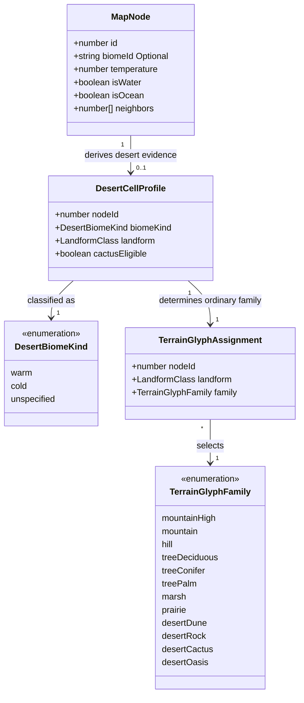
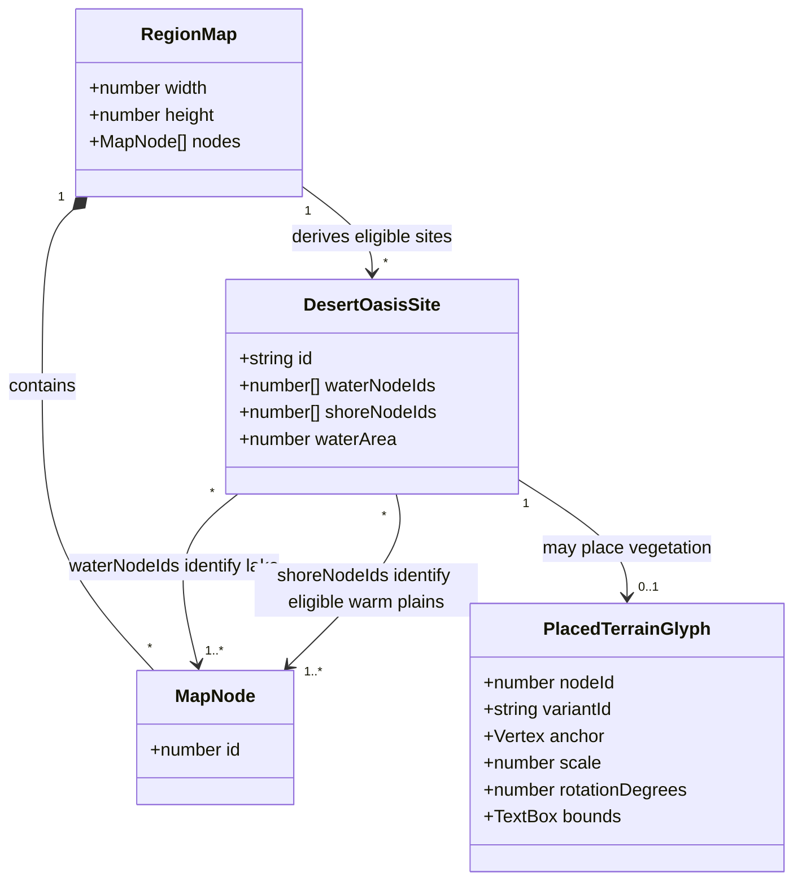

# Region desert display

**Status:** implemented — the human reviewer approved the design and domain model on 2026-10-04.
See the [visual review and validation record](region-desert-display-388/README.md).

Tracked by [#388](https://github.com/ironarachne/ironarachne/issues/388). Extends
[Region terrain glyphs](region-terrain-glyphs.md),
[Region terrain tones](region-terrain-tones.md), and
[Region Map Cartography](region-cartography.md).

## Problem

Desert cells receive a pale yellow wash, but plain desert has no terrain glyphs. Desert
hills and mountains receive the same relief symbols as other biomes. The result lacks the
dunes, sparse cacti, and craggy rocks requested by the issue. Water-supported oases should
occasionally provide a focal point without inventing water that the saved map does not contain.

The map records biome, temperature, moisture, relative relief, surface water, and rivers.
It does not record sand cover, exposed bedrock, cactus populations, springs, or groundwater.
The proposed marks are a cartographic vocabulary derived from those available inputs;
they do not add geological or ecological facts to saved regions or their prose.

## Solution and decisions

Keep this feature inside `src/lib/map`. Extend `terrain_glyph_types.ts`,
`terrain_glyph_catalog.ts`, and `terrain_glyph_assignment.ts`; introduce renderer-local
desert classification and oasis-site derivation in `desert_terrain.ts`, with the new types
in `desert_terrain_types.ts`. Compose placement in `region_map_svg.ts` using the existing
scatter, fitting, spacing, water clearance, label reservations, and painter ordering.
No generator configuration, persisted shape, migration, dependency, or new route is needed.

### 1. Desert compatibility and relief

Normalize biome names by trimming and lowercasing. Recognize the current classifications
`subtropical desert` and `cold desert`, plus exact aliases `desert` and `hot desert`.
Do not classify all dry grassland, savanna, scrub, or unknown biomes as desert.

Reuse `classifyRegionLandforms`; introduce no second set of elevation thresholds.
Apply the following rules after excluding water and ocean cells:

| Desert evidence                               | Terrain family          | Interpretation                                |
| --------------------------------------------- | ----------------------- | --------------------------------------------- |
| High mountain                                 | Existing `mountainHigh` | Preserve large relief silhouettes             |
| Mountain                                      | Existing `mountain`     | Preserve mountain ranges                      |
| Hill                                          | New `desertRock`        | Low craggy outcrops rather than rounded hills |
| Plain, eligible warm cell selected for cactus | New `desertCactus`      | Sparse desert vegetation                      |
| Other plain desert                            | New `desertDune`        | Low wind-shaped desert contours               |

One ordinary terrain family remains assigned per cell. Dunes indicate the visual character
of low-relief desert; the map cannot establish that a particular cell is a sand erg.
Rocks express relief, not a claim about mineral composition. Explicitly defer a sand/rock
substrate model and any corresponding changes to regional resources or narrative.

Cactus eligibility requires a finite temperature of at least 20°C, plain relief, and a
supported desert biome other than `cold desert`. A dedicated RNG stream selects 20% of
eligible cells for the cactus family; remaining cells use dunes. This is a presentation
rule, not a new population model. Bare `desert` aliases must meet the same temperature
test. Missing or invalid temperature cannot authorize cacti. Cold deserts retain dunes,
rocks, and mountains without cactus or palm imagery.

### 2. Visual vocabulary

Use the existing warm sepia ink, tapered pen strokes, parchment body fills, and conservative
footprints. Author four variants for each new family, including the oasis vegetation
family described below. Reuse the existing stroke and variant types; do not add raster art.

- Dunes: two or three low asymmetric crests, a curved slip face, and minimal flank shading.
  Keep them flatter and more elongated than hills; leave the baseline open.
- Cacti: recognizable branching silhouettes, unequal arm heights, occasional unbranched
  stems, and a few ground strokes. Avoid dense clusters or forest-sized crowns.
- Rocks: broken angular tops, uneven vertical faces, and sparse cross-hatching confined
  to one shadow face. Keep them lower than mountain glyphs.
- Oasis vegetation: one or two leaning palms with a small reed or grass tuft. The mark
  contains no pool outline, water strokes, or water fill; the existing lake supplies the water.

Starting density ratios are 0.35 for dunes, 0.25 for cacti, and 0.45 for rocks. Oasis site
selection uses a separate 0.35 probability per eligible lake, followed by at most one
vegetation mark per selected lake. Tune size and density through rendered review while
preserving warm/cold restrictions and the one-mark limit. Keep more open paper than forests.

### 3. Oasis evidence

For this issue, an oasis is a sparse vegetation accent beside a small, enclosed freshwater
lake in desert. Rivers alone do not establish an isolated pool, and moisture is not proof
of surface water. Springs, groundwater oases, and riverbank vegetation are deferred.

Derive connected components of nodes where `isWater` is true and `isOcean` is false,
using existing neighbor links. Each component becomes eligible only when:

- It has a nonempty land boundary, all of whose cells are supported desert biomes.
- Neither its water cells nor their polygons touch the map boundary, and it has no
  neighboring ocean cell. Use polygon contact with the map rectangle to detect enclosure.
- Its summed polygon area is positive, finite, and at most 1% of `map.width * map.height`.
- At least one immediately adjacent desert land cell is plain, warm, and not `cold desert`,
  using the same temperature requirement as cactus eligibility.
- Existing processed water geometry contains a drawable shoreline for that component.

The small-lake criterion uses graph polygons to classify scale; placement uses the actual
processed shoreline, which can differ from those polygons. The renderer must retain the
association between a water component's node IDs and its processed outline rather than
guessing by nearest lake. A component whose shoreline cannot be associated safely is skipped.

Do not draw, enlarge, recolor, or move a lake to accommodate an oasis mark. Rivers entering
an existing lake do not disqualify it, but ocean adjacency does. No qualifying lake means
no oasis, including on historical maps with moisture or river data alone.

### 4. Placement, containment, and determinism

Retain the shared Poisson candidate stream. Classify oasis sites before drawing; for each
selected site, consider only existing candidates inside its eligible adjacent land cells
and within two `mapScale` units of its processed shoreline, where the renderer already
defines `mapScale = min(width, height) / 35`. Distance is point-to-shoreline distance,
not distance to a water cell's center.

Try candidates in their existing deterministic order and select the first whose complete
vegetation footprint fits on desert land and clears all drawn water, including rivers.
Use the current largest-fitting-scale search and minimum-scale rejection. A lake with
no fitting candidate receives no oasis. Reserve accepted oasis marks in the shared spacing
index before ordinary terrain marks, processing sites by their smallest water node ID.
Do not reserve space for a rejected mark. At most one accepted mark is allowed per lake.

Desert dunes, rocks, cacti, and oasis vegetation share a containment mask across supported
desert land, while each anchor must satisfy its own relief and climate rule. This prevents
isolated cactus assignments from confining every silhouette to one raw Voronoi cell.
Existing mountains retain their current containment rules. All families still obey water
clearance, map bounds, shared spacing, furniture reservations, and label placement.

Use `@ironarachne/rng` with separate keys derived from the existing renderer map key and
stable node IDs: cactus-cell selection, oasis-site selection, and glyph variant/style
selection each own their stream. A lake's stable identifier derives from its smallest
water node ID. Do not consume candidate-generator draws to select a family. Sort derived
site node IDs and boundary node IDs numerically; graph traversal order must not change
site identity or selection. Rendering the same saved map must produce identical SVG.

## Domain model

All added data is transient renderer state. Existing map and terrain glyph types are reused.
The diagrams below specify the new types in `desert_terrain_types.ts` and the additions to
the existing `TerrainGlyphFamily` union. They show only relevant fields of existing types.

`warm` covers `subtropical desert` and `hot desert`, `cold` covers `cold desert`, and
`unspecified` covers `desert`. Warm classification alone does not bypass temperature checks.
`desertOasis` belongs to the glyph catalog but is selected through an oasis site rather
than ordinary per-cell assignments; an accepted oasis suppresses nearby ordinary candidates
through shared spacing.

`waterNodeIds` identifies the complete connected lake; `shoreNodeIds` contains only its
immediately adjacent eligible warm plain desert cells, not the complete land boundary.
Both arrays are sorted and unique. `waterArea` is in squared map units. A site records
eligibility before probability and fit checks; existence does not promise a rendered mark.
The placed glyph's `nodeId` identifies its land anchor, never a water node.
Processed outlines remain existing renderer geometry referenced through `waterNodeIds`,
not duplicated or persisted in this model.

## Validation and acceptance

After approval, cover classification and placement behavior with co-located library tests:

- All supported names, normalization, unknown/dry non-desert biomes, warm/cold temperature
  boundaries, invalid temperatures, and water exclusion.
- Relative relief precedence, deterministic cactus selection, and no loss of mountain ranges.
- Qualifying small lakes, multi-cell lake components, the exact area cutoff, boundary lakes,
  ocean contact, mixed non-desert shores, cold-only shores, and waterless desert.
- Moisture-only and river-only fixtures producing no oasis; rivers intersecting otherwise
  valid lake shores exercising clearance rather than fabricated water.
- At most one oasis per lake, rejected fits creating no spacing reservation, footprints
  staying on land, and stable site derivation when neighbor arrays are reordered.
- Identical repeated SVG, finite bounded geometry, and shared collision/furniture rules.

Create a controlled visual fixture with warm dunes, warm cactus plains, rocky desert hills,
desert mountains, cold desert, and small inland water beside desert. Include accepted and
rejected oasis cases. Render it at ordinary map scale and as an enlarged specimen sheet;
inspect silhouettes, sparse density, readable lake boundaries, and label collisions.
Render pinned-seed before/after maps through `scripts/render_region_map.ts` and record
the seeds, images, and observations with the implementation. A seed lacking suitable
freshwater is expected to have no oasis; the controlled fixture supplies positive evidence.

Run `npm run verify` for implementation and `npm run verify:all` before merging this rendering
change. Preserve per-library coverage gates. Review the browser and SVG export paths and
confirm existing non-desert terrain still reads correctly. No implementation work items
are broken out until the human reviewer approves this proposal and its domain model.
