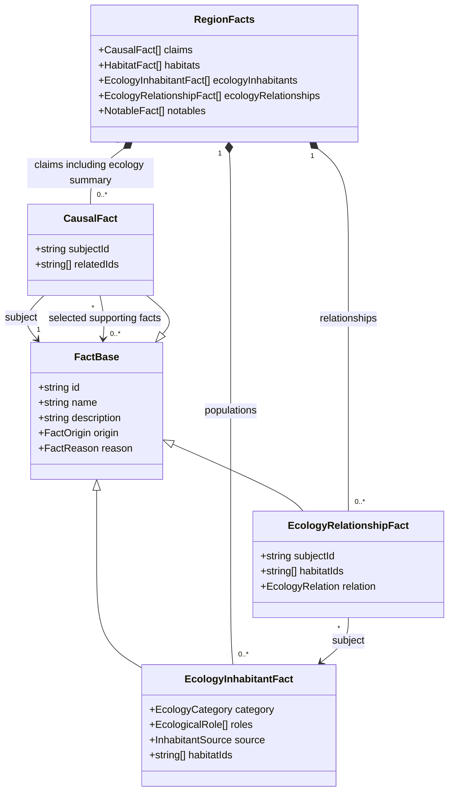
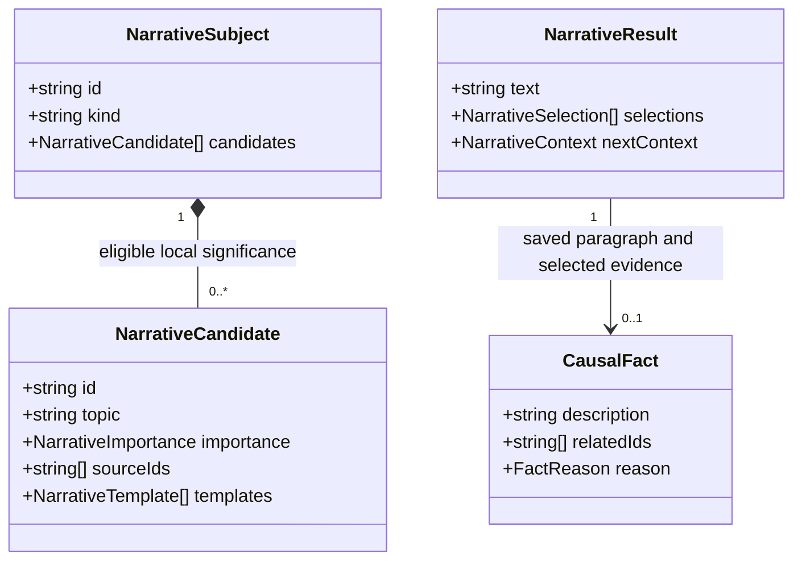

# Regional ecology paragraph

**Status:** implemented — domain model and frequency approved by Ben on 2026-10-09 for #395.

## Problem

The Flora and fauna section lists short, repetitive population descriptions, while fantastical
populations appear in a separate Inhabitants section. Neither format explains which populations
matter to this region. Notability means unusual or important relationships with the surrounding
region and its inhabitants, rather than mere presence or a fantastical category.

## Decisions

1. Replace both lists with one Flora and fauna paragraph shared by the page, Markdown, standalone
   PDF and project publication. Use a budget of four sentences and one sentence per selected
   population; fewer sentences are preferable to filler. Keep all supporting facts available for
   inspection, editing and structured transfer.
2. Build eligible meanings from current saved ecological relationships and explicit supporting
   facts. Settlement uses and documented hazards affecting gathering have priority over ordinary
   feeding relationships. Mere occurrence, a predator role or a restricted habitat does not by
   itself establish unusualness. Do not invent rarity, diets, industries or effects on residents.
   Include the population's named habitat and explain its local significance in each meaning.
   Resolve settlement names through their saved identities when a relation names a settlement.
3. Use the accepted narrative composer to choose useful meanings before choosing words. Supply
   multiple grammatical whole-sentence expressions of each supported meaning, stable semantic IDs,
   a caller-owned stage RNG and explicit empty batch context for this single paragraph. Exclude
   stale relationships, populations, habitats and other required evidence. Rank equally important
   candidates with seeded choice and avoid describing the same relationship twice from its two
   endpoints.
4. Fantastical populations require supported local significance, just like other populations.
   Admit fantastical candidates on one in ten generation runs using a dedicated stage RNG draw;
   include at most one fantastical population. This is a proposal for their frequency, not a claim
   that fantastical species are biologically rare. Authored summary prose bypasses composition.
5. Persist the generated paragraph as an existing `CausalFact` in `RegionFacts.claims`, with the
   reserved ID `claim:ecology-summary`, subject `area:land`, and `relatedIds` plus reason sources
   identifying the selected supporting facts. Its description holds the final paragraph. This is
   an aggregate claim about regional ecology, not a new population. Existing validation, snapshot
   transfer and dependency invalidation apply; no payload-version or type-shape change is needed.
   Generate it after relationships and notable hazards have been established, on an isolated
   `ecology-narrative` stream. Persist no claim if there is no eligible content.
6. Presentation reads the saved summary without composing or rolling. Changes to supporting
   facts mark its explanation stale through the existing dependency mechanism, retain its saved
   wording and show the existing review notice. Text edits to the summary retain authored prose.
   Removing referenced facts follows the existing dependent-removal behavior.
7. Older snapshots without a summary remain readable without automatic regeneration or migration.
   Their fallback paragraph uses existing saved descriptions of relationship-backed populations
   and the corresponding saved relationships in stable identity order, within the same budget.
   It excludes stale evidence and fantastical entries by default; it performs no random selection
   or wording rewrite. Snapshots with no supported notable content omit the section. Retain old
   population prose in the supporting facts even when omitted from the reading format.

## Domain model

All persisted types below already exist. The summary specializes `CausalFact` by reserved identity
and meaning; it does not introduce a new TypeScript type or collection. The transient narrative
types come from the accepted shared prose model.

## Verification

Test supported local uses, ecological dependencies and gathering hazards; omit ordinary presence,
unsupported claims and stale evidence. Check sentence budgets, duplicate-relationship omission,
fantastical eligibility and frequency across a fixed seed bank, same-seed equality and wording/focus
variation. Verify grammar across the small template pools, unchanged upstream generation output,
authored prose preservation, dependency invalidation, legacy fallback and snapshot round trips.
Page and exports must use identical saved words with no population subheadings or Inhabitants
section. Run `npm run verify`, and run `npm run verify:all` before merging this rendering change.
Update the narrative adoption inventory and region presentation documentation with implementation.

## Implementation work items

1. Adapt current ecology evidence to narrative candidates and persist the composed claim on its own stage stream.
2. Share the paragraph across page and exports; retain a deterministic saved-wording fallback for older snapshots.
3. Verify selection, omissions, seeded frequency, saved/authored stability, dependency behavior and browser rendering.
