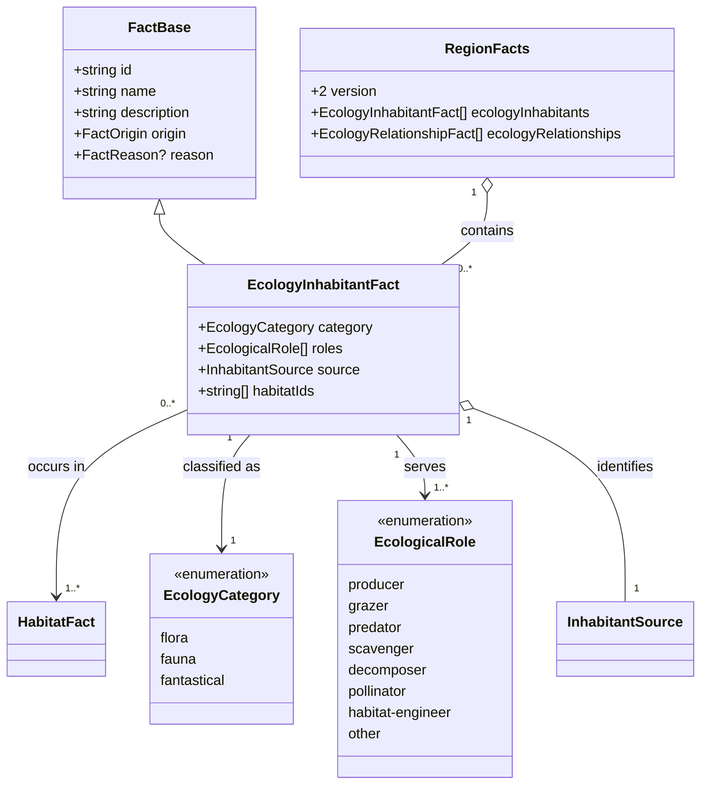
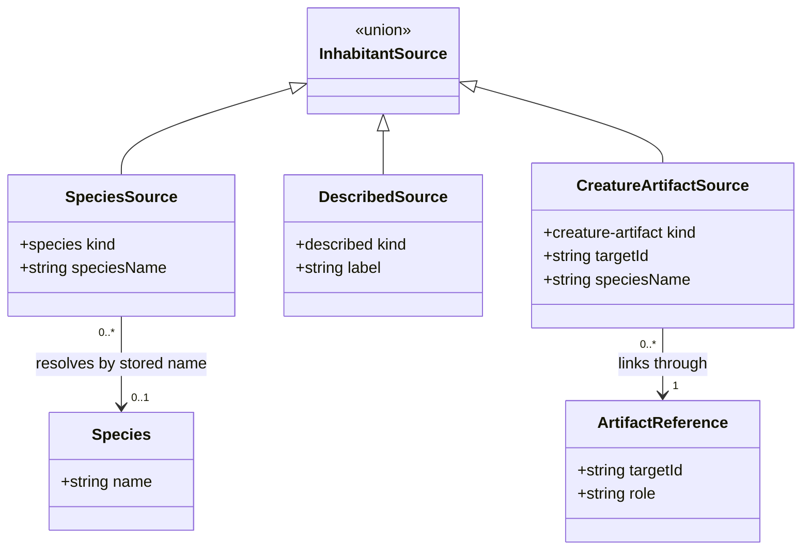
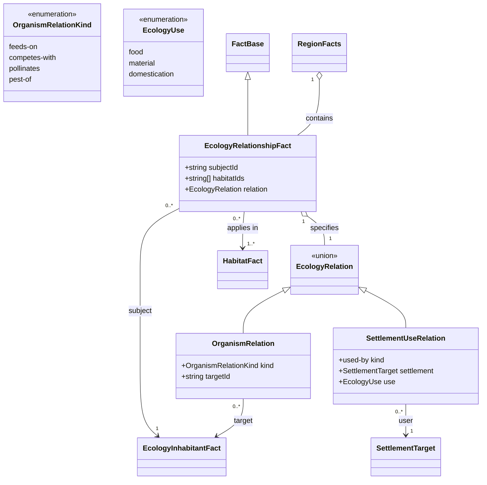

# Bounded regional ecology

**Status:** accepted for [#334](https://github.com/ironarachne/ironarachne/issues/334).
The human reviewer approved this design and domain model on 2026-09-30. This extends the accepted
[Regions release contract](regions-release-contract.md), dependency #326, and uses the implemented
[spatial habitats](region-habitats.md). It supplies the data contract for #335 and #336; creature
context in #337 remains stretch work.

## Problem

A referee needs a few characteristic inhabitants and useful interactions that belong to the
region's actual habitats. A species list alone cannot explain what feeds, shelters, threatens or
sustains anything. Conversely, inventing a complete food web would require diet, population,
seasonality and productivity data that the current libraries do not provide.

The current contracts impose concrete limits:

| Existing data                                                                                                                                          | Design consequence                                                                                                                     |
| ------------------------------------------------------------------------------------------------------------------------------------------------------ | -------------------------------------------------------------------------------------------------------------------------------------- |
| `HabitatFact` has semantic identity, area references and a biome footprint; #330 excludes lake and ocean cells.                                        | Reuse these habitats. A wetland inhabitant can occupy wet land beside water; an open-water community needs a later habitat extension.  |
| `Environment.ecosystems` and `dominantEcosystem` contain names and string lists of flora/fauna; the ecosystem generator currently returns empty lists. | Adapt populated lists as candidates, without pretending they form a species registry or forcing entries when lists are empty.          |
| Biome classifications contain vegetation/fauna labels and climate ranges.                                                                              | Use labels as descriptive candidates and ranges as coarse suitability inputs, with explicit aliases to species where known.            |
| `Species` has `name`, broad `environments`, `creatureTypes`, tags and commonality, but no diet, pollinator, seasonal or niche contract.                | Reference species by the existing persisted name convention. Habitat labels and threat levels cannot establish a feeding relationship. |
| `StoredCreature` names a species and stores individual traits; artifact references identify saved creatures.                                           | Regional ecology describes kinds of inhabitants. A named creature is an optional artifact link, not a new embedded creature snapshot.  |
| Region payload version 3 stores `RegionFacts.version = 1`, reasons and semantic references.                                                            | Introduce an explicit migration for new required lists; extend the existing fact namespace and edit rules.                             |

## Decisions

### 1. An inhabitant is a regional occurrence, not a population simulation

Add `EcologyInhabitantFact` to `RegionFacts`. It describes one kind of living or fantastical
inhabitant associated with one or more existing habitats. Its editable name and description,
origin and reason follow `FactBase`. `category` distinguishes flora, fauna and fantastical life;
`roles` is a small list drawn from `producer`, `grazer`, `predator`, `scavenger`, `decomposer`,
`pollinator`, `habitat-engineer` and `other`.

These roles are descriptive niches, not a balanced trophic level. Multiple roles are permitted;
an unknown niche is `other`, never inferred from creature type, size or threat. Flora is not
automatically a producer (a fantastical parasitic plant might not be one). A role must be backed
by the producing rule or a deliberate authored choice. `category = fantastical` does not imply
predator or exempt an entry from habitat requirements.

`source` is a discriminated reference: an existing species name, a descriptive label without a
species definition, or a saved creature artifact plus its last known species name. A descriptive
entry such as reeds, upland grasses or small fish is valid without inventing a new `Species` or
plant library. The label is a saved fallback, not a foreign key. Renaming the displayed fact
does not change its source or semantic ID.

An inhabitant represents the same kind across its listed habitats, not one individual per cell.
Generation combines repeated selections of the same source and role set into one occurrence;
authored entries may distinguish local variants. No counts, biomass, territory radius, numerical
abundance, breeding rates or encounter probability are persisted or inferred. A named creature
link does not establish that its entire species occurs throughout the region.

### 2. Five relationship kinds have explicit endpoints

Add `EcologyRelationshipFact`, with `FactBase`, `habitatIds`, `subjectId` and a discriminated
`relation`. The subject always identifies an inhabitant. There are five kinds:

| Kind            | Target                      | Meaning and generation requirement                                                                                                                             |
| --------------- | --------------------------- | -------------------------------------------------------------------------------------------------------------------------------------------------------------- |
| `feeds-on`      | Inhabitant                  | Subject consumes target. Covers grazing, predation and scavenging, but requires an explicit compatible food rule.                                              |
| `competes-with` | Inhabitant                  | Both share a specific limited resource or niche stated in the saved description and rule. Symmetric; coexistence alone is insufficient.                        |
| `pollinates`    | Inhabitant                  | Subject has the pollinator role; target is flora. A compatible pollination rule must exist.                                                                    |
| `pest-of`       | Inhabitant                  | Subject damages or parasitizes target. Requires an explicit host/plant compatibility rule, not merely a hostile creature label.                                |
| `used-by`       | Existing `SettlementTarget` | The inhabitant supplies food, material or a domesticated animal to that settlement, distinguished by `use`. Requires supported access and a specific use rule. |

No arbitrary relationship strings or untyped endpoint IDs are accepted. `used-by` uses the
accepted embedded/artifact settlement union, rather than creating an imaginary human population
or encoding a settlement as a species. A feeding fact names its selected food; it cannot target
unrepresented “prey” to complete an apparent food chain. Relationships are facts in their own
right, so later hazards and livelihood claims can cite them by semantic ID without duplicating
their structure. The existing `CausalFact` remains available for broader explanations.

Descriptions may qualify an interaction (“feeding along the wet banks”), but cannot introduce an
unstored endpoint or claim a quantitative effect. Migration and seasonal movement are outside
this relationship vocabulary: #336 may save a supported qualitative qualification in description
and provenance, such as activity restricted by observed cold. The current climate inputs cannot
by themselves establish an annual flood, a monthly migration route or a recurring breeding event.
Such claims are omitted unless an explicit versioned rule has adequate saved observations. The saved `Climate.seasons` list already supplies named periods and day ranges; #336 can cite
that whole `climate` observation for a qualitative seasonal statement when an explicit organism
rule supports it. Its current temperature/humidity adjustments are coarse defaults, not measured
seasonal ecology. No new calendar is generated, and empty seasons support no seasonal claim.
Structured per-organism timing or movement would require another reviewed schema extension.

### 3. Evidence selects candidates; saved facts remain the result

#335 consumes realized habitats and their observed map conditions after the habitat pass. It
checks temperature, moisture, shared landform classification, water adjacency and habitat
availability. Region-wide climate summaries cannot override contradictory local evidence.
Species environment labels are broad compatibility hints translated through an explicit alias
table; exact string equality between biome and species environment names is not the contract.

Candidates may come from existing species, saved ecosystem strings or biome vegetation/fauna
labels. Exact known aliases can resolve a label to a species; unknown labels remain descriptive.
Selection never extracts biology from prose, dynamically evaluates rules from a payload or treats
all entries in an ecosystem string list as suited to every habitat. Curated fantasy rules supply
only the missing suitability, role and interaction metadata needed for the small release set.
Missing or uncertain metadata produces fewer facts and a documented data gap in #335/#336.

Persist inhabitants and interactions once. Loading, editing and exporting use those saved facts;
they do not rerun selection or reconstruct roles from newer catalog data. Reasons cite the habitat
and relevant map/environment observations, using versioned rules such as
`fantasy:region:ecology:wetland-heron:v1`. A relationship reason also cites its inhabitant endpoints
and, for human use, an existing settlement role supporting access. Do not assert feeding,
pollination or domestication from broad species tags alone.

Extend `EnvironmentFactField` with `ecosystems` so existing `FactSource.kind = environment` can
record the serialized saved list when that list contributes a candidate. `observedValue` contains
the tested value, as for other environment sources. This is an observation path, not an ecosystem
identity or a mutable array-index relationship. Use `dominantEcosystem` only when that specific
existing field was tested. Empty ecosystem lists are valid and contribute no candidates.

### 4. Fantasy life gets a niche without a compulsory diet

A fantasy rule may select a wisp for a supported swamp habitat because its species environments
include swamp and the local habitat satisfies the rule. It may describe the wisp's saved glow
or a rule-defined narrative presence without inventing prey, caloric requirements, corpse
production or a food-chain apex. Such an inhabitant can use `roles = [other]` and have no
relationships. An ecological hazard must cite a separate supported relationship or explicit
fantasy hazard rule; “undead” alone does not justify a predation claim.

There is no requirement to generate fantasy life in every region. Magical exceptions to ordinary
suitability must be explicit in a versioned fantasy rule and its saved description/reason; they
cannot silently alter terrain, climate, water or existing habitat facts. The core validator knows
the neutral vocabulary and references; it does not encode fantasy habitat preferences.

### 5. Output is bounded and deterministic

The first generator selects up to four habitats represented by #330's major zones, in existing
prevalence order with semantic-ID ties. It chooses at most two flora and three fauna/fantastical
entries per selected habitat, with at most one fantastical entry per habitat and two distinct
fantastical entries in the region. This yields at most twenty distinct inhabitants; repeated
occurrences are merged. Secondary and minor habitats keep their spatial facts even when they
receive no ecology selections.

#336 generates at most two relationships per selected habitat and six overall. It prefers a few
supported interactions; zero is valid when catalog evidence is absent. Caps are generation policy,
not payload-validation limits: authors may retain or add more entries. No minimum forces a
fantasy inhabitant, a predator or a closed chain.

Use independent named `ecology-inhabitants` and `ecology-relationships` stage streams through the
existing `createRegionStageRng`, placed after habitats and before consumers of ecology. Candidates,
habitat IDs and symmetric endpoint pairs are sorted before selection. Adding an ecology draw
does not consume another stage's RNG. The selected facts do not change the physical map or
regenerate upstream habitats. Downstream prose can change when its supporting facts change.

## Domain model

The new types belong beside the existing regional facts, in a dedicated `region_ecology_types.ts`
type file re-exported by the regions public API. These diagrams define persisted additions, not
runtime generator objects. Existing fields abbreviated below retain their current types.

`InhabitantSource` is exactly
`{ kind: 'species'; speciesName: string } |
{ kind: 'described'; label: string } |
{ kind: 'creature-artifact'; targetId: string; speciesName: string }`.
Species are catalog references, not copied tables. An unavailable species name leaves the saved
fact readable and reports unresolved catalog data, following the creature codec's inert fallback
convention. A creature-artifact source requires a matching artifact reference with role
`ecology-inhabitant`; when resolved, its kind must be `creature`. A missing referenced artifact
uses the vault's existing dangling-reference behavior. The saved species name is explicitly last
known context; a live mismatch requires review, not silent rewriting. #335 produces only species
and described variants; resolving/attaching named creature links belongs to #337.

`EcologyRelation` is exactly
`{ kind: 'feeds-on' | 'competes-with' | 'pollinates' | 'pest-of'; targetId: string } |
{ kind: 'used-by'; settlement: SettlementTarget; use: EcologyUse }`.
These types intersect `FactBase`; all names, descriptions, roles, sources, habitat assignments
and relation choices are stored data. No source union contains an embedded `Species`, `Creature`
or ecosystem copy. The existing `FactReason`/`FactSource` model applies, with the single
`EnvironmentFactField` addition described above.

## Validation and editing contract

Structural validation applies equally to generated and authored content:

1. Inhabitant IDs start with `inhabitant:`; relationship IDs start with `ecology:`. Both join
   the one-region fact-ID namespace, including `FactSource` and `CausalFact` resolution.
2. Every inhabitant has at least one unique, existing habitat ID and at least one unique known
   role. `other` is used alone. Source strings are nonempty; category and every union discriminator
   must be known. Unknown species names are unresolved catalog references, not invalid payloads.
3. Every relationship has a subject in `ecologyInhabitants` and at least one unique habitat ID.
   An organism target must also be an inhabitant in the same snapshot and differ from the subject.
   Every relationship habitat must be present on both endpoints; for `used-by`, on the subject.
4. `pollinates` requires subject role `pollinator` and target category `flora`.
   `used-by/domestication` requires a fauna or fantastical subject, rather than treating crop
   cultivation as animal domestication. Embedded settlement targets must exist. Artifact targets
   require the existing reference contract and report unavailable/wrong-kind targets on resolution.
5. Duplicate relations with the same kind, endpoints, use and sorted habitat set are rejected.
   Competition uses a canonical lexically sorted endpoint pair, so reversing it is not a new
   relation. Opposite directed feeding links remain distinct; circular feeding chains are not
   rejected merely for being cycles. Reasons are dependency explanations, not food-web traversal.
6. Current reasons must resolve their sources. Stale reasons may retain missing historical source
   IDs under the existing validator convention. A stale reason does not excuse a missing live
   relationship endpoint or habitat. Generation requires nonempty, current reasons for all new
   facts; authored facts may have no generated reason.

Fantasy generation additionally checks observed suitability, explicit role/interaction metadata,
actual spatial overlap for organism interactions, and accessible habitat for settlement use. Two
inhabitants sharing a disconnected habitat footprint is not sufficient evidence that they meet:
the rule must find a common supported patch from the saved graph. It records the relevant node
or edge observations in the reason. New hard spatial boundaries or per-organism polygons are
outside this model. Generic persistence does not enforce fantasy diet rules on authored worlds.

Editing addresses facts by ID. Text edits retain identity and set origin to `authored`; generated
reasons remain separate. Changing a source, role, habitat or relation must validate the candidate
snapshot and mark affected generated reasons stale transitively, including dependent hazards,
resource-use claims and overview explanations. No editor silently rewrites the user's prose.

Removing a habitat or inhabitant must resolve live inbound references before saving: present a
concrete cascade of removable generated dependents; if authored facts depend on it, require an
explicit reassign/delete choice. Do not turn dangling endpoints into valid “stale” relationships.
Removing only a supporting observation or fact may retain a stale reason. Partial regeneration
in #347 preserves authored ecology and checks the full dependency set before replacing generated
facts; loading never performs that operation.

## Concrete representative snapshot

This is an illustrative fixture, not a claim that current generation produces these entries.
All new entries below have `origin = generated`; each reason uses a versioned fantasy rule and
the cited saved observations. The saved map has swamp land nodes 12/13 incident to river edge 7,
and a cool montane-forest patch 31/32 with hill/mountain landforms. Existing habitats are
`habitat:biome:swamp` and `habitat:biome:montane%20forest`, with their complete dry-land footprints and
existing area links. Settlement `settlement:1` has a role supporting access to the river-bank
habitat. These IDs use #330's biome prefix and encoding; edits retain the original IDs.

| ID                          | Saved source / category                                          | Roles     | Habitat IDs                      | Reason and description                                                                                                      |
| --------------------------- | ---------------------------------------------------------------- | --------- | -------------------------------- | --------------------------------------------------------------------------------------------------------------------------- |
| `inhabitant:reeds`          | `{kind: described, label: reeds}` / flora                        | producer  | `habitat:biome:swamp`            | Wet land nodes and adjacent river support a descriptive reed stand. No invented plant species.                              |
| `inhabitant:crayfish`       | `{kind: species, speciesName: crayfish}` / fauna                 | scavenger | `habitat:biome:swamp`            | An explicit wet-bank rule supports crayfish at river margins, without creating an open-water habitat.                       |
| `inhabitant:heron`          | `{kind: species, speciesName: heron}` / fauna                    | predator  | `habitat:biome:swamp`            | Swamp compatibility and river-margin evidence support foraging herons.                                                      |
| `inhabitant:upland-grasses` | `{kind: described, label: upland grasses}` / flora               | producer  | `habitat:biome:montane%20forest` | A curated open-patch rule cites local moisture, temperature and shared landform classes; forest name alone is insufficient. |
| `inhabitant:ibex`           | `{kind: species, speciesName: ibex}` / fauna                     | grazer    | `habitat:biome:montane%20forest` | The mountain environment alias and supported grassy rocky patch establish suitability.                                      |
| `inhabitant:wisp`           | `{kind: species, speciesName: "will o' the wisp"}` / fantastical | other     | `habitat:biome:swamp`            | The swamp rule and saved glow ability support lights in the wetland. No feeding relation is asserted.                       |

The corresponding relationship objects, each also carrying editable `name`, `description`,
`origin` and a `reason`, are:

| ID                      | subjectId          | relation                                                                                   | habitatIds                         | Support                                                                                                 |
| ----------------------- | ------------------ | ------------------------------------------------------------------------------------------ | ---------------------------------- | ------------------------------------------------------------------------------------------------------- |
| `ecology:heron-feeding` | `inhabitant:heron` | `{kind: feeds-on, targetId: inhabitant:crayfish}`                                          | [`habitat:biome:swamp`]            | A curated heron/crayfish food rule, both saved inhabitants and a shared river-margin patch.             |
| `ecology:ibex-grazing`  | `inhabitant:ibex`  | `{kind: feeds-on, targetId: inhabitant:upland-grasses}`                                    | [`habitat:biome:montane%20forest`] | A curated grazing rule and the supported shared upland patch.                                           |
| `ecology:reed-use`      | `inhabitant:reeds` | `{kind: used-by, settlement: {kind: embedded, settlementId: settlement:1}, use: material}` | [`habitat:biome:swamp`]            | A reed-material rule plus the existing settlement access role. No harvest quantity or economy forecast. |

For example, the heron relationship's reason contains
`{kind: fact, factId: inhabitant:heron}`, `{kind: fact, factId: inhabitant:crayfish}`,
`{kind: fact, factId: habitat:biome:swamp}` and
`{kind: map-edge, edgeId: 7, property: river, observedValue: "1"}` when edge 7's saved value is 1.
It uses `ruleId = fantasy:region:ecology:heron-crayfish:v1` and `status = current`.
The food compatibility is a deliberate new rule, not information already present in `Species`.
If crayfish is removed, this feeding relation must be removed or reassigned before saving. If
the river evidence changes, its explanation becomes stale. Renaming herons preserves both IDs.

## Migration and compatibility

The implementation introducing these lists moves the region artifact to payload version 4 and
`RegionFacts` to version 2. Version 3 migrates by preserving all seven existing fact lists,
their IDs, reasons and `state`, then adding empty `ecologyInhabitants` and `ecologyRelationships`.
Versions 1 and 2 first retain the existing legacy conversion and then receive the same empty
ecology lists. New required lists may not be silently dropped or treated as present in a v3 payload.

Empty ecology does not change a current region's facts to legacy, and migration does not invent
reeds, diets, roles or reasons from old descriptions. Environment ecosystems, the physical map,
embedded settlements and authored prose remain intact. Reopening/exporting an old region omits
empty ecology sections. An explicit generation action can later populate ecology after review
of authored dependencies.

Unknown future fact versions, categories, roles or relation variants use the vault's unsupported
payload path, preserving the original for recovery/export; no unknown variant is coerced to
`other`. Catalog names and artifact targets can be unresolved without losing saved text. Adding
future open-water habitats, plant catalogs or interaction kinds requires an explicit schema or
rule revision, never a reinterpretation of existing saved facts.

## Verification and review boundary

The approved implementation must demonstrate:

- Wetland, upland and fantastical fixtures matching the example, with every habitat, endpoint
  and current reason resolving against the saved snapshot.
- Rejected missing/duplicate IDs, illegal variants, invalid pollination, self-links, reversed
  duplicate competition and mismatched habitat assignments; unresolved catalog and artifact
  fallbacks preserve text.
- Deterministic capped selection with shuffled catalog/graph order, empty ecosystems, sparse
  species metadata, disconnected habitat patches and extra stage RNG draws.
- Evidence-based omissions: no open-water community from a dry-land habitat, no diet from threat,
  no compulsory fantasy predator, no annual flood from a river flag or overview climate alone.
- Version 1/2/3 migration without upstream rewrites, identity retention through rename/reorder,
  dependent stale reasons and removal/regeneration preserving authored work.
- Saved/page/Markdown/PDF ecology agreement, empty-section omission, save/reopen retention and
  mobile readability when the display work lands. `npm run verify` is the implementation gate;
  `npm run verify:all` is required before merging rendering changes.

This design excludes a full food web, population dynamics, ecological equilibrium, simulated
resource depletion, precise seasonal calendars, migration paths, automatic creature creation,
new map symbols and an expanded open-water habitat model. Approval settles the persisted shape,
bounded vocabulary and migration policy. Implementation work may now be broken down;
#335/#336 own selection and interactions, #347 owns edit/regeneration integration, and #337 may
consume the optional creature-reference contract later.

## Approval record

On 2026-09-30 the human reviewer explicitly approved this design and domain model, including
the inhabitant and relationship types, bounded vocabulary, validation and editing contracts,
and payload version 4 / facts version 2 migration policy.

## Implementation status

#335 implements inhabitant selection, the declared ecology vocabulary and structural validation,
and payload version 4 / facts version 2 migration. Generation persists inhabitants. #336 adds bounded feeding and material-use
relationships, shared-cell support, settlement access, qualitative cold-browse qualifications
and gathering hazards that cite the saved relationships. [The regions README](../src/lib/regions/README.md#characteristic-inhabitants-335)
records selection rules and catalog gaps. Gazetteer display (#344), structural edit/regeneration
integration (#347) and creature-artifact attachment/resolution (#337) remain follow-on work.
