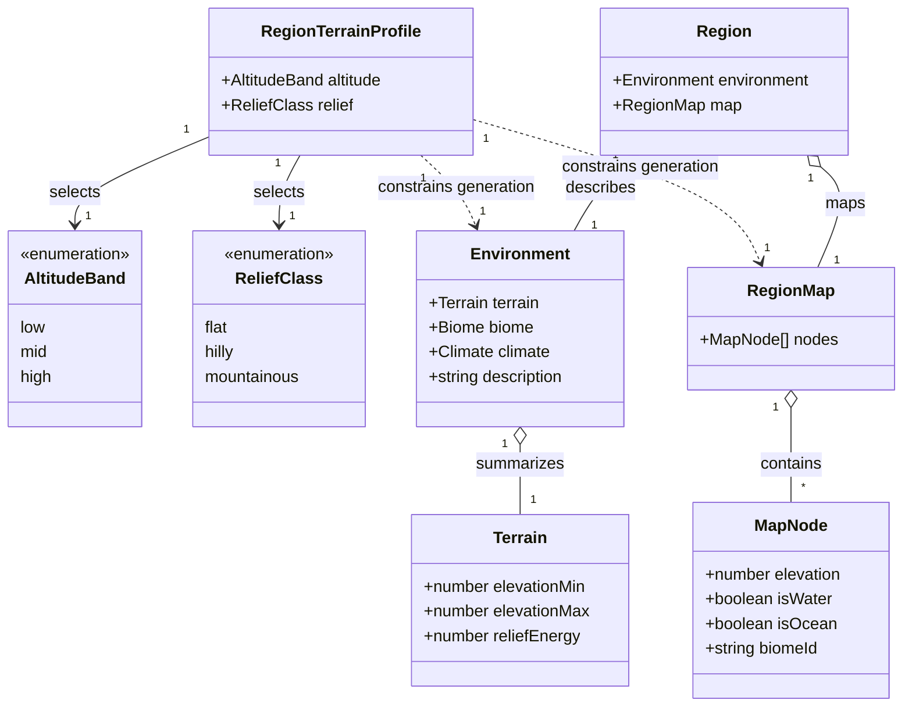
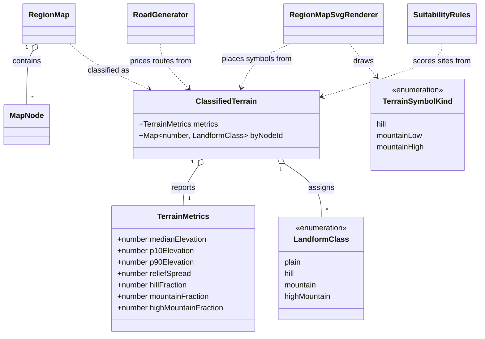

# Region Environment Coherence

This design document defines the quantitative terrain contract needed to make a generated region's
overview environment and spatial map describe the same place. It is the design work for
[#289](https://github.com/ironarachne/ironarachne/issues/289) and a prerequisite for the generator
change tracked by [#249](https://github.com/ironarachne/ironarachne/issues/249).

**Status:** accepted. The quantitative contract, domain model, and dedicated hill-symbol decision
were approved by the human reviewer on 2026-09-21. Implementation remains tracked by #249.

## Problem

`$lib/environment` and `$lib/map` currently use different terrain models without a contract between
them. A region map chooses elevation noise, a possible mountain range, moisture, and per-cell biomes
before the region generates its overview `Environment`. Latitude is the only shared input. The
result can truthfully describe one data structure while drawing another, as seed `5pkjdquccl04i`
does: low, flat mangrove prose over a map dominated by montane forest and mountain cells.

The numeric scales do not currently make the two models comparable:

- The default environment starts at elevation `0.35` and relief energy `0.05`. Terrain generation
  samples around those values and then applies three erosion passes that each divide elevation and
  relief by two. The resulting overview terrain is therefore always low-altitude and flat under
  `describeTerrain`'s `< 0.2`, `> 0.8`, `> 0.3`, and `> 0.5` boundaries.
- Map elevation uses `[-1, 2]`, with sea level at `-0.1`. Its generator independently adds a ridge
  half the time.
- The renderer and road finder each duplicate an absolute `0.58` mountain boundary. The renderer
  uses `0.82` only to choose the high-peak glyph. Both also treat biome names containing
  `mountain` or `alpine` as topography.

Absolute altitude and relief are different dimensions. A high plateau may be flat; a mountain
range may rise from low country. An absolute elevation threshold cannot represent both truths, and
a biome name describes climate and ecology rather than landform.

## Scope

This document settles the map-level meaning of low/mid/high altitude and
flat/hilly/mountainous relief, including the invariants generation must meet and the shared
classification used by map consumers.

It does not choose the biome-mixture policy, rewrite existing saved graphs, add tree species, or
implement #249. It does require one new hill symbol so the accepted landform vocabulary can be
drawn honestly. The broader #249 design must use this contract when it defines how one regional
profile constrains environment and biome generation.

## Decisions

### 1. One profile has two independent terrain dimensions

`RegionTerrainProfile` has an `AltitudeBand` and a `ReliefClass`. The profile is selected once and
is an input to both environment and map generation. Neither generated prose nor the finished map is
used to infer the other after the fact.

The two dimensions deliberately allow all nine combinations. `high + flat` is a plateau;
`low + mountainous` is a range rising from a low regional base. Rejecting either combination would
preserve the current conflation under a different name.

The profile is generation-time data, not a new persisted field. A stored `RegionSnapshot` already
contains the realized `Environment` and complete `RegionMap`; those remain payload truth.

### 2. Metrics use land cells and robust statistics

`measureRegionTerrain` excludes ocean and lake cells. Water coverage is a separate property and
must not make a coastal region look artificially low or rugged.

Altitude is the median land-cell elevation. Relief spread is land-cell `P90 - P10`. Median and
percentiles are used instead of minimum/maximum so one noisy corner cannot change the region's
classification. Percentiles use nearest-rank selection over elevation-sorted land cells; the test
contract must pin the boundary behavior for small maps.

The profile bands intentionally reuse the environment vocabulary's existing boundaries:

| Dimension             | Class       | Quantitative band      |
| --------------------- | ----------- | ---------------------- |
| median land elevation | low         | `< 0.20`               |
| median land elevation | mid         | `0.20` through `0.80`  |
| median land elevation | high        | `> 0.80`               |
| `P90 - P10`           | flat        | `<= 0.30`              |
| `P90 - P10`           | hilly       | `> 0.30` and `<= 0.50` |
| `P90 - P10`           | mountainous | `> 0.50`               |

The boundaries belong in `$lib/map` as named constants and pure classifiers. Prose generation,
validation, the renderer, and pathfinding import the contract; none restates numeric literals.

### 3. Cell landforms are relative to the region, not absolute altitude

For each land cell, `relativeElevation` is its elevation minus the region's median land elevation.
The initial classification contract is:

| Cell class    | Relative elevation      |
| ------------- | ----------------------- |
| plain         | `< 0.15`                |
| hill          | `0.15` through `< 0.35` |
| mountain      | `0.35` through `< 0.65` |
| high mountain | `>= 0.65`               |

This makes a uniformly high plateau plain or hilly while allowing a low-altitude ridge to be
mountainous. Biome names do not override the result. `alpine tundra` may occur on a high plateau;
it is not by itself permission to draw a peak or charge a mountain road penalty.

The thresholds are deliberately stated against the map's existing numeric scale. #249 may change
how raw noise is remapped to satisfy them, but it must not tune renderer-only conditions until a
particular seed looks right.

### 4. The profile is a contract over the finished land map

The generator must satisfy both its statistical band and its cell-distribution invariant:

| Relief profile | Required finished-map invariant                                                                                      |
| -------------- | -------------------------------------------------------------------------------------------------------------------- |
| flat           | relief spread `<= 0.30`; zero mountain/high-mountain cells; hills are at most 10% of land                            |
| hilly          | relief spread `(0.30, 0.50]`; hills are at least 15% of land; high mountains are zero; mountain cells are at most 5% |
| mountainous    | relief spread `> 0.50`; mountain/high-mountain cells are at least 15% and at most 60% of land                        |

The caps preserve local variation without allowing secondary terrain to contradict the overview.
A flat region may have a few raised cells; it may not contain a drawn mountain range. A hilly
region may contain an isolated low peak but not a high range. A mountainous region must visibly be
mountainous without turning every traversable cell into a peak.

Generation validates these postconditions. It may deterministically remap the same generated field
to the requested band; it must not retry with an unbounded stream of new random draws, because that
would make generation cost and RNG consumption profile-dependent and difficult to reproduce.

### 5. One classifier serves every map consumer

`classifyRegionLandforms(map)` returns terrain metrics and a class for every land node. The SVG
renderer uses hill classes for the dedicated hill symbol and mountain/high-mountain classes for
peak glyphs. Road generation uses the same classes for terrain penalties. Suitability rules may
distinguish plains from hills, but may not invent a third set of thresholds.

The existing `0.58`/`0.82` and biome-name checks are retired together. Changing only the renderer
would conceal inconsistent geography while roads, settlements, and biome assignment still consume
the old interpretation.

### 6. Saved graphs are not migrated

No field is added to `RegionMap`, `MapNode`, `Environment`, or `RegionSnapshot`; there is no payload
migration. Existing saved node elevations and biomes are never rewritten on read.

Because presentation code is a pure interpretation of the stored graph, existing maps will use the
shared relative classifier when rendered after this change. Their graph, settlements, roads, and
environment remain byte-for-byte unchanged. Preserving the exact old peak glyph placement would
require storing a rendering-version discriminator or retaining two contradictory classifiers; that
would be a persisted compatibility feature and is explicitly out of scope.

### 7. Hills have their own cartographic symbol

A hill is not a low mountain. The renderer gains a dedicated hill symbol whose silhouette reads as
low, rounded relief rather than a peak. Reusing `mountain-low` would preserve the visual ambiguity
that prompted #249, while leaving hills undrawn would make a hilly profile numerically true but
visually absent.

The symbol joins the existing SVG definition-and-`<use>` vocabulary. It is deterministic, shares
the combined back-to-front scatter and spacing pass with trees and mountains, and follows the
approved Tolkien/novel-endpaper language in `docs/region-cartography.md`. Its exact strokes are
settled by rendering the reference matrix and human visual review, not by adding another persisted
landform or changing the stored graph.

## Domain model

The profile is selected once; the environment and map are two realizations of it. Metrics and cell
classes are derived from a finished map and are not persisted.

The map library owns the shared interpretation used by generation postconditions, rendering, roads,
and suitability.

## Verification contract

1. Boundary tests pin `0.20`, `0.80`, `0.30`, and `0.50`, plus every cell-class threshold.
2. Small-map tests pin nearest-rank percentile behavior and exclude ocean/lake cells.
3. A matrix covers all nine altitude × relief profiles over a fixed bank of seeds. Every result
   satisfies the median, spread, and cell-fraction postconditions and remains deterministic.
4. Renderer and road tests use the same classified map fixture and prove they agree about every
   hill and mountain cell.
5. High-flat and low-mountainous fixtures prove altitude and relief are independent.
6. Seed `5pkjdquccl04i` is retained as the end-to-end regression: the overview profile, dominant
   biome policy from #249, map metrics, glyphs, roads, and prose must agree.
7. The reference matrix is rendered and reviewed visually before #249 is complete, because a
   numerically valid distribution can still make an unreadable map.
8. Hill-symbol tests prove that hills use their own definition, never reference either peak symbol,
   stay inside the classified hill region, and participate in combined terrain-symbol spacing and
   painter ordering. The visual review confirms that the new mark reads as a hill at page scale.

## Approved implementation sequence

The domain model is approved, so the work can now be divided without reopening its shape:

1. Add the pure metrics, percentile, profile-band, and node-landform classifiers to `$lib/map`, with
   boundary and small-map tests.
2. Replace the duplicated renderer, road, and suitability thresholds with the shared classifier;
   add the dedicated hill symbol and complete its focused visual review.
3. In #249, select one `RegionTerrainProfile`, constrain environment and map generation from it,
   and enforce the finished-map postconditions without unbounded retries.
4. Add the nine-profile contract matrix, the high-flat and low-mountainous fixtures, and seed
   `5pkjdquccl04i` as the end-to-end regression.
5. Render the profile matrix and run `npm run verify:all`, because the work changes generation,
   SVG output, routes/components that display it, and browser-visible rendering.

## Approval record

On 2026-09-21 the human reviewer approved the proposed quantitative contract and domain model, then
selected a dedicated hill symbol rather than leaving hills undrawn or reusing the low-mountain
peak. No design questions remain in #289.
