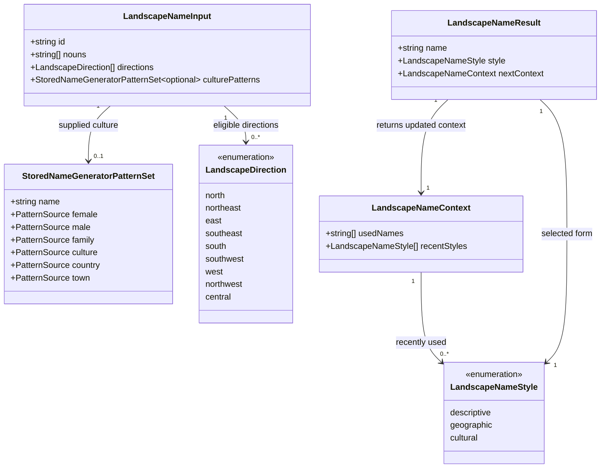
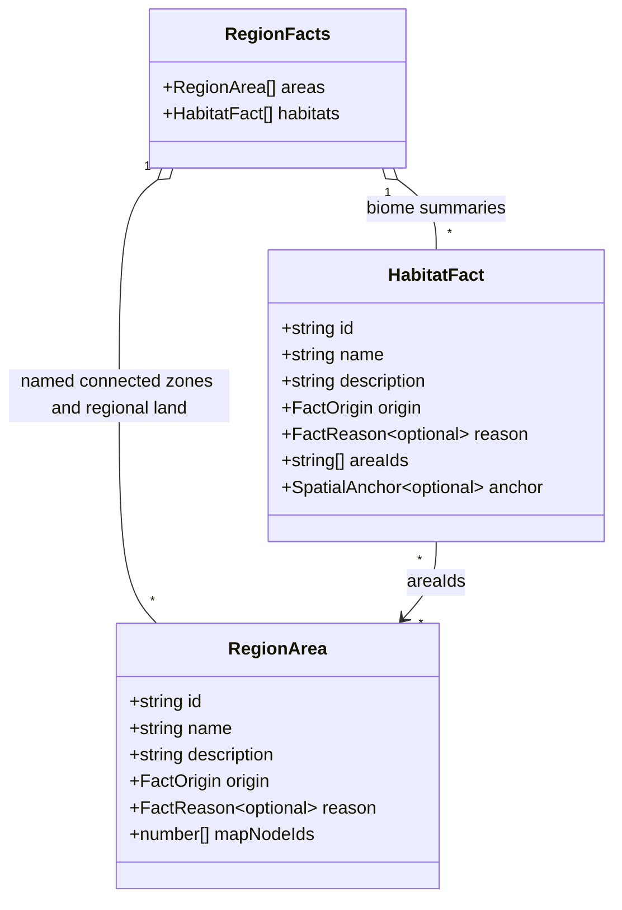

# Regional landscape names

**Status:** implemented — domain model approved by Ben on 2026-10-03.

## Problem

The Landscape section presents spatial zones as technical labels such as “central montane
grassland zone” and repeats “The Landscape of” before every heading. Readers need memorable
place names, occasional names drawn from the dominant culture, and accurate landscape descriptions.
The regional-land introduction remains unheaded.

Landscape facts represent two different things: connected spatial zones (`RegionArea`) and
region-wide biome summaries (`HabitatFact`), which may span several disconnected places. Naming
both as separate places would suggest geographic divisions that the map does not establish.

## Decisions

1. **Name connected landscape zones.** Add a reusable `generateLandscapeName` function to
   `src/lib/names`, with transient types in `landscape_name_types.ts` and vocabulary/templates in
   `landscape_names.ts`. The region adapter supplies eligible nouns and directions from the saved
   map. Store the returned string in each generated zone's existing `name` field.
2. **Mix three styles.** Start with weights of 55 for evocative descriptive names, 30 for geographic
   names, and 15 for cultural names. Only eligible styles participate. Examples illustrate the
   intended tone, not fixed output: “the Whispering Woods”, “the Eastern Woods”, “the Quiet
   Grasslands”, and “Dobby’s Hills”. Cultural names are an occasional accent, not the default.
   Descriptive names combine curated folk-name epithets with compatible landscape nouns; these
   names do not add historical events, owners, monsters, resources or other claims to descriptions.
3. **Use culture naming when supplied.** Cultural forms use a personal name (female or male)
   or a family name from the dominant culture, followed by a compatible landform noun; personal
   forms use a possessive. A name such as “Dobby’s Hills” is a toponym, not a generated resident
   or proof of ownership. Without a dominant culture, omit this style rather than silently using
   the settlement naming set. Empty or unavailable name output falls back to a descriptive form.
4. **Ground the landscape nouns.** Forest biomes offer Woods, Forest or Woodlands; grassland
   biomes offer Grasslands, Downs or Plains where compatible; desert, wetland and tundra biomes
   have their own vocabulary. Hills, Heights and Mountains require support from the existing
   map landform classification of the zone, rather than guessing from its biome's name. Plains
   require flat terrain; Downs require hilly terrain. No invented
   tree species, farms, mineral colors or landmarks. Unknown biomes retain a readable descriptive
   fallback. Vocabulary eligibility is explicit, not substring-driven guesswork.
5. **Ground geographic adjectives.** Directional candidates use the map's existing thirds,
   with a direction eligible only when at least two-thirds of the footprint lies in that side.
   Compound directions require both component directions to qualify. Central is eligible only
   when two-thirds lies in the central third on both axes. Broad or scattered footprints can omit
   direction. Shape adjectives such as Long require an explicit footprint-shape rule; the initial
   implementation omits them until such a rule exists. Ordinary poetic epithets need no new
   geographic assertion.
6. **Avoid repetition across the region.** Pass an explicit naming context with used names and
   recent styles. Prefer different eligible forms within a batch; avoid duplicate names across
   zones with case- and whitespace-normalized comparison. Use bounded retries and then a stable
   human-readable qualifier, never visible fact IDs. Do not keep mutable module-level state.
7. **Keep summaries honest.** Region-wide biome summaries retain their existing technical `name`
   internally because ecology and other consumers use it. Their Landscape headings use readable
   category wording such as “Woodlands across the region” or “Montane grasslands across the region”,
   without “The Landscape of”. They are summaries, not additional named places. Zone headings
   display their saved names directly. A named zone and a summary remain separate descriptions;
   this change does not remove facts or merge footprints.
8. **Isolate naming randomness.** Add a `landscape-names` region stage after habitats and before
   ecology/resource consumers. Capture the dominant culture's pattern sources without drawing
   names, then rebuild generators with this stage's RNG through the existing names API. Never
   consume the original culture generators. Naming helpers accept the caller-owned RNG. The
   stage changes only zone names: IDs, anchors, footprints, habitat ranking and description
   selection stay stable. Downstream prose may naturally reuse the new saved zone names.
9. **Preserve saved work.** No persisted fields, versions or migrations are added. Existing saved
   and authored names load verbatim; rendering and export do not generate names. The page,
   Markdown, standalone PDF and project publication reuse stored zone names. The UI wrapper
   removal applies to existing names too. The generic “Regional land” remains unheaded.

## Domain model

All new types are transient and owned by `names`. The region adapter selects factual naming
options before calling the generator. The generator returns a name and the next batch context;
only the name is persisted through an existing `RegionArea` field.

`culturePatterns` is an optional property (`culturePatterns?: StoredNameGeneratorPatternSet`).
`PatternSource` abbreviates the existing `string[] | PatternSet` type; its definition is unchanged.
The generator signature is `generateLandscapeName(input, context, rng): LandscapeNameResult`.

These persisted types already exist. Naming changes only `RegionArea.name` for generated habitat
zones; `area:land` and `HabitatFact.name` are unchanged. Zone identity never comes from the new name.

## Determinism review

The inspected path is `rollRegion` → `generate` → `generateHabitatFacts`, with cultural naming
through `nameGeneratorSetToStoredPatternSet` / `nameGeneratorSetFromPatternSources` and the installed
made-up-names `BaseNameGenerator`. Region generation already captures naming patterns and rebuilds
settlement generators on the habitation stream. The new naming stage follows that boundary.
`BaseNameGenerator` and its word generator use the supplied RNG; its live generators must not be
shared into the new stage. Clock-seeded defaults in unrelated convenience functions are outside
this path and must not be used here. Focused tests repeat the complete cultural generation path even after the supplied culture’s live
generators have advanced; saved names and settlement names repeat. Isolated extra naming draws
leave geography, all non-name zone fields, habitats, settlements and realms unchanged.

## Verification

Verify repeated seeds and changed seeds, culture-pattern fidelity, no mutation or consumption of
live cultural generators, and descriptive fallback without a culture. Test all biome/noun
compatibility rules, directional eligibility, duplicate avoidance, possessives and empty cultural
output. Verify graph order independence and isolated extra draws in the naming stage, including
unchanged terrain, footprints, IDs, settlements and realm names. Update tests that locate facts
by display name to use stable identity where appropriate. Check saved/authored names in the page
and exports, direct zone headings, summary headings and the unheaded regional introduction.
Verification on 2026-10-03 passed: `npm run verify` (6,911 tests and the per-library coverage
gate), all 12 region desktop browser tests, and the region layout checks at all five phone widths.
Run `verify:all` before merging rendering changes.
