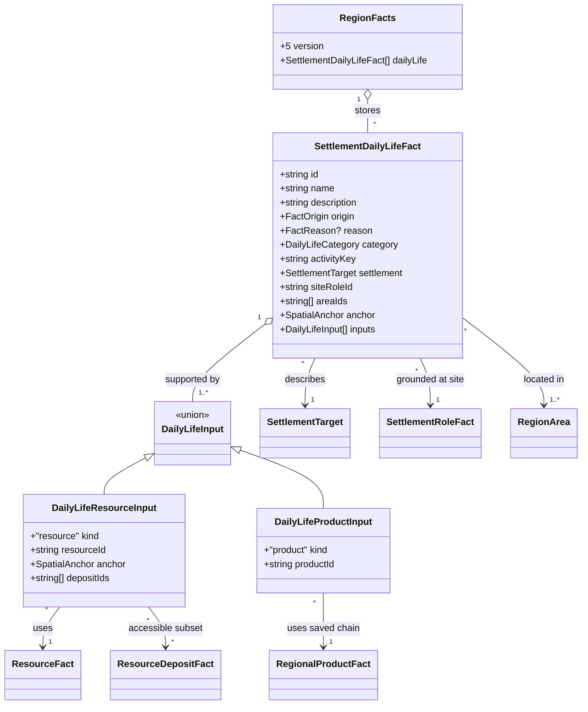

# Regional livelihoods and daily materials

**Status:** implemented for [#340](https://github.com/ironarachne/ironarachne/issues/340)
following explicit human approval of this design and domain model on 2026-10-01.

## Problem and boundary

The [material-culture epic #324](https://github.com/ironarachne/ironarachne/issues/324)
needs settlement-scale explanations of how people live from this landscape. The accepted
[resource model](region-resources.md) records raw supply and the accepted
[processing model](region-processing.md) records possible production chains. Neither chooses
representative livelihoods, ordinary foods, construction materials, fuel or crafts.

Extend `$lib/regions` with stored daily-life facts and a settlement-context API. Reuse
`$lib/resources` catalog identities and the existing evidence graph. These are qualitative
fantasy generation choices, not prices, workforce counts, dietary completeness, extraction yields
or a numerical economy. Dedicated gazetteer UI and comprehensive assembly remain #344; #340
provides reusable facts and descriptions without changing standalone settlement payloads.

## Decisions

### 1. Store each assertion with its inputs

Add `RegionFacts.dailyLife: SettlementDailyLifeFact[]`. Each fact describes one livelihood,
staple, building material, fuel or craft, belongs to a settlement and records its site role,
source inputs, settlement anchor and area IDs. A versioned rule and stable `activityKey` identify
the selection independently of editable text. IDs use the `daily-life:` prefix.

Raw inputs retain the actual accessible resource anchor and geological deposit subset. Product
inputs link to saved processing facts; their complete chains are resolved through the existing
processing-chain API. No display-name matching, unnamed material substitution or invented
imports. Reasons cite the site role and all direct inputs; the source graph leads back through
habitats, ecology, geology and saved map observations.

Generated livelihoods are representative ways of living selected from supported opportunities.
Their descriptions preserve limited-supply qualifications. They establish no commercial scale,
permanent mine, workshop or cultivated acreage. Crafts remain plausible household work under
the recorded technique/tool assumptions. A potential processing chain alone is not an industry.

### 2. Use coarse local access, including water without inventing transport

A settlement needs a valid dry-land site and a current site-role fact. Reuse the saved dry-land
neighbor graph from processing for terrestrial resources and accessible surface/shallow
deposits. State that this is coarse overland access; map coordinates provide no travel distance
or catchment radius. Deep deposits, drilling, trace deposits, unknown/not-observed resources,
stale evidence and disconnected land do not support generated daily-life facts.

Fish need a separate shore-access check: a supporting aquatic resource node must be adjacent
to the settlement's dry-land site, or its resource anchor must explicitly include that site.
A coastal role alone does not establish fish supply, boats, navigability or offshore fishing.
Freshwater use needs a reachable saved freshwater resource; ocean adjacency supplies no freshwater.
Product inputs must belong to the same settlement and have a complete current local chain.
Chains containing imports are excluded from generated selections; #341 owns import explanations.

Accessibility helpers can be shared inside regions, preserving processing's existing behavior.
Catalog metadata identifies raw food and materials; structured resource kinds identify water,
timber and cultivation potential where no catalog descriptor exists.

### 3. Conservative first rule catalog

| Category          | Supported selections                                                                                                                | Required evidence                                                                                                                                   |
| ----------------- | ----------------------------------------------------------------------------------------------------------------------------------- | --------------------------------------------------------------------------------------------------------------------------------------------------- |
| Livelihood        | Fishing, hunting, timber gathering, fiber gathering, surface/shallow mineral extraction, possible cultivation, household processing | Corresponding accessible raw inputs or same-settlement saved product chain; cultivation additionally needs current arable-land and freshwater facts |
| Staple            | Represented fish or game meat; saved smoked/dried provisions                                                                        | Catalog-derived edible raw input, or an eligible saved food product with its complete chain                                                         |
| Building material | Raw timber, reeds/papyrus for thatch, workable quarry stone, sawn timber/construction components, dressed stone                     | Compatible catalog metadata or saved product key; geological inputs retain accessible deposit IDs                                                   |
| Fuel              | Gathered timber, saved charcoal                                                                                                     | Supported timber resource or complete charcoal chain                                                                                                |
| Craft             | Woodworking, mat weaving, linen weaving, stone dressing, basic iron toolmaking, food preservation                                   | Eligible saved product with all material, fuel and water dependencies and declared tools/facilities                                                 |

Cultivation is described as a supported opportunity. Arable land and water never invent a named
crop or staple. The present plant-product catalog contains fiber stems, not cereals, fruit or
vegetables; the first rules must honestly leave those foods unrepresented. No domesticated herd,
milk, eggs, wool, bread, leather, brick, salt, steel, refined oil or gas is inferred without its
own supported source/processing definition. Reed/papyrus supports thatch and mats, not cloth;
flax cloth requires the saved water-dependent linen chain.

For this coarse fantasy model, the staple category means representative locally supported food
choices, not proof that hunting/fishing supplies sufficient calories year-round. Descriptions
explicitly identify these as an incomplete food picture and distinguish limited sources.
Animal occurrence alone cannot yield food: require the saved catalog-derived edible resource.

Site roles remain geographic. A port can also gather timber; a crossing can also weave mats.
Rules must not relabel a site as an industrial or agricultural center. Prioritize compatible
livelihoods using stable site rule IDs and inputs, never the editable role name: a forest site
prefers supported timber work, a shore site supported fishing, and an agricultural site supported
cultivation with water. Missing inputs omit the assertion instead of forcing the preferred label.

### 4. Bounded deterministic generation and reusable descriptions

Run a named `livelihoods` stage after processing and before notables/presentation, with its own
seed stream. Sort settlements, roles, resources, products and candidates by stable semantic IDs
and rule keys before selection. Per settlement, retain at most three livelihoods, three staples,
three building materials, two fuels and three crafts. Sparse sites may have empty categories.
Do not rerun processing or create an omitted processing family to fill a craft slot.

Keep daily-life inputs separate from category selections: a selected craft may cite a product
even when that product is not independently selected as a building material or staple. This avoids
category caps breaking evidence chains. Selection adds facts only; it never rewrites map, roles,
ecology, resource availability, products or settlement snapshots.

Export an API that groups saved facts by stable settlement target and category, and one that
composes a concise daily-life description from those saved facts. Include the supplied-input
explanations and stale status for inspectors; ordinary prose identifies stale assertions as
needing review rather than repeating them as current support. Empty categories produce no
invented fallback food/material. Neither reading nor describing regenerates selections.

### 5. Persistence, validation and editing

Bump `RegionFacts.version` from 4 to 5 and region payload version from 6 to 7. Migrations from
versions 1–6 preserve their existing content and gain `dailyLife: []`. Migration never selects
livelihoods or foods for an old settlement. Unknown saved activity keys remain readable through
stored text and reasons; unknown structural categories are rejected without discarding the artifact.

Validate IDs, category variants, settlement targets, site-role references, area/anchor membership,
resource/product input variants, geological subsets and same-settlement product links. Generated
current facts require current usable inputs and valid access; authored/stale explanations remain
readable with structurally valid links. Fantasy selection rules stay outside generic validation.

Extend fact text editing and dependency traversal to daily-life facts. Edits retain identities and
input links, mark the fact authored and stale dependent explanations. Source, product, role or
settlement removal removes direct generated dependents, protects authored dependents and stales
reason-only dependents according to the existing contract. A saved daily-life text edit must survive
loading and export without rebuilding from the seed.

## Domain model

`SettlementDailyLifeFact` extends the existing `FactBase`, including editable `id`, `name`,
`description`, `origin` and optional `reason`. `DailyLifeCategory = 'livelihood' | 'staple' |
'building-material' | 'fuel' | 'craft'`. The input union records local sources only; imports
remain processing-chain data and are not generated support for this issue.

No new standalone settlement type, economy library or resource catalog representation is introduced.
`FactReason`, `SpatialAnchor`, `SettlementTarget` and all upstream fact types retain their shapes.
The settlement context API returns the saved daily-life facts grouped by category; no additional
persisted aggregate profile is needed.

## Verification

Use controlled contrasting coastal, forest, grassland and quarry/mineral fixtures. Assert every
selected food/material/craft traces to current compatible inputs and the correct settlement.
Exercise freshwater-dependent cultivation and linen, shore fish access, shallow workable deposits,
complete iron fuel/handle chains, limited supply, disconnected sources and empty categories.
Verify missing/stale inputs omit candidates; raw fiber does not become cloth, arable land does not
become grain, and oil/ore does not become manufactured fuel/tools without the required chain.

Test bounded selection, input/list reordering, repeatability and isolation of the named stream.
Test validation failures, versions 1–6 migrations, edited round trips, authored dependency protection,
and resource/product/role/settlement removal. Test settlement descriptions from saved facts,
including stale and empty contexts. Run `npm run verify` without relaxing coverage. If implementation
changes routes, components or rendering, run `npm run verify:all` before merging.

## Implementation notes

The current species-product catalog has no fish carcass subtype, so the fishing rules are exercised
with a controlled catalog fixture and do not fabricate fish in generated regions. Named crops also
remain absent from the raw inventory. Forest, cultivation and quarry fixtures demonstrate distinct
supported daily life with the existing catalog. Extending fantasy species/material catalogs remains
separate work; the source checks will consume supported future fish inputs without relabeling a port
as a food source.

Save validation and description helpers use lightweight evidence modules rather than importing live
species or recipe catalogs. Stored chains and unknown activity keys remain readable when catalogs
change. Settlement removal shares the resource dependency traversal so reason-only descendants are
staled transitively and authored inbound work is protected.
