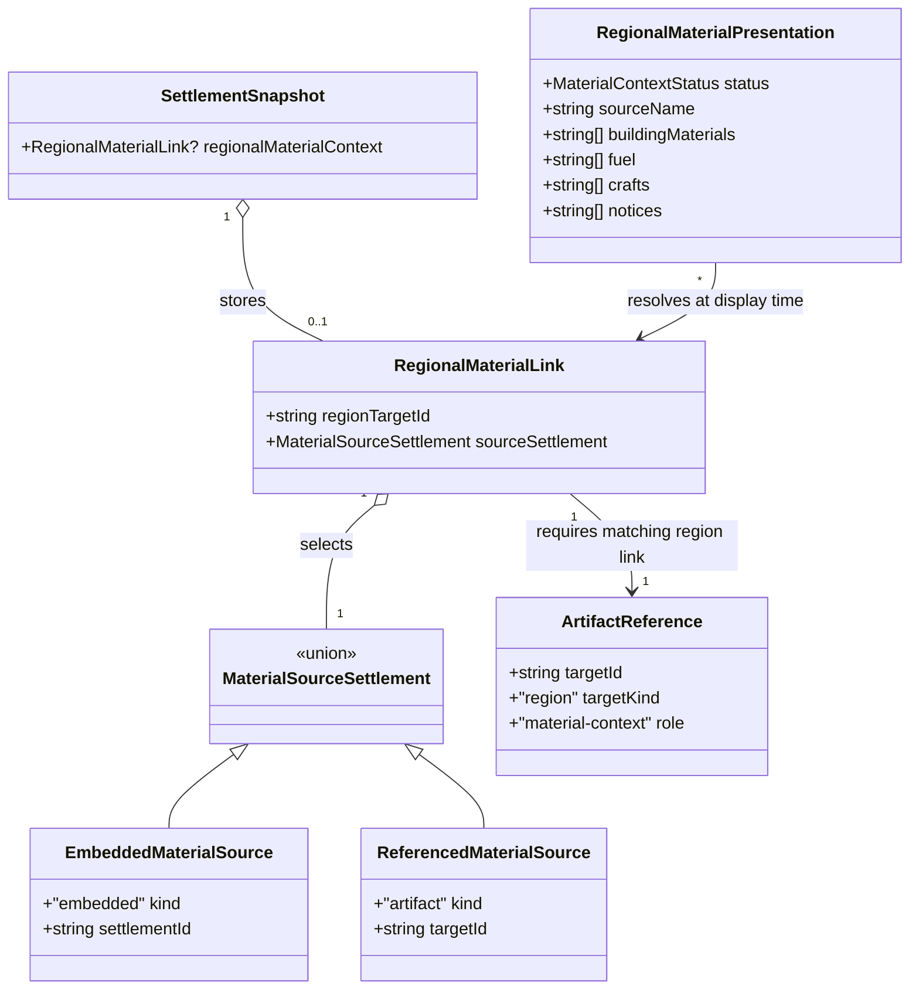

# Regional materials in the settlement tool

**Status:** proposal for [#342](https://github.com/ironarachne/ironarachne/issues/342).
Implementation awaits human approval of this document and domain model.

## Problem and boundary

The approved [daily-life model](region-livelihoods.md) already exposes saved materials and crafts
by settlement target. The standalone settlement tool cannot consume that context. Add one
optional composition path in the settlement generator and editor, rather than changing equipment,
crafting and every other settlement consumer together.

The user selects a saved region and a source settlement in that region. The tool displays a
regional material reference beside the generated settlement: building materials, fuel and
crafts supported at the selected source. The source's name is explicit. Selecting an example
does not establish the new settlement's position or access to those supplies. This is a useful
material-culture reference, not automatic geographic placement or an economy simulation.

## Decisions

### Reuse the saved chains

A new regions presentation helper projects the existing daily-life context to building-material,
fuel and craft categories. It follows `DailyLifeInput` through canonical saved resources and
processing chains. Preserve limited-supply and tool/facility qualifications. Stale evidence is
shown as needing review rather than as a current material recommendation. No raw ore becomes
tools, generic fiber becomes cloth, or arable land becomes an invented crop.

The projection does not select new livelihoods, reroll processing, parse editable prose or copy
facts into the standalone settlement. Reuse the existing current-evidence helpers and complete
chain resolver. An empty category is omitted; empty overall context is an explicit ordinary
state. Legacy regions are selectable but may have no recorded materials.

### Save a link and a regional settlement identity

Add nullable `regionalMaterialContext` to live `Settlement` and `SettlementSnapshot`. It contains
the chosen region's artifact ID and source `SettlementTarget`. Save the matching artifact
reference with `targetKind: 'region'` and `role: 'material-context'`. Embedded source settlements
use the existing region-local ID; referenced source settlements use their artifact target ID.
Never use list positions or display names as keys.

Only a successfully loaded region and existing source target can establish a new selection.
Choosing or clearing context is a composition edit independent of generation, as religion
attachment already is. Seed and standalone RNG behavior do not depend on this reference.
Changing controls does not falsely rewrite the configuration of a previously rolled settlement.

The context stores no region snapshot, daily-life facts, product chains, resource descriptions,
material names or source settlement copy. The generated settlement's ordinary prose remains
its own editable content. The linked material section is assembled from the current resolved
region and remains visibly attributed to the selected source.

### Resolve consistently in generator, editor and export

Use the existing artifact picker and workshop resolver. Keep asynchronous resolution in UI;
library projection receives the resolved snapshot. Reject a wrong target kind or a missing
matching reference when validating a new save. Refresh the selected source list after a region
edit; a missing source becomes unresolved rather than silently selecting another town.

Loading a saved settlement resolves its context afresh. Region deletion, removed source,
unreadable/future region payload and source-kind mismatch produce a visible unavailable section
while preserving the settlement and stored link. A region with stale facts preserves authored
text and displays review status. No failed resolution prevents opening, editing or exporting
the settlement's standalone content.

Markdown, plain text and PDF use the same optional resolved context presentation as the page.
When resolution fails, include an attributed unavailable notice, never an obsolete copied
material list. Resolution occurs once for an export so a single document uses one consistent
source snapshot. A newly generated unsaved settlement can display and export the selection;
saving persists the link and matching reference.

### Migrate without inventing composition

Move the standalone settlement payload from version 3 to 4. Existing versions 1–3 follow the
current mechanics migrations and receive `regionalMaterialContext: null`. Preserve all existing
settlement content, provenance and references; no old settlement acquires regional facts.
Unknown future payload versions retain the vault's unsupported-payload behavior.

Region-embedded `SettlementSnapshot` values also gain the field through the region codec's
migration: increment its current payload version 8 to 9 and add `null` to embedded settlements
from versions 1–8 after their existing migrations. Do not change `RegionFacts.version` or
regenerate the map. Region-generated settlements use `null` by default. Exporting a settlement
with a link must not recursively expand a referenced region or another settlement's material
context; resolve only the selected region's daily-life facts. This prevents composition cycles.

## Domain model

`RegionalMaterialLink` is owned by settlements. Its source target is a neutral union with the
same representation as `SettlementTarget`; regions adapts it without introducing a circular
settlements-to-regions import. Presentation values are transient and never serialized.

`MaterialContextStatus = 'current' | 'needs-review' | 'empty' | 'unresolved'`.
Nullable persisted context uses `null`, not an omitted required field in version 4.
`RegionalMaterialPresentation` has no source payloads or writable references to stored facts.
Live `Settlement` carries the same optional link as its snapshot.

## Verification and acceptance

Demonstrate contrasting timber, reed and quarry source settlements, with visible material
details traced to their saved resource/product chains. Test stale, authored, limited, imported,
unknown and empty contexts; preserve each chain's existing qualifications. The section must
name the source settlement and must not claim access for the newly generated settlement.

Verify standalone seeded rolls remain identical apart from the new null field. Test settlement
versions 1–3 and region versions 1–8 migration, JSON/codec round trips, missing matching
references, wrong kinds, invalid target variants and unknown future versions. Renaming or
reordering sources retains the selection; deleting a region/source preserves the consumer with
an unresolved state. Context cycles do not cause recursive resolution.

Browser coverage saves a region, picks its source in the settlement tool, saves/reopens the
consumer, edits the region and verifies refreshed page/export material detail. Cover loading
races, project changes, missing sources, clearing context, mobile controls and standalone use.
Run `npm run verify`; run `npm run verify:all` before merging these rendering changes.

## Implementation boundary after approval

Implement the saved link and codec migrations, regions presentation projection, settlement
generator/editor composition controls and consistent export treatment. Equipment and crafting
generators remain potential later consumers of the same source facts.
