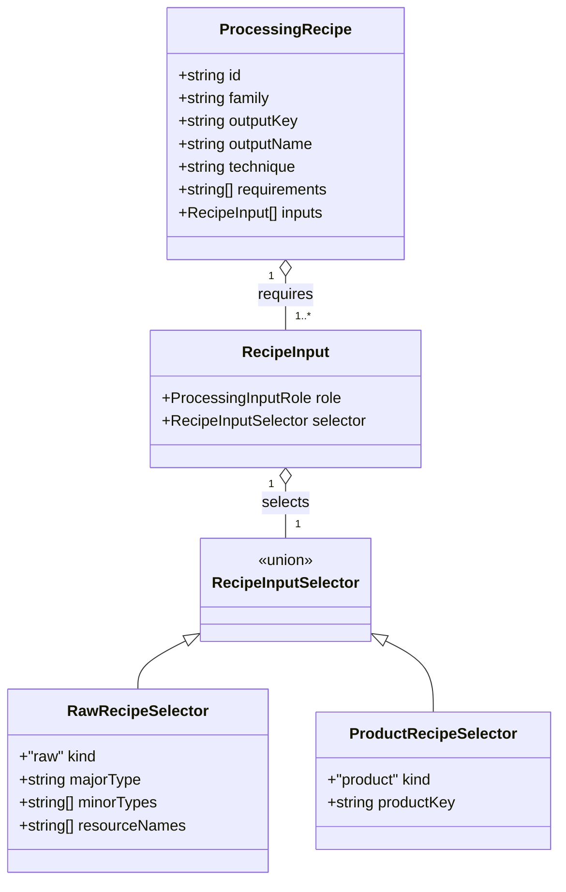
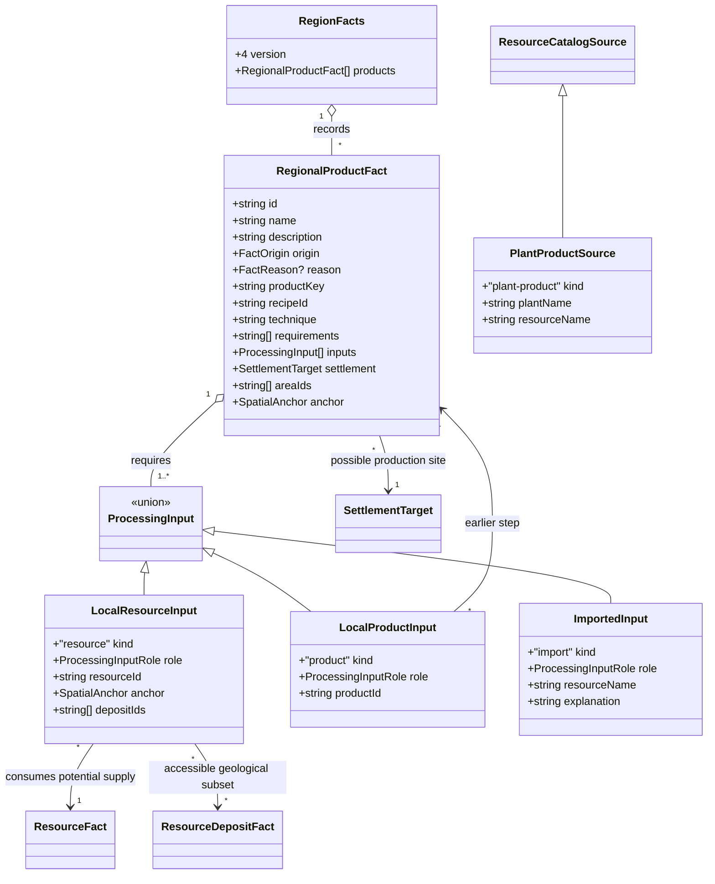

# Regional processing chains and products

**Status:** implemented for #339 following human approval on 2026-10-01. The human reviewer approved the model, with fantasy catalog follow-ups tracked in [#364](https://github.com/ironarachne/ironarachne/issues/364) and [#365](https://github.com/ironarachne/ironarachne/issues/365).

## Problem and boundary

The [material-culture epic #324](https://github.com/ironarachne/ironarachne/issues/324) needs
representative local products with inspectable input chains. #338 stores potential raw supply,
not extraction technology or local industry. Ore, oil or gas presence cannot by itself establish
manufactured goods. This extends the accepted [resource model](region-resources.md).

The existing `$lib/resources` owns `Resource`, species-product derivation, building materials,
geological resources and `RefinementProcess`. The latter has no implemented recipe catalog and
requires quantitative time, yield and technology fields that Regions does not model. Equipment's
refinery applies item modifiers such as polished or reinforced; it does not turn ore into metal.
Add a small qualitative recipe catalog to resources and saved product facts to regions, rather
than creating another crafting library or inventing quantitative refinement data.

## Decisions

### 1. Products are potential local outputs with a dependency graph

Add `RegionFacts.products: RegionalProductFact[]`. Each product fact is one processing step,
with a stable product key, versioned recipe ID, technique, explicit requirements and typed
inputs. A resource input refers to a saved raw-resource ID and records the specific accessible
anchor/deposits used. A product input refers to an earlier product fact. Walking these links
shows the complete chain, including fuel and other required inputs. Names remain editable;
matching never uses a fact's display name.

The facts describe what a settlement **could produce** under the declared fantasy craft
capabilities. They do not assert that a workshop, workforce, mine, farm or trade industry
already exists. #340 owns livelihoods and staple selection. Persist the technique and
requirements so an old chain remains understandable when its recipe catalog changes.

An imported input stores its resource name and explanation explicitly. #339 never creates an
import to rescue a missing local input. Authored chains may declare imported inputs; #341 will
provide generated import explanations through its reviewed model. Imported inputs cannot be
presented as local extraction or traced to an invented regional resource.

### 2. Accessibility and capabilities must support every input

Run a new named `processing` stage after habitation and ecology relationships, before notables
and presentation. A generated product belongs to an embedded settlement with a valid dry-land
site and current site role. Raw inputs need current positive availability, a reachable source
on the saved dry-land neighbor graph and current supporting facts. No map distance, boat access
or imported transport is implied. Intermediate inputs belong to the same settlement.

For geological resources, select actual reachable workable/rich deposits. The first fantasy
policy permits surface gathering/quarrying and shallow mining. Deep mining and drilling remain
unavailable to this policy. Oil/gas stay saved geological resources without automatic refined
fuels. A raw resource that combines accessible and inaccessible deposits uses only its recorded
accessible subset in the chain.

The first policy declares basic woodwork, fiber preparation, spinning/weaving, charcoal making,
bloomery smelting, forging, stone dressing, smoking and drying as possible craft capabilities.
A recipe carries the required techniques/tools/facilities as explicit assumptions, not evidence
that a real workshop exists. Recipes missing any material, fuel or water input are omitted.
No advanced metallurgy, steelmaking, petrochemicals or magical substitution is inferred.

### 3. Representative recipes and honest textile inputs

Include these representative families:

| Family              | Required chain                                                                                                                                     |
| ------------------- | -------------------------------------------------------------------------------------------------------------------------------------------------- |
| Timber construction | Supported timber → sawn timber → construction components.                                                                                          |
| Fiber work          | Reed/papyrus stems → mats or thatch; textile-capable flax stems + freshwater → prepared fiber → yarn → linen.                                      |
| Iron tools          | Timber → charcoal; compatible accessible iron ore + charcoal → bloomery iron; iron + charcoal + timber for handles → simple iron tools.            |
| Preserved food      | Catalog-derived raw meat + supported timber fuel → smoked provisions; raw meat → dried provisions as a separate drying recipe. No salt is assumed. |
| Stone work          | Accessible raw quarry stone → dressed stone, using corresponding building-material catalog entries where they exist.                               |

A recipe's input list is exhaustive for its declared coarse model. Furnace, forge, loom and
tool requirements are named craft assumptions; consumption quantities, temperature, processing
time, nutritional completeness, shelf life and success rates are outside this model. Iron
uses an explicitly basic bloomery route, not a blast furnace or alloy recipe with omitted flux.
These are game-generation rules, not practical instructions for making food or metal.

The current fiber inventory only generates reeds/papyrus. These support mats and thatch,
not automatic cloth. Add a reviewed flax flora rule for suitable temperate grassland cells,
producer metadata and raw flax-stem derivation, together with a small plant-product catalog
in `$lib/resources`. A represented plant occurrence supports possible fiber gathering, not
acreage, domestication or a cultivated crop. Local ranges are explicit coarse generation rules,
not botanical range maps. Flax can support linen; cotton and wool need their own future source
metadata. See [Kew's flax/fiber account](https://powo.science.kew.org/taxon/urn%3Alsid%3Aipni.org%3Anames%3A30003859-2/general-information).

Add a `plant-product` variant to `ResourceCatalogSource` so reed, papyrus and flax products
have stable plant and resource identities. No migration retrospectively assigns new plant links
to old descriptive resources. A resolver may establish an old reed/papyrus identity from its
existing saved inhabitant sources, never its mutable display name. Reuse species derivation,
raw geological definitions and building-material entries when constructing recipe candidates.

### 4. Bounded, deterministic selection and reusable APIs

Sort candidates by recipe ID and semantic input IDs before random selection. Select up to three
representative families, with at most twelve product facts including intermediates and depth
at most four. Save every required intermediate of a selected output; caps must never leave an
orphaned final product. Omit an entire chain if its closure does not fit. Sparse or inaccessible
regions may produce fewer families or no products. Controlled fixtures and representative
seeds must demonstrate multiple families, including a full iron and textile chain.

`$lib/resources` exports the recipe catalog and input compatibility helpers using resource
metadata and product keys, without importing region types. `$lib/regions` exports product
chain resolution that returns ordered product steps and local/imported leaves, preserving
requirements and evidence. Downstream item generators can consume this resolved context;
#342 will integrate particular consumers. Resolution reports missing/stale links and cycles
rather than silently substituting another product or rerunning recipes.

### 5. Persistence, validation and editing

Bump `RegionFacts.version` to `4` and region payload version to `6`. Versions 1–5 migrate through
their existing paths and gain `products: []`. Preserve all existing map, geology, resources,
ecological facts, text, identities, availability and reasons. Migration produces no chains.
Unknown saved product keys and recipe IDs remain readable with their saved explanatory fields.

Products join the fact-ID namespace with `product:` IDs. Validate input variants, source
references, settlement/area IDs, spatial membership and an acyclic product dependency graph.
Current generated chains require usable current raw supply and compatible source anchors;
stale reasons preserve readable old explanations while explicit direct links remain valid.
Imported inputs need a nonempty explanation. Fantasy recipe compatibility remains generation
logic, not a generic payload validator requirement.

Extend existing resource edit/removal traversal to products. Raw source or product edits stale
all downstream explanations. Removing a source removes direct generated product dependents,
protects authored inbound dependencies and stales reason-only dependents. Settlement removal
also accounts for product chains and protects authored work. Product text edits retain their
IDs and input graph. Neither loading nor exporting recalculates products.

Dedicated product displays and gazetteer assembly remain #344. This issue supplies the saved
facts and reusable APIs; it does not expand routes, rendering or the full crafting system.

## Domain model

The shared recipe types are qualitative. Output keys identify catalog definitions; input
selectors use catalog metadata, not editable region names.

Empty `minorTypes` or `resourceNames` means any matching catalog member of that major type.
`ProcessingInputRole = 'material' | 'fuel' | 'water'`.

`ProcessingInput` is exactly the discriminated union represented above. `RegionalProductFact`
extends the existing `FactBase`; anchors and source IDs use their established saved-map semantics.
Plant-product references extend the #338 catalog-source union; shared raw plant products reuse
`Resource` rather than introducing another material representation.

## Verification after approval

Verify positive complete chains for timber, flax, iron, food and stone; omit outputs when ore,
fuel, handles, water, textile fibers or necessary intermediate products are absent, stale or
inaccessible. Test deep deposits and drilling exclusions, explicit imported inputs, matching
without display names, stable ordering and named-stream isolation. Test bounded selection with
complete intermediate closure, cycle rejection and reusable chain resolution. Cover migrations
from versions 1–5, edited save round trips and source/product/settlement removals with authored
dependencies. Run the repository verification gate without weakening coverage requirements.
