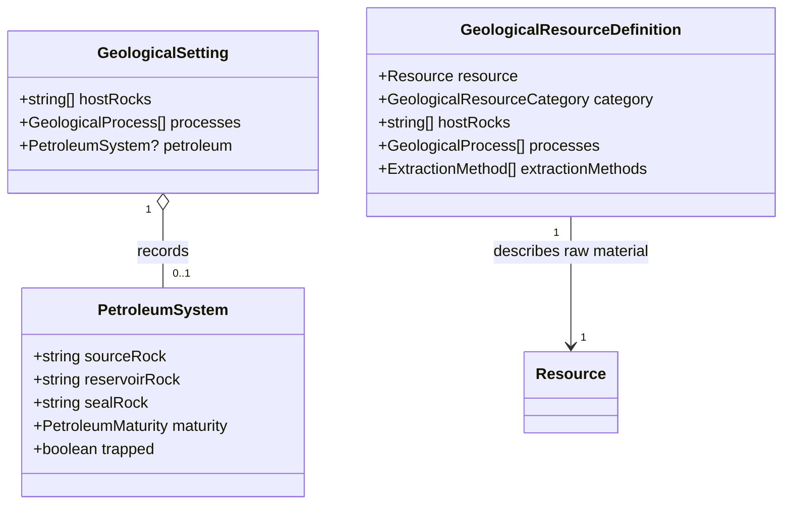
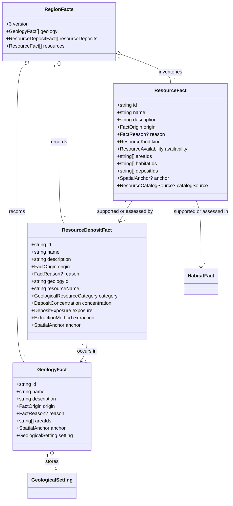

# Regional raw resources and geology

**Status:** accepted. The human reviewer approved the revised domain model on 2026-10-01. Implemented for #338.

## Problem and scope

#338 needs a bounded raw-resource inventory grounded in geography and ecology. The user
explicitly expanded its scope to geological generation: metal ores, gemstones, multiple
stone types, oil and gas, with gas available for later sci-fi consumers.

The terrain system already saves `GeologicalMakeup.soilTypes` and `rockTypes`. These are
broad randomly selected material lists, not located geological formations or deposits.
The previous proposal incorrectly described geological inputs as entirely absent and
would have left geological generation unimplemented. This revision replaces that approach.
It extends the accepted [Regions release contract](regions-release-contract.md), including
its restriction that ore claims require a new saved geological input.

Expand the existing environment/geography and resources systems. Generate coarse geological
settings, locate them in the saved region and record deposits. Feed those deposits into the
resource inventory. All requested geological categories ship in #338; they are not deferred.
This is a procedural fictional-world model, not a mineral survey or detailed geological
simulation. Processing, industries, technology, livelihoods and imports remain #339–#341.

## Decisions

### 1. Geological settings belong to geography

Add pure geological-setting types, curated compatibility rules and a seeded setting generator
to `$lib/environment`. It consumes the terrain's saved rock and soil vocabulary. Expand that
vocabulary with shale, quartzite, schist, gneiss, pegmatite, kimberlite, dolomite and evaporite rock alongside
existing granite, basalt, limestone, sandstone, obsidian, slate and marble. Keep existing
`GeologicalMakeup` fields and the standalone environment snapshot shape unchanged. Retain the
established surface-rock draw pool to avoid shifting unrelated composed generators; the new
geological-setting generator adds compatible associated subsurface rocks from the expanded vocabulary.

A setting lists actual host rocks and a finite set of permitted geological processes. A rock
permits certain settings but never guarantees a deposit. Curated configurations must keep host
rocks and processes compatible. A petroleum setting additionally records source rock,
reservoir rock, seal rock, maturity and trap presence. Oil and gas require that complete
compatible setting; sandstone alone does not imply petroleum. These are generated world
facts, saved before deposit selection, not explanations invented after choosing a commodity.

In `$lib/regions`, wrap settings in `GeologyFact` objects with existing fact identities,
locations and reasons. Generate at most four provinces over regional land, covering every
saved land node exactly once. Provinces may group separated patches; they are coarse material
zones, not claims of continuous formations, faults, stratigraphic sections or geological ages.
Stable node ordering and deterministic assignment make province membership reproducible.
Their reasons cite saved terrain geology and anchored land observations. Do not change
map elevations, rivers, biomes or habitat membership to justify a formation.

Use a new named `geology` stream after physical geography and before habitats. All setting
choices and province assignments belong to that stream. Existing named stages retain their
seeds. Later resource choices cannot change geological settings.

### 2. Expand the resource catalogs and occurrence rules

Add `GeologicalResourceDefinition` and curated raw-resource definitions to `$lib/resources`.
Definitions reference existing `Resource` entries where appropriate; they add geological
category, compatible host rocks/processes and allowed extraction methods. The existing ore
catalog remains the public source for metal resources; occurrence metadata is separate from
its material properties. Existing metal commonality may weight a compatible procedural choice,
but is never itself evidence of a deposit.

Initial coverage includes:

- Metal ores: iron, copper, tin, lead, zinc, gold and silver, with explicit compatible
  occurrence rules. Existing metals without rules remain catalog resources without automatic
  regional deposits; document exactly which are covered.
- Gemstones: quartz/amethyst, garnet, beryl, corundum (ruby/sapphire) and diamond, with distinct
  compatible hosts/processes. Gem-quality concentrations require a selected gemstone deposit;
  trace minerals are not automatically gem resources. Diamond rules require a compatible
  generated volcanic-pipe setting, not arbitrary basalt.
- Raw stone: granite, basalt, limestone, sandstone, slate, marble, quartzite and obsidian.
  Produce raw stone occurrences, not catalog ashlar, blocks or tiles.
- Other geological materials: clay, sand, gravel, salt, gypsum and coal, with appropriate
  surficial, evaporite or organic-sedimentary settings.
- Hydrocarbons: crude oil and natural gas. Generate them from compatible saved petroleum
  settings and record subsurface access requirements. Gas means natural gas here; exotic or
  atmospheric sci-fi gases can extend the catalog later.

Compatibility follows simplified geological associations, not biome stereotypes. The design
uses [USGS mineral deposit models](https://pubs.usgs.gov/bul/b1693/),
[gemstone environments](https://pubs.usgs.gov/gip/gemstones/environment.html) and
[petroleum-system elements](https://pubs.usgs.gov/bul/1912/report.pdf) as reference points.
Weights and concentration/exposure choices are explicit game-generation rules, not empirical
probabilities or predicted reserves.

### 3. Deposits distinguish presence from usable concentration

Add `ResourceDepositFact` to the region. Each deposit refers to one geological province,
one raw catalog resource, an extraction method, exposure and concentration. Its reason cites
the province and local saved observations. Up to three deposits per province and twelve
region-wide keep the model bounded. A region need not contain every resource category.
Supported catalogs and representative seeds must demonstrate positive results for every
requested geological category; `unknown` placeholders do not satisfy that requirement.

`concentration = 'trace' | 'workable' | 'rich'` distinguishes geological presence from a
potential usable deposit. `exposure = 'surface' | 'shallow' | 'deep'` records coarse access.
`extraction = 'gathering' | 'quarrying' | 'mining' | 'drilling'` states the required activity.
Oil and gas use drilling and subsurface exposure. No concentration represents tonnage, grade,
profitability or a sustainable yield. A deep workable deposit can be a potential resource
without being available to the current inhabitants' technology.

A deposit is a geological fact, not a settlement, mine or oil industry. Keep it even if the
inventory cap omits it or its concentration is only trace. Downstream processing and livelihood
rules must check extraction needs rather than assuming every regional commodity is in use.

### 4. Inventory and availability

Extend `ResourceFact` with required `availability`, `depositIds` and optional `catalogSource`.
Keep freshwater, arable-land, fish and timber; add stone, ore, gemstone, fiber,
animal-material, food, geological-material, oil and gas. These thirteen kinds have at most
three selected occurrences each, plus one assessment for a kind without a usable source:
no more than thirty-nine entries. Sort candidates by semantic identity before RNG selection.
Omitted compatible occurrences are never described as absent.

Availability describes potential raw-source supply, separately from extraction technology:

- `available`: an organic/gathering source is supported in multiple represented habitats,
  or geological evidence includes a rich deposit or multiple workable deposits.
- `limited`: a source occurs in one represented habitat/local water site or one workable
  geological deposit. It is not an economic scarcity estimate.
- `not-observed`: assessment found no usable modeled source. Trace deposits may exist and
  must be identified in the explanation. This is absence from the generated usable inventory,
  not proof of real-world absence or lack of unmodeled deposits.
- `unknown`: evidence is missing, stale or unsupported, including migrated data. Do not use
  this as the default substitute for implementing geological rules.

Geological occurrences cite their deposit IDs and matching province evidence. Only workable
or rich deposits become positive inventory entries. Assessments cite the complete assessed
province/deposit set. Incomplete evidence cannot establish absence. Catalog links are named
references; species products also store species identity. Unknown future catalog names remain
readable and are never regenerated on lookup failure.

Biological sources still use the four major habitats and current, locally supported saved
inhabitants. Timber needs explicit producer tree rules; fibers need explicit reed/papyrus
rules. Ordinary fauna products reuse `deriveResourcesFromSpecies`; fantastical life is not
automatically harvestable. Fish require represented aquatic species, not water alone.
Freshwater comes from actual land-adjoining rivers or non-ocean lakes. Preserve the primary
river ID `resource:freshwater` for existing dependent facts. Arable ground uses existing
agricultural suitability plus supported soil observations where available; do not invent
measured fertility, crops, water purity or population density.

### 5. Persistence, editing and consumers

Bump `RegionFacts.version` to `3` and region payload version to `5`. Add required `geology`
and `resourceDeposits` lists. Migrate versions 1–4 through existing paths, preserving all
maps, composed content, authored prose, fact IDs and reasons. Add empty geology/deposit lists;
existing resource facts gain `availability: 'unknown'`, `depositIds: []` and no catalog link.
Migration generates no geology or deposits and never rerolls a saved artifact. Legacy lists
stay empty until an explicit later upgrade/regeneration action.

Validate setting combinations, enums, catalog-reference structure, semantic uniqueness,
spatial membership and deposit/province/resource links. A positive geological resource must
reference matching workable/rich deposits; trace evidence cannot validate a usable occurrence.
Generic validation uses structural invariants; compatibility rules remain generation logic.
Authored unknown catalog names can survive even if catalog resolution fails.

Extend dependency traversal for province/deposit edits and removals: protect authored inbound
relationships and mark affected generated reasons stale. Saved inventory text remains editable
without changing source IDs. The new facts join the existing reason graph and partial-regeneration
work planned under #347.

Overview and foundational notable generation consume current positive resources and preserve
river-specific evidence checks. Unknown/not-observed assessments do not become positive claims.
No routes, components, map drawing or new geological overlay are required here. The later
editor/gazetteer work will present the expanded facts. Oil and gas data is genre-neutral and
is generated now; fantasy consumers do not imply drilling technology or fuel industries.

## Domain model

These types extend existing libraries; implementation will place definitions in dedicated type
files. Existing `FactBase`, `SpatialAnchor`, reasons and location fields keep their contracts.





```typescript
type GeologicalProcess =
  | 'intrusive'
  | 'volcanic'
  | 'volcanic-pipe'
  | 'metamorphic'
  | 'hydrothermal'
  | 'sedimentary'
  | 'placer'
  | 'evaporite'
  | 'organic-sedimentary'
  | 'petroleum';
type PetroleumMaturity = 'immature' | 'oil-window' | 'gas-window';
type GeologicalResourceCategory =
  | 'metal-ore'
  | 'gemstone'
  | 'stone'
  | 'industrial-mineral'
  | 'oil'
  | 'gas';
type DepositConcentration = 'trace' | 'workable' | 'rich';
type DepositExposure = 'surface' | 'shallow' | 'deep';
type ExtractionMethod = 'gathering' | 'quarrying' | 'mining' | 'drilling';
type ResourceKind =
  | 'freshwater'
  | 'arable-land'
  | 'fish'
  | 'timber'
  | 'stone'
  | 'ore'
  | 'gemstone'
  | 'fiber'
  | 'animal-material'
  | 'food'
  | 'geological-material'
  | 'oil'
  | 'gas';
type ResourceAvailability = 'available' | 'limited' | 'not-observed' | 'unknown';
type ResourceCatalogSource =
  | { kind: 'building-material'; resourceName: string }
  | { kind: 'species-product'; speciesName: string; resourceName: string }
  | { kind: 'geological-resource'; resourceName: string };
```

`GeologyFact` IDs use `geology:` and deposits use `deposit:`. Both join the existing local
semantic namespace and can be cited by the unchanged `FactSource.kind = 'fact'` variant.
The existing `environment/terrain` source can capture saved geological makeup, so no new
executable source paths or map property variants are needed.

Catalog-source variants have the exact discriminated fields above. Petroleum fields are
stored fictional geological attributes; processes, host rocks and maturity are validated
against curated generation rules before a deposit is asserted. No new standalone environment
payload version is necessary because its existing shape remains unchanged.

## Data flow and verification after approval

Physical geography → geological settings/provinces → habitats → inhabitants → resource
deposits/inventory → habitation → ecological interactions → notables → presentation.
Deposits use the existing named resources stage; settings use the new geology stage. Neither
stage depends on settlements or a later prose choice.

Test each geological category with controlled compatible inputs and representative seeds,
including oil/gas, multiple stone types, gemstone quality and trace-only mineral presence.
Test incompatible hosts, incomplete/untrapped petroleum systems, maturity restrictions,
exposure/extraction consistency, bounded inventories and explicit absent/unknown assessments.
Test complete land coverage, locality, shuffled equivalent inputs, named-stream isolation,
same-seed snapshots, migration from versions 1–4, authored edits and stale dependencies.
Verify organic sources and existing river landmarks still agree with their evidence. Run the
repository verification gate after implementation; do not change coverage requirements.
