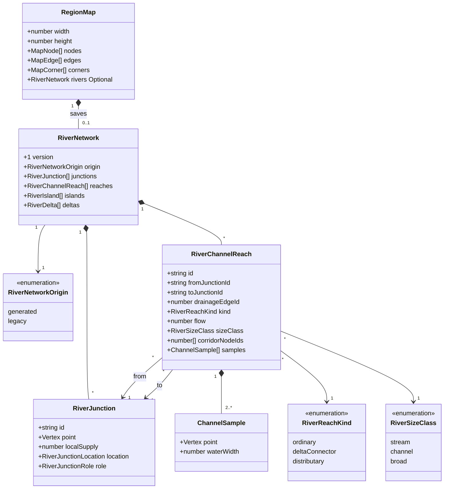
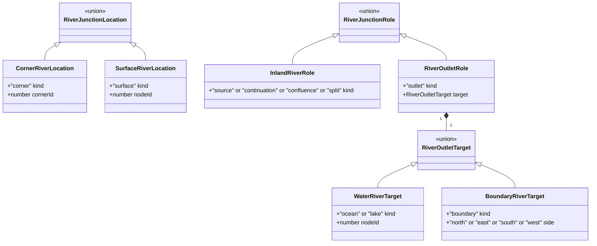
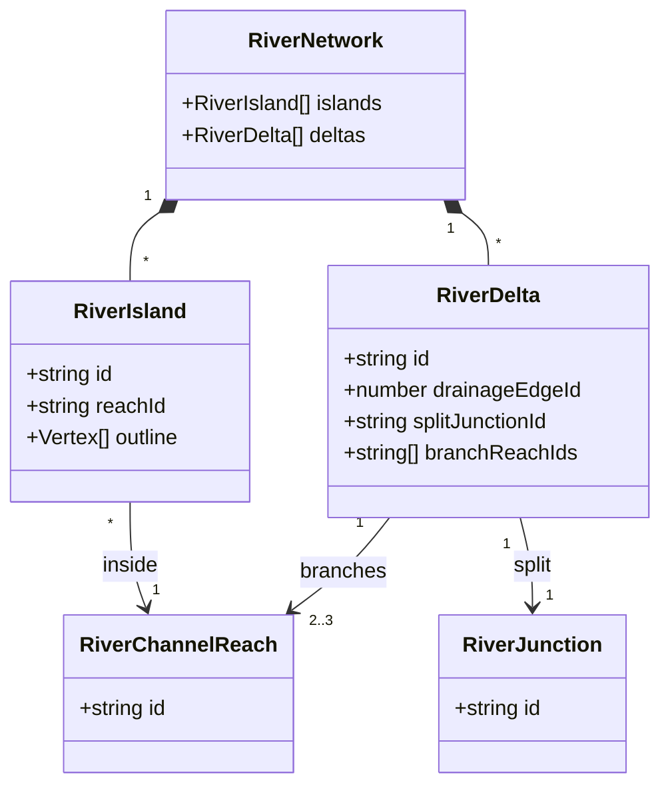

# Region river networks

**Status:** implemented — the human reviewer approved the domain model on 2026-10-04.

Tracked by [#387](https://github.com/ironarachne/ironarachne/issues/387). Extends
[Region Map Cartography](region-cartography.md) and [Region terrain tones](region-terrain-tones.md).

## Problem

Headwaters, tributaries, and broad rivers need visibly different treatment. Rivers should bend
according to terrain, broad channels can contain islands, and suitable ocean mouths can form deltas.
These features must be saved geography that other consumers can inspect, rather than decoration
invented by SVG rendering.

The current foundations are useful but incomplete:

- `water.ts` follows one strictly lower `downslope` neighbor from each selected spring. Edge flow
  counts spring contributions; it is not discharge in physical units. Local minima become lakes.
- `river_paths.ts` already tapers natural sources, scales widths with flow, and samples curves.
- `region_map_svg.ts` adds small terrain-independent offsets separately to each edge. Endpoints
  join, but neighboring tangents need not agree. Every stream receives the same filled channel.
- `RegionSnapshot.map` saves the graph. It does not save river geometry, islands, or distributaries.
  The region artifact's map validator currently checks dimensions and the existence of graph arrays,
  not referential integrity or hydrological correctness.

## Solution and decisions

### Two scales, with explicit ownership

Keep the Voronoi graph as the coarse terrain and drainage substrate. Add a versioned
`RiverNetwork` to `RegionMap` for directed surface channels, their flow, their geometry, and islands
and deltas. The network is the authority for detailed river geography; rendering and detailed river
queries consume it. `MapCorner.downslope` remains the terrain drainage direction and
`MapEdge.river` remains the coarse spring-contribution count. Neither can represent delta branching.

Every channel records which drainage edge supplied its water and which terrain cells contain its
geometry. Those are different relationships: a delta branch can cross several cells while receiving
water from one terminal drainage edge. Do not fabricate Voronoi edges for its path.

Existing coarse consumers of positive `edge.river` (freshwater access, river corridors, habitat
evidence, and settlement roles) keep their present meaning. They do not gain claims about navigability,
delta branches, island settlement sites, or precise channel crossings. New detailed queries must use
the network. River islands are sub-cell land features, not new `MapNode`s, settlement sites, or ocean
islands in this issue.

Use one network per map; do not add a second region-facts copy. Keep this work in `src/lib/map`,
with saved types in `river_network_types.ts` and generation, geometry, and validation in separate
sibling modules. Region generation and artifact codecs compose that public API.

### A directed, conserving network

Represent each channel as a directed reach between two river junctions. In the initial model an
ordinary reach corresponds to one positive-flow drainage edge. Keeping that correspondence makes
existing IDs and evidence traceable and avoids an additional reach-group identity scheme.

Junctions represent sources, continuations, confluences, delta splits, and outlets. Their kind is a
discriminated union, not a collection of optional flags. A source has no incoming reaches; an outlet
has no outgoing reaches. An ordinary continuation has one incoming and one outgoing reach;
a confluence has at least two incoming and one outgoing reach; a delta split has one incoming and
two or three outgoing reaches. All downstream paths end in mapped ocean, a mapped lake, or the sheet
boundary. There are no cycles or dangling inland terminations.

Record local spring supply at junctions. A spring can be selected more than once, or start halfway
down an existing river. At every non-outlet junction:

`sum(outgoing.flow) = sum(incoming.flow) + localSupply`.

At outlets, incoming flow is discharged out of the network and local supply is zero. A source has positive supply;
continuations and confluences may also have supply. Delta splits have zero local supply. The water
pass must record actual contributing springs, rather than inferring them from the renderer's retained
reaches. Skip springs whose water never traverses a channel. If later lake growth submerges a source
or part of a channel, rebuild the final surface network against the final water cells: discharge
retained upstream flow at the new shoreline, and terminate hidden downstream channels. Do not turn
their historical edge counts into new downstream surface sources. Lakes are sinks here; lake outflow
and flow through lakes are outside this issue.

Flow is a positive, finite, dimensionless contribution count. Ordinary drainage counts are integral;
delta shares may be fractional. Use relative tolerance `1e-9 * max(1, incoming + supply)` for
conservation checks. No rounding of saved branch flow. Rendering widths are never used to calculate
flow. No claim of real discharge, drainage area, sediment transport, or seasonal flooding is made.

### Saved geometry and width

Save each reach as ordered channel samples with map-coordinate positions and full water widths in
map units. Samples run upstream to downstream and include both junction endpoints. The samples
are the authoritative centreline approximation; widths interpolate by distance. Pure geometry code
constructs the channel envelope and bank offsets. Store no SVG, CSS, pixel width, random decoration,
or renderer-specific path syntax.

Save a `stream | channel | broad` size class derived from flow by a versioned generation rule.
This is independent of junction role: a headwater means a source with no upstream channel, and a
tributary means a reach entering a confluence. A tributary need not be small. Proposed initial
thresholds are stream below 3 contributions, channel from 3 to below 8, and broad from 8 upward.
Use the existing square-root width rule as the starting width calibration. Thresholds and width
constants must be centralized, exercised against existing flow distributions, and recorded with
visual evidence before implementation is considered complete. They cannot depend on viewport
size or a seed's maximum flow. Changing those constants affects new generation, not saved geometry.

Expose pure map-library queries for incoming/outgoing reaches, outlet tracing, and the water
footprint at a point. Rendering, island containment, label clearance, and detailed water queries
must share the same envelope construction and island subtraction; do not introduce separate
approximations that disagree about whether a point is land or water. These queries describe only
river water; callers combine them with the existing ocean/lake polygons for complete surface water.

Widths are positive except at a natural source's first sample, which is exactly zero. They grow
gradually toward downstream flow width. At confluences, the outgoing width must accommodate each
incoming width without pinching; at delta splits, narrower branch widths transition after their
shared join. Junction envelopes must remain connected. Bank ink is a rendering choice outside the
saved water width. Narrow streams use a solid water-ink ribbon that tapers into existence; wider
channels use pale water interiors with fine sepia banks. Both use the same saved water envelope.

Generate curves along connected downstream chains rather than independently jittering every edge.
Compute junction tangents from neighboring reaches; continuations share tangent direction, and
confluences enter the downstream channel smoothly. Sample the resulting curves to a map-relative
error bound and cap their point counts. The model version fixes interpolation and envelope semantics
so saved samples do not acquire different channel shapes after an algorithm update.

Use local downslope gradient, adjacent cell elevations, and cell geometry to determine bend freedom.
Low-gradient wide land corridors permit larger bends; steep, narrow corridors constrain them.
Biome alone does not prove a floodplain. Keep ordinary channels inside their adjacent land-cell
corridor, except for their terminal water contact. Validate centreline elevations using the same
piecewise terrain interpolation used by generation, allowing only a documented numerical tolerance.
When a candidate curve crosses unrelated water, rises uphill, self-intersects, intersects an unrelated
river, or cannot fit its envelope, reduce bend amplitude; a straight valid channel is the final fallback.
Do not alter the drainage graph to rescue a decorative bend.

Existing road paths are generated after towns. Finalize river geometry after those paths exist and
before region facts are derived. Pin channel passage at actual road crossings of its drainage edge
and constrain bends around them. A coarse shared edge continues to mean a crossing opportunity;
do not silently move a visibly intersecting river away from a road. The geometry pass consumes no
settlement-generation RNG values and does not relocate towns or roads.

### Islands

A `RiverIsland` is a saved simple land polygon wholly inside one broad reach's water envelope.
It has a stable identity and an owning reach ID. Place small elongated islands away from sources,
confluences, split junctions, mouths, and road crossings. Require water clearance on both sides and
no overlap with another island. Bound size and count; omit an island if a safe polygon cannot fit.

An island creates a hole in a channel's water footprint. It does not duplicate the reach's flow or
introduce a simulated split/rejoin: this model records total channel flow around it, not discharge
on each side. Detailed water queries subtract island polygons, and rendering gives them land tone
and a fine bank outline. The polygon is real saved geography even though it is too small to change
the Voronoi terrain mesh. Island terrain, resources, and occupation remain unspecified.

### Deltas

A delta is a generated terminal network replacement, not extra lines drawn alongside the full-flow
main mouth. Start with a sufficiently strong ocean-bound drainage edge with dry land on both sides
and a suitable low-gradient coastal corridor. Its upstream corner becomes the delta split. Replace
the original terminal reach with two or three distributaries to distinct mapped ocean contacts;
record the replaced drainage edge in `RiverDelta`. Every branch attributes its flow to that edge.
The sum of branch flows equals that edge's retained surface inflow, including any supply at the
upstream confluence before the split. If that upstream corner is already a confluence or supplies
water, insert a short ordinary connector to a separate zero-supply split point within the terminal
edge corridor. The connector and split branches conserve flow together; only the split branches
participate in the terminal drainage-edge attribution sum.

Branches must remain downhill within tolerance, pass through contiguous allowed coastal cells,
stay mutually disjoint except at their shared start, and end on the raw ocean shoreline. Validate
their complete envelopes, including land clearance between branches after the join. Islands within
delta branches are deferred. Lake outlets and sheet-edge exits cannot become deltas. A coastal
candidate may fail the seeded chance or fail geometric feasibility; keep its original valid mouth
in either case. Chance alone is never sufficient evidence for a delta.

Save the split junction and branch IDs as one `RiverDelta`. Branch routing, flow shares, and outlet
contacts are stored. Do not mark the entire coastal cell as water or redraw the coastline: this
issue represents distributary channels through existing coastal land, not sediment deposition or
new coastal islands. Only direct-to-ocean branches are supported initially; recursive branching
and branch rejoining require a later model extension.

Ocean and lake outlets cite an existing water node whose raw polygon boundary contains the endpoint.
The renderer can bridge a small gap to its processed shoreline using the existing bounded mouth
connector. It must use the actual target water body, not the globally nearest unrelated water.
If processing creates a larger gap, report a geometry failure rather than silently hiding the reach
or inventing a distant connection. Renderer shore adjustment does not change saved flow or endpoints.

## Domain model

All additions are plain serializable data. IDs are stable strings derived from drainage identities
and deterministic local indices, not UUIDs or array offsets. References use IDs; arrays have stable
generation order. `Vertex` reuses the existing `{ x: number, y: number }` map coordinate type.



Junction unions specify location independently of network role. A synthetic point supports a delta
split or shoreline contact without mutating terrain corners. Terminal targets cannot be absent.



The quoted alternatives declare TypeScript literal unions. `RiverJunctionLocation`,
`RiverJunctionRole`, and `RiverOutletTarget` are discriminated unions of the shown shapes.
Corner locations match their corner's point exactly. Surface locations lie in their referenced
cell's closed polygon; boundary contacts can cite a containing boundary cell.



An island outline has at least three distinct vertices, is implicitly closed, and has positive
area. A delta's branch list contains distinct distributary IDs whose common start is its split.
Every distributary belongs to exactly one delta; every split belongs to exactly one delta.
An ordinary drainage edge contributes one ordinary reach after clipping to final surface water,
or a delta replacement, never both. Submerged drainage edges can have no surface reach.

## Generation, determinism, and compatibility

Build and reconcile surface topology after the water pass has finalized lakes and ocean connectivity.
Finalize terrain-aware samples, widths, islands, and deltas after biome assignment and road generation,
before deriving facts. No consumer should observe a partially finalized network. Generation operates
on a cloned map and publishes only a validated result.

The parent region generator owns randomness. Give the new geometry operation one explicitly derived,
saved-generation-boundary seed from that RNG; instantiate `@ironarachne/rng` once for that operation
and thread it through helpers. Reserve that seed at a fixed point regardless of candidate counts.
Never seed from clock time, IDs generated at runtime, `Math.random`, or renderer state. Changing
candidate counts cannot consume the parent's later random choices. This additional seed draw changes
new seeded region output once; do not promise byte-for-byte equivalence with the old generator.

Sorting candidates by graph IDs, fixed retry limits, stable IDs, and bounded sample/branch/island
counts make output and cost reproducible. Proposed limits are 128 samples per reach, two islands
per broad reach, 32 vertices per island, three branches per delta, and eight geometry attempts per
candidate. A network has at most four reaches per positive-flow drainage edge, including connectors,
and at most two junctions per reach. Rendering and validation consume no RNG. Saving and
rehydrating preserve network data exactly; exports use that same model.

`RegionMap.rivers` is optional for intermediate graphs and old standalone map callers. A missing
network takes the existing renderer path. An empty present network deliberately means no surface
rivers. A malformed or unknown-version present network is an error, not an excuse to use fallback.

Bump the region artifact payload version from the current 9 to 10, subject to the current version at
implementation time. New generated snapshots require a generated network. Migrate earlier region
versions through their existing fact/actor migrations, then attach a deterministic legacy network
when the source map is valid enough. That conversion follows existing stored drainage and mapped
outlets, preserves existing width/taper behavior, and creates no islands or deltas. Set origin to
`legacy`; do not infer unrecorded historical springs. For its retained graph only, nonnegative flow
differences supply junctions. If those differences are inconsistent, or graph references are invalid,
keep the historical map with no network and the legacy drawing path. Migration is explicit and does
not mutate the stored artifact merely by opening it. The current artifact validator accepts an absent
network for compatibility, since absence alone cannot prove the map's provenance. New-generation
validation and snapshot construction require a generated network for newly generated regions.
Do not claim that the artifact validator can distinguish an old map from a new one after its network
has been removed. Saving a carried-forward legacy map remains supported.

Adding `rivers` does not add an independent migration framework. `RiverNetwork.version` describes
the network shape and geometry semantics; the artifact payload version controls the enclosing save
migration. A future network version must retain a versioned geometry interpretation or explicitly
migrate samples. Do not rerun current procedural generation to display an old save.

## Validation and failure behavior

Provide a map-library network validator used both after generation and by the region artifact codec.
Validate unknown input structurally before following references. New network-bearing maps require
positive finite dimensions, unique graph IDs, valid referenced nodes/edges/corners, finite terrain
and point values, and consistent incident relationships. Build ID lookup tables; never treat arbitrary
external IDs as array offsets. Existing array-index assumptions require contiguous IDs for generated
maps; imported network-bearing maps must satisfy that contract until the wider map API changes.
Historical maps without a network retain their existing acceptance policy.

The validator checks:

- Supported version, literal variants, unique network IDs, finite values, bounded counts, and all
  graph/network references; correct corner and cell location bindings.
- Acyclic directed topology, exact degree requirements, valid mapped outlet targets, nonnegative
  supply, positive reach flows, conservation, and reachability of an outlet from every junction.
- Coarse drainage attribution for ordinary reaches and delta replacements, allowing final-water
  clipping to discharge at an earlier valid shore. No duplicated full-flow terminal reach.
- At least two noncoincident channel samples, exact shared endpoints, legal width/taper rules,
  corridor continuity and containment, downhill centreline samples, simple connected envelopes,
  and no unrelated channel overlaps. Permitted overlap is confined to actual shared junctions.
- Island simplicity, area, ownership, containment, minimum surrounding channel clearance, and
  exclusion zones; delta membership, distinct ocean contacts, flow shares, and branch separation.

Use one geometry tolerance scaled to map dimensions, separate from flow tolerance. Enforce the same
published generation limits on imported data so validation cannot be forced into unbounded work.
Reuse spatial indexing for envelope intersection checks rather than comparing every sample pair.

Generation tries constrained curves and optional features with bounded retries. Reject an optional
island or delta candidate without losing its ordinary river. If even the ordinary surface network
is invalid, return a generation error with the responsible IDs; do not hide it with the renderer's
current reach filtering. Import rejects invalid new network data with an actionable validation reason.
Do not silently repair saved topology or discard malformed features during rendering.

## Validation plan

After model approval, test controlled maps with a single spring, duplicate springs, a spring at a
continuation, unequal tributaries, multiple confluences, local-minimum lakes, later lake submergence,
ocean contacts, sheet-edge exits, no rivers, and all-water terrain. Prove conservation and drainage
attribution before testing drawing. Include invalid graphs, cycles, dangling references, wrong outlet
classification, fractional split sums, excessive counts, and non-finite values.

Use terrain fixtures to show greater bend freedom on gentle plains than steep corridors while retaining
downhill flow, exact joins, road crossings, and nonintersecting envelopes. Test safe island holes and
rejection of oversized or overlapping islands. Test eligible deltas, failed chance, failed routing,
lake exclusion, narrow coasts, and deterministic fallback to the original mouth.

Compare full serialized networks from equal seeds and configurations; require some variation across
different seeds. Verify random draws stay within the documented owner boundary. Test snapshot save,
rehydrate, import/export, migration from every supported region payload version, missing legacy
networks, invalid present networks, and future-version rejection. Existing river evidence must remain
valid after adding geometry; no legacy save gains new geographical claims.

Render pinned-seed before/after SVGs and controlled examples showing pointed streams, smooth
confluences, broad channels, island land holes, and deltas. Inspect normal size and zoom, coast
connections, water-tone consistency, joins, road intersections, and label avoidance. Reserve label
clearance from the complete new envelopes, including distributaries. Check browser rendering and
save/reload behavior. Run `npm run verify` and, before merging rendering changes, `npm run verify:all`.
Do not lower coverage baselines or add exclusions. Record chosen constants, geometry limits, visual
evidence, performance observations, and verification results here during implementation.

## Review boundary

The human reviewer approved this model on 2026-10-04. Implementation proceeds in this order:

1. Saved network types, spring reconciliation, topology and geometry validation.
2. Terrain-constrained curves, conserving terminal deltas, and island polygons.
3. Saved-geometry rendering, detailed queries, and version 10 region migration.
4. Hydrology, malformed-data, persistence, visual, and browser verification.

## Implementation notes

The saved types and pure topology operations live in `river_network_types.ts` and `river_network.ts`.
`water.ts` records selected springs, then builds surface flow against the final water classification.
Historical coarse edge counts remain intact; a surface reach can have less flow when an upstream
spring or path was submerged by later lake growth. They cannot supply phantom surface sources.

`river_generation.ts` finalizes channels after roads in the dedicated `river-geometry` region stage.
The existing named-stage mechanism derives its RNG directly from the parent region seed, so no
additional draw advances physical geography or habitation. A test perturbs only that stage and
compares every other saved region field. Geometry can also be regenerated from the saved local
spring supplies without treating a previous delta's branches as new drainage edges.

The initial stream/channel/broad boundaries are 3 and 8 contributions. Preferred widths retain the
existing square-root calibration: `(0.09 + 0.09 * sqrt(flow)) * min(width, height) / 35`. Curves
use cell-centre/corner triangle interpolation for downhill checks. Eight bend attempts fall back
to the chord; eight width-fitting attempts can narrow a constrained channel. A separate bounded
collision-fitting pass reduces conflicting widths and reconciles incident join widths. This records
the fitted physical width without reducing water contributions. One-sided clipped sheet edges allow
their outer banks into the cropped margin, including tiny slivers left by vertex interning.

Eligible ocean mouths need at least 8 contributions and gradient no greater than 0.15 in the map's
dimensionless elevation/coordinate system. The initial delta chance is 35%. Generation currently
creates two direct distributaries with a separate connector and zero-supply split; validation also
supports the approved three-branch shape. Candidate failures retain the original mouth. Existing
road crossings prevent a delta replacement, and branches cannot introduce a new road crossing.
Broad ordinary reaches have a 40% island opportunity; the initial generator places at most one
small island per reach, while the saved model permits two. Neither feature creates new terrain cells.

`river_geometry.ts` supplies envelopes, island-subtracting water queries, incoming/outgoing queries,
and outlet tracing. `river_validation.ts` checks unknown input before following IDs, then validates
graph relationships, supply conservation, acyclicity, outlets, attribution, geometry, junction
widths, crossings, and optional features. It rejects submerged inland junctions and out-of-sheet
graph coordinates. Import limits are 10,000 units per dimension, 10,000 entries per graph list,
250,000 total channel samples, and the per-feature limits above. Intersection checks use spatial
bins and local junction caps, rather than exempting whole reaches that share a junction.

Region payload version 10 validates present networks. Migration preserves version 9 material links,
composes earlier migrations, and adopts a legacy network only when its old topology and copied
historical curve geometry satisfy the new contract. Otherwise the old map remains on the established
renderer path. Adoption consumes no RNG and adds no islands or deltas. All adopted and generated
networks render through their stored samples; adopted streams retain filled-channel treatment.
An empty present network draws nothing, including when coarse historical river counts remain.

The graph builder also now skips cells collapsed below three corners and assigns surviving node IDs
contiguously. New network validation exposed these existing degeneracies in pinned region seeds;
fixing them preserves the map library's array-index/ID contract.

Terrain interpolation gives shared drainage edges their exact linear elevation before consulting
cell-center triangle fans. Clipped and merged cells can have overlapping fans; choosing one first
could incorrectly classify a straight downhill channel as uphill. Seed `river-stress-120` covers
this case. The generation sweep also exposed fractional landscape-name weights exceeding the
integer RNG picker's upper bound. Integer weights now preserve the repeat-penalty ratios, with
an upper-bound RNG test and seed `river-stress-46` regression.

### Visual evidence

[Review artifacts](region-rivers-387/README.md) include the Alpha before/after comparison, Bravo and
Charlie maps, and controlled meander, delta, and island examples. The controlled fixture has unequal
tributaries, duplicate/local spring contributions, and a broad ocean or lake mouth. Its artifacts
can be regenerated with:

```bash
RIVER_REVIEW_DIRECTORY=docs/region-rivers-387 npm run test -- src/lib/map/river_network.test.ts
```

The native SVGs were rasterized with `rsvg-convert` and inspected at normal size. The gentle-terrain
fixture shows smooth persisted bends, streams taper to a point, delta branches separate after their
shared join, and the island retains water on both sides. Real terrain can constrain reaches to a
straighter path; the renderer does not invent additional bends. Browser region generation, save,
reopen/edit, and reserved-label tests also pass.

### Verification (2026-10-04)

- `npm run verify:all`: type checking and lint passed; 6,953 unit tests passed, and all 100 libraries
  met the 80% coverage gate. Browser tests recorded 662 passed, 5 skipped, and one failure in the
  existing workshop lone-tool width assertion (`e2e/workshop.spec.ts:202`), with a transient
  291.03125px difference. That test passed 10 consecutive targeted reruns. The full browser run
  therefore did not exit green; all region and mobile checks passed.
- A separate sweep generated and rendered 150 `river-stress-*` seeds without errors.
- The refreshed SVG review artifacts were rasterized and visually inspected.
