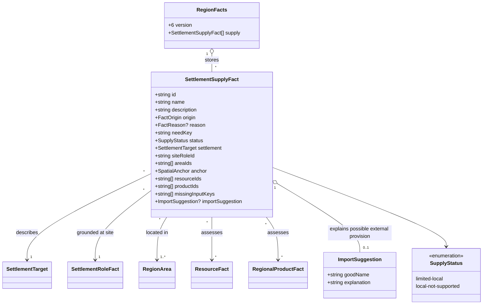

# Regional scarcity and plausible imports

**Status:** implemented for [#341](https://github.com/ironarachne/ironarachne/issues/341)
following explicit human approval of this design and domain model on 2026-10-02.

## Problem and boundary

The resource inventory, processing chains and daily-life facts explain local possibilities,
but do not explain consequential supply limitations or what people might need to bring in.
Extend the existing regions library with saved settlement-scale supply explanations. Reuse
the accepted [processing](region-processing.md) and [livelihood](region-livelihoods.md) models.
Do not add prices, volumes, market simulation, transport capabilities or trade networks.
Dedicated gazetteer assembly remains #344; this change provides saved facts and reusable prose.

## Decisions

### 1. Scarcity is qualified by evidence and place

Add `RegionFacts.supply: SettlementSupplyFact[]`. A fact identifies a stable need key, a
settlement and site role, the relevant inventory and product evidence, the limitation, and
a practical consequence for construction, fuel, household crafts or food preservation.
Use the existing `FactBase` for editable text, origin and versioned reasons.

Distinguish `limited-local` from `local-not-supported`. Limited supply means usable positive
local evidence explicitly records limited availability. A supported local material or complete
production chain prevents an unsupported-local assertion for that same need. A complete chain
using limited raw inputs may have limited output; its description must say it can be made
locally and explain why supplementary imports might help. Never describe such output as absent.

`local-not-supported` means the saved inventory and declared craft policy do not establish
local provision at this site. It does not mean the item is physically absent from the region.
Descriptions name the actual cause: no recorded compatible source, sources outside supported
access, inaccessible deposits, or a missing processing input. Unknown or stale evidence cannot
establish absence; omit the assertion when its supporting assessment cannot be trusted.

### 2. Assess possibilities before representative selection

Daily-life and processing selection caps are editorial choices, not evidence of scarcity.
Extract a pure internal processing-capability assessment from the existing chain builder,
sharing recipe, technique, depth, raw-resource and access rules. It reports support and missing
inputs without consuming RNG, persisting products or modifying upstream facts. Evaluate all
eligible chains, including families omitted by the processing selection cap. Retain existing
processing output and RNG behavior; cover that explicitly with regression tests.

Compare supply against the full current accessible raw inventory and complete possible chains,
not the selected daily-life categories. Use current roles and the existing coarse access checks.
Positive supply elsewhere in the region is distinguished from accessible supply at this site;
never call a represented regional resource absent because it is disconnected or inaccessible.

The first need catalog covers construction timber, wood fuel, workable building stone, woven
cloth, simple iron tools and preserved provisions. Use catalog selectors and stable product
keys rather than editable names. Do not infer named grain, salt, livestock, steel or refined
oil from catalog gaps. Food statements concern preservation and an incomplete represented
food picture; they do not claim that inhabitants cannot feed themselves. Building materials
are alternatives: lack of stone does not imply that all construction requires imported stone.

### 3. Imports explain a need without claiming commerce

An optional saved import suggestion names the needed good and gives an explicit explanation.
Use generic external origin only: “would need to be brought in if used” for unsupported goods,
or “could supplement the limited local supply” for limited goods. State supported local
alternatives where relevant. These are conditional necessities, not existing trade flows.

This first implementation deliberately makes no specific origin claims, even when a road or
river is present: a route alone proves neither navigability nor a supplier. No invented neighbor,
destination, merchant network, port traffic or guaranteed transport. Specific origins can be
added later when a saved neighbor and its actual supply evidence support them.

Generated suggestions do not create raw resources, products, imported processing inputs or
import-supported livelihoods. Existing authored `ProcessingInput` imports remain readable
through the chain API, which already distinguishes local inputs from imports. An authored
import-dependent chain must not count as wholly local provision.

### 4. Persist, inspect and edit the explanation

Run a named `supply` stage after livelihoods and before notables/presentation. Stable sorting
and its isolated seed stream select at most three distinct needs per settlement from the
supported candidates. Sparse evidence may yield no facts. Reading descriptions never reruns
generation or fills missing categories.

Each assessment records all considered relevant resource/product IDs, including conflicting
positive evidence, and the explicit missing-input keys. Reasons also reference the site role.
Absence assessments depend on an inventory as well as individual facts: adding, removing or
changing resources, deposits, products, roles or saved geography must stale affected supply
assessments, including additions that were not previously linked. Consumers recheck current
support before repeating scarcity; a newly supported local good suppresses an obsolete claim.
Return stored authored text intact to inspectors while ordinary descriptions identify stale
assertions as needing review.

Bump `RegionFacts.version` from 5 to 6 and region payload version from 7 to 8. Older payloads
gain `supply: []` without generating new content. Validate need/status variants, settlement and
role targets, area/anchor membership, evidence references and import suggestion structure.
Keep fantasy need selection outside generic structural validation. Unknown saved need keys
remain readable through stored text, as activity keys do today.

Extend semantic fact traversal, text editing and removal protection. Text edits preserve
identity and evidence, mark the fact authored and stale dependents. Source removal removes
direct generated dependents, protects authored dependents and stales reason-only descendants
under the existing editing contract. Save/load/export preserves edited supply explanations.

## Domain model

`SettlementSupplyFact` extends `FactBase`. Existing `SettlementTarget`, `SpatialAnchor`,
`FactReason`, resource and product types retain their shapes. Evidence IDs represent the
assessment inputs, not resources consumed by an imported good.

The internal pure capability assessor returns support, contributing resource IDs and missing
input keys; it is transient rather than another persisted domain entity. No standalone
settlement payload or generic resource availability enum changes.

## Verification

Use controlled forest, quarry, mineral, fiber and sparse fixtures. Available local timber
prevents timber scarcity; limited timber supports qualified local production plus optional
supplementation. Complete unselected recipe chains prevent false product shortages. Deep or
disconnected sources explain access limitations without asserting regional absence. Missing
charcoal, water, textile fiber or tool handles prevents the corresponding complete local chain.
Authored imported chains distinguish local work from externally supplied inputs.

Assert conditional imports, supported alternative materials and no named origins or trade
destinations. Exercise stale/unknown evidence, empty inventories, category caps, source/list
reordering, repeatability and named-stream isolation. Verify processing output remains unchanged.
Test validation failures, older migrations, edited round trips, additions invalidating negative
claims, resource/product/role/settlement removals and authored dependency protection. Run
`npm run verify`; run `npm run verify:all` before merging if rendering is changed.

## Implementation notes

`generateSupplyFacts` uses the isolated `supply` stream and saves up to three distinct needs per
settlement. `settlementSupplyContext` returns stored assertions; `describeSettlementSupply`
accepts the saved facts and map, rechecks complete capabilities and returns review notices for
obsolete explanations. These APIs do not assemble the gazetteer or modify settlement snapshots.

The shared processing policy and raw matching preserve the existing generator's selection and
random draw behavior. The pure capability assessor evaluates all complete chains without saving
products. Supply assessments conservatively inspect the full resource/product inventory and
record its IDs. Unknown, stale or empty inventories produce no generated scarcity claims.
Inventory additions invalidate membership checks; existing edit/removal helpers stale surviving
assessments. Callers that directly add inventory entries must mark saved supply reasons stale
before saving; validation rejects obsolete generated assessments still marked current.

Text edits follow the existing fact-editing contract: stored authored words and inputs survive,
while their explanation becomes stale and ordinary prose asks for review. Older payload versions
1–7 migrate with an empty supply list. No UI, route, trade partner or imported production chain
is introduced.
