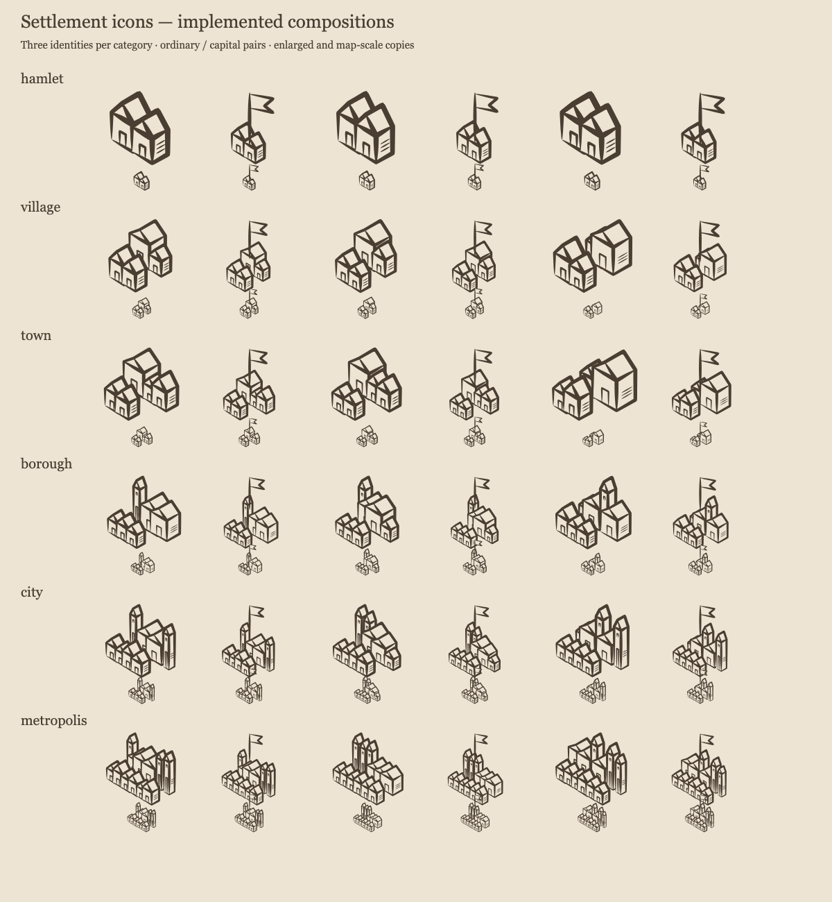

# Settlement icon review — #385

The compositions use the renderer's actual building catalog and independent deterministic RNG
streams. The [accepted design](../region-settlement-icons.md) defines the category counts, capital
pennant, bounds, and compatibility contracts.

## Specimens

[Vector specimen sheet](specimens.svg)



The first visual pass showed that thin ink and the proposed initial footprints were too faint
at normal map scale. Final target half-width factors are 2.0, 2.3, 2.6, 2.9, 3.2, and 3.5 for
hamlet through metropolis. Cottage/hall/tower counts are unchanged. Contours use thicker tapered
ribbons; sparse internal hatching remains light. The pennant rises above the tallest roof.

The human reviewer requested that every building overlap another during implementation. The reviewer also requested isometric perspective and correct foreground occlusion. Building
geometry and slots share ±30-degree ground axes, with vertical height. Projected ground depth
determines painter order, so rear buildings never paint over foreground buildings. Slots and rows
form a dense cluster with bounded jitter. Unit tests sample the actual filled body polygons across all categories and forty identities
each: every building intersects another building and retains exposed roof area after later bodies
are painted. Padded footprints alone are not used as evidence of visual overlap.

## Pinned map comparisons

Both sides use the existing `render:region` CLI's seeded generation configuration. The left side
uses the renderer from commit `6b8487be`; the right side uses the implemented settlement icons.
Map geography and saved settlement facts are the same. Labels, title placement, and terrain
clearance may move because composed icons now reserve their actual footprints.

- [Alpha comparison](alpha-comparison.png): shoreline settlements and mountain terrain.
- [Bravo comparison](bravo-comparison.png): a dense network with a large capital and varied towns.
- [Charlie comparison](charlie-comparison.png): settlements near the top frame, mixed terrain,
  and a cartouche that moves to clear the larger icons.

The built region page was also inspected at [desktop width](browser-desktop.png) and
[a 375px phone width](browser-mobile-375.png), using a locked `bravo` seed and the page's default
configuration. These captures show the image path used by visitors, rather than inline review SVG.

Each comparison has matching `*-before.svg` and `*-after.svg` vector sources in this directory.

## Reproduce

```bash
npx vite-node scripts/render_settlement_icons.ts --out /tmp/settlement-icons.svg
npm run render:region -- --seed alpha --svg-out /tmp/region-alpha.svg
npm run render:region -- --seed bravo --svg-out /tmp/region-bravo.svg
npm run render:region -- --seed charlie --svg-out /tmp/region-charlie.svg
```

The specimen and comparison PNGs were rendered with Chromium. The SVG downloads use reusable
vector definitions and contain no external artwork. Existing saved regions need no migration.

## Validation

Focused composition, renderer, and presentation tests pass. They cover category boundaries and
fallbacks, exact counts, footprint containment, roof visibility, deterministic independence,
capital toggling, preserved capital roles, isometric ground/ridge angles and vertical walls,
back-to-front depth order, exact-edge placement and near-edge scales, escaped
identity, and label clearance.

`npm run verify:all` passed on 2026-10-04:

- Type checking: zero errors and warnings; formatting and lint passed.
- Unit tests: 512 files, 6,960 tests passed.
- Coverage gate: all 100 libraries at or above 80%, with no baselined debt or new exemptions.
- Playwright: 663 passed in 10.7 minutes, covering desktop and 320/360/375/390/430px layouts.
- Five astronomical preview-golden tests skipped because their platform baselines were absent.
  The pixel-render checks ran and passed; no golden baselines were regenerated locally.

All seven region-map browser cases measured the actual composed SVG artwork against its reserved
bounds, checked the capital pennant, and verified label clearance. Region save/reopen/edit,
SVG/PDF downloads, and locked-seed reproduction passed. The reviewed desktop and phone images
were captured from the final built app after confirming seeded regeneration had completed.

The region export/import integration cases have a scoped 15-second timeout because each
generates a region and renders both copies and its publication. The initial GitHub coverage
run exceeded the default five seconds on two `bravo` cases; their assertions remain intact.
