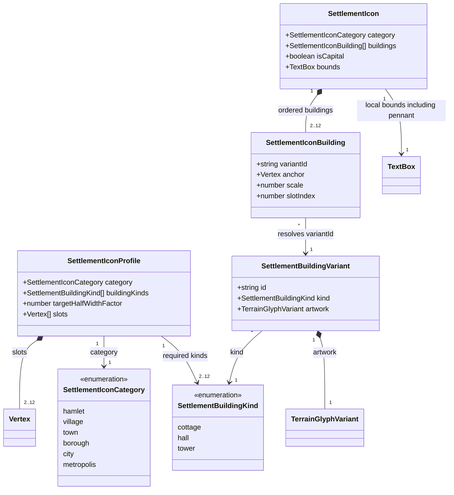
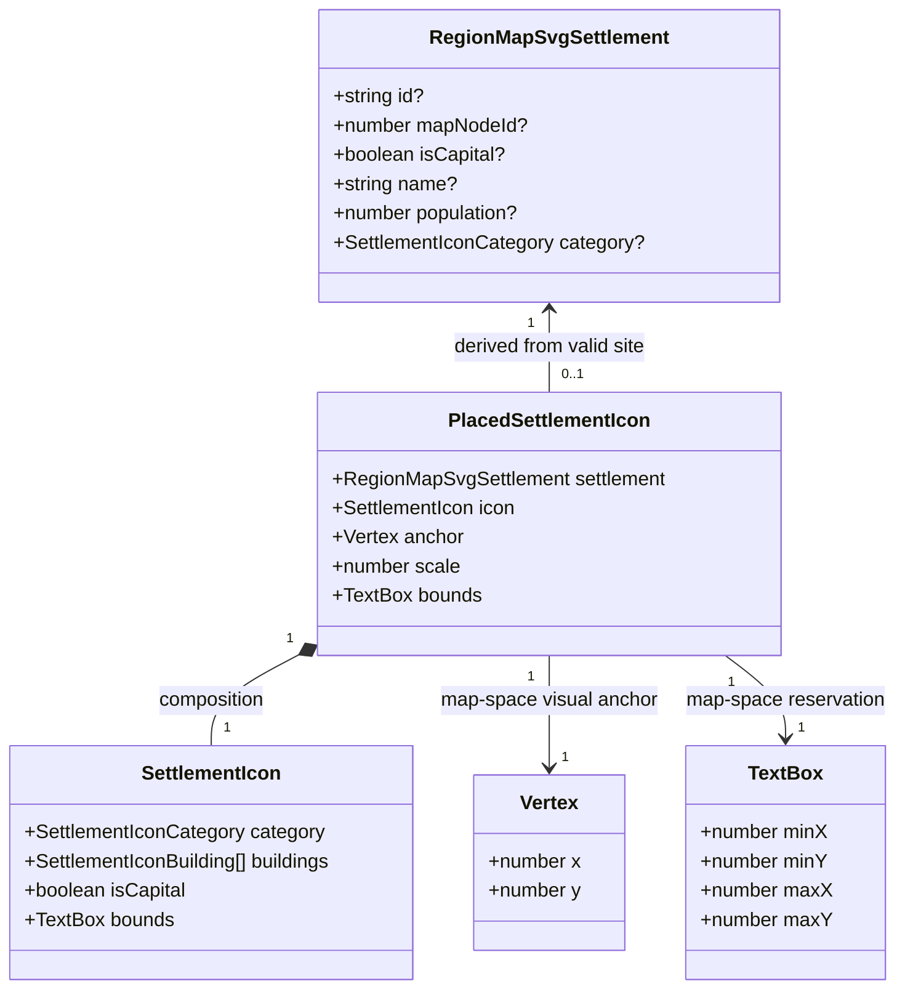

# Region settlement icons

**Status:** implemented — the human reviewer approved the domain model and visual direction on
2026-10-04. Renderer and export integration are complete, and `npm run verify:all` passed on 2026-10-04.
See the [visual review and validation record](region-settlement-icons-385/README.md).

Tracked by [#385](https://github.com/ironarachne/ironarachne/issues/385). Extends
[Region Map Cartography](region-cartography.md) and uses the ink vocabulary established by
[Region terrain glyphs](region-terrain-glyphs.md).

## Problem

Region maps currently mark ordinary settlements with circles and capitals with stars.
Population changes label size, but a hamlet and a metropolis have the same ordinary marker.
Replace those markers with small, procedurally arranged groups of buildings: category determines
their number and kinds, arrangement varies between settlements, and capitals remain unmistakable.

The settlement snapshot already contains its category. `regionToMapSvg` currently passes only
identity, location, capital status, name, and population to the renderer. Capital status already
uses a saved role rather than array order, with an existing legacy fallback. Preserve that behavior.

## Visual direction

Draw isometric ink sketches on parchment, consistent with the terrain: pitched roofs, a visible
front and side, sparse right-side hatching, tapered contours, and irregular but legible silhouettes.
Project building footprints and cluster slots onto ground axes at ±30 degrees; keep height
vertical. Roof ridges and ground edges share the same projection across the cluster. Buildings remain upright;
vary proportions, roof shapes, spacing, and depth rather than rotating the entire icon.

Use three building kinds: **cottage** (low pitched roof), **hall** (broad, taller roof), and
**tower** (narrow vertical silhouette). These are cartographic symbols of settlement scale,
not assertions that the saved settlement has a particular institution, fortification, or religion.
Do not infer building materials, prosperity, culture, or architectural style from unrelated fields.

Every capital receives a short pole and forked pennant rising above the cluster, including a
hamlet capital. The pennant replaces the existing star and shadow. Ordinary towers never carry
it. Capital treatment adds no buildings and does not promote the settlement's category.
Parchment body fills occlude underlying marks; dark contours and restrained hatching provide
depth. No external artwork, fonts, textures, or new dependencies are needed.

## Decisions

### 1. Category controls the silhouette

Use the six existing category names, rather than their three coarse `sizeClass` values.
The initial profiles are:

| Category   | Cottages | Halls | Towers | Total | Target half-width relative to current marker radius |
| ---------- | -------- | ----- | ------ | ----- | --------------------------------------------------- |
| hamlet     | 2        | 0     | 0      | 2     | 1.2                                                 |
| village    | 3        | 1     | 0      | 4     | 1.4                                                 |
| town       | 4        | 1     | 0      | 5     | 1.6                                                 |
| borough    | 4        | 2     | 1      | 7     | 1.8                                                 |
| city       | 5        | 2     | 2      | 9     | 2.0                                                 |
| metropolis | 6        | 3     | 3      | 12    | 2.2                                                 |

Counts are exact, so variation cannot turn a hamlet into a city silhouette. Larger categories
grow in both footprint and density; do not shrink twelve roofs into the space of two cottages.
Population continues to drive label size independently. Footprint ratios are initial visual
tuning values; counts and building-kind progression are the proposed contract.

Add optional `category?: SettlementIconCategory` to `RegionMapSvgSettlement` and supply it from
the normalized category name in `regionToMapSvg`. Recognized category wins even if an edited
population disagrees. For missing or unrecognized categories, infer from the existing settlement
category table using finite, positive population and its inclusive ranges. Clamp below/above the
table to hamlet/metropolis; missing, nonfinite, or nonpositive population defaults to hamlet.
Keep the renderer's union mapping exhaustive and test it against the public settlement table;
do not duplicate population thresholds. Older direct renderer callers remain supported.

### 2. Compose from a small catalog

Keep this renderer concern in `src/lib/map`. Proposed declarations live in
`settlement_icon_types.ts`; authored building variants and category profiles live in
`settlement_icon_catalog.ts`; normalization, composition, and placement live in
`settlement_icons.ts`. `region_map_svg.ts` serializes their output.

Start with three authored variants per building kind. Reuse `TerrainGlyphVariant` as the
artwork record (body paths, tapered ink strokes, conservative footprint) and the existing ink
expansion functions. Despite its name, this record contains no terrain-specific fields.
Use namespaced SVG IDs such as `settlement-building-cottage-1`, and reference reusable definitions
with `<use>`. The capital pennant uses the same artwork record and has a fixed recognizable shape.

Compose in local coordinates with ground contact at `(0, 0)` and negative y above ground.
Each category has a bounded arrangement of row slots, sufficient for its exact count.
Randomly assign eligible buildings to slots, vary row offsets and bounded slot jitter, and choose
artwork variants and modest scales. Keep halls and towers visible in rear rows. Every building must overlap at least one other
building in the cluster, as requested by the human reviewer during implementation on 2026-10-04.
Overlap means intersecting filled building silhouettes, not merely intersecting padded bounds.
Render buildings
back to front by projected ground-contact y, then x, then stable slot index. Foreground parchment
bodies occlude rear buildings; a rear building must never be painted over a nearer one. Slight depth occlusion is
intentional; every building must retain a visible roof, and the pennant draws last.

Use conservative transformed footprints to constrain jitter and prevent roofs being completely
hidden. Bound placement attempts per slot and fall back to its unjittered position, so composition
always terminates and retains the exact building counts. Catalog/profile validation must establish
that fallback slots fit the largest eligible variants and preserve visible roofs. No settlement
is dropped merely because a decorative arrangement could not be found.

### 3. Independent deterministic layouts

Use only `@ironarachne/rng`. Derive a renderer-local key from a literal namespace
`region-settlement-icons:v1`, map width and height, and settlement ID. For callers without an
ID, use map node ID. Include the node center coordinates as saved numeric values to distinguish
sites on different maps. Serialize key components unambiguously, for example as a JSON array.
Do not use names, array indices, population, category, capital status, or neighbor order in this key.

Give slot order, slot jitter, and each slot's variant/scale separate derived streams. Category
selects the profile without consuming another settlement's RNG. Renaming, reordering, removing,
or changing another settlement cannot alter this settlement's composition. Capital status adds
or removes only the pennant; the underlying buildings remain identical. A category change
recomposes that settlement from the new profile. Population edits within a category affect labels,
not buildings. Moving the settlement to a different site may change its arrangement.

Re-rendering identical saved inputs produces byte-identical SVG. This is a contract within a
renderer version, not a promise to preserve old artwork across future catalog changes. No new
seed field, persisted icon, or generation-pass RNG consumption is necessary.

### 4. Bounds are shared drawing data

Compose and place every valid settlement icon once, before title or label layout. Produce map-space
bounds from the union of transformed building and pennant footprints, including ribbon width and
the existing ink-edge allowance if that filter is applied. Reuse this placed record for drawing,
marker reservations, title and compass avoidance, and settlement-label offsets. Remove the
circle/star radius assumptions from those consumers. Labels should clear the actual top edge,
including the capital pennant, rather than a symmetric estimate around the site.

Anchor each cluster at the node center so road endpoints still reach the settlement. Uniformly
scale the complete icon to the category's target width; capital treatment must not shrink the
base cluster relative to an ordinary settlement of the same category. If necessary, scale the
whole icon further to keep its bounds inside the map-content rectangle while retaining its anchor.
Compute the largest fitting positive scale directly from the bounds; do not move the saved site
or rely on SVG clipping. A site on the exact boundary that cannot fit at any positive scale uses
an inward visual offset just sufficient to fit the icon, with a fine connector back to its site.
Include that connector in reserved bounds and retain the road's original endpoint. Invalid/missing
nodes keep the existing behavior of omitting the marker and its label.

Settlement clusters outrank terrain decoration. Filter terrain glyphs whose bounds intersect icon
bounds, in addition to the existing furniture and regional-feature exclusions. Keep roads and
rivers beneath the icons; do not alter graph geometry, hydrology, or routes. Settlement icons stay
visible when crowded; existing label conflict resolution still applies. Do not silently omit or
merge neighboring settlements to make the page less busy.

### 5. Integration and saved data

Extend the derived renderer input only. `RegionSnapshot`, `Settlement`, regional facts, artifact
versions, and IndexedDB schemas remain unchanged. Existing saved regions gain the new icons when
rendered, and the saved capital-role semantics and legacy fallback remain authoritative.

Preserve `data-feature-id` and `data-feature-kind="settlement"` on the icon group so feature
identity survives the switch from a circle or text glyph to composed SVG. Escape IDs and labels
using the existing serialization helpers. The same SVG feeds the region page, workshop previews,
downloaded SVG, image and PDF paths, and the SVG output of `scripts/render_region_map.ts`.
The CLI's ASCII map may retain its existing character symbols.

## Domain model

These are proposed TypeScript declarations, not saved entities. New types belong in
`settlement_icon_types.ts`; the existing derived `RegionMapSvgSettlement` stays in
`region_map_svg_types.ts`. `Vertex`, `TextBox`, and `TerrainGlyphVariant` already exist.
`category`, `id`, and `mapNodeId` remain optional on renderer inputs. Arrays preserve drawing order.

`buildingKinds` and `slots` have equal lengths; each slot receives one building. Profile selection
produces a `SettlementIcon` whose local bounds include the fixed capital artwork when applicable.
Building anchors and scales are local to that icon. Artwork footprints include all visible ink.

The original site remains recoverable from `settlement.mapNodeId`. A connector is derived from
that site's center and the placed anchor only when they differ; it needs no persisted record.

## Validation and acceptance

Implementation should verify category mapping and population fallback at every existing category
boundary, exact counts/kinds, variant footprint containment, finite geometry, bounded composition,
roof visibility, and edge-fit behavior. Test deterministic output and independence from names,
settlement order, other settlements, and capital toggling. Update capital tests to inspect semantic
icon identity and the pennant rather than searching for a star character.

Integration checks must demonstrate that category reaches the renderer, stable capital roles
survive reorder/removal and old snapshots, labels clear complete icon bounds, terrain yields to
icons, and download/export still carries all settlement IDs. Run `npm run verify` and
`npm run verify:all` before merging the rendering implementation, retaining the per-library coverage
gate without new exceptions.

Visual review needs an enlarged and map-scale specimen sheet showing several deterministic
arrangements for all six categories, each with an ordinary and capital version. Then compare
before/after maps for pinned seeds, including a crowded region, a shoreline site, and settlements
near the frame. Use the existing `render:region` SVG path and inspect the browser at desktop and
phone widths. Every size category must read as a building cluster; capitals must remain recognizable
when fine hatching disappears. Record the reviewed images and outcomes alongside this document
during implementation.

## Approval boundary

The human reviewer explicitly approved the category profiles, capital pennant, deterministic
composition model, shared bounds, and domain model on 2026-10-04. This satisfies the repository's
design-review prerequisite for implementation and decomposition into work items.

## Implementation notes

Visual review increased target half-width factors to 2.0, 2.3, 2.6, 2.9, 3.2, and 3.5 from
hamlet through metropolis, and increased contour weight so roofs read at normal map scale.
The approved exact counts and building-kind progression are unchanged. Isometric ground rows, narrow slot spacing, and bounded jitter create deliberate overlap between
building bodies. The human reviewer requested isometric perspective and foreground occlusion on
2026-10-04. Building geometry and slots now use the same ±30-degree ground axes, with vertical
height and painter order determined by projected ground depth. Foreground buildings occlude rear
buildings, while exposed roof flanks preserve each building silhouette. Tests sample actual body polygons to check that every
building overlaps a neighbor and retains visible roof area after later bodies are painted.
Composition needs no placement rejection or fallback loop.

The renderer reaches the existing population table through the category-only settlement module.
This is a documented code-splitting exception to the ordinary barrel rule: loading the full
settlement entry point brought the generator/artifact graph into the map renderer and closed an
initialization cycle through the workshop and regional artifact registry. The full region-artifact
suite verifies that the category-only dependency avoids that cycle.
