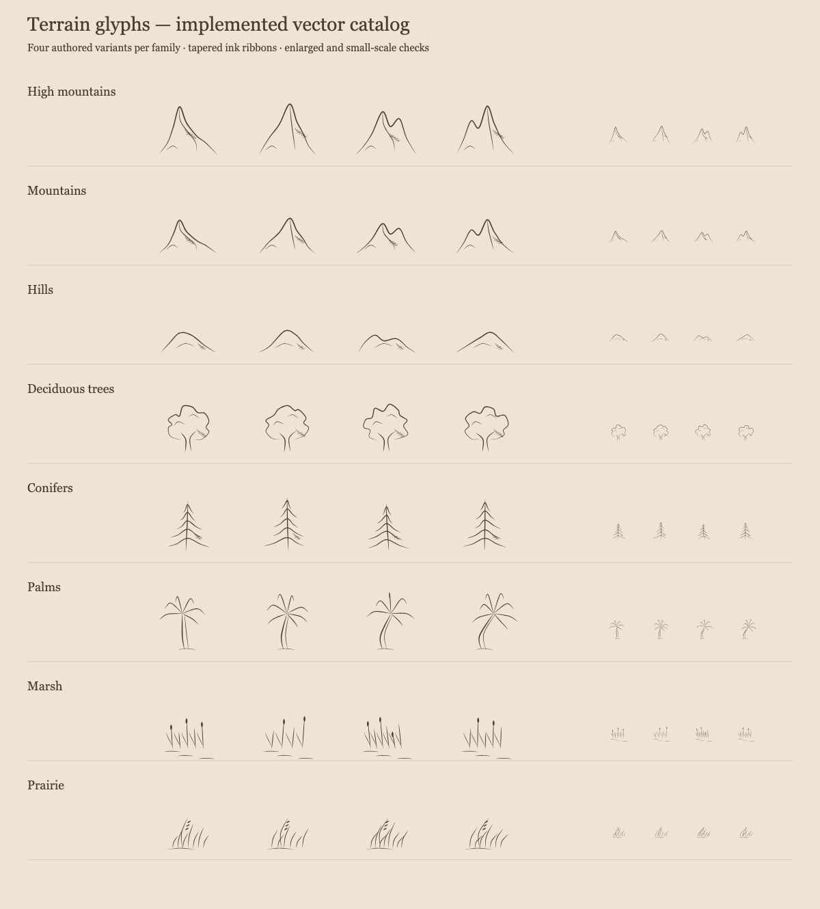
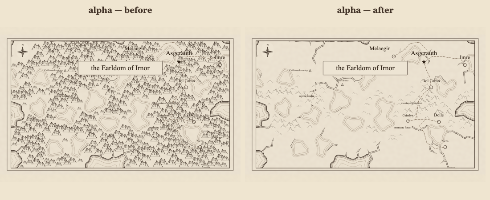
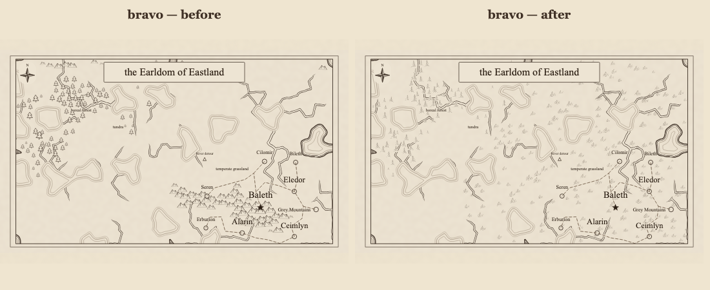
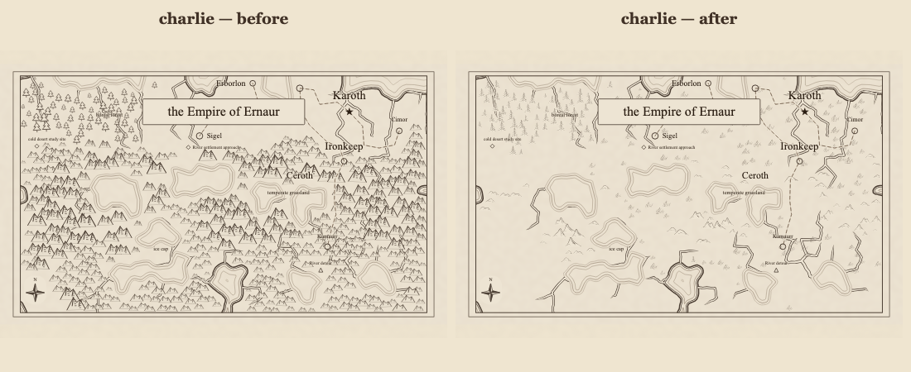

# Terrain glyph review — #373

The complete design and domain model were approved on 2026-10-02. These are rendered review
artifacts from the implementation, not generated bitmap assets used by the application.

## Implemented vocabulary



[Vector specimen sheet](implemented-glyphs.svg). Reproduce it with:

```bash
npx vite-node scripts/render_terrain_glyphs.ts --out docs/region-terrain-glyphs-373/implemented-glyphs.svg
```

The ink comes from the actual catalog and ribbon-expansion code. The original design specimens
remain in [specimens.svg](specimens.svg) for comparison. The controlled
[all-family map](all-families.svg) uses the same 16-cell setup as
`terrain_glyph_assignment.test.ts`: eight distinct terrain cells and eight bare plain cells
providing the shared classifier's lowland baseline. Its [raster preview](all-families.png) checks
legibility at the renderer's normal output size. The empty lower half is deliberate fixture geography.

## Reference maps

Baseline source: `bf6ffa245b02039635963f5306596894d5334f82`, before the #373 edits.
Both versions use the same generated geography and the existing CLI's 60 × 35 dimensions.







Reproduce each after SVG with:

```bash
npm run render:region -- --svg-out docs/region-terrain-glyphs-373/alpha-after.svg --seed alpha
npm run render:region -- --svg-out docs/region-terrain-glyphs-373/bravo-after.svg --seed bravo
npm run render:region -- --svg-out docs/region-terrain-glyphs-373/charlie-after.svg --seed charlie
```

The drawings have softer contours, tapered ends, and small intersecting hatch strokes.
The forest trees have distinct crown/branch silhouettes. Hills and grass tufts remain lighter
than forests. The sheet and controlled map include marsh and palm drawings that these three
reference geographies do not guarantee.

The reduced peak coverage on Alpha and Charlie is intentional: glyph classification now uses
the shared relative landforms instead of treating almost every sufficiently elevated cell as
a mountain. Bravo gains prairie grass and distinguishes rolling hills from peaks. Settlements,
roads, rivers, water outlines, label styling, and furniture keep their existing rendering code.

## Size and timing review

| Reference SVG with existing labels | Before bytes | After bytes | Change |
| ---------------------------------- | -----------: | ----------: | -----: |
| Alpha                              |      162,765 |     163,960 |  +0.7% |
| Bravo                              |      139,069 |     186,673 | +34.2% |
| Charlie                            |      167,991 |     209,332 | +24.6% |

All are below the proposal's 2× size-review threshold. The renderer expands each variant only
once, combines its ink into one filled path, simplifies sampled ribbons within 0.001 local units,
and serializes only referenced definitions. This avoids per-instance curve expansion and shadows.

A local timing experiment warmed both renderer modules, then alternated seven calls to the old
and new renderer on each identical map. Generation and module loading were outside the timings;
these calls omit optional labels to isolate map drawing. Browser verification was running at the
same time, so these figures are diagnostic rather than a stable performance benchmark.

| Seed    | Before median ms | After median ms | Before glyphs | After glyphs |
| ------- | ---------------: | --------------: | ------------: | -----------: |
| Alpha   |            152.4 |           135.3 |           486 |          120 |
| Bravo   |            120.9 |           154.2 |           140 |          273 |
| Charlie |            125.8 |           125.4 |           485 |          246 |

Bravo's roughly 28% timing increase crosses the proposal's 25% investigation threshold. Its
eligible terrain now includes prairie and hills, and it draws 133 additional glyphs. This is a
plausible explanation, rather than proof of which operation dominates. The increase is about
33 ms in this experiment. Repeating the same alternating seven-call experiment after browser
verification completed produced the following results:

| Seed    | Before median ms | After median ms | Change |
| ------- | ---------------: | --------------: | -----: |
| Alpha   |            111.9 |           107.2 |  −4.3% |
| Bravo   |             99.2 |           102.1 |  +3.0% |
| Charlie |             94.0 |            96.8 |  +3.0% |

The repeat is below the timing-review threshold for all three inputs. It demonstrates no large
steady-state serialization regression in this local sample, despite Bravo's additional glyphs.
It does not measure module initialization or establish a browser drawing-time guarantee.

## Validation record

- The full `npm run verify:all` run passed type checking, lint, 6,805 unit tests, and coverage for
  all 99 libraries; its browser stage passed 661 tests with five skips in 10.7 minutes.
- The region-specific browser checks passed label and compass bounds, raster paper-rim checks,
  saved-data reopening, SVG download, and PDF export. All five phone widths passed.
- A subsequent regression test also checks the full reed footprint against an adjacent rendered
  lake, including its low ground-water strokes. The final `npm run verify` passed with 6,806
  unit tests, clean type/lint checks, and all 99 libraries above their coverage gate.
- The implemented catalog sheet, controlled all-family map, and three reference comparisons were
  visually inspected. Human approval covers the design; these implementation renders are available
  for further aesthetic review.
