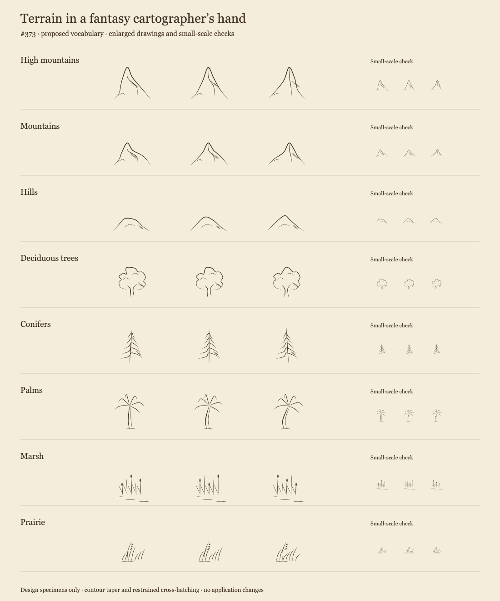
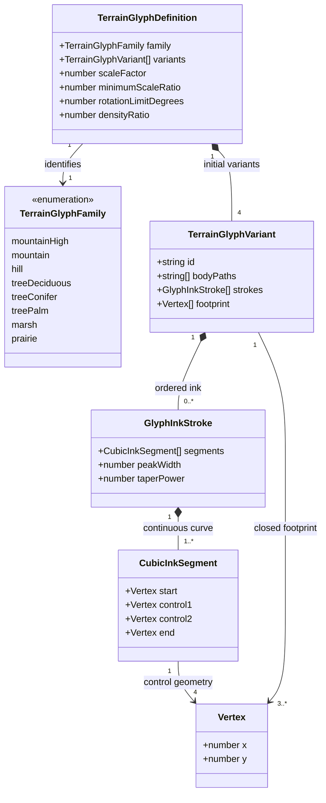
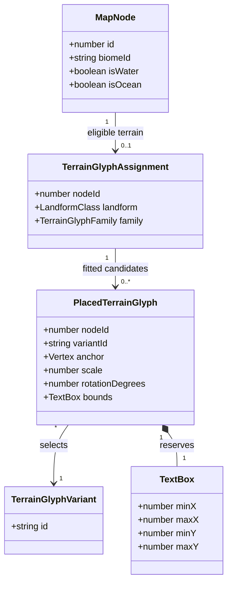

# Region terrain glyphs

**Status:** implemented — the human reviewer approved the complete proposal, domain model, and
visual direction on 2026-10-02. See the [rendered review and validation record](region-terrain-glyphs-373/README.md).

Tracked by [#373](https://github.com/ironarachne/ironarachne/issues/373). This extends
[Region Map Cartography](region-cartography.md); it does not replace its palette, spacing,
water treatment, labels, or map furniture. The implementation follows the approved model.

## Problem

The map has five fixed symbols: oak, pine, palm, high mountain, and low mountain. Scale and
rotation vary, but the drawings repeat. Mountains are angular diagrams, trees have simple
geometric crowns, and the pen strokes have constant width. There are no hill, marsh, or
prairie glyphs. The renderer also uses older absolute mountain thresholds rather than
`classifyRegionLandforms`, which already supplies the landform classes used elsewhere.

The intended meaning of **natural-looking** is **like a fantasy cartographer's ink drawing
of the terrain**. Recognition, expressive contours, and economy of marks matter more than
botanical accuracy or photographic detail. A mountain should feel sketched, a tree should
feel grown, and a prairie should read as wind-bent grass at map scale.

## Visual direction

Keep the novel-endpaper tradition: warm dark ink on parchment, open paper between marks,
and small drawings viewed obliquely. Use asymmetry within a recognizable vocabulary.

- Mountains: uneven summits, broken slopes, subsidiary shoulders, and a few descending
  ridge strokes. High mountains are taller and sharper; ordinary mountains remain rocky,
  rather than becoming rounded hills.
- Hills: low, rounded, asymmetric humps with a short flank contour and sparse shading.
  An open baseline prevents the mark looking like a filled pebble.
- Deciduous trees: irregular lobed crowns, visible trunk forks, and a few interior leaf-mass
  contours. Avoid the repeated cloud-on-a-stick silhouette.
- Conifers: a slightly wandering trunk, uneven drooping branch tiers, and gaps between
  needle masses. Avoid stacked identical triangles.
- Palms: retain the tropical vocabulary, with varied leaning trunks and arching fronds.
  Include them in the variant and taper treatment so the terrain set stays coherent.
- Marsh: reeds of unequal heights, occasional seed heads, and two or three low broken
  water strokes. These indicate wet ground, not a newly drawn lake.
- Prairie: sparse tufts with long curving blades, occasional seed stalks, and a common
  gentle lean. Keep more paper visible than in forests; avoid dot-like texture marks.

Contour strokes begin at zero width, swell through the middle, and end at zero width.
Use lighter, thinner tapered strokes for internal detail and hatching. Shade predominantly
on the right/lower flank, leaving the opposite face open. Cross-hatching means two intersecting
sets of strokes, confined to small shadow areas on mountains, hills, and tree crowns.
Grass and reeds need little or no cross-hatching. No solid dark shadow wedges or new drop
shadows: parchment body fills provide occlusion; hatching provides depth.

### Specimen sheet

[Open the SVG specimen sheet](region-terrain-glyphs-373/specimens.svg).

The sheet shows three proposed drawings for each of eight families, enlarged for contour
review and repeated at a small size for legibility review. It is a hand-authored design
artifact, not renderer output, a final asset catalog, or evidence that map placement works.
The proposed initial catalog has **four authored variants per family** (32 total). The three
specimens establish the vocabulary; the fourth is authored during implementation after approval.

Review both the enlarged and small marks. Fine shading may disappear at small sizes, but
the silhouette must still distinguish a hill from a mountain and reeds from grass.

## Scope and decisions

### 1. A renderer-local catalog, with authored variation

Keep the catalog and geometry in `src/lib/map`, with types in
`terrain_glyph_types.ts`, data in `terrain_glyph_catalog.ts`, and stroke expansion in
`terrain_glyph_ink.ts`. This is a rendering concern, not a new general-purpose library.
`region_map_svg.ts` consumes the catalog instead of maintaining separate geometry and fit outlines.

Variants differ in summit position, shoulders, branch arrangement, canopy contour, trunk lean,
and blade count. Random scaling and slight rotation supplement these differences. Do not
randomly distort individual vertices at render time: this risks illegible marks and invalid bounds.

Each variant carries closed parchment body paths (where needed), ordered ink strokes, and
a conservative footprint enclosing all visible geometry. Body paths have no inked bottom edge
unless a separate stroke declares one. All geometry uses local symbol coordinates, with the
base anchored at `(0, 0)` and negative y above ground. Detail stays within the footprint.

### 2. Taper as geometry

SVG cannot express varying width along an ordinary stroke consistently across our browser and
export paths. Expand each open cubic Bézier stroke into a closed filled ribbon. Represent a
straight line as a cubic segment too, so contours, reeds, and hatch lines share one model.

Sample each segment deterministically; compute normals from the curve tangent; offset on both
sides by half the width. Width follows `peakWidth * sin(pi * t)^taperPower`, where `t` is normalized
arc length across the entire stroke. Clamp the sine to nonnegative values before exponentiation
and explicitly set both endpoint widths to zero to avoid floating-point artifacts. Both endpoints therefore have zero width, including strokes
with several segments. Use a conservative initial maximum sample step of 0.02 local units;
validate curves and refine where needed to avoid corners in the expanded outline. Degenerate
segments are omitted; tangent fallbacks prevent NaN geometry. Separate strokes at intentional
corners instead of forcing a ribbon through a sharp cusp.

Closed parchment body paths are fills, not strokes, and do not use endpoint taper. Hatch marks
are individual strokes; they do not join into one long zigzag. Expand ribbons once per variant
when building SVG definitions, then place them with `<use>`. Keep numbers rounded to the existing
three-decimal convention; quantization must preserve a visibly tapered end at ordinary map scale.

The footprint includes ribbon width and any ground marks. Derive fitted outlines, spacing
half-widths, and label boxes from that same footprint. Reject artwork escaping its footprint
in catalog tests, rather than relying on clipping to conceal invalid geometry.

### 3. Landform and vegetation precedence

Compute `classifyRegionLandforms(map)` once. Use its `byNodeId` result without introducing
new elevation thresholds. Replacing the old renderer thresholds deliberately changes which
cells show peaks and introduces hills consistent with the map's terrain metrics.

Choose at most one family per cell, using the following ordered rules:

| Order | Evidence                             | Family                      |
| ----- | ------------------------------------ | --------------------------- |
| 1     | Ocean or water cell                  | None                        |
| 2     | `highMountain` landform              | High mountain               |
| 3     | `mountain` landform                  | Mountain                    |
| 4     | Marsh-compatible land biome          | Marsh                       |
| 5     | `hill` landform                      | Hill                        |
| 6     | Forest/woodland biome                | Deciduous, conifer, or palm |
| 7     | Prairie-compatible land biome        | Prairie                     |
| 8     | Other or unknown biome on plain land | None                        |

This keeps the existing single-layer mountain-over-forest approach. Hills also take precedence
over trees: wooded hills read as hills in this iteration. Marsh takes precedence over hills
so a wetland does not lose its defining symbol. Composite wooded hills and mountain trees
would need a separate proposal; independently scattering both would resurrect stacking problems.

Marsh compatibility initially means `flooded grassland`, `freshwater wetland`, and legacy
`swamp`, plus explicit marsh/bog/fen aliases. Do not treat mangrove forest as marsh or treat all
humid land as wetland. Prairie compatibility initially means `temperate grassland` and explicit
prairie aliases. Tropical savanna and montane grassland remain outside that visual class;
plain desert, tundra, and unknown land remain unmarked. Resolve supported names in one renderer
classification helper, with exact normalized matches for new aliases, rather than scattered
substring conditions. Preserve the existing tree-family mappings for tropical/mangrove,
boreal/montane/coniferous, and other forest/woodland biomes.

Marsh glyphs still obey land-to-water clearance: wetland marks do not authorize drawing in a
lake. This proposal depicts saved cell evidence; it does not infer or change hydrology,
biome assignment, altitude, or terrain generation.

### 4. Sparse placement and deterministic variation

Retain the shared Poisson candidate set, shared variable-width spacing index, largest-fitting-scale
search, drawn-water clearance, furniture reservations, and back-to-front painter ordering.
Extend the candidate lookup and containment masks to all eight families. Containment follows
cells assigned the same family, not just the same variant; internal cell boundaries remain invisible.
Select a variant **before** fitting so its actual footprint determines fit and spacing.

Each family declares desired scale, minimum scale ratio, rotation limit, and density relative to
the current tree treatment. Start with existing mountain/tree density and lighter hills (0.65),
marsh (0.5), and prairie (0.35). These are proposal starting points for visual tuning, not promises
about exact glyph counts. Thin candidates with the family's RNG; the shared spacing index still
has final say. Do not pack extra tufts into gaps already occupied by other glyphs.

Use only `@ironarachne/rng`. Keep candidate placement's current deterministic map-based seed.
Give variant choice and density their own local RNG stream derived from the same map key,
node ID, and stable candidate index. Thus changing the number of variants does not consume
placement RNG draws or shift unrelated candidates. Re-rendering an identical saved map produces
byte-identical SVG. A new public seed or snapshot field is unnecessary; the saved map is the input.
Variants are selected uniformly; four authored shapes plus scale variation should break obvious
repetition. No history-dependent neighbor alternation in the initial design.

### 5. Saved data, exports, and exclusions

The new catalog and placed-glyph records are ephemeral rendering data. No RegionMap, snapshot,
artifact, or IndexedDB schema change is required. Existing saved regions gain the new artwork
when rendered. Stable variant IDs are SVG IDs, not new persisted references.

Keep vector SVG export and the existing image/PDF embedding path. No external raster artwork,
fonts, textures, network resources, or vendored asset changes. Settlement and manmade landmark
glyphs, including ruins, are outside #373. Coast/road/river strokes and map furniture are also
outside the tapered terrain-stroke treatment.

## Domain model

These are the proposed declarations for `terrain_glyph_types.ts`. `Vertex`, `MapNode`,
`LandformClass`, and `TextBox` are existing concepts; the diagram shows only the fields relevant
to their relationships here. Arrays preserve drawing order. Numeric profile values are local
symbol units unless explicitly ratios or degrees.

An assignment is absent for water or unmarked plains. Each eligible cell has one family but can
place zero or several glyphs. A placed glyph points to one catalog variant and records the same
bounds used by collision and label placement. SVG markup is serialized from this record rather
than being the record's identity.

## Validation and review criteria

Mechanical validation cannot decide whether the drawings feel like fantasy cartography.
Human review must inspect the specimen vocabulary first and full maps after implementation.

- Every family has four visibly different authored variants; hills, mountains, trees, grass,
  and reeds remain recognizable at the map's ordinary output size and its smallest fitted scale.
- Endpoint widths are zero, middle widths positive, multi-segment joins finite and continuous,
  and every ribbon lies within its declared footprint. Repeated generation is byte-identical.
- Classification tests cover hills, both mountain classes, forests, wetlands, prairie, water,
  unsupported biomes, and every precedence combination. Replace the grassland-empty assertion
  only for prairie-compatible grassland; retain it for other open biomes.
- Placement tests retain water clearance, shared spacing, back-to-front ordering, region
  containment, and furniture/label exclusion for all variant footprints. Include wetland fixtures
  bordering narrow water and dense mixed-terrain fixtures.
- Render before/after maps for `alpha`, `bravo`, and `charlie` with `scripts/render_region_map.ts`,
  plus controlled maps guaranteeing all families. Compare at normal size, zoomed detail, and narrow
  page widths. Verify SVG and existing PDF/image export preserve tapered edges and fine shading.
- Record output bytes, glyph count, and render time against those same inputs. Review any growth
  beyond 2x SVG bytes or 25% median rendering time on the same machine; investigate rather than
  silently accepting it. Shared definitions should make authored detail cheap per instance.
- Run `npm run verify` for implementation and `npm run verify:all` before merging this rendering
  change, in accordance with AGENTS.md. The proposal itself needs formatting and visual inspection.

## Approval record

The human reviewer approved the visual vocabulary, the eight-family domain model, authored
variants with tapered ribbons, shared landform classification, and the stated terrain precedence.
The density ratios and stroke sampling limit are starting values to tune against rendered maps.

Per [AGENTS.md](../AGENTS.md), “Implementation does not start before that approval.” This document
and its specimen sheet are review artifacts. Approval was given on 2026-10-02: “Looks good, I approve everything.”

## Approved implementation work items

1. Add the renderer-local types, authored catalog, and tapered ribbon geometry.
2. Integrate shared terrain classification, deterministic variants, and footprint-aware placement.
3. Add geometry and placement regression coverage; render reference maps and an all-family fixture.
4. Run the required gates and record visual and performance findings.

## Implementation record

All four approved work items are implemented. The runtime catalog contains 32 authored variants;
the renderer uses shared landform classification and independent deterministic streams for
placement, density, selection, and styling. SVG ink uses filled tapered ribbons, with conservative
control-hull footprints shared by fit, spacing, water clearance, and reservation bounds.
No geography or saved-data schema changed. The [review folder](region-terrain-glyphs-373/README.md)
contains the actual catalog sheet, all-family fixture, reference comparisons, and performance findings.
