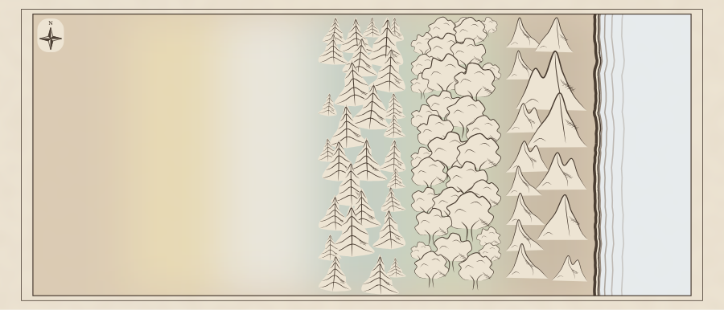

# Region terrain tone review

The domain model in [the design](../region-terrain-tones.md) was approved on 2026-10-04.

The palette fixture shows ordinary land, desert, tundra, conifer forest, deciduous forest,
mountains, and ocean from left to right. It exercises blended land boundaries and a sharp
water edge, with existing terrain glyphs above the wash.

The following maps were rendered with `npm run render:region -- --seed <seed> --svg-out <path>`
and captured in headless Chromium. The `alpha` pair retains the same geography and symbols;
the change is the new wash and pale river channels. Visual inspection found smooth terrain
transitions, crisp shorelines, readable labels, and preserved sepia ink.

| Seed          | SVG                     | Chromium image         |
| ------------- | ----------------------- | ---------------------- |
| alpha, before | [SVG](alpha-before.svg) |                        |
| alpha, after  | [SVG](alpha-after.svg)  | [PNG](alpha-after.png) |
| bravo, after  | [SVG](bravo-after.svg)  | [PNG](bravo-after.png) |

## Validation

`npm run verify` passes: 0 type errors or warnings, formatting and lint clean, 6,936
unit tests passing, and all 100 libraries at or above the coverage threshold.

Chromium pixel sampling of the isolated wash fixture confirmed gradual land transitions:
samples at 0.2-map-unit intervals across the brown/desert boundary changed by at most one
channel value per step. Across the shore, samples 0.4 map units apart changed from
`rgb(210,195,173)` to `rgb(231,236,237)`. Three samples inside water were identical,
confirming that the land wash does not bleed into the fill. The final water palette was
cooled slightly to compensate for the warm parchment visible through its opacity.

`npm run verify:all` completed with 660 browser tests passing, 5 skipped, and 3 failures
(10.4 minutes). The command therefore exited nonzero. Region label bounds passed for all
five seeds, and `/region` passed at all five mobile widths (320, 360, 375, 390, and 430px).

Three checks failed during the full run and passed in isolated reruns against the final code:

- Heraldry save/edit: the save button remained disabled after selecting a division on
  randomly generated arms. Selecting a division already present does not make an edit.
- Gazetteer Markdown export: the generated name `Thaurbarn  Brothers Traders` contained
  double spaces. Markdown retained them while browser `innerText` collapsed them, causing
  the exact-substring assertion to fail.
- Regional materials resize: the viewport assertion caught sidebar links at `left=-16`
  during the drawer transition after changing the viewport to 320px.

The gazetteer and regional-materials checks also passed on an untouched copy of HEAD.
These failures appear unrelated to terrain tones; no changes were made to their code or tests.
The `alpha` before/after SVGs have identical placement for all 120 terrain glyphs and
identical geometry for all 22 water outlines.
