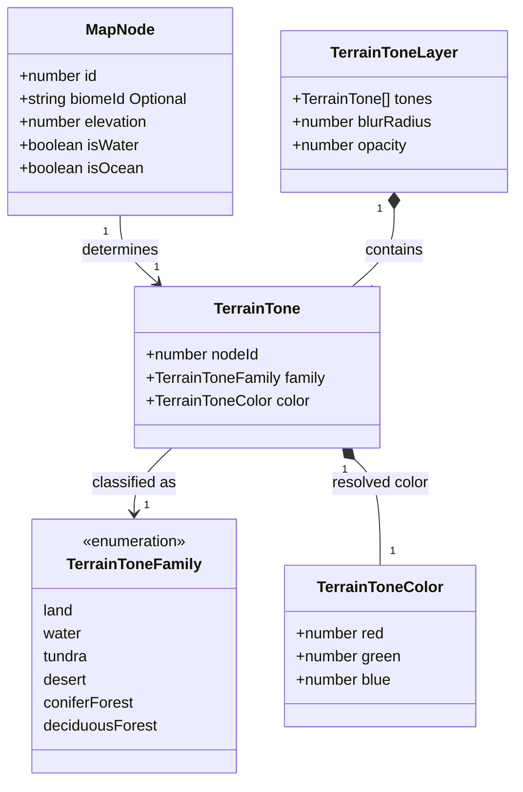

# Region terrain tones

**Status:** implemented — the human reviewer approved the domain model on 2026-10-04.

Tracked by [#386](https://github.com/ironarachne/ironarachne/issues/386). Extends
[Region Map Cartography](region-cartography.md) and
[Region terrain glyphs](region-terrain-glyphs.md).

## Problem

Region maps currently draw terrain symbols and water hatching on the same parchment ground.
The missing tonal layer makes broad terrain regions difficult to distinguish. Introduce subtle
brown, blue, white, yellow, and green washes while retaining the sepia ink and parchment texture.
Land transitions must blend smoothly; coastlines and lake boundaries must remain crisp.

## Solution and decisions

Keep the feature inside `src/lib/map`, with renderer-local types in `terrain_tone_types.ts`
and classification, color calculation, and SVG wash construction in `terrain_tones.ts`.
The existing `region_map_svg.ts` composes that wash beneath hatching, rivers, glyphs, roads,
settlements, labels, and map furniture. No saved data or generator output changes are needed.

### Palette

Use these muted starting colors, subject to refinement through rendered visual checks:

| Surface                               | Color     | Direction           |
| ------------------------------------- | --------- | ------------------- |
| Ordinary land and unclassified biomes | `#d8c6ad` | Warm brown          |
| Ocean and lake water                  | `#e6eef4` | Lightest, cool blue |
| Tundra and ice                        | `#e9e7de` | Warm off-white      |
| Desert                                | `#e7d8ae` | Pale yellow         |
| Coniferous forest                     | `#bdcbc1` | Muted blue-green    |
| Deciduous forest                      | `#c7cfb5` | Muted green         |

Water is slightly lighter than tundra; their temperature distinguishes the two. The wash
uses one common opacity, initially 0.8, so the underlying parchment grain remains visible.
The shared cartography ink palette stays as it is.

Normalize biome names and classify tundra/ice, desert, and forest/woodland explicitly.
Follow the existing glyph conventions for boreal, montane, coniferous, and pine forests.
Other forest types, including tropical forests, receive the green forest wash. Marsh,
grassland, savanna, and unknown biomes use the ordinary land tone for this issue.

Apply relief darkening to the biome color rather than replacing it. Use
`classifyRegionLandforms`, which already drives terrain symbols and regional prose:
plain has no darkening, hills have a small amount, mountains more, and high mountains most.
This preserves the cool tint of a mountain forest and the pale tint of alpine tundra.
Water never receives relief darkening.

### Blending and water boundaries

Paint the land cells as opaque colored polygons into one SVG group, then apply one
map-scaled Gaussian blur to that group. A small same-color polygon stroke covers numerical
seams before filtering. Blur width follows typical cell size, so boundaries soften without
erasing narrow terrain regions. Use an explicit expanded filter region to avoid clipped blur
at the map edges, and a base land rectangle to avoid transparent edge fringes.

Apply a land mask **after** filtering. Its water cutouts reference the exact processed
water paths already used by the renderer for hatching and coastlines. Paint water fills
using those same paths. The mask and water fills stop the land wash at the drawn shoreline;
they do not use raw Voronoi coast polygons. No blur is applied to water.

Retain the current river geometry and sepia bank strokes; use the pale water color for
river channels so inland water shares the tonal vocabulary. Preserve the parchment fills
inside glyph bodies and label halos, which keep the ink illustrations and text legible.

### Determinism and cost

Color and blending derive exclusively from the existing map. They consume no RNG values
and do not change glyph placement. The renderer emits one blur group for all land rather
than one full-map filter per cell. No dependency is added.

## Domain model

These are transient drawing inputs. Existing `RegionMap`, `MapNode`, and `LandformClass`
are reused; the new types live in `terrain_tone_types.ts`.

`TerrainToneColor` channels are finite values in the range 0–255. Each map node gets one
tone; land colors already include relief darkening. `TerrainToneLayer` holds the derived
cell tones and scale-dependent drawing parameters, with no serialized or persisted state.
Water path definitions remain owned by the existing SVG renderer and are passed as path
references to wash construction rather than copied into this model.

## Validation

After approval, verify biome classification, relative-relief darkening, water immunity to
darkening, deterministic output, and finite colors and geometry. Exercise adjoining terrain
cells, isolated water, all-water, and all-land fixtures. Assert wash ordering and use of the
same processed shoreline paths for land masking and water filling.

Render pinned-seed before/after maps with `scripts/render_region_map.ts`, plus a controlled
fixture showing every palette family beside water. Inspect normal-size images for visible
cell seams, coastline bleed, loss of ink contrast, and excessive filter cost. Check the
result in a browser and run `npm run verify`; run `npm run verify:all` before merging this
rendering change, as required by `AGENTS.md`. Record the visual evidence and results here.
