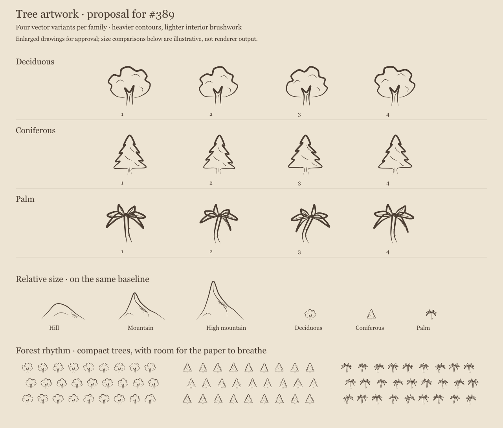

# Tree artwork review — #389

**Status:** implemented; artwork approved on 2026-10-04. Final validation is recorded in
[PR #398](https://github.com/ironarachne/ironarachne/pull/398).

The [design and domain model](../region-tree-icons.md) were approved on 2026-10-04.
This sheet proposes four new drawings each for deciduous, coniferous, and palm trees.
It uses the production tapered-ribbon serializer and cartography colors. The runtime
catalog now uses these approved drawings, with a separate forest candidate stream and
the approved size ceiling.



The enlarged rows show silhouette and stroke weight. The comparison row shows the new
trees beside existing hills and mountains. Forest samples show detail at reduced scale.
Comparison sizes and forest positions are illustrative; they are not generated map
placements or proof of the approved renderer size and density guarantees. Full-map
comparisons follow integration.

Sources: [editable sketches and specimen renderer](artwork.ts), [vector sheet](specimens.svg),
and [PNG preview](specimens.png).

Regenerate from the repository root:

```bash
npx vite-node docs/region-tree-icons-389/artwork.ts
rsvg-convert docs/region-tree-icons-389/specimens.svg -o docs/region-tree-icons-389/specimens.png
```

The reviewer approved these drawings on 2026-10-04: “Those drawings are fine. Proceed.”

## Implementation review

[Controlled renderer fixture](fixture.png): the top row contains deciduous, coniferous,
and palm forests; the middle row contains hills, ordinary mountains, and high mountains.
These are actual placements, including the size ceiling, shared spacing, and furniture
reservations. Regenerate with `npx vite-node docs/region-tree-icons-389/render_fixture.ts`.

Reference maps: [alpha before](alpha-before.svg), [alpha after](alpha-after.svg),
[bravo before](bravo-before.svg), [bravo after](bravo-after.svg),
[charlie before](charlie-before.svg), [charlie after](charlie-after.svg).

The map-wide ceiling is deliberately conservative: in maps with very small cells, trees
read as fine forest texture at full-map size; zoom reveals the approved silhouettes.
The controlled fixture uses equal cell sizes and makes the relative size hierarchy clearer.

[Performance measurements](performance.json) compare five warmed renderer runs per seed
on the same machine, using the same generated map and title options. They exclude region
generation and use the original HEAD renderer/catalog for the before measurements.
Median times increased from 102 to 132 ms for alpha, 114 to 154 ms for bravo, and
106 to 134 ms for charlie. This exceeds the 25% investigation threshold: the additional
Poisson pass samples at half the old radius, so its scaffold has about four times as
many sites; accepted glyphs also increase substantially in forested maps. The measured
absolute cost is 28–40 ms per render. The pass is skipped when no tree family is assigned.
No clearance or fit checks were weakened to reduce that cost. SVG byte growth remains
below 2x on all three seeds.

Tree placements increased from 1 to 4 on alpha, 79 to 397 on bravo, and 67 to 325 on
charlie. Every non-tree `<use>` placement is identical between each reference pair.
The full tree candidate scaffolds contain 4,389, 4,415, and 4,409 sites respectively
(2,568 for the controlled fixture), so none of these fixtures can hit the 12,000 accepted
candidate cap. Accepted candidates are a subset of those complete deterministic scaffolds.
