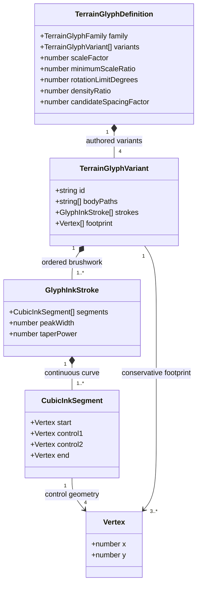
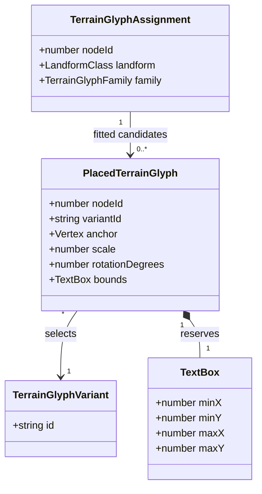

# Region map tree icons

**Status:** accepted — design, domain model, and artwork approved on 2026-10-04; implementation under verification.

Tracked by [#389](https://github.com/ironarachne/ironarachne/issues/389). Extends
[Region terrain glyphs](region-terrain-glyphs.md) and
[Region Map Cartography](region-cartography.md).

## Problem

Coniferous, deciduous, and palm trees need new drawings. They should retain the map's
brushwork style, have heavier outlines than interior details, and render smaller and
denser than hills and mountains.

The current catalog gives trees a scale factor of 0.6 and hills 0.75, but the tree artwork
is roughly twice as tall in local coordinates. Scale factors alone therefore do not
establish the requested hierarchy. Trees already have a density ratio of 1, but share the
landforms' Poisson candidate distance of `1.1 * mapScale`; increasing the ratio cannot
create additional candidates. Fitting also applies a common non-mountain scale floor,
which can defeat a reduction in a tree's scale factor.

## Solution and decisions

Keep this change in `src/lib/map`, using the existing vector glyph catalog, tapered ink
ribbons, footprint fitting, shared spacing index, and painter ordering. Replace the twelve
tree drawings, extend the existing definition with a candidate spacing factor, and constrain
tree dimensions explicitly. No new library, dependency, route, setting, persisted field,
or migration is needed. Existing saved maps receive the new trees when rendered.

### 1. Visual vocabulary

Retain four authored variants in each tree family and the existing `tree-oak-0..3`,
`tree-pine-0..3`, and `tree-palm-0..3` SVG IDs. Variation comes from different silhouettes
and branch arrangements, with the existing small deterministic lean and size variation.

| Family     | Silhouette                                                                                                | Interior detail                                                                |
| ---------- | --------------------------------------------------------------------------------------------------------- | ------------------------------------------------------------------------------ |
| Deciduous  | Compact, irregular rounded canopy above a short visible trunk; broad lobes rather than a scalloped bubble | Two or three broken branch or foliage strokes, with sparse shading on one side |
| Coniferous | Narrow, tapered crown with asymmetric stepped boughs and a short trunk                                    | A few downward branch strokes; avoid the current ladder of disconnected tiers  |
| Palm       | Short curved trunk and a compact fan of individually outlined, drooping fronds                            | Fine frond ribs and at most a few trunk marks; retain open gaps between fronds |

Use parchment body fills where the canopy or trunk should obscure marks behind it.
Palm fronds need closed leaf bodies and paired outer edges, rather than single hairline
spokes. Author continuous curves through rounded transitions; split strokes at sharp
tips and intentional breaks. Preserve tapered endpoints and slight asymmetric brushwork.
Do not use uniform SVG strokes or introduce raster artwork.

Start with outline peak widths of 1.8–2.2 sketch units and interior widths of 0.55–0.8,
using the existing conversion of 0.032 map-symbol units per sketch unit. Every structural
outline must be at least twice the thickest interior detail's peak width. Taper means
an outline tip can still be thinner than a detail's middle; the requirement concerns their
stroke profiles, not every individual pixel. Avoid dense crosshatching that becomes a
dark knot at normal output size. Trunks and frond edges count as structural outlines.

### 2. Size hierarchy

Measure size from the complete footprint, including ribbon width and ground marks,
after rotation and scale. A smaller `scaleFactor` alone is insufficient.

Establish a map-wide tree size ceiling from the existing hill, mountain, and high-mountain
catalog profiles. For each of those families, use its smallest permitted fitted scale
at the smallest desired scale among land nodes in this map. Include every variant and
the family's allowed rotation range when deriving conservative lower bounds on width
and height. Compute this once per render; it does not depend on whether a landform
actually finds a placement. Empty or invalid maps return no glyphs as today.

Each tree's transformed footprint must be at most 75% of both reference dimensions:
the smallest reference width and the smallest reference height. This guarantees that
trees remain smaller than every legal hill or mountain on that map, even when a landform
fits at its minimum size. Landform fitting must continue to reject placements below
its declared minimum. A conservative bound over the continuous rotation range is
required; checking only a handful of angles would not establish the guarantee.

Start tree scale factors at 0.4. Apply the ceiling after random size variation and before
fitting. The common `0.5 * mapScale` floor must not override this ceiling. Use the capped
desired tree scale as the basis for its existing 0.45 minimum fitting ratio; omit a tree
when it cannot fit. All three families obey the same ceiling, including the tall palm.
Tune the drawing proportions and starting factor during visual review, while retaining
the 75% invariant. Keep relief artwork and its size profiles unchanged.

### 3. Forest density

Add `candidateSpacingFactor: number` to `TerrainGlyphDefinition`. It multiplies `mapScale`
to set the minimum Poisson candidate distance. All existing non-tree definitions use 1.1;
the three tree definitions start at 0.55. Keep tree `densityRatio` at 1. These values double
the sampling resolution in each direction without promising an exact tree count.

Retain the original candidate stream for non-tree terrain and oasis selection. Generate
one additional stream restricted to cells assigned a tree family, using a separate seed
suffix such as `:trees`. Tree definitions share one candidate spacing factor so this
pass can cross adjoining forest families without independent grids. Validate that equality
in catalog tests. The original stream's tree candidates are ignored; each forest uses
only the new stream. Keep each pass's 12,000-point cap as a safety bound and report cap
hits in review fixtures before deciding whether any further change is needed.

Place oasis candidates and non-tree terrain in their current order, then trees. This
preserves existing non-tree candidate identities and prevents extra forest candidates
from displacing landforms. Trees enter the same variable-width spacing index, with the
existing radius calculation derived from their smaller footprints. Do not reduce water
clearance, terrain containment margins, or label/furniture exclusions to gain density.
Final painting still sorts all placed terrain by ground anchor, back to front.

Use `@ironarachne/rng` with separate placement, variant, density, and style streams.
Tree styling keys include the `trees` suffix, node ID, and stable tree candidate index.
Changing tree artwork must not consume draws from non-tree streams. Rendering an
identical map with identical options remains byte-identical. A renderer revision can
change the appearance of an old saved map without changing that map's geography.

### 4. Scope boundaries

Keep the existing biome-family classification and relief precedence: wooded hills and
mountains still display relief, rather than a second tree layer. Forest washes, marsh,
prairie, desert symbols, coastlines, rivers, roads, settlements, and map furniture retain
their existing definitions. `desertOasis` contains palm-like vegetation but is a separate
composite family; redrawing it is outside the three tree families requested here.

SVG definitions continue to share expanded ribbons through `<use>`. SVG download and
existing PDF/image export receive the same artwork. Footprints, fit outlines, spacing
radii, and label reservation bounds must all come from the updated catalog geometry.

## Domain model

These are renderer-local types in `terrain_glyph_types.ts`. The only proposed new field
is `TerrainGlyphDefinition.candidateSpacingFactor`; the other declarations and relationships
already exist. `TerrainGlyphFamily` retains all twelve current string variants. Tree
membership and the map-wide size ceiling are derived calculations, not new stored records.

## Validation and review criteria

- Inspect all twelve proposed drawings enlarged, at ordinary map scale, and at minimum
  fitted scale. Confirm recognizable families, heavier structural outlines, and readable
  brushwork after reduction. Use `scripts/render_terrain_glyphs.ts`, adding a comparison
  at actual placement scales; its current sheet enlarges families equally and cannot
  demonstrate the hierarchy by itself.
- Test the size ceiling against every landform and tree variant, extreme scale variation,
  rotation limits, minimum fitted landforms, heterogeneous cell sizes, and different map
  dimensions. Check complete transformed footprints, not just scale values.
- Retain the catalog's unique IDs, four distinct variants per family, finite tapered
  ribbons, and complete footprint containment. Check positive candidate spacing factors
  and equal factors across tree families. Inspect outline/detail widths in the artwork
  review; no stroke-role field is needed solely to automate that check.
- Use controlled, equal-area forest and hill/mountain fixtures with matching cell sizes
  and no water or labels. Each tree family must place more glyphs per eligible area than
  each relief family. Also inspect narrow forest strips and forest boundaries; clearance
  can legitimately reduce or eliminate trees in constrained areas, so density is a
  placement policy rather than a promise for every individual cell.
- Verify unchanged non-tree placements on mixed-terrain fixtures, byte-identical repeated
  SVG output, shared spacing, painter order, water clearance, and label exclusions. Include
  neighboring forests of different families and a forest bordering an oasis.
- Render before/after `alpha`, `bravo`, and `charlie` maps with
  `scripts/render_region_map.ts`, plus controlled fixtures containing all tree and relief
  families. Review at full size and narrow page widths, and inspect SVG and PDF/image
  exports. Record glyph counts, SVG bytes, candidate cap hits, and median render time on
  the same machine. Investigate more than 2x SVG bytes or 25% render-time growth.
- Run `npm run verify` for implementation and `npm run verify:all` before merging this
  rendering change. This proposal requires Markdown formatting and design review.

## Approval record

The human reviewer approved this design and domain model on 2026-10-04: “I approve,
but I will want to also approve the artwork you come up with before a PR”. Artwork
approval is a separate gate: do not open a PR until the reviewer explicitly approves
the proposed drawings. Full-map comparisons also need visual review before merge.

Artwork approval was given on 2026-10-04: “Those drawings are fine. Proceed.” The
[artwork and implementation review folder](region-tree-icons-389/README.md) retains the
approved vector specimens and the full-map comparisons.

## Approved implementation work items

1. Author the twelve vector tree drawings and create a specimen sheet for artwork approval.
2. Integrate approved artwork, the size ceiling, and the separate forest candidate pass.
3. Verify geometry, placement, density, determinism, full-map appearance, and exports.
4. Run the required checks; open a PR only after explicit artwork approval.
