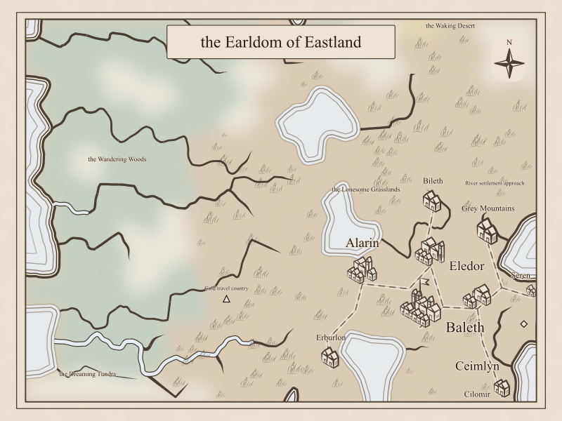
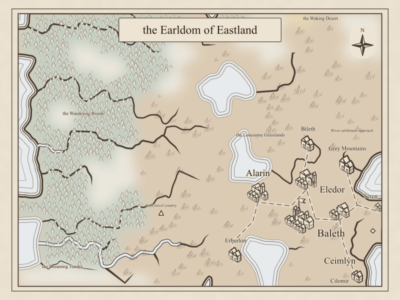
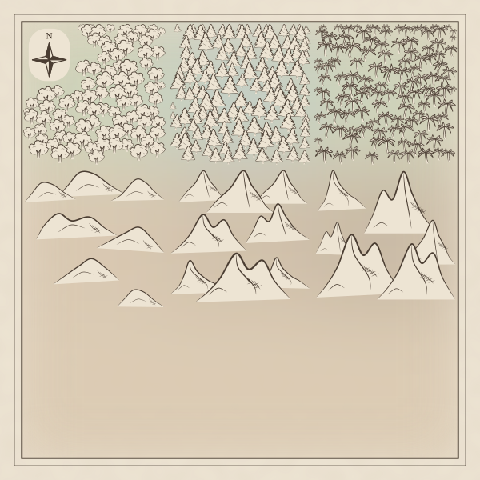

# Tree visibility correction

The original #389 implementation rendered trees around 1.6 pixels tall on a default
40×30 map. The map-wide cap used the smallest land cell and the smallest permitted
relief fitting scale, then constrained both width and height separately. This made
otherwise valid tree placements effectively invisible.

The correction compares each cell's nominal relief profile by its longest dimension.
Trees remain capped at 75% of that reference diameter, with a 0.25 scale factor and
`0.35 * mapScale` floor. Coast fitting, water clearance, forest density, and the approved
artwork are retained. A new export-size regression fixture includes all three tree
families and a tiny unrelated clipped cell.

## Default-size map

Seed `bravo`, default region configuration (40×30), tiefling name generators sharing
the configuration RNG, and `regionToMapSvg(toRegionSnapshot(generate(config)))`.
Images are rasterized at the SVG's native 800×600 size with `rsvg-convert`.

Before: 773 trees, median footprint height 1.61px.

After: 739 trees, median footprint height 9.55px (range 4.26–11.77px).

## All three families

The existing [controlled fixture](../region-tree-icons-389/render_fixture.ts), rendered
with the corrected sizing: deciduous, conifer, and palm in the top row; hills,
mountains, and high mountains in the middle row. The drawings are unchanged.

## Validation

- Targeted SVG and sizing tests: 30 passed, including export visibility with a tiny outlier cell.
- `npm run verify`: passed; 6,983 tests and all 100 libraries above the coverage gate.
- Region browser workflows, map label bounds, and SVG/PDF exports: passed.
- Full browser-suite and CI results: see [PR #399](https://github.com/ironarachne/ironarachne/pull/399).
