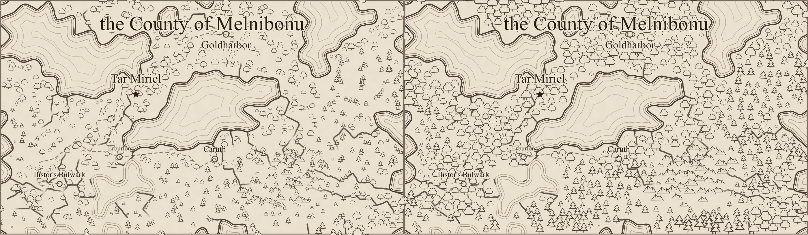
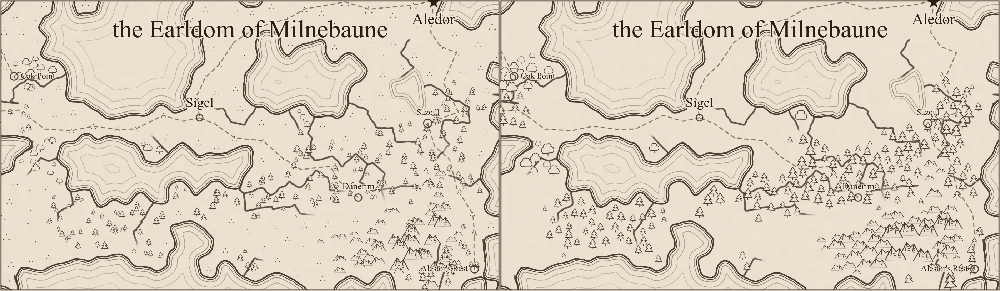
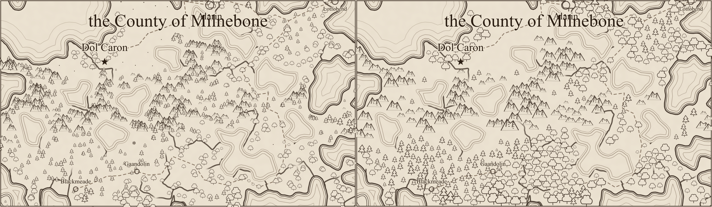

# Glyph scatter review (#194)

Each comparison has **before on the left, after on the right**, rasterized with `rsvg-convert` at
1400 pixels per map. These are review illustrations, not golden-image tests. Human visual review
was approved by Ben in [PR #242](https://github.com/ironarachne/ironarachne/pull/242).

Trees and peaks now share one Poisson candidate set and one spacing index. Larger glyphs carry
the terrain, with parchment between them. Mountain cells get peaks instead of a second independent
layer of trees; the other forest and woodland cells get trees. Open biomes have no dust-speck text
marks. Alpha's stored land is entirely forest/woodland, while Charlie includes actual grassland;
this drawing change does not alter those biomes.

Candidate spacing is 1.1 units at the 60×35 reference dimensions. The shared check additionally
requires base-point distance to be at least 0.55 times the sum of the glyphs' drawn half-widths.
This removes near-coincident stacks while preserving partial overlap and base-y drawing order.
The final candidates are fitted against the existing terrain and water containment checks.

## Measurements

The overlap metric uses glyph base-point distance divided by summed silhouette half-widths,
matching the issue's triage approximation. A ratio below 0.35 counts as near-coincident; below 1
counts as a potential overlap. The latter is a geometric approximation, not a raster collision test.

| Seed    | Glyphs before → after | Near-coincident pairs before → after | Potential overlaps before → after | Minimum ratio after |
| ------- | --------------------- | ------------------------------------ | --------------------------------- | ------------------: |
| alpha   | 1,154 → 692           | 68 → 0                               | 492 → 388                         |              0.5794 |
| bravo   | 369 → 252             | 21 → 0                               | 163 → 81                          |              0.5642 |
| charlie | 1,035 → 478           | 115 → 0                              | 850 → 295                         |              0.5560 |

| Seed    | Before SVG bytes | After SVG bytes | Median SVG generation before → after |
| ------- | ---------------: | --------------: | ------------------------------------ |
| alpha   |          201,499 |         160,629 | 73.0 → 82.8 ms                       |
| bravo   |          137,952 |         120,598 | 55.8 → 62.8 ms                       |
| charlie |          204,405 |         153,598 | 80.0 → 84.2 ms                       |

Timing is local, one warm-up followed by seven renders of each stored map, excluding region
generation and rasterization. The moderate increase comes from the shared sampling and spacing
checks. Shoreline definitions, sea hatching, and title/settlement text are identical before/after.
Text collisions and roads/rivers remain the subjects of #234 and #235.

## Alpha



## Bravo



## Charlie



## Reproduction

The baseline is `3be5646d` (PR #241). Repeat for `alpha`, `bravo`, and `charlie`:

```sh
npm run render:region -- --svg-out /tmp/alpha.svg --seed alpha
rsvg-convert -w 1400 /tmp/alpha.svg -o /tmp/alpha.png
```

The baseline images reuse the accepted #233 output, identical to this baseline. The temporary
Vite configuration used for earlier comparisons works around this machine's pre-existing
optimized-dependency cache failure: import the repository's config and override
`optimizeDeps: { noDiscovery: true, include: [] }`. Both revisions use identical settings.
Comparison images are joined from the rendered PNGs and encoded as lossless WebP.
