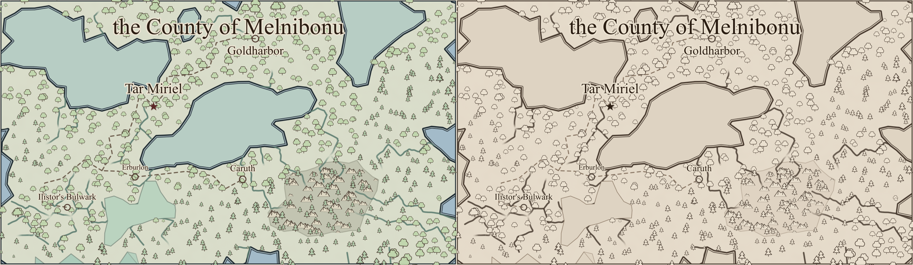
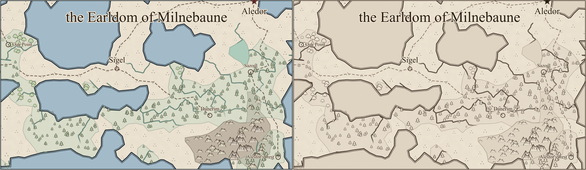
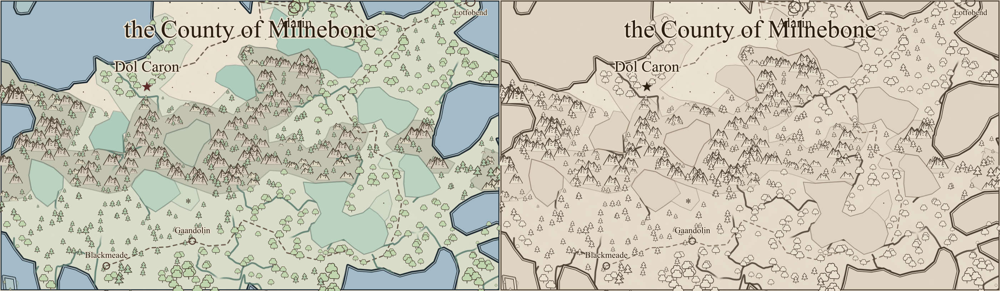

# Region map ink review (#230)

Each comparison has **before on the left, after on the right**, at 1400 pixels per map.
These are review illustrations, not golden-image tests. Human visual acceptance is still pending.

The palette is now near-monochrome sepia. The geometry, glyph scatter, label placement, opacities,
and filter parameters are identical across these three seeds, verified by comparing the SVG trees
with only paint and stroke-width attributes excluded. Polygonal coastlines, terrain fills, crowded
glyphs, and label collisions remain for the subsequent issues in #229.

| Seed    | Before SVG bytes | After SVG bytes |
| ------- | ---------------- | --------------- |
| alpha   | 200,342          | 199,547         |
| bravo   | 128,562          | 127,831         |
| charlie | 202,718          | 201,939         |

## Alpha

## Bravo

## Charlie

## Reproduction

Use `npm run render:region -- --svg-out /tmp/alpha.svg --seed alpha`, repeated for `bravo` and
`charlie`, then rasterize at 1400 pixels wide. The before renderer is the parent version of
`src/lib/map/region_map_svg.ts`.

On this machine the CLI encountered a pre-existing Vite optimized-dependency cache failure. These
renders used the same script with a temporary Vite config importing the repository config and
setting `optimizeDeps: { noDiscovery: true, include: [] }`. Rasterization used `rsvg-convert -w 1400 input.svg -o output.png` for both sides.
The comparisons are stored as lossless WebP to keep the review assets small.
