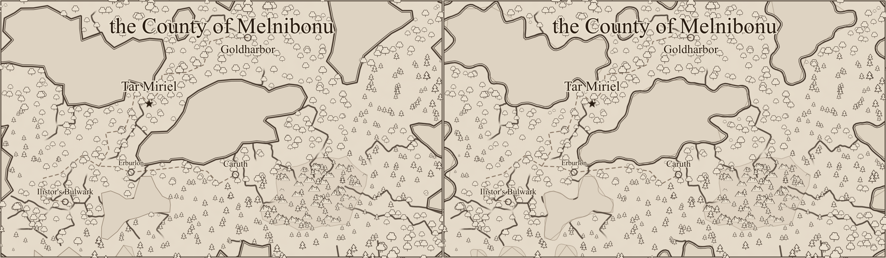
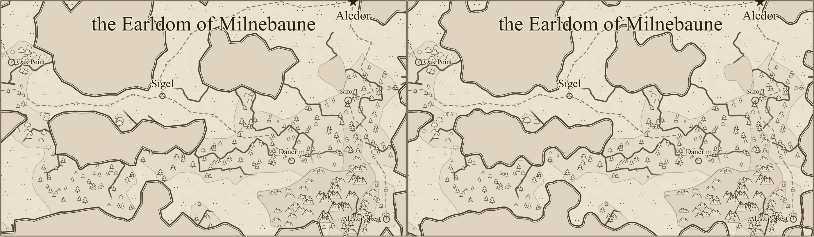
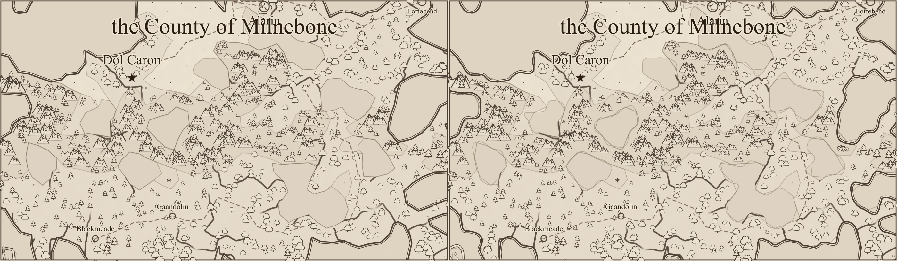

# Water outline review (#231)

Each image has **before on the left, after on the right**, rendered at 1400 pixels per map with
`rsvg-convert`. These are review illustrations, not golden-image tests. Human visual acceptance
was completed in PR #239.

Water now follows uniformly sampled, rounded outlines with bounded irregularity. This removes
cell-sized straight segments and angular corners while keeping the stored graph unchanged.
Terrain region fills retain their old edges for #233. Text and settlement placement are unchanged.
Glyphs are fitted against the drawn shore, so some near water shrink, move, or are omitted.

| Seed    | Before SVG bytes | After SVG bytes | Before glyphs | After glyphs |
| ------- | ---------------- | --------------- | ------------- | ------------ |
| alpha   | 199,547          | 285,558         | 1,166         | 1,154        |
| bravo   | 127,831          | 229,217         | 371           | 369          |
| charlie | 201,939          | 308,770         | 1,043         | 1,035        |

The added shoreline samples increase SVG size. Paths are still emitted as a few long paths rather
than thousands of individual line elements. Every shoreline segment, including the closing edge,
is at most 0.302 map units after rounding (under 1% of the 35-unit short dimension). Tests check
this across all three seeds, no visible self-crossings, shared fill/stroke geometry, and complete
glyph silhouettes clear of the actual water outline. Existing label collisions and dense inland
scatter remain for #234 and #194.

## Alpha



## Bravo



## Charlie



## Reproduction

The before renderer is `cd09dd56` (PR #238). On each revision, repeat for `alpha`, `bravo`, and
`charlie`:

```sh
npm run render:region -- --svg-out /tmp/alpha.svg --seed alpha
rsvg-convert -w 1400 /tmp/alpha.svg -o /tmp/alpha.png
```

This machine's pre-existing Vite optimized-dependency cache failure required running the same
render script with a temporary config importing the repository's Vite config and overriding
`optimizeDeps: { noDiscovery: true, include: [] }`. Both revisions used identical settings. The
rasterized images were joined side by side and encoded as lossless WebP for review.
