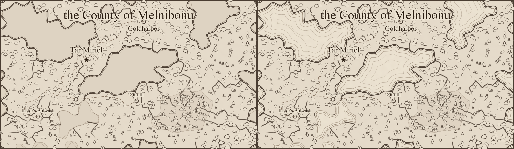
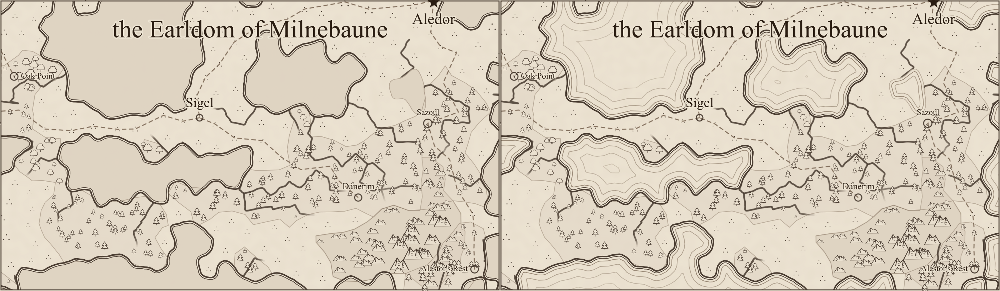
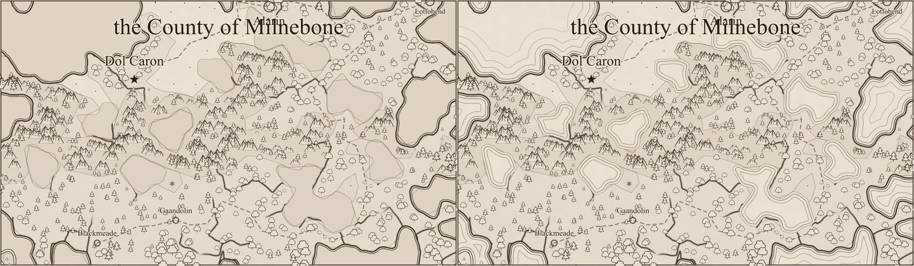

# Sea hatching review (#232)

Each comparison has **before on the left, after on the right**, rasterized with `rsvg-convert` at
1400 pixels per map. These are review illustrations, not golden-image tests. Human visual review
is pending.

Water is now parchment with parallel coast-following bands. Ocean bands spread apart and become
lighter seaward; larger lakes have two closer bands, and small lakes keep a bare interior.
Distance contours split in narrow channels instead of producing crossing offset curves. Terrain
ink is masked out of water, so it cannot masquerade as a remaining flat water fill.

Shoreline geometry, text, and glyph placements are identical before/after for all three seeds.
Labels, rivers, and the dense inland scatter still await their assigned follow-up issues.

| Seed    | Before SVG bytes | After SVG bytes | Connected hatch paths |
| ------- | ---------------- | --------------- | --------------------- |
| alpha   | 285,558          | 216,022         | 45                    |
| bravo   | 229,217          | 147,995         | 49                    |
| charlie | 308,770          | 227,767         | 58                    |

The new line work costs less than the repeated water outlines it replaces: shoreline definitions
are shared by coast strokes, clips, and masks, while joined and simplified contours are emitted
as a few long paths. There are no individual SVG line elements. Reference tests enforce a size
budget below the previous renders.

## Alpha



## Bravo



## Charlie



## Reproduction

The baseline is `7be3ee81` (PR #239). On each revision, repeat for `alpha`, `bravo`, and `charlie`:

```sh
npm run render:region -- --svg-out /tmp/alpha.svg --seed alpha
rsvg-convert -w 1400 /tmp/alpha.svg -o /tmp/alpha.png
```

The same temporary Vite configuration used for the previous comparisons was used here to work
around this machine's pre-existing optimized-dependency cache failure: import the repository's
config and override `optimizeDeps: { noDiscovery: true, include: [] }`. Both revisions use identical
settings. Comparison images are joined from the rendered PNGs and encoded as lossless WebP.
