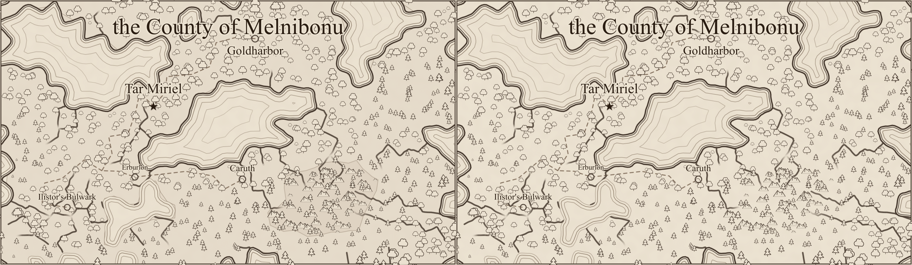
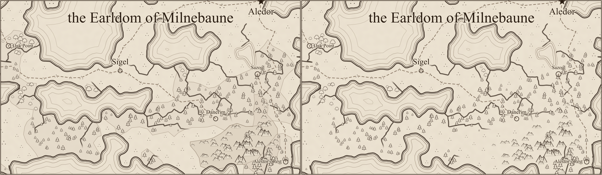
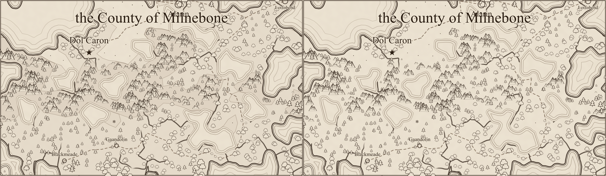

# Terrain fill removal review (#233)

Each comparison has **before on the left, after on the right**, rasterized with `rsvg-convert` at
1400 pixels per map. These are review illustrations, not golden-image tests. Human visual review
is pending.

Forests and mountain ranges now show only their glyphs on parchment. Their regional washes and
outlines are gone, including the visible cell-shaped boundary around Charlie's mountain band.
The fill-only helpers and their water exclusion mask have been removed as well.

Glyph transforms, labels, shoreline definitions, and water hatching are identical before/after
for all three seeds. Terrain membership and glyph containment remain in place. Density is
intentionally unchanged: [#194](https://github.com/ironarachne/ironarachne/issues/194) will retune
scatter now that glyphs carry the terrain alone.

| Seed    | Before SVG bytes | After SVG bytes |
| ------- | ---------------: | --------------: |
| alpha   |          216,022 |         201,499 |
| bravo   |          147,995 |         137,952 |
| charlie |          227,767 |         204,405 |

## Alpha



## Bravo



## Charlie



## Reproduction

The baseline is `75b75193` (PR #240). Repeat for `alpha`, `bravo`, and `charlie`:

```sh
npm run render:region -- --svg-out /tmp/alpha.svg --seed alpha
rsvg-convert -w 1400 /tmp/alpha.svg -o /tmp/alpha.png
```

The baseline images reuse the accepted #232 output, which is identical to this baseline. The same
temporary Vite configuration used for the previous comparisons works around this machine's
pre-existing optimized-dependency cache failure: import the repository's config and override
`optimizeDeps: { noDiscovery: true, include: [] }`. Both revisions use identical settings.
Comparison images are joined from the rendered PNGs and encoded as lossless WebP.
