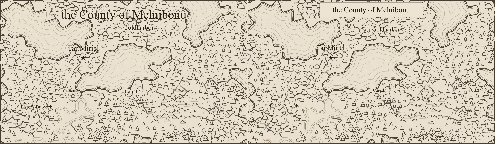
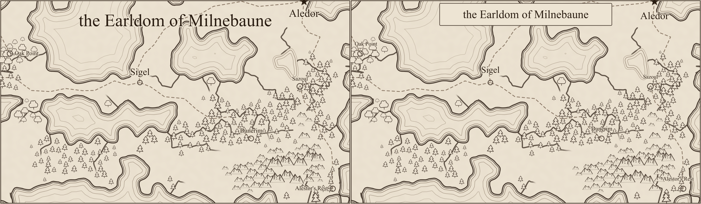
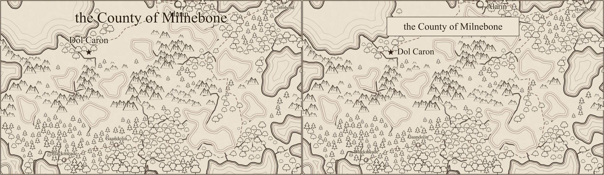

# Label and title review (#234)

Each comparison has **before on the left, after on the right**, rasterized with `rsvg-convert` at
1400 pixels per map. These are review illustrations, not golden-image tests. Human visual review
was approved, and PR #243 was merged.

The title now sits in a compact bordered parchment panel. It reserves its whole footprint,
including its border, and leaves markers visible. Near the top edge, it leaves enough room for a
settlement name beside its marker. Labels are clamped inside the sheet and cannot intersect the
cartouche or a marker. Names that cannot fit are omitted rather than drawn clipped.

Conservative serif bounds replace the old narrow estimates, with room for halos and SVG rounding.
The halo is slightly lighter on parchment. The SVG records text reservations, and browser tests
compare actual glyph bounds against those boxes, rather than trusting the estimates alone.
`rsvg-convert` ignores `textLength` in a direct rendering check, so the fix does not rely on it.

All settlement names survive on the three reference maps. Shoreline definitions, sea hatching,
and every terrain glyph transform are identical before/after. The extra seeds `delta`, `echo`, and
`foxtrot` were also rendered and inspected. Their labels, along with the reference seeds, are
covered by unit and browser geometry checks. Unit fixtures additionally cover long names, accented
text, edge markers, impossible labels, and settlements under the title.

| Seed    | Before SVG bytes | After SVG bytes | Settlement labels retained |
| ------- | ---------------: | --------------: | -------------------------: |
| alpha   |          160,629 |         161,029 |                     5 of 5 |
| bravo   |          120,598 |         121,048 |                     6 of 6 |
| charlie |          153,598 |         153,989 |                     5 of 5 |

The small size increase includes the cartouche and the text-bound metadata. Other settlement labels
remain soft obstacles; this work forbids clipping and hard-obstacle collisions, rather than
promising collision-free text at arbitrary settlement density.

## Alpha



## Bravo



## Charlie



## Reproduction

The baseline is `33367682` (PR #242). Repeat for `alpha`, `bravo`, and `charlie`:

```sh
npm run render:region -- --svg-out /tmp/alpha.svg --seed alpha
rsvg-convert -w 1400 /tmp/alpha.svg -o /tmp/alpha.png
```

The baseline images reuse the accepted #194 output, identical to this baseline. The temporary
Vite configuration used for earlier comparisons works around this machine's pre-existing
optimized-dependency cache failure: import the repository's config and override
`optimizeDeps: { noDiscovery: true, include: [] }`. Both revisions use identical settings.
Comparison images are joined from the rendered PNGs and encoded as lossless WebP.
